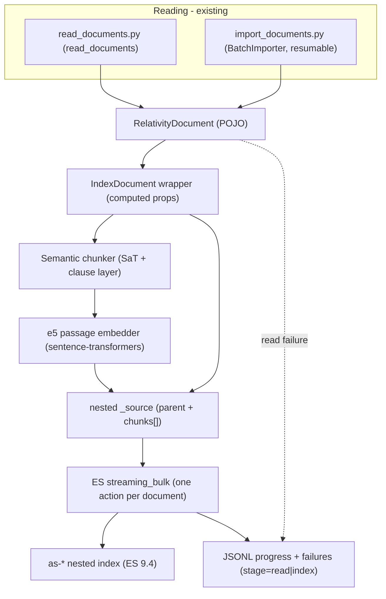

# aiR Assist: Document Indexing Module and Semantic Chunking

**Purpose:** Design reference for engineers and AI agents building a new `es-index-explorer` module
that takes the `RelativityDocument` data produced by [`read_documents.py`](../read_documents.py)
(one-shot) and [`import_documents.py`](../import_documents.py) (resumable batch) and writes it into the
custom nested aiR Assist index defined in `05-index-structure-design.md`. It specifies the declarative
field mapping, the derived/numeric field calculations, the HuggingFace tokenization + embedding stack,
a new semantic (sentence/clause-aware) chunker with variable overlap, the Elasticsearch bulk-write
strategy (including `refresh_interval` handling), and read-vs-index error reporting.

This document is a **design specification only** — it contains the critical algorithm, mapping, and
calculation snippets, but no full implementation. The code-planning and code-writing steps follow
separately.

**Scope and constraints (confirmed):**
- **Language: English only** for now. Multilingual is a future nice-to-have and explicitly out of
  scope. The chunker/segmenter must be robust to **out-of-vocabulary (OOV)** terms — proper nouns and
  typos. Stated preference: higher English accuracy over multilingual breadth.
- **Embedding model:** `intfloat/multilingual-e5-small` (384-dim, cosine) — the same model as
  production (`02-index-population-pipeline.md` §4), sourced from **HuggingFace** with **no dependency
  on company-internal projects** (no R1 Model Gateway, no Artifactory-only packages) for tokenization
  or embedding.
- **Target index:** the **nested** index from `05-index-structure-design.md` — **one Elasticsearch
  document per RelativityOne document**, with chunks stored as a `nested` array. This differs from
  production, which writes one ES document per chunk (`02-...md` §5).
- **Transaction granularity:** one RelativityOne document = one ES bulk action (atomic per document).
- **Elasticsearch:** 9.4.x (deployment 9.4.0, client 9.4.1), per `05-index-structure-design.md`.

**Reads from / cross-references:** `01-air-assist-elasticsearch-index.md` (current mapping),
`02-index-population-pipeline.md` (production chunking/embedding baseline), `03-retrieval-strategies.md`
(query-side `query:` prefix), `04-relativity-object-manager-api.md` (reading), and
`05-index-structure-design.md` (the target nested mapping, derived fields R12-R14, and `semantic_text`
parent fields).

> **`title` is documented here; only the code wiring is deferred.** This report fully specifies the
> index `title` mapping (source: the RelativityOne **`"Unified Title"`** field) and its derived
> `title_semantic` twin (§3). What is left to the later code phase is the *implementation* of the source
> wiring — adding `title` to `RelativityFieldMappingConfig`
> ([config.py](../es_index_explorer/config.py)), to `RelativityDocument`
> ([models.py](../es_index_explorer/relativity/models.py)), to the reader `field_map`
> ([reader.py](../es_index_explorer/relativity/reader.py)), and to `config.example.toml`. This report
> changes no code; it records the mapping so the code phase implements it alongside everything else.

---

## 1. Pipeline Overview

The new module sits downstream of the existing readers and turns each `RelativityDocument` into one
nested ES document. The unit of work is a single document: read -> build -> chunk -> embed -> write.



**Contrast with production (`02-...md`):** production chunks the text, embeds each chunk via the R1
Model Gateway, and writes **one ES document per chunk** keyed `{documentId}_{chunkId}`. Here we keep all
chunks of a document **together** as a nested array on **one** ES document keyed by the document
ArtifactId, matching the nested design in `05-...md` §2.4. Embedding still happens per chunk (batched),
but the ES write unit is the document.

---

## 2. Reused and New Data Classes

The request is to reuse as many existing data classes as possible and, where a new shape is needed, to
prefer a class that holds a reference to the original object and exposes computed properties.

### 2.1 Reused as-is (no changes in this report)

From [`es_index_explorer/relativity/models.py`](../es_index_explorer/relativity/models.py):
- `RelativityDocument` — the source POJO (artifact_id, control_number, extracted_text,
  primary_date_time, email_from/to/cc/bcc, summary, topic). The mapping (§3) also reads `source.title`;
  adding that `title` field (and its `"Unified Title"` config/reader wiring) is implemented in the later
  code phase — documented here, no code changed now.
- `ReadResult` — `documents` + `failures`.
- `FailedDocument` — `artifact_id`, `raw_row`, `error` (extended for stages in §8).

### 2.2 New: `IndexDocument` (wrapper over `RelativityDocument`)

A thin wrapper that **holds a reference** to the original `RelativityDocument` and exposes the
derived/computed values needed by the index. It does not copy source fields; it reads them through
`self.source`.

```python
@dataclass
class IndexDocument:
    """Computed, index-ready view over a RelativityDocument (holds a reference, does not copy)."""

    source: RelativityDocument
    chunks: list["Chunk"]          # produced by the chunker+embedder
    subset_ids: list[str]          # from run config (the active subset)

    @property
    def byte_size(self) -> int:
        return len(self.source.extracted_text.encode("utf-8"))

    @property
    def char_count(self) -> int:
        return len(self.source.extracted_text)

    @property
    def token_count(self) -> int:
        # full-document e5 token count, computed once (see section 4)
        ...

    @property
    def chunk_count(self) -> int:
        return len(self.chunks)
```

### 2.3 New: `Chunk` dataclass

Mirrors the nested `chunks` properties of the index (`05-...md` §4):

```python
@dataclass(frozen=True)
class Chunk:
    chunk_index: int            # 0-based, sequential
    text: str                   # exact substring of extracted_text
    token_count: int            # e5 tokens spanning [overlap_start, cut_next)
    leading_overlap_chars: int  # characters duplicated from the previous chunk (0 for chunk 0)
    embedding: list[float]      # 384-dim, normalized e5 passage vector
```

---

## 3. Declarative Field Mapping (single source of truth)

Mapping is expressed once, as a central `MAPPING` dictionary co-located with `IndexDocument`: ES field
name -> a pure extractor callable over an `IndexDocument`. Building an ES `_source` is then a single
dict comprehension over `MAPPING`, which keeps the document/index contract in **one place** and makes
it trivially serializable.

```python
from collections.abc import Callable

MAPPING: dict[str, Callable[[IndexDocument], object]] = {
    "document_artifact_id": lambda d: d.source.artifact_id,
    "control_number":       lambda d: d.source.control_number,
    "title":                lambda d: d.source.title,                # <- RelativityOne "Unified Title"
    "summary":              lambda d: d.source.summary,
    "topic":                lambda d: d.source.topic,
    "primary_date_time":    lambda d: d.source.primary_date_time,   # datetime | None -> ISO at serialize time
    "email_from":           lambda d: d.source.email_from,
    "email_to":             lambda d: d.source.email_to,
    "email_cc":             lambda d: d.source.email_cc,
    "email_bcc":            lambda d: d.source.email_bcc,
    "byte_size":            lambda d: d.byte_size,
    "token_count":          lambda d: d.token_count,
    "char_count":           lambda d: d.char_count,
    "chunk_count":          lambda d: d.chunk_count,
    "subset_ids":           lambda d: d.subset_ids,
    "chunks":               lambda d: [_chunk_to_dict(c) for c in d.chunks],
    # title_semantic / summary_semantic / topic_semantic are populated by Elasticsearch via copy_to
    # (05-...md §4.5) from title / summary / topic respectively - not set by the client.
}

def build_source(doc: IndexDocument) -> dict[str, object]:
    return {field: extract(doc) for field, extract in MAPPING.items() if extract(doc) is not None}

def _chunk_to_dict(c: Chunk) -> dict[str, object]:
    return {
        "chunk_index": c.chunk_index,
        "text": c.text,
        "token_count": c.token_count,
        "leading_overlap_chars": c.leading_overlap_chars,
        "embedding": c.embedding,
    }
```

| ES field | Source | Notes |
|---|---|---|
| `document_artifact_id` | `source.artifact_id` | also the ES `_id` (as a string) |
| `control_number` | `source.control_number` | |
| `title` | `source.title` | from RelativityOne `"Unified Title"`; feeds `title_semantic` via `copy_to`; source wiring implemented in the code phase |
| `summary`, `topic` | `source.summary`, `source.topic` | each feeds its `*_semantic` twin via `copy_to` (ES-side) |
| `primary_date_time` | `source.primary_date_time` | datetime | None`; serialized ISO-8601 |
| `email_from/to/cc/bcc` | `source.email_*` | keyword(s) |
| `byte_size`, `token_count`, `char_count`, `chunk_count` | computed (`IndexDocument`) | see §4 |
| `subset_ids` | run config (`relativity.subset_id`) | multi-tenancy scoping (`05-...md` §4.1) |
| `chunks[]` | chunker + embedder | nested array (§6) |
| `title_semantic`, `summary_semantic`, `topic_semantic` | not set by client | filled by ES `copy_to` from `title`/`summary`/`topic` (`05-...md` §4.5) |

**Why a dict over decorators/attributes.** A C#-attribute-style approach (decorators on a model) is
possible, but a plain dict of extractor callables is the most declarative-in-one-place option, has no
import-time magic, is easy to unit-test, and serializes directly. The decorator alternative is noted but
not recommended. `_id = str(artifact_id)`.

---

## 4. Derived / Numeric Calculations

All derived numeric fields are computed once per document. Definitions follow `05-...md` §6 exactly.

**Document level:**

```python
byte_size  = len(extracted_text.encode("utf-8"))   # 05-...md §6.1 (UTF-8 actual bytes; ADLS-file parity)
char_count = len(extracted_text)                    # 05-...md §6.4 (Unicode code points)
token_count = len(tokenizer(extracted_text,         # 05-...md §6.2 (full-doc, PRE-chunking)
                            add_special_tokens=False).input_ids)
chunk_count = len(chunks)                            # 05-...md §6.3
```

- `token_count` is the **full-document** e5 token count computed **before** chunking. It is *not* the
  sum of `chunks[].token_count` (overlap double-counts boundary tokens), per `05-...md` §6.2.
- These reuse the **same** tokenizer object used for chunking and embedding (§5), so the count is
  consistent with the chunk geometry.

**Chunk level:**

```python
chunk_index           = i                                   # 0-based, in order
token_count           = cut_next - overlap_start            # e5 tokens in [overlap_start, cut_next)
leading_overlap_chars = char(content_start) - char(overlap_start)   # 0 for chunk 0; see §6
```

`leading_overlap_chars` is in **characters** (not tokens) so the retrieval layer can concatenate a
contiguous run of chunks and strip duplicated overlap with no tokenizer (`05-...md` §8, R14).

### 4.1 The e5 512-token cap (a hard constraint on chunk size)

`intfloat/multilingual-e5-small` accepts at most **512 tokens**; longer inputs are truncated
([model card](https://huggingface.co/intfloat/multilingual-e5-small)). At embed time each chunk becomes
`"passage: " + chunk.text`, which adds the prefix tokens plus 2 special tokens (`<s>`, `</s>`).
Therefore the usable content budget is:

```python
MAX_CONTENT = MODEL_MAX_TOKENS - NUM_SPECIAL_TOKENS - len(tokenizer("passage: ", add_special_tokens=False).input_ids)
# ~= 512 - 2 - ~3 = ~507  (computed at runtime, not hard-coded)
```

Because a chunk is `leading_overlap + new_content`, **`overlap + unique <= MAX_CONTENT` is the only
HARD size limit** — the ~400 unique target, the ~360 soft floor, and the ~80 overlap are all SOFT,
sentence-driven targets (§6). The sentence packer picks the overlap first (whole sentences ~80 within
`[40, 120]`) and then packs whole sentences for the unique content so that
`cut_next - overlap_start <= MAX_CONTENT`; a sentence too long to fit triggers a clause/word cut
(§6.4 Tier A) rather than truncation. Without this cap the **newest** content (chunk tail) would be
silently truncated at embed time — the single most important numeric constraint from the embedding
model.

---

## 5. Tokenization and Embedding (HuggingFace, no company dependencies)

### 5.1 One shared model + tokenizer

```python
from sentence_transformers import SentenceTransformer

model = SentenceTransformer(EMBEDDING_MODEL)   # "intfloat/multilingual-e5-small" (or a local path)
tokenizer = model.tokenizer                    # XLM-RoBERTa SentencePiece (fast) - reused for chunking
```

- The **same tokenizer object** is used both to count/align tokens for chunking (§4, §6) and to feed
  the embedding model — satisfying the "use literally the same tokenizer" requirement. e5 uses the same
  SentencePiece model as Sentence-Transformers, so it is reusable as-is
  ([axinc-ai overview](https://medium.com/axinc-ai/multilingual-e5-a-machine-learning-model-for-embedding-text-in-multiple-languages-b4916cb22bda)).
- A **fast** tokenizer is required so we can request `return_offsets_mapping=True` for char<->token
  alignment (§6).

### 5.2 Embedding chunks

```python
texts = [f"passage: {c.text}" for c in chunks]                # e5 requires the "passage: " prefix
vectors = model.encode(texts, normalize_embeddings=True,      # unit vectors -> cosine parity with index
                       batch_size=EMBEDDING_BATCH_SIZE)        # default ~96 (02-...md §4.3)
```

- The `passage:` prefix is mandatory for e5 documents; queries use `query:` at retrieval time
  (`03-...md`). Omitting prefixes degrades quality
  ([e5 model card](https://huggingface.co/intfloat/multilingual-e5-small)).
- `normalize_embeddings=True` yields unit-length vectors, matching the index `similarity: cosine`
  (`05-...md` §4) ([sentence-transformers usage](https://sbert.net/docs/sentence_transformer/usage/usage.html)).
- Batch size is configurable; embedding can be batched across the chunks of one document, or across a
  small buffer of documents, while the **ES write stays per document** (§7).

### 5.3 Out-of-vocabulary terms (proper nouns, typos)

SentencePiece subword tokenization (XLM-RoBERTa) decomposes any unknown token into in-vocabulary
subword units, so OOV proper nouns and typos are handled with **no special logic** for either embedding
or token counting. (The chunker is likewise OOV-robust — §6.) `intfloat/multilingual-e5-small` is kept
as agreed; it performs well on English, and an English-only embedding model is out of scope.

### 5.4 Model provisioning

Add a config option for the model source: HuggingFace Hub id (default) or a local directory, plus an
offline flag (`HF_HUB_OFFLINE`) for air-gapped runs, since the cluster's outbound network posture is
unknown. Dependencies: `sentence-transformers` (pulls `torch` + `transformers`). This is acceptable for
a research/tooling repo (unlike the production agent image).

---

## 6. Semantic Chunking and Variable-Overlap Algorithm

This is the core of the module. It is a **whole-sentence packer with sentence-aligned overlap**: by
default *both* the unique content and the leading overlap are composed of **whole sentences**
(priority 5). The lower priorities (4-1: parenthetical / semicolon / comma / word) are a **fallback used
only when a single sentence does not fit the length budget**. Geometry, measured in **e5 subword
tokens**:

- **Unique (new) content per chunk:** target ~**400 tokens** (SOFT), composed of whole sentences. There
  is a SOFT lower floor of ~**360** tokens (itself adjusted by the realized overlap length), and the
  whole-sentence packing aims near 400.
- **Leading overlap:** whole sentence(s) summing to ~**80 tokens (a bit less in practice, since it is
  whole sentences)**, clamped to **[40, 120]**. The **first chunk has no overlap**.
- **The only HARD limit:** `overlap + unique <= MAX_CONTENT` (§4.1), so every chunk embeds without
  truncation. `400`, `~360`, and `~80` are all soft, sentence-driven targets.
- **Fallback to priorities 4-1 (Tier A):** only when a sentence is too long to fit — i.e. the overlap
  cannot be a whole sentence within the ~120 cap, or the unique content cannot end on a sentence
  boundary without breaching `MAX_CONTENT` or falling below the soft floor. See §6.4.
- `leading_overlap_chars` recorded in **characters** for tokenizer-free concatenation (`05-...md` §8).

> **For the next agent:** the rules below fix the design intent; the precise resolution of edge cases
> (exact floors, tie-breaks, how far to search, behavior at document ends, interaction of the soft floor
> with overlap length, etc.) should be decided **in consultation with the user** — when an edge-case
> question arises while specifying the algorithm, ask rather than guess. The goal is a plan detailed
> enough that an implementation agent (e.g. GPT Codex 5.3) can build the chunker reliably without
> re-deriving intent.

### 6.1 Boundary candidates and priority

Boundaries are detected as **character positions**, mapped to e5 token indices via the offset mapping,
and tagged with a priority. The semantic preference hierarchy (most -> least preferred), and which
engine produces each level:

| Priority | Boundary type | Produced by | When used |
|---|---|---|---|
| 5 | Sentence end (incl. newlines) | **SaT** sentence engine (default; pluggable, §6.5) | **Default** for both overlap and unique |
| 4 | Parenthetical close `)` | **spaCy** clause engine (default) — morphosyntactic; type from the mark | Tier-A fallback only |
| 3 | Semicolon `;` | **spaCy** clause engine (default) | Tier-A fallback only |
| 2 | Comma `,` (real clause separator) | **spaCy** clause engine (default; digit-guarded, parse-validated) | Tier-A fallback only |
| 1 | Word boundary | tokenizer (inter-token gap; always available) | Last-resort fallback |

Important properties (these drive the §6.5 engine choice):
- **SaT covers only priority 5.** It is a sentence/newline boundary model; it does **not** type
  sub-sentence boundaries and its boundary probability *inside* a sentence is uninformative
  (`predict_proba` is trained on sentence/newline boundaries). So SaT cannot make the priority 4-2
  decision — it is purely the sentence engine.
- **Priorities 4-2 are a clause-level fallback** invoked only inside an over-long sentence (§6.4
  Tier A). Locating a `)`/`;`/`,` is intrinsically a character operation, but the **judgement** of
  whether that mark is a real clause boundary (and its type) is made **morphosyntactically by spaCy's
  English dependency parse** (the default), which is preferred over a naive punctuation/regex rule
  because e-discovery text (OCR, email threads) contains many run-on / poorly punctuated sentences. A
  lean punctuation-only clause strategy remains available as a pluggable alternative (§6.5).
- **Priority 1 (word)** is the tokenizer's inter-token gap and guarantees a candidate always exists.
- The sentence engine returns sentence char spans (SaT's sentences are exact contiguous substrings, so
  offsets are recovered by sequential indexing); the clause engine returns clause char spans within a
  given sentence.

### 6.2 Selection rules (sentence-first)

Two selections drive the algorithm. Both are **sentence-first**: they operate over whole sentences and
only drop to clause/word (priorities 4-1) when a sentence does not fit.

**Cut selection** (end of the unique content). Default path — **pack whole sentences** starting at
`content_start`, extending the cut to the end of each successive sentence, choosing the sentence
boundary whose unique length `u = cut - content_start` is **closest to 400** while satisfying both:
- HARD: `cut - overlap_start <= MAX_CONTENT`;
- SOFT: `u >= ~360` (floor adjusted by the realized overlap length).
Fallback (Tier A) — if even the **first** sentence from `content_start` cannot satisfy the hard cap (the
sentence is longer than the remaining room), or whole-sentence packing cannot reach the soft floor
without breaching the cap, cut **inside** that sentence at the best clause boundary (priority 4 -> 3 ->
2) nearest the target via the clause engine, else a word boundary; always respecting `MAX_CONTENT`.

**Overlap selection** (leading overlap of the next chunk). Default path — walk **backward** from
`content_start` over whole sentences, accumulating until the overlap length `o = content_start -
overlap_start` is **closest to ~80** within **[40, 120]** (prefer a-bit-less / shorter on tie, since
whole sentences rarely hit 80 exactly). Fallback (Tier A) — if the single immediately-preceding sentence
is longer than the 120 cap (no whole sentence fits), take a ~80-token tail within [40, 120] at the best
clause boundary (4 -> 3 -> 2) via the clause engine, else a word boundary. The first chunk has
overlap 0.

> Sentence boundaries (priority 5) dominate by design — clause/word boundaries appear only when a
> sentence overflows the budget. Targets (`400`, `~360`, `~80`) and tie-breaks are tunable knobs;
> exact values and edge-case behavior are to be confirmed with the user during algorithm design.

### 6.3 Algorithm (pseudocode)

```python
def chunk_document(text, tokenizer, sentence_engine, clause_engine, cfg) -> list[ChunkSpan]:
    enc = tokenizer(text, add_special_tokens=False, return_offsets_mapping=True)
    tokens, offsets = enc["input_ids"], enc["offset_mapping"]   # offsets[t] = (char_start, char_end)
    n = len(tokens)
    if n == 0:
        return []

    # Sentence boundaries as token indices (priority 5), from the sentence engine (SaT default).
    sentences = sentence_engine.sentence_token_bounds(text, offsets)   # ascending split indices

    # Tier B: no sentence structure at all -> legacy non-semantic sliding window (02-...md §3)
    if not sentences:
        return legacy_sliding_window(tokens, offsets, text, cfg)       # 500 window / 100 overlap

    spans, content_start, i = [], 0, 0
    while content_start < n:
        # Leading overlap: whole sentence(s) ~80 in [40,120]; Tier-A clause/word fallback if a
        # single preceding sentence > 120 cap. (0 for the first chunk.)
        overlap_start = 0 if i == 0 else choose_overlap_start(sentences, clause_engine, content_start, cfg)

        # Cut: pack whole sentences toward ~400 unique, soft floor ~360, HARD cap
        # (cut - overlap_start) <= MAX_CONTENT; Tier-A clause/word cut inside an over-long sentence.
        cut = choose_cut(sentences, clause_engine, content_start, overlap_start, n, cfg)

        spans.append(ChunkSpan(
            chunk_index=i,
            text=text[offsets[overlap_start][0] : offsets[cut - 1][1]],
            token_count=cut - overlap_start,
            leading_overlap_chars=offsets[content_start][0] - offsets[overlap_start][0],  # 0 when i == 0
        ))
        content_start, i = cut, i + 1

    spans = drop_or_merge_pure_overlap_tail(spans, cfg)   # see §6.4: last chunk must carry new content
    return [reindex(s, k) for k, s in enumerate(spans)]
```

Key invariants:
- `chunk.text = text[char(overlap_start):char(cut)]` is an **exact substring** of `extracted_text`.
- The head of chunk `i` of length `leading_overlap_chars` equals the tail of chunk `i-1` (same character
  range), so retrieval-time concatenation strips it once (`05-...md` §8).
- `cut > content_start` is enforced (progress guaranteed; word boundaries ensure a candidate exists).
- **No pure-overlap final chunk** (§6.4): the last chunk always carries content beyond its overlap.

`choose_cut` / `choose_overlap_start` encapsulate the sentence-first selection of §6.2 with the
clause/word Tier-A fallback. Their exact internals (search bounds, the soft-floor/overlap interaction,
tie-breaks, document-end handling) are intentionally left for the algorithm-design step — to be settled
with the user (see the note in §6 and §9).

### 6.4 Fallbacks (two tiers) and the last-chunk rule

The default path uses whole sentences. Fallbacks are organized into two distinct tiers, plus a
structural rule for the final chunk.

- **Tier A - over-long sentence (clause/word).** The text *has* sentence structure, but a single
  sentence does not fit the budget (overlap can't be a whole sentence within the ~120 cap, or the
  unique content can't end on a sentence boundary without breaching `MAX_CONTENT` / the soft floor). We
  then cut **inside** that sentence at the best clause boundary, descending the hierarchy
  parenthetical(4) -> semicolon(3) -> comma(2), judged by the **spaCy English clause engine** (default),
  and finally a **word boundary (1)** if no clause boundary fits. This is the only place priorities 4-1
  are used, and it is expected to fire on OCR/email run-ons.
- **Tier B - no sentence structure at all.** The segmenter finds no sentences (e.g. one unpunctuated
  blob). Fall back to the **legacy non-semantic sliding window** (500-token window, 100-token overlap;
  `02-...md` §3). It plugs into the same `ChunkSpan` interface, so downstream code is unchanged.

- **Last-chunk rule (no pure-overlap chunk).** A trailing segment that would contain **only overlap**
  (no new/unique content beyond the leading overlap) must **not** be emitted: it is dropped, and its
  content is already covered by the previous chunk (or merged into it). Equivalently, the final chunk
  must always carry text beyond its overlap. This avoids a redundant tail chunk that duplicates the end
  of the document.

### 6.5 Engine choice: sentence engine + clause engine

There are **two** pluggable, config-selectable engines: a **sentence engine** (priority 5) and a
**clause engine** (priorities 4-2, Tier-A fallback). The scoring, packing, two-tier fallback,
last-chunk rule, and token/char alignment are engine-independent. Evaluation criteria (English-only,
accuracy-first): English boundary accuracy, robustness to noisy/OCR/legal text, OOV/typo robustness,
**how many priorities the engine can cover**, maintenance/activity, dependencies, license, latency.

**Priorities-covered scoreboard** (can the engine both surface and meaningfully *judge* that priority):

| Engine | 5 Sentence | 4 Paren | 3 Semicolon | 2 Comma | 1 Word | Notes |
|---|---|---|---|---|---|---|
| SaT (`wtpsplit`) | Native (SOTA) | no (scorer only, weak) | no | no | no | sentence/newline model; no typing; uninformative mid-sentence |
| spaCy (en + parser) | yes | yes | yes | yes | yes | morphosyntactic clause boundaries; covers all five |
| BlingFire | yes | no | no | no | yes | sentences + word tokenization |
| sentencex | yes (+offsets) | no | no | no | yes | sentences + tokenizer |
| pySBD | yes | no | no | no | no | sentences only |

**Sentence engine — DEFAULT = SaT / `wtpsplit`** (ML; MIT; EMNLP 2024; actively maintained). English
~96.5-97.4 (sat-3l-sm / sat-12l-sm); state-of-the-art, punctuation-agnostic, explicitly robust on
poorly formatted and **legal-domain** text — the right fit for e-discovery, where both overlap and
unique content are sentence-built. Dependencies **reuse the `torch`** already pulled for e5, or run via
**`wtpsplit-lite`** (ONNX; minimal deps). Cost: per-document inference (~150 ms/page lite). OOV-robust.
Pluggable alternatives: **BlingFire** (Microsoft; MIT; fastest; C++ wheel, no runtime deps; ~90-92%
GRS) for a no-ML option; **sentencex** (Wikimedia; MIT; very actively maintained; char offsets); and
**pySBD** assessed but **not selected** (accurate ~97% GRS but **unmaintained since 2021**, ~20x slower).
([SaT paper](https://arxiv.org/abs/2406.16678), [wtpsplit](https://github.com/segment-any-text/wtpsplit),
[lite](https://github.com/superlinear-ai/wtpsplit-lite), [BlingFire](https://github.com/microsoft/BlingFire),
[sentencex](https://github.com/wikimedia/sentencex), [pySBD](https://github.com/nipunsadvilkar/pySBD))

**Clause engine (Tier-A fallback) — DEFAULT = spaCy (English, `en_core_web_sm` with the dependency
parser).** Rationale: SaT cannot judge sub-sentence boundaries (see §6.1), so when a sentence overflows
the budget the choice is **morphosyntactic (spaCy) vs naive punctuation/regex**. Because the corpus has
**substantial email threads and OCR'd documents** (frequent run-on / poorly punctuated sentences),
spaCy's dependency parse earns its keep often enough to be the default: it identifies genuine clause
boundaries (coordinations, clausal modifiers, parentheticals) and supplies the priority 4/3/2 type from
the mark at the boundary. spaCy is the **only** engine that covers all five priorities. A **lean
punctuation-only clause strategy** (locate `)`/`;`/`,` with a digit-guard; no parser) remains available
as a pluggable alternative for minimal-dependency deployments. ([spaCy](https://spacy.io/))

**Does this need morphosyntactic analysis?** For **sentences (priority 5): no** — SaT handles them. For
the **over-long-sentence fallback (priorities 4-2): yes, by choice** — we default to spaCy's
morphosyntactic parse rather than regex, because e-discovery's run-on/OCR text makes good clause cuts
matter. e5 is an **encoder** and cannot segment by generation, so LLM/encoder segmentation is rejected
(cost, non-determinism).

---

## 7. Writing to Elasticsearch

### 7.1 Nested document construction

For each document, build the `_source` from `MAPPING` (§3) and emit one bulk action:

```python
def to_action(index_name: str, doc: IndexDocument, *, overwrite: bool) -> dict:
    # Default (overwrite=False) -> "create": Elasticsearch returns 409 if the _id already exists, so an
    # existing document is never clobbered. overwrite=True -> "index": replace any existing document.
    return {"_op_type": "index" if overwrite else "create", "_index": index_name,
            "_id": str(doc.source.artifact_id), "_source": build_source(doc)}
```

`primary_date_time` is serialized to ISO-8601 (e.g. via `RelativityDocument.model_dump(mode="json")`
for the source fields, or an explicit `.isoformat()`), so the ES `date` field parses cleanly.

> **Note - "request `_source`" vs "stored `_source`".** The `_source` built here is the **write-time
> request body**, which **must include `chunks[].embedding`** so Elasticsearch can index the vectors
> into the kNN (BBQ/HNSW) structure. It is *not* a contradiction with vectors being absent from
> results: the index definition excludes them from the **stored/returned** `_source`
> (`05-...md` §4.4 - `_source.excludes` lists `chunks.embedding` and the `*_semantic.inference.*`
> outputs; ES 9.x also defaults `index.mapping.exclude_source_vectors` to true). After indexing, ES
> strips the vectors from the persisted `_source` and does not echo them in search hits, while keeping
> the raw vectors internally for kNN scoring and rescoring. In short: send the embeddings at write
> time; they are simply not retained in or returned from `_source`.

### 7.2 Bulk + batch size

Use the streaming bulk helper, which sends actions in chunks and yields a result per action:

```python
from elasticsearch.helpers import streaming_bulk

for ok, info in streaming_bulk(
        client, actions,
        chunk_size=cfg.bulk_docs_per_request,   # DOCUMENTS per _bulk request (configurable)
        max_retries=cfg.bulk_max_retries, retry_on_status=(429,),
        raise_on_error=False, yield_ok=True):
    record_result(ok, info)                     # per-document success/failure (see §8)
```

- `chunk_size` here counts **documents** (each action is a full nested document), and is a **new,
  dedicated setting** — it is unrelated to the QuerySlim read `batch_size`, which paginates the OM read.
  Embedding has its own `embedding_batch_size` (§5).
- `retry_on_status=(429,)` handles transient backpressure with exponential backoff
  ([es-py helpers](https://elasticsearch-py.readthedocs.io/en/stable/api_helpers.html)).
- With the default `create` op (no `--overwrite`), an existing `_id` yields a **409 conflict** per
  action; `streaming_bulk` surfaces it as `ok is False` with `info["create"]["status"] == 409`. We
  classify it as an index-stage **conflict error** (§8.2), not a silent skip. With `--overwrite`, the
  `index` op replaces the document and `info["index"]["result"]` is `"updated"` (vs `"created"` for a
  brand-new doc), which we log distinctly.

### 7.3 `refresh_interval` handling (disable for load, restore after)

Elastic's "tune for indexing speed" guidance is to set `index.refresh_interval` to `-1` during a bulk
load and restore it afterwards
([guide](https://www.elastic.co/guide/en/elasticsearch/reference/current/tune-for-indexing-speed.html)).
Elasticsearch has **no "temporary" disable** — you set `-1` explicitly and restore the original value.
Wrap the ingest in a context manager so the original is always restored, even on error:

```python
@contextmanager
def disabled_refresh(client, index):
    current = client.indices.get_settings(index=index)
    original = current[index]["settings"]["index"].get("refresh_interval")   # may be absent (default)
    client.indices.put_settings(index=index, settings={"index": {"refresh_interval": "-1"}})
    try:
        yield
    finally:
        client.indices.refresh(index=index)                                  # make the load visible once
        client.indices.put_settings(index=index,
                                    settings={"index": {"refresh_interval": original}})  # None -> reset to default
```

The index ships with `refresh_interval: 60s` (`05-...md` §4), so `original` is restored to that; if it
were unset, passing `None` resets it to the ES default. (Replica reduction is deliberately not changed
here; it can be added later as an optional tuning step.)

### 7.4 Idempotency, overwrite policy, and re-runs

`_id = str(artifact_id)` makes writes idempotent by identity, but **overwriting an existing document is
NOT allowed by default**:

- **Default (no `--overwrite`):** actions use `_op_type: "create"`. If a document with the same `_id`
  already exists, Elasticsearch returns a **409 conflict**; the indexer records it as an **index-stage
  error** (`outcome="conflict"`, `error_type="document_exists_conflict"`), surfaces it as the terminal
  "last error", and writes it to the resume/failures log. The existing record is **left untouched**.
- **With `--overwrite` (explicit opt-in CLI flag):** actions use `_op_type: "index"`, replacing any
  existing document. Each replacement is detected from the bulk result (`result == "updated"`) and
  **logged distinctly** in the result file as an `overwritten` outcome (separate from `created`), so
  overrides are auditable.

Because all chunks live on one document, replacement needs no orphan-chunk cleanup (the problem
production solves when a re-chunk yields fewer chunks — `02-...md` §5.3). Re-running after a partial
load re-attempts only the not-yet-succeeded documents (§8.1-§8.2).

---

## 8. Integration, Error Reporting, Configuration, Dependencies

### 8.1 Integration with the existing readers

A new `indexing` package (e.g. `es_index_explorer/indexing/`: `document_builder.py`, `chunking.py`,
`embedding.py`, `writer.py`, `indexer.py`) consumes either:
- the one-shot `read_documents(...) -> ReadResult` ([`reader.py`](../es_index_explorer/relativity/reader.py)), or
- the resumable `BatchImporter` stream ([`batch_reader.py`](../es_index_explorer/relativity/batch_reader.py))
  for large workspaces.

A new root CLI (`index_documents.py`) wires read -> index, reusing the existing JSONL `ProgressLog` /
`ImportState` and the `ProgressView` TUI ([`progress.py`](../es_index_explorer/relativity/progress.py),
[`tui.py`](../es_index_explorer/relativity/tui.py)). The transaction unit is one document, matching the
existing per-document progress model and resume semantics. The CLI exposes **`--overwrite`** to permit
replacing documents that already exist in the index (default off; see §7.4).

### 8.2 Error reporting: distinguish read vs index failures

Record a per-document **outcome** so the result/resume JSONL and the terminal state which **stage**
acted and **why**:

```python
@dataclass(frozen=True)
class DocumentResult:
    artifact_id: int | None
    outcome: Literal["created", "overwritten", "conflict", "read_failed", "index_failed"]
    stage: Literal["read", "index"] | None = None   # set for failures/conflicts
    error_type: str | None = None                   # exc.__class__.__name__ or ES error.type
    error_message: str | None = None                # str(exc) or ES error.reason
```

- **Read failures** (validation/OM) -> `outcome="read_failed"`, `stage="read"` (today's
  `FailedDocument`).
- **Index failures** (embedding/chunking exception, or a non-conflict ES error) -> `outcome="index_failed"`,
  `stage="index"`, carrying the ES `error.type`/`reason` or the Python exception type and message.
- **Existing-document conflict** (default, no `--overwrite`): a 409 from the `create` op ->
  `outcome="conflict"`, `stage="index"`, `error_type="document_exists_conflict"`. Treated as an
  **error** (terminal last error + resume/failures log), never overwriting.
- **Overwrite** (with `--overwrite`): bulk `result == "updated"` -> `outcome="overwritten"` (logged
  distinctly for auditability); `result == "created"` -> `outcome="created"`.
- **Resume:** `created`/`overwritten` advance `last_processed_id`; `read_failed`/`index_failed`/`conflict`
  are retryable via `--retry`. Note a `conflict` will recur on retry unless `--overwrite` is supplied —
  this is intentional, so overriding an existing record is always an explicit user choice.

### 8.3 Configuration additions

```toml
[elasticsearch]
# hosts = [...]                # existing
index_name = "as-..."          # target nested index

[indexing]
bulk_docs_per_request = 200       # documents per _bulk
bulk_max_retries = 3
embedding_model = "intfloat/multilingual-e5-small"   # or a local path
embedding_batch_size = 96
# Chunk geometry (all SOFT except max_content_tokens):
chunk_unique_target = 400         # soft target for unique tokens
chunk_unique_floor = 360          # soft lower floor (adjusted by realized overlap)
overlap_target = 80               # soft; whole sentences, usually a bit less
overlap_min = 40
overlap_max = 120
max_content_tokens = 505          # HARD: overlap + unique cap (or computed from the tokenizer)
# Sentence engine (priority 5):
sentence_engine = "sat"           # "sat" | "blingfire" | "sentencex" | "pysbd"
sat_model = "sat-3l-sm"
# Clause engine (Tier-A fallback, priorities 4-2):
clause_engine = "spacy"           # "spacy" (default, morphosyntactic) | "punctuation" (lean, no parser)
spacy_model = "en_core_web_sm"
# Tier-B fallback (no sentence structure at all): legacy non-semantic sliding window
fallback_window = 500
fallback_overlap = 100
```

Overwrite behavior is a **CLI flag** (`--overwrite`, default off), not a config key: by default an
existing `_id` is a conflict error (§7.4); passing `--overwrite` replaces the document and logs it as
`overwritten`. `title` is mapped from the RelativityOne `"Unified Title"` field via a new
`[relativity.fields].title` key (mapping documented in §3); implementing that config key, the POJO, and
the reader is part of the later code phase.

### 8.4 Dependencies

- `sentence-transformers` (+ `torch`, `transformers`) — e5 embeddings and the shared tokenizer.
- `wtpsplit` (reuses `torch`) **or** `wtpsplit-lite` (ONNX, minimal deps) — the SaT **sentence** engine.
- `spacy` (+ the `en_core_web_sm` English model) — the default **clause** engine (Tier-A fallback).
  This is a second parser, accepted because the corpus has frequent OCR/email run-on sentences where
  good clause cuts matter; the lean `punctuation` clause strategy needs no parser if a minimal install
  is preferred.
- optional `blingfire` / `sentencex` — alternative sentence engines.
- `elasticsearch` — already present.
- (`pysbd` is assessed but **not** the default; available as an alternative sentence engine.)

`es-index-explorer` is research/tooling, so these dependencies are acceptable (unlike the minimal
production agent image).

---

## 9. Open Decisions and Assumptions

1. **SaT model + device (decided): `sat-12l-sm` on CPU.** `sat-12l-sm` is chosen for the best English
   score (~97.4, §6.5). The deployment is **CPU-only** — no GPU/CUDA, Apple MPS, or other NPU is
   available — so `[indexing].device` is set explicitly to `"cpu"` (avoiding accelerator
   auto-selection). Accelerated devices (a CUDA GPU, or Apple MPS) would be a **faster option** for both
   SaT and the e5 embedder, but are not available here. On CPU, `sat-12l-sm` is the accuracy-but-slowest
   combination and is expected to be the indexing throughput bottleneck. Faster CPU options, if ever
   needed (a quality/speed trade-off, no code change — only `[indexing]` settings): switch the sentence
   engine to `sat-3l-sm` (~96.5), and/or set **`clause_engine = "punctuation"` to skip loading spaCy
   entirely** (the clause path is only the rare over-long-sentence fallback, §6.4 Tier A). `wtpsplit-lite`
   (ONNX) is an alternative SaT runtime to benchmark.
2. **Sentence-first chunk geometry is tunable and mostly soft.** `chunk_unique_target` (~400),
   `chunk_unique_floor` (~360, overlap-adjusted), `overlap_target` (~80) and the `[40, 120]` overlap
   band are soft; only `overlap + unique <= max_content_tokens` is hard. The exact selection internals
   (sentence-packing search bounds, how the soft floor interacts with the realized overlap, tie-breaks,
   when exactly Tier-A clause cutting triggers, and document-end handling) are to be settled with the
   user during algorithm design.
   - **Edge cases -> ask the user.** When the next agent specifies the chunker algorithm and an
     edge-case/ambiguity arises (degenerate inputs, a sentence longer than `MAX_CONTENT`, overlap that
     can't reach `overlap_min`, single-sentence documents, etc.), it should ask the user rather than
     guess.
   - **No pure-overlap last chunk (settled).** A trailing segment consisting solely of overlap is never
     emitted; the final chunk must carry content beyond its overlap (§6.4).
   - **Clause engine default = spaCy English (`en_core_web_sm`)** for Tier-A over-long-sentence cuts;
     the lean `punctuation` strategy is the no-parser alternative (§6.5).
3. **`subset_ids` source:** taken from the run's `relativity.subset_id`; append-to-existing semantics
   (production's `AlreadyIndexedAppendToSubset`, `02-...md` §5.3) are out of scope for the first version
   (full overwrite per document).
4. **`title`** mapping (source: `"Unified Title"`) is documented in §3; only its code wiring (config,
   POJO, reader, example config) is deferred to the code phase.
5. **Document modify time / versioning** (production `documentModifyTime`, `NewVersion`) are not
   modeled. Re-runs do **not** overwrite by default: an existing `_id` is reported as a conflict error
   (§7.4); overriding requires the explicit `--overwrite` flag, which logs an `overwritten` outcome.
6. **Embedding skip mode** (text-search-only, `02-...md` §4.4) could be added later via a config flag.

---

## 10. Sources

**This folder:** `01-air-assist-elasticsearch-index.md`, `02-index-population-pipeline.md`,
`03-retrieval-strategies.md`, `04-relativity-object-manager-api.md`, `05-index-structure-design.md`.

**External:**
- e5 model (prefixes, 512-token limit, XLM-RoBERTa/SentencePiece): https://huggingface.co/intfloat/multilingual-e5-small
- Sentence-Transformers usage (prompts, normalize): https://sbert.net/docs/sentence_transformer/usage/usage.html
- SaT / Segment any Text (EMNLP 2024): https://arxiv.org/abs/2406.16678 ; https://github.com/segment-any-text/wtpsplit ; https://github.com/superlinear-ai/wtpsplit-lite
- BlingFire: https://github.com/microsoft/BlingFire
- sentencex (Wikimedia): https://github.com/wikimedia/sentencex
- spaCy (default clause engine; English `en_core_web_sm`, dependency parser): https://spacy.io/ ; https://spacy.io/models/en
- pySBD (assessed, not selected): https://github.com/nipunsadvilkar/pySBD ; https://aclanthology.org/2020.nlposs-1.15/
- Independent sentence-tokenizer benchmark: https://github.com/ndgigliotti/sentence-tokenizer-bench
- Elasticsearch "tune for indexing speed" (refresh_interval): https://www.elastic.co/guide/en/elasticsearch/reference/current/tune-for-indexing-speed.html
- Python Elasticsearch helpers (`streaming_bulk`): https://elasticsearch-py.readthedocs.io/en/stable/api_helpers.html
