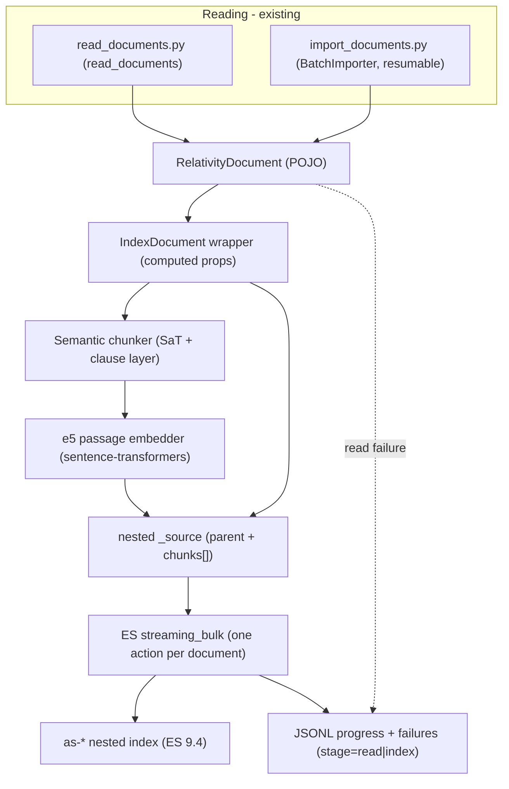

# aiR Assist: Document Indexing Module and Semantic Chunking

**Purpose:** Design reference for engineers and AI agents building a new `es-index-explorer` module
that takes the `RelativityDocument` data produced by [`read_documents.py`](../read_documents.py)
(one-shot) and [`import_documents.py`](../import_documents.py) (resumable batch) and writes it into the
custom nested aiR Assist index defined in `05-index-structure-design.md`. It specifies the declarative
field mapping, the derived/numeric field calculations, the HuggingFace tokenization + embedding stack,
a new semantic (sentence/clause-aware) chunker with variable overlap, the Elasticsearch bulk-write
strategy (including `refresh_interval` handling), and read-vs-index error reporting.

This document is a **design specification only** — it contains the critical algorithm, mapping, and
calculation snippets, but no full implementation. The code-planning and code-writing steps follow
separately.

**Scope and constraints (confirmed):**
- **Language: English only** for now. Multilingual is a future nice-to-have and explicitly out of
  scope. The chunker/segmenter must be robust to **out-of-vocabulary (OOV)** terms — proper nouns and
  typos. Stated preference: higher English accuracy over multilingual breadth.
- **Embedding model:** `intfloat/multilingual-e5-small` (384-dim, cosine) — the same model as
  production (`02-index-population-pipeline.md` §4), sourced from **HuggingFace** with **no dependency
  on company-internal projects** (no R1 Model Gateway, no Artifactory-only packages) for tokenization
  or embedding.
- **Target index:** the **nested** index from `05-index-structure-design.md` — **one Elasticsearch
  document per RelativityOne document**, with chunks stored as a `nested` array. This differs from
  production, which writes one ES document per chunk (`02-...md` §5).
- **Transaction granularity:** one RelativityOne document = one ES bulk action (atomic per document).
- **Elasticsearch:** 9.4.x (deployment 9.4.0, client 9.4.1), per `05-index-structure-design.md`.

**Reads from / cross-references:** `01-air-assist-elasticsearch-index.md` (current mapping),
`02-index-population-pipeline.md` (production chunking/embedding baseline), `03-retrieval-strategies.md`
(query-side `query:` prefix), `04-relativity-object-manager-api.md` (reading), and
`05-index-structure-design.md` (the target nested mapping, derived fields R12-R14, and `semantic_text`
parent fields).

> **`title` is documented here; only the code wiring is deferred.** This report fully specifies the
> index `title` mapping (source: the RelativityOne **`"Unified Title"`** field) and its derived
> `title_semantic` twin (§3). What is left to the later code phase is the *implementation* of the source
> wiring — adding `title` to `RelativityFieldMappingConfig`
> ([config.py](../es_index_explorer/config.py)), to `RelativityDocument`
> ([models.py](../es_index_explorer/relativity/models.py)), to the reader `field_map`
> ([reader.py](../es_index_explorer/relativity/reader.py)), and to `config.example.toml`. This report
> changes no code; it records the mapping so the code phase implements it alongside everything else.

---

## 1. Pipeline Overview

The new module sits downstream of the existing readers and turns each `RelativityDocument` into one
nested ES document. The unit of work is a single document: read -> build -> chunk -> embed -> write.



**Contrast with production (`02-...md`):** production chunks the text, embeds each chunk via the R1
Model Gateway, and writes **one ES document per chunk** keyed `{documentId}_{chunkId}`. Here we keep all
chunks of a document **together** as a nested array on **one** ES document keyed by the document
ArtifactId, matching the nested design in `05-...md` §2.4. Embedding still happens per chunk (batched),
but the ES write unit is the document.

---

## 2. Reused and New Data Classes

The request is to reuse as many existing data classes as possible and, where a new shape is needed, to
prefer a class that holds a reference to the original object and exposes computed properties.

### 2.1 Reused as-is (no changes in this report)

From [`es_index_explorer/relativity/models.py`](../es_index_explorer/relativity/models.py):
- `RelativityDocument` — the source POJO (artifact_id, control_number, extracted_text,
  primary_date_time, email_from/to/cc/bcc, summary, topic). The mapping (§3) also reads `source.title`;
  adding that `title` field (and its `"Unified Title"` config/reader wiring) is implemented in the later
  code phase — documented here, no code changed now.
- `ReadResult` — `documents` + `failures`.
- `FailedDocument` — `artifact_id`, `raw_row`, `error` (extended for stages in §8).

### 2.2 New: `IndexDocument` (wrapper over `RelativityDocument`)

A thin wrapper that **holds a reference** to the original `RelativityDocument` and exposes the
derived/computed values needed by the index. It does not copy source fields; it reads them through
`self.source`.

```python
@dataclass
class IndexDocument:
    """Computed, index-ready view over a RelativityDocument (holds a reference, does not copy)."""

    source: RelativityDocument
    chunks: list["Chunk"]          # produced by the chunker+embedder
    subset_ids: list[str]          # from run config (the active subset)

    @property
    def byte_size(self) -> int:
        return len(self.source.extracted_text.encode("utf-8"))

    @property
    def char_count(self) -> int:
        return len(self.source.extracted_text)

    @property
    def token_count(self) -> int:
        # full-document e5 token count, computed once (see section 4)
        ...

    @property
    def chunk_count(self) -> int:
        return len(self.chunks)
```

### 2.3 New: `Chunk` dataclass

Mirrors the nested `chunks` properties of the index (`05-...md` §4):

```python
@dataclass(frozen=True)
class Chunk:
    chunk_index: int            # 0-based, sequential
    text: str                   # exact substring of extracted_text
    token_count: int            # e5 tokens spanning [overlap_start, cut_next)
    leading_overlap_chars: int  # characters duplicated from the previous chunk (0 for chunk 0)
    embedding: list[float]      # 384-dim, normalized e5 passage vector
```

---

## 3. Declarative Field Mapping (single source of truth)

Mapping is expressed once, as a central `MAPPING` dictionary co-located with `IndexDocument`: ES field
name -> a pure extractor callable over an `IndexDocument`. Building an ES `_source` is then a single
dict comprehension over `MAPPING`, which keeps the document/index contract in **one place** and makes
it trivially serializable.

```python
from collections.abc import Callable

MAPPING: dict[str, Callable[[IndexDocument], object]] = {
    "document_artifact_id": lambda d: d.source.artifact_id,
    "control_number":       lambda d: d.source.control_number,
    "title":                lambda d: d.source.title,                # <- RelativityOne "Unified Title"
    "summary":              lambda d: d.source.summary,
    "topic":                lambda d: d.source.topic,
    "primary_date_time":    lambda d: d.source.primary_date_time,   # datetime | None -> ISO at serialize time
    "email_from":           lambda d: d.source.email_from,
    "email_to":             lambda d: d.source.email_to,
    "email_cc":             lambda d: d.source.email_cc,
    "email_bcc":            lambda d: d.source.email_bcc,
    "byte_size":            lambda d: d.byte_size,
    "token_count":          lambda d: d.token_count,
    "char_count":           lambda d: d.char_count,
    "chunk_count":          lambda d: d.chunk_count,
    "subset_ids":           lambda d: d.subset_ids,
    "chunks":               lambda d: [_chunk_to_dict(c) for c in d.chunks],
    # title_semantic / summary_semantic / topic_semantic are populated by Elasticsearch via copy_to
    # (05-...md §4.5) from title / summary / topic respectively - not set by the client.
}

def build_source(doc: IndexDocument) -> dict[str, object]:
    return {field: extract(doc) for field, extract in MAPPING.items() if extract(doc) is not None}

def _chunk_to_dict(c: Chunk) -> dict[str, object]:
    return {
        "chunk_index": c.chunk_index,
        "text": c.text,
        "token_count": c.token_count,
        "leading_overlap_chars": c.leading_overlap_chars,
        "embedding": c.embedding,
    }
```

| ES field | Source | Notes |
|---|---|---|
| `document_artifact_id` | `source.artifact_id` | also the ES `_id` (as a string) |
| `control_number` | `source.control_number` | |
| `title` | `source.title` | from RelativityOne `"Unified Title"`; feeds `title_semantic` via `copy_to`; source wiring implemented in the code phase |
| `summary`, `topic` | `source.summary`, `source.topic` | each feeds its `*_semantic` twin via `copy_to` (ES-side) |
| `primary_date_time` | `source.primary_date_time` | datetime | None`; serialized ISO-8601 |
| `email_from/to/cc/bcc` | `source.email_*` | keyword(s) |
| `byte_size`, `token_count`, `char_count`, `chunk_count` | computed (`IndexDocument`) | see §4 |
| `subset_ids` | run config (`relativity.subset_id`) | multi-tenancy scoping (`05-...md` §4.1) |
| `chunks[]` | chunker + embedder | nested array (§6) |
| `title_semantic`, `summary_semantic`, `topic_semantic` | not set by client | filled by ES `copy_to` from `title`/`summary`/`topic` (`05-...md` §4.5) |

**Why a dict over decorators/attributes.** A C#-attribute-style approach (decorators on a model) is
possible, but a plain dict of extractor callables is the most declarative-in-one-place option, has no
import-time magic, is easy to unit-test, and serializes directly. The decorator alternative is noted but
not recommended. `_id = str(artifact_id)`.

---

## 4. Derived / Numeric Calculations

All derived numeric fields are computed once per document. Definitions follow `05-...md` §6 exactly.

**Document level:**

```python
byte_size  = len(extracted_text.encode("utf-8"))   # 05-...md §6.1 (UTF-8 actual bytes; ADLS-file parity)
char_count = len(extracted_text)                    # 05-...md §6.4 (Unicode code points)
token_count = len(tokenizer(extracted_text,         # 05-...md §6.2 (full-doc, PRE-chunking)
                            add_special_tokens=False).input_ids)
chunk_count = len(chunks)                            # 05-...md §6.3
```

- `token_count` is the **full-document** e5 token count computed **before** chunking. It is *not* the
  sum of `chunks[].token_count` (overlap double-counts boundary tokens), per `05-...md` §6.2.
- These reuse the **same** tokenizer object used for chunking and embedding (§5), so the count is
  consistent with the chunk geometry.

**Chunk level:**

```python
chunk_index           = i                                   # 0-based, in order
token_count           = cut_next - overlap_start            # e5 tokens in [overlap_start, cut_next)
leading_overlap_chars = char(content_start) - char(overlap_start)   # 0 for chunk 0; see §6
```

`leading_overlap_chars` is in **characters** (not tokens) so the retrieval layer can concatenate a
contiguous run of chunks and strip duplicated overlap with no tokenizer (`05-...md` §8, R14).

### 4.1 The e5 512-token cap (a hard constraint on chunk size)

`intfloat/multilingual-e5-small` accepts at most **512 tokens**; longer inputs are truncated
([model card](https://huggingface.co/intfloat/multilingual-e5-small)). At embed time each chunk becomes
`"passage: " + chunk.text`, which adds the prefix tokens plus 2 special tokens (`<s>`, `</s>`).
Therefore the usable content budget is:

```python
MAX_CONTENT = MODEL_MAX_TOKENS - NUM_SPECIAL_TOKENS - len(tokenizer("passage: ", add_special_tokens=False).input_ids)
# ~= 512 - 2 - ~3 = ~507  (computed at runtime, not hard-coded)
```

Because a chunk is `leading_overlap + new_content`, and we allow up to 120 overlap + ~400 new = 520,
**the chunker must cap total chunk tokens at `MAX_CONTENT`** (overlap is chosen first within
`[40, 120]`, then the cut yields so `cut_next - overlap_start <= MAX_CONTENT`). Without this, the
**newest** content (chunk tail) would be silently truncated at embed time. This is the single most
important numeric constraint introduced by the embedding model.

---

## 5. Tokenization and Embedding (HuggingFace, no company dependencies)

### 5.1 One shared model + tokenizer

```python
from sentence_transformers import SentenceTransformer

model = SentenceTransformer(EMBEDDING_MODEL)   # "intfloat/multilingual-e5-small" (or a local path)
tokenizer = model.tokenizer                    # XLM-RoBERTa SentencePiece (fast) - reused for chunking
```

- The **same tokenizer object** is used both to count/align tokens for chunking (§4, §6) and to feed
  the embedding model — satisfying the "use literally the same tokenizer" requirement. e5 uses the same
  SentencePiece model as Sentence-Transformers, so it is reusable as-is
  ([axinc-ai overview](https://medium.com/axinc-ai/multilingual-e5-a-machine-learning-model-for-embedding-text-in-multiple-languages-b4916cb22bda)).
- A **fast** tokenizer is required so we can request `return_offsets_mapping=True` for char<->token
  alignment (§6).

### 5.2 Embedding chunks

```python
texts = [f"passage: {c.text}" for c in chunks]                # e5 requires the "passage: " prefix
vectors = model.encode(texts, normalize_embeddings=True,      # unit vectors -> cosine parity with index
                       batch_size=EMBEDDING_BATCH_SIZE)        # default ~96 (02-...md §4.3)
```

- The `passage:` prefix is mandatory for e5 documents; queries use `query:` at retrieval time
  (`03-...md`). Omitting prefixes degrades quality
  ([e5 model card](https://huggingface.co/intfloat/multilingual-e5-small)).
- `normalize_embeddings=True` yields unit-length vectors, matching the index `similarity: cosine`
  (`05-...md` §4) ([sentence-transformers usage](https://sbert.net/docs/sentence_transformer/usage/usage.html)).
- Batch size is configurable; embedding can be batched across the chunks of one document, or across a
  small buffer of documents, while the **ES write stays per document** (§7).

### 5.3 Out-of-vocabulary terms (proper nouns, typos)

SentencePiece subword tokenization (XLM-RoBERTa) decomposes any unknown token into in-vocabulary
subword units, so OOV proper nouns and typos are handled with **no special logic** for either embedding
or token counting. (The chunker is likewise OOV-robust — §6.) `intfloat/multilingual-e5-small` is kept
as agreed; it performs well on English, and an English-only embedding model is out of scope.

### 5.4 Model provisioning

Add a config option for the model source: HuggingFace Hub id (default) or a local directory, plus an
offline flag (`HF_HUB_OFFLINE`) for air-gapped runs, since the cluster's outbound network posture is
unknown. Dependencies: `sentence-transformers` (pulls `torch` + `transformers`). This is acceptable for
a research/tooling repo (unlike the production agent image).

---

## 6. Semantic Chunking and Variable-Overlap Algorithm

This is the core of the module. The geometry, measured in **e5 subword tokens**, is:

- ~**400 new (unique) tokens** per chunk, snapped to a semantic boundary;
- a **variable leading overlap of 40-120 tokens (target 80)** carried from the previous chunk;
- the **first chunk has no leading overlap**;
- total tokens per chunk capped at `MAX_CONTENT` (§4.1);
- `leading_overlap_chars` recorded in **characters** for tokenizer-free concatenation (`05-...md` §8).

### 6.1 Boundary candidates and priority

Boundaries are detected as **character positions**, mapped to e5 token indices via the offset mapping,
and tagged with a priority. The semantic preference hierarchy (most -> least preferred) is:

| Priority | Boundary type | Source |
|---|---|---|
| 5 | Sentence end (incl. newlines) | segmenter (SaT default), as char spans |
| 4 | Parenthetical close `)` | punctuation scan |
| 3 | Semicolon `;` | punctuation scan |
| 2 | Comma `,` (real separator) | punctuation scan with digit-guard (not `1,000`) |
| 1 | Word boundary | every inter-token gap (always available) |

The segmenter is **pluggable** (see §6.5). SaT returns sentence strings that are exact contiguous
substrings of the input, so their char offsets are recovered by sequential indexing; the clause layer
(priorities 4-2) scans the original text for the punctuation marks and applies a digit-guard so numeric
commas are not treated as clause separators. Word boundaries (priority 1) are the inter-token gaps from
the tokenizer and guarantee a candidate always exists.

### 6.2 Scoring

Two selections drive the algorithm. Both prefer **higher-priority** boundaries first, then proximity to
a target, with deterministic tie-breaking.

**Cut selection** (end of the ~400 new tokens). Among candidate boundaries with token index in the
search band around `target = content_start + 400`, choose by:
1. highest priority;
2. smallest `|index - target|` (linear);
subject to the cap `index - overlap_start <= MAX_CONTENT`. If only word boundaries exist, take the word
boundary nearest `target` (or the cap, whichever binds).

**Overlap selection** (leading overlap of the next chunk; user-specified rule). Among candidate
boundaries whose overlap length `o = content_start - index` falls in `[40, 120]`, choose by:
1. highest priority;
2. smallest `|o - 80|` (symmetric, linear);
3. tie -> **shorter** overlap (larger index).
If only word boundaries exist, take the word boundary nearest `o = 80` within `[40, 120]`. The first
chunk has overlap 0.

> Priority dominates distance by design ("semantic-based, not a strict token cut-off"): e.g. a sentence
> boundary at overlap 45 is preferred over a comma at overlap 80. The weighting is a tunable knob; the
> default is strict priority-first, distance-second.

### 6.3 Algorithm (pseudocode)

```python
def chunk_document(text, tokenizer, segmenter, cfg) -> list[ChunkSpan]:
    enc = tokenizer(text, add_special_tokens=False, return_offsets_mapping=True)
    tokens, offsets = enc["input_ids"], enc["offset_mapping"]   # offsets[t] = (char_start, char_end)
    n = len(tokens)
    if n == 0:
        return []

    # 1) candidate boundaries: token_index -> max priority (word=1 implicit for every index)
    boundaries = detect_boundaries(text, offsets, segmenter)    # {token_index: priority>=2}; falls back below

    # 2) if no sentence/clause structure at all -> legacy non-semantic sliding window (02-...md §3)
    if not has_usable_structure(boundaries):
        return legacy_sliding_window(tokens, offsets, text, cfg)   # 500 window / 100 overlap

    spans, content_start, i = [], 0, 0
    while content_start < n:
        # leading overlap (0 for first chunk)
        overlap_start = 0 if i == 0 else select_overlap(boundaries, content_start, cfg)

        # cut: ~400 new tokens, snapped, capped so (cut - overlap_start) <= MAX_CONTENT
        target = content_start + cfg.chunk_new_tokens                  # 400
        cap_hi = overlap_start + cfg.max_content_tokens                # ~507
        cut = select_cut(boundaries, content_start, target, cap_hi, n, cfg)

        char_start = offsets[overlap_start][0]
        char_end   = offsets[cut - 1][1]
        leading_overlap_chars = offsets[content_start][0] - offsets[overlap_start][0]  # 0 when i == 0

        spans.append(ChunkSpan(
            chunk_index=i,
            text=text[char_start:char_end],
            token_count=cut - overlap_start,
            leading_overlap_chars=leading_overlap_chars,
        ))
        content_start, i = cut, i + 1
    return spans
```

Key invariants:
- `chunk.text = text[char(overlap_start):char(cut)]` is an **exact substring** of `extracted_text`.
- The head of chunk `i` of length `leading_overlap_chars` equals the tail of chunk `i-1` (same character
  range), so retrieval-time concatenation strips it once (`05-...md` §8).
- `cut > content_start` is enforced (progress guaranteed; word boundaries ensure a candidate exists).

### 6.4 Fallbacks

- **Per-boundary:** when no priority >= 2 boundary fits a search band, fall back to the **word**
  boundary nearest the target (still token-accurate, just not semantic).
- **Whole-document:** when the segmenter finds no sentence/clause structure (e.g. a single
  unpunctuated blob), fall back to the **legacy non-semantic sliding window** (500-token window,
  100-token overlap; `02-...md` §3). It plugs into the same `ChunkSpan` interface, so downstream code is
  unchanged.

### 6.5 Segmenter library: evaluation and decision

The sentence engine is **pluggable / config-selectable**; the clause layer, scoring, fallbacks, and
token/char alignment are engine-independent. Evaluation criteria (reweighted for the English-only,
accuracy-first scope): **English sentence-boundary accuracy**, robustness to noisy/OCR/legal text,
OOV/typo robustness, **maintenance/activity**, dependencies, license, and latency.

- **SaT / `wtpsplit`** (ML; MIT; EMNLP 2024; actively maintained) — **RECOMMENDED DEFAULT.** English
  ~96.5-97.4 (sat-3l-sm / sat-12l-sm); state-of-the-art, punctuation-agnostic, and explicitly robust on
  poorly formatted and **legal-domain** text — a strong fit for e-discovery. Dependencies **reuse the
  `torch`** already pulled for e5, or run via **`wtpsplit-lite`** (ONNX; minimal deps:
  `onnxruntime`, `tokenizers`, `numpy`, `huggingface-hub`). Cost: per-document model inference
  (~150 ms/page with the lite ONNX path; slower on CPU with full torch). OOV-robust (subword model).
  ([paper](https://arxiv.org/abs/2406.16678), [repo](https://github.com/segment-any-text/wtpsplit),
  [lite](https://github.com/superlinear-ai/wtpsplit-lite))
- **BlingFire** (Microsoft; MIT; stable) — **recommended lightweight alternative / no-ML fallback.**
  Fastest by far (C++ via pip wheel, **no runtime dependencies**), ~90-92% English GRS, handles
  abbreviations (`Dr.`, `D.C.`, `Jan. 5th`). Best when ML/torch is undesirable.
  ([repo](https://github.com/microsoft/BlingFire))
- **sentencex** (Wikimedia; MIT; very actively maintained, Rust core, char offsets, ~300 languages) —
  secondary lightweight option. Fast and current; English GRS accuracy is benchmark-dependent (worth a
  quick check before adopting). ([repo](https://github.com/wikimedia/sentencex))
- **pySBD** (MIT) — **assessed for completeness, NOT selected.** Accurate (~97% English GRS) but
  **unmaintained since 2021** (last release v0.3.4, Feb 2021) and ~20x slower than BlingFire. It is the
  origin of the sentencex / sentencesplit rule sets. ([repo](https://github.com/nipunsadvilkar/pySBD),
  [paper](https://aclanthology.org/2020.nlposs-1.15/))
- **Rejected:** `syntok` (fails on common abbreviation patterns), `nltk` punkt (lower ~66-72% GRS),
  `MiniSBD` (brand-new, **AGPL-3.0** copyleft), spaCy (heavier; its dependency parser is offered only as
  an optional clause-accuracy upgrade), and LLM/encoder approaches (cost, non-determinism; and e5 is an
  **encoder** that cannot segment by generation).

**Does this need morphosyntactic analysis?** No. SaT (or any rule-based engine) for sentences, plus the
punctuation clause layer, suffices for the requested hierarchy. Full dependency parsing (spaCy) is an
optional clause-accuracy upgrade only and is not required.

---

## 7. Writing to Elasticsearch

### 7.1 Nested document construction

For each document, build the `_source` from `MAPPING` (§3) and emit one bulk action:

```python
def to_action(index_name: str, doc: IndexDocument, *, overwrite: bool) -> dict:
    # Default (overwrite=False) -> "create": Elasticsearch returns 409 if the _id already exists, so an
    # existing document is never clobbered. overwrite=True -> "index": replace any existing document.
    return {"_op_type": "index" if overwrite else "create", "_index": index_name,
            "_id": str(doc.source.artifact_id), "_source": build_source(doc)}
```

`primary_date_time` is serialized to ISO-8601 (e.g. via `RelativityDocument.model_dump(mode="json")`
for the source fields, or an explicit `.isoformat()`), so the ES `date` field parses cleanly.

> **Note - "request `_source`" vs "stored `_source`".** The `_source` built here is the **write-time
> request body**, which **must include `chunks[].embedding`** so Elasticsearch can index the vectors
> into the kNN (BBQ/HNSW) structure. It is *not* a contradiction with vectors being absent from
> results: the index definition excludes them from the **stored/returned** `_source`
> (`05-...md` §4.4 - `_source.excludes` lists `chunks.embedding` and the `*_semantic.inference.*`
> outputs; ES 9.x also defaults `index.mapping.exclude_source_vectors` to true). After indexing, ES
> strips the vectors from the persisted `_source` and does not echo them in search hits, while keeping
> the raw vectors internally for kNN scoring and rescoring. In short: send the embeddings at write
> time; they are simply not retained in or returned from `_source`.

### 7.2 Bulk + batch size

Use the streaming bulk helper, which sends actions in chunks and yields a result per action:

```python
from elasticsearch.helpers import streaming_bulk

for ok, info in streaming_bulk(
        client, actions,
        chunk_size=cfg.bulk_docs_per_request,   # DOCUMENTS per _bulk request (configurable)
        max_retries=cfg.bulk_max_retries, retry_on_status=(429,),
        raise_on_error=False, yield_ok=True):
    record_result(ok, info)                     # per-document success/failure (see §8)
```

- `chunk_size` here counts **documents** (each action is a full nested document), and is a **new,
  dedicated setting** — it is unrelated to the QuerySlim read `batch_size`, which paginates the OM read.
  Embedding has its own `embedding_batch_size` (§5).
- `retry_on_status=(429,)` handles transient backpressure with exponential backoff
  ([es-py helpers](https://elasticsearch-py.readthedocs.io/en/stable/api_helpers.html)).
- With the default `create` op (no `--overwrite`), an existing `_id` yields a **409 conflict** per
  action; `streaming_bulk` surfaces it as `ok is False` with `info["create"]["status"] == 409`. We
  classify it as an index-stage **conflict error** (§8.2), not a silent skip. With `--overwrite`, the
  `index` op replaces the document and `info["index"]["result"]` is `"updated"` (vs `"created"` for a
  brand-new doc), which we log distinctly.

### 7.3 `refresh_interval` handling (disable for load, restore after)

Elastic's "tune for indexing speed" guidance is to set `index.refresh_interval` to `-1` during a bulk
load and restore it afterwards
([guide](https://www.elastic.co/guide/en/elasticsearch/reference/current/tune-for-indexing-speed.html)).
Elasticsearch has **no "temporary" disable** — you set `-1` explicitly and restore the original value.
Wrap the ingest in a context manager so the original is always restored, even on error:

```python
@contextmanager
def disabled_refresh(client, index):
    current = client.indices.get_settings(index=index)
    original = current[index]["settings"]["index"].get("refresh_interval")   # may be absent (default)
    client.indices.put_settings(index=index, settings={"index": {"refresh_interval": "-1"}})
    try:
        yield
    finally:
        client.indices.refresh(index=index)                                  # make the load visible once
        client.indices.put_settings(index=index,
                                    settings={"index": {"refresh_interval": original}})  # None -> reset to default
```

The index ships with `refresh_interval: 60s` (`05-...md` §4), so `original` is restored to that; if it
were unset, passing `None` resets it to the ES default. (Replica reduction is deliberately not changed
here; it can be added later as an optional tuning step.)

### 7.4 Idempotency, overwrite policy, and re-runs

`_id = str(artifact_id)` makes writes idempotent by identity, but **overwriting an existing document is
NOT allowed by default**:

- **Default (no `--overwrite`):** actions use `_op_type: "create"`. If a document with the same `_id`
  already exists, Elasticsearch returns a **409 conflict**; the indexer records it as an **index-stage
  error** (`outcome="conflict"`, `error_type="document_exists_conflict"`), surfaces it as the terminal
  "last error", and writes it to the resume/failures log. The existing record is **left untouched**.
- **With `--overwrite` (explicit opt-in CLI flag):** actions use `_op_type: "index"`, replacing any
  existing document. Each replacement is detected from the bulk result (`result == "updated"`) and
  **logged distinctly** in the result file as an `overwritten` outcome (separate from `created`), so
  overrides are auditable.

Because all chunks live on one document, replacement needs no orphan-chunk cleanup (the problem
production solves when a re-chunk yields fewer chunks — `02-...md` §5.3). Re-running after a partial
load re-attempts only the not-yet-succeeded documents (§8.1-§8.2).

---

## 8. Integration, Error Reporting, Configuration, Dependencies

### 8.1 Integration with the existing readers

A new `indexing` package (e.g. `es_index_explorer/indexing/`: `document_builder.py`, `chunking.py`,
`embedding.py`, `writer.py`, `indexer.py`) consumes either:
- the one-shot `read_documents(...) -> ReadResult` ([`reader.py`](../es_index_explorer/relativity/reader.py)), or
- the resumable `BatchImporter` stream ([`batch_reader.py`](../es_index_explorer/relativity/batch_reader.py))
  for large workspaces.

A new root CLI (`index_documents.py`) wires read -> index, reusing the existing JSONL `ProgressLog` /
`ImportState` and the `ProgressView` TUI ([`progress.py`](../es_index_explorer/relativity/progress.py),
[`tui.py`](../es_index_explorer/relativity/tui.py)). The transaction unit is one document, matching the
existing per-document progress model and resume semantics. The CLI exposes **`--overwrite`** to permit
replacing documents that already exist in the index (default off; see §7.4).

### 8.2 Error reporting: distinguish read vs index failures

Record a per-document **outcome** so the result/resume JSONL and the terminal state which **stage**
acted and **why**:

```python
@dataclass(frozen=True)
class DocumentResult:
    artifact_id: int | None
    outcome: Literal["created", "overwritten", "conflict", "read_failed", "index_failed"]
    stage: Literal["read", "index"] | None = None   # set for failures/conflicts
    error_type: str | None = None                   # exc.__class__.__name__ or ES error.type
    error_message: str | None = None                # str(exc) or ES error.reason
```

- **Read failures** (validation/OM) -> `outcome="read_failed"`, `stage="read"` (today's
  `FailedDocument`).
- **Index failures** (embedding/chunking exception, or a non-conflict ES error) -> `outcome="index_failed"`,
  `stage="index"`, carrying the ES `error.type`/`reason` or the Python exception type and message.
- **Existing-document conflict** (default, no `--overwrite`): a 409 from the `create` op ->
  `outcome="conflict"`, `stage="index"`, `error_type="document_exists_conflict"`. Treated as an
  **error** (terminal last error + resume/failures log), never overwriting.
- **Overwrite** (with `--overwrite`): bulk `result == "updated"` -> `outcome="overwritten"` (logged
  distinctly for auditability); `result == "created"` -> `outcome="created"`.
- **Resume:** `created`/`overwritten` advance `last_processed_id`; `read_failed`/`index_failed`/`conflict`
  are retryable via `--retry`. Note a `conflict` will recur on retry unless `--overwrite` is supplied —
  this is intentional, so overriding an existing record is always an explicit user choice.

### 8.3 Configuration additions

```toml
[elasticsearch]
# hosts = [...]                # existing
index_name = "as-..."          # target nested index

[indexing]
bulk_docs_per_request = 200    # documents per _bulk
bulk_max_retries = 3
embedding_model = "intfloat/multilingual-e5-small"   # or a local path
embedding_batch_size = 96
chunk_new_tokens = 400
overlap_target = 80
overlap_min = 40
overlap_max = 120
fallback_overlap = 100
max_content_tokens = 505       # or computed from the tokenizer at runtime
segmenter = "sat"              # "sat" | "blingfire" | ...
sat_model = "sat-3l-sm"
```

Overwrite behavior is a **CLI flag** (`--overwrite`, default off), not a config key: by default an
existing `_id` is a conflict error (§7.4); passing `--overwrite` replaces the document and logs it as
`overwritten`. `title` is mapped from the RelativityOne `"Unified Title"` field via a new
`[relativity.fields].title` key (mapping documented in §3); implementing that config key, the POJO, and
the reader is part of the later code phase.

### 8.4 Dependencies

- `sentence-transformers` (+ `torch`, `transformers`) — e5 embeddings and the shared tokenizer.
- `wtpsplit` (reuses `torch`) **or** `wtpsplit-lite` (ONNX, minimal deps) — the SaT segmenter.
- optional `blingfire` — the lightweight, no-ML alternative engine.
- `elasticsearch` — already present.
- (`pysbd` is **not** required.)

`es-index-explorer` is research/tooling, so these dependencies are acceptable (unlike the minimal
production agent image).

---

## 9. Open Decisions and Assumptions

1. **SaT model size / runtime:** `sat-3l-sm` (~96.5, faster) vs `sat-12l-sm` (~97.4, slower); `wtpsplit`
   (torch) vs `wtpsplit-lite` (ONNX). To be benchmarked on representative e-discovery text in the code
   phase.
2. **Cut search radius and priority-vs-distance weighting** are tunable; defaults are priority-first,
   distance-second, with a modest band around 400.
3. **`subset_ids` source:** taken from the run's `relativity.subset_id`; append-to-existing semantics
   (production's `AlreadyIndexedAppendToSubset`, `02-...md` §5.3) are out of scope for the first version
   (full overwrite per document).
4. **`title`** mapping (source: `"Unified Title"`) is documented in §3; only its code wiring (config,
   POJO, reader, example config) is deferred to the code phase.
5. **Document modify time / versioning** (production `documentModifyTime`, `NewVersion`) are not
   modeled. Re-runs do **not** overwrite by default: an existing `_id` is reported as a conflict error
   (§7.4); overriding requires the explicit `--overwrite` flag, which logs an `overwritten` outcome.
6. **Embedding skip mode** (text-search-only, `02-...md` §4.4) could be added later via a config flag.

---

## 10. Sources

**This folder:** `01-air-assist-elasticsearch-index.md`, `02-index-population-pipeline.md`,
`03-retrieval-strategies.md`, `04-relativity-object-manager-api.md`, `05-index-structure-design.md`.

**External:**
- e5 model (prefixes, 512-token limit, XLM-RoBERTa/SentencePiece): https://huggingface.co/intfloat/multilingual-e5-small
- Sentence-Transformers usage (prompts, normalize): https://sbert.net/docs/sentence_transformer/usage/usage.html
- SaT / Segment any Text (EMNLP 2024): https://arxiv.org/abs/2406.16678 ; https://github.com/segment-any-text/wtpsplit ; https://github.com/superlinear-ai/wtpsplit-lite
- BlingFire: https://github.com/microsoft/BlingFire
- sentencex (Wikimedia): https://github.com/wikimedia/sentencex
- pySBD (assessed, not selected): https://github.com/nipunsadvilkar/pySBD ; https://aclanthology.org/2020.nlposs-1.15/
- Independent sentence-tokenizer benchmark: https://github.com/ndgigliotti/sentence-tokenizer-bench
- Elasticsearch "tune for indexing speed" (refresh_interval): https://www.elastic.co/guide/en/elasticsearch/reference/current/tune-for-indexing-speed.html
- Python Elasticsearch helpers (`streaming_bulk`): https://elasticsearch-py.readthedocs.io/en/stable/api_helpers.html
