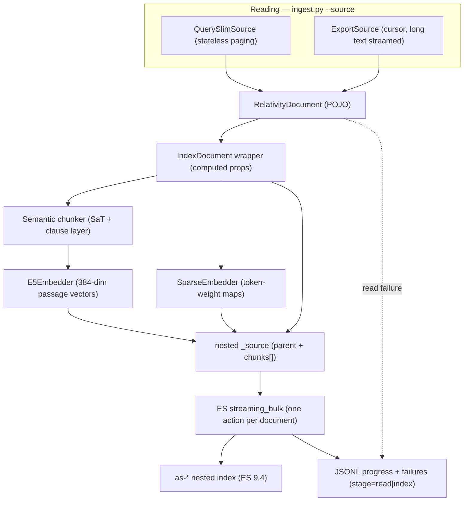

# Custom aiR Assist Elasticsearch Index: Design and Ingestion Reference

**Purpose:** Single-source-of-truth design and ingestion reference for the custom aiR Assist
Elasticsearch index. This document covers the index structure, field mapping, embedding and chunking
pipelines, retrieval strategies, and configuration. It is written for human engineers and AI agents
building a RAG client against this index.

**Target stack:**
- Elasticsearch **9.4** (deployment **9.4.0**, client **9.4.1**), **Platinum/Enterprise** license.
- Dense chunk embeddings: **`intfloat/multilingual-e5-small`** (384 dims, cosine) — computed
  client-side via `sentence-transformers`.
- Sparse parent-metadata embeddings: **`opensearch-project/opensearch-neural-sparse-encoding-v2-distill`**
  (BERT WordPiece, symmetric, Apache-2.0) — computed client-side via `sentence-transformers`
  `SparseEncoder`. **No Elasticsearch inference endpoint dependency.**
- Index prefix: **`as-*`** (Applied Science / research grant).

**Consolidates:** reports `05-index-structure-design.md`, `06-document-indexing-and-semantic-chunking.md`,
and `07-client-side-sparse-vectors.md` in this folder. Those reports remain as historical references;
this document supersedes them for all implementation work.

---

## 1. Requirements

The design is evaluated against these explicit requirements:

| # | Requirement | Source |
|---|---|---|
| R1 | Two-level hierarchy: one parent (document) has 0..N children (chunks); each child has exactly one parent; children have no children. | User |
| R2 | Document-level (global/categorical) attributes live at the parent: title, summary, topic, email from/to/cc/bcc, primary date, derived metrics. | User |
| R3 | Evaluate highly specific child-level queries, enforce parent-level metadata filters, and reconstitute parent context — without performance degradation or index fragmentation. | User |
| R4 | Children are immutable after write; parents are very unlikely to change. | User |
| R5 | Typically <10 children per parent, occasionally up to a few dozen. | User |
| R6 | Be ready for any chunking strategy (fixed window +/- overlap, semantic, sentence-boundary) without changing the index structure. | User |
| R7 | Support, on a single index, the full matrix of retrieval strategies: lexical (BM25), dense (kNN), sparse (learned sparse), hybrid (RRF/linear), and later reranking (MMR, cross-encoder, late-interaction, LLM). | User |
| R8 | Support both single-call ("do everything in ES, return everything") and multi-step (find docs -> fetch chunks -> re-query) retrieval. | User |
| R9 | Be ready to return either separate document/chunk objects (joined agent-side) or denormalized chunks-with-metadata. | User |
| R10 | Decide whether the first chunk is a parent field or a child element; avoid redundant data. | User |
| R11 | Not inferior to the current index: every field/search capability present today must be available here, plus more. | User |
| R12 | Derived field `byte_size` enabling an **optional query-time** filter on documents (and their chunks) whose content exceeds 5 MB. Applied at query time, not as an ingest-time exclusion — every document is indexed. | User |
| R13 | Index-setup code must set all important parameters explicitly — no reliance on cluster-template defaults. | User |
| R14 | Retrieval must be able to concatenate a contiguous series of sibling chunks into one larger chunk, de-duplicating the dynamic per-boundary overlap so the shared text appears once. | User |

---

## 2. Design Rationale

Four relationship-modeling patterns were evaluated against R1-R14:

- **Nested objects (chosen):** one ES document per Relativity document; chunks stored as a `nested`
  array. Excellent parent-pre-filtered hybrid search in one query, no metadata duplication, immutable
  children make reindex cost irrelevant. The ranking unit is the **document** (scored by its best
  passage via `score_mode: max`), with matching chunks returned via `inner_hits`.
- **Flat denormalization (retained as evaluation alternative):** one ES document per chunk; parent
  metadata duplicated on every chunk. Native global chunk-level ranking, trivial sharding — the current
  production model. Retained as a first-class paradigm; the document-centric vs chunk-centric choice is
  an evaluation question.
- **Separate indices:** parents and chunks in different indices with application-side join. Multi-step
  only; cannot satisfy single-call retrieval (R8). Not recommended as a general-purpose base.
- **`join` field:** Elastic explicitly discourages; 5-10x slower than nested, single-shard constraint,
  does not compose with kNN/RRF. Rejected.

**Ranking unit:** nested queries rank **documents**, each scored by its best passage. A global
chunk-level ranking is obtained via a client-side flatten of `inner_hits` (provably complete with
`score_mode: max`; see §13.5). For hybrid, two documented approaches exist (§13.6).

---

## 3. Source Data Model

### 3.1 RelativityDocument

The ingest pipeline reads `RelativityDocument`
([`es_index_explorer/relativity/models.py`](../es_index_explorer/relativity/models.py)):

| Python field | Type | Required | Role |
|---|---|---|---|
| `artifact_id` | `int` | yes | Relativity document ArtifactId — the stable primary key |
| `control_number` | `str` | yes | Human-readable Relativity Control Number |
| `extracted_text` | `str` | yes | Full document text; source of all chunks |
| `title` | `str \| None` | no | Document title (source: RelativityOne "Unified Title") |
| `primary_date_time` | `datetime \| None` | no | Date for range filtering |
| `email_from` | `str \| None` | no | Email sender |
| `email_to` | `list[str] \| None` | no | Email recipients (multi-valued) |
| `email_cc` | `list[str] \| None` | no | Email CC (multi-valued) |
| `email_bcc` | `list[str] \| None` | no | Email BCC (multi-valued) |
| `summary` | `str \| None` | no | Document-level summary |
| `topic` | `str \| None` | no | Document-level topic |
| `extracted_text_size_kb` | `float \| None` | no | Workspace-reported extracted-text size in KB |

### 3.2 Parent vs child mapping

- **Parent (document)** carries all of the above *except* `extracted_text`, plus derived metrics
  (§7): `byte_size`, `token_count`, `char_count`, `chunk_count`, `workspace_extracted_text_size`,
  multi-tenancy `subset_ids`, and client-computed sparse vectors (`title_sparse`, `summary_sparse`,
  `topic_sparse`).
- **Child (chunk)** carries only what is derived from `extracted_text`: `chunk_index`, `text`,
  `embedding`, `token_count`, `byte_size`, `char_count`, `leading_overlap_chars`.

### 3.3 Identifiers

| Identifier | Where | Notes |
|---|---|---|
| `document_artifact_id` | parent | = Relativity ArtifactId. Stable, used for security trimming and joins. |
| `control_number` | parent | Display/citation. |
| `chunk_index` | child | 0-based sequential index within the document. |
| ES `_id` | parent doc | `str(artifact_id)`. One ES document per Relativity document. |

---

## 4. Index Mapping

Every parameter is set explicitly per R13. The JSON below is the authoritative mapping from
[`air_assist_nested.json`](../es_index_explorer/index_definitions/air_assist_nested.json):

```json
{
  "settings": {
    "index": {
      "number_of_shards": 1,
      "number_of_replicas": 1,
      "refresh_interval": "60s",
      "max_inner_result_window": 100,
      "mapping": {
        "nested_objects": { "limit": 25000 },
        "total_fields": { "limit": 2000 }
      }
    }
  },
  "mappings": {
    "_source": {
      "enabled": true,
      "excludes": [
        "chunks.embedding",
        "title_sparse",
        "summary_sparse",
        "topic_sparse"
      ]
    },
    "dynamic": "strict",
    "properties": {
      "document_artifact_id": { "type": "long" },
      "control_number": { "type": "keyword" },
      "title": { "type": "text" },
      "summary": { "type": "text" },
      "topic": { "type": "text" },
      "primary_date_time": { "type": "date" },
      "email_from": { "type": "keyword" },
      "email_to": { "type": "keyword" },
      "email_cc": { "type": "keyword" },
      "email_bcc": { "type": "keyword" },
      "byte_size": { "type": "long" },
      "workspace_extracted_text_size": { "type": "long" },
      "token_count": { "type": "integer" },
      "char_count": { "type": "integer" },
      "chunk_count": { "type": "integer" },
      "subset_ids": { "type": "keyword" },
      "title_sparse": {
        "type": "sparse_vector",
        "index_options": {
          "prune": true,
          "pruning_config": {
            "tokens_freq_ratio_threshold": 5,
            "tokens_weight_threshold": 0.4
          }
        }
      },
      "summary_sparse": {
        "type": "sparse_vector",
        "index_options": {
          "prune": true,
          "pruning_config": {
            "tokens_freq_ratio_threshold": 5,
            "tokens_weight_threshold": 0.4
          }
        }
      },
      "topic_sparse": {
        "type": "sparse_vector",
        "index_options": {
          "prune": true,
          "pruning_config": {
            "tokens_freq_ratio_threshold": 5,
            "tokens_weight_threshold": 0.4
          }
        }
      },
      "chunks": {
        "type": "nested",
        "properties": {
          "chunk_index": { "type": "integer" },
          "text": { "type": "text" },
          "byte_size": { "type": "long" },
          "char_count": { "type": "integer" },
          "token_count": { "type": "integer" },
          "leading_overlap_chars": { "type": "integer" },
          "embedding": {
            "type": "dense_vector",
            "dims": 384,
            "index": true,
            "similarity": "cosine",
            "index_options": {
              "type": "bbq_hnsw",
              "m": 16,
              "ef_construction": 100,
              "rescore_vector": { "oversample": 3.0 }
            }
          }
        }
      }
    }
  }
}
```

### 4.1 Index settings rationale

| Setting | Value | Why |
|---|---|---|
| `number_of_shards` | 1 | Single shard keeps BM25 IDF statistics global (no `dfs_query_then_fetch` needed). Sufficient for the expected corpus size (~5-15M chunk vectors, ~1-2 GB RAM). |
| `number_of_replicas` | 1 | Standard HA. |
| `refresh_interval` | `60s` | Reduced refresh frequency for bulk-load throughput. Disabled (`-1`) during ingest runs and restored after (§12.3). |
| `max_inner_result_window` | 100 | Caps `inner_hits.from + inner_hits.size` per document. Set explicitly per R13 (also the ES default). |
| `nested_objects.limit` | 25000 | Well above the expected max chunks per document (~few dozen). |
| `total_fields.limit` | 2000 | Headroom for future fields. |

---

## 5. Field-by-Field Reference

### 5.1 Parent-level fields

| Field | ES Type | Source / Computation | Search / Retrieval Role |
|---|---|---|---|
| `document_artifact_id` | `long` | `source.artifact_id` | Exact filter, security-trim join key, document identity. Also the ES `_id` (as string). |
| `control_number` | `keyword` | `source.control_number` | Display/citation, exact filter, sort/agg. |
| `title` | `text` | `source.title` (RelativityOne "Unified Title") | BM25 full-text search on title. |
| `summary` | `text` | `source.summary` | BM25 full-text search on summary. |
| `topic` | `text` | `source.topic` | BM25 full-text search on topic. |
| `title_sparse` | `sparse_vector` | Client-computed by `SparseEmbedder` from `title` text; `{token: weight}` map. Omitted when title is empty. | Learned-sparse retrieval on title via `sparse_vector` query. Token pruning pinned (`prune: true`, thresholds 5/0.4). |
| `summary_sparse` | `sparse_vector` | Client-computed by `SparseEmbedder` from `summary` text; `{token: weight}` map. Omitted when summary is empty. | Learned-sparse retrieval on summary via `sparse_vector` query. Token pruning pinned (`prune: true`, thresholds 5/0.4). |
| `topic_sparse` | `sparse_vector` | Client-computed by `SparseEmbedder` from `topic` text; `{token: weight}` map. Omitted when topic is empty. | Learned-sparse retrieval on topic via `sparse_vector` query. Token pruning pinned (`prune: true`, thresholds 5/0.4). |
| `primary_date_time` | `date` | `source.primary_date_time` (ISO-8601) | Date range filter. |
| `email_from` | `keyword` | `source.email_from` | Email participant filter. |
| `email_to` | `keyword` (multi-valued) | `source.email_to` | Email participant filter. |
| `email_cc` | `keyword` (multi-valued) | `source.email_cc` | Email participant filter. |
| `email_bcc` | `keyword` (multi-valued) | `source.email_bcc` | Email participant filter. |
| `byte_size` | `long` | `len(extracted_text.encode("utf-8"))` | Optional 5 MB query-time filter (R12). |
| `workspace_extracted_text_size` | `long` | `ceil(extracted_text_size_kb * 1024)` from OM field. Optional. | Size analytics; cross-index comparison. |
| `token_count` | `integer` | Full-document e5 token count, **pre-chunking**. | Analytics, filtering, cost estimation. Not derivable from chunks (overlap double-counts). |
| `char_count` | `integer` | `len(extracted_text)` (Unicode code points). | Encoding-independent length for filtering/analytics. Not derivable from chunks. |
| `chunk_count` | `integer` | `len(chunks)` | Cross-index filter/sort/agg. |
| `subset_ids` | `keyword` (multi-valued) | Run config (`relativity.subset_id`) | Multi-tenancy scoping filter. |

### 5.2 Chunk-level fields (nested under `chunks`)

| Field | ES Type | Source / Computation | Search / Retrieval Role |
|---|---|---|---|
| `chunk_index` | `integer` | 0-based sequential order within the document | First-chunk selection (`== 0`), ordering. |
| `text` | `text` | Exact substring of `extracted_text` | BM25 lexical chunk retrieval. |
| `byte_size` | `long` | `len(text.encode("utf-8"))` | Per-chunk size analytics. |
| `char_count` | `integer` | `len(text)` | Per-chunk size analytics. |
| `token_count` | `integer` | e5 tokens spanning `[overlap_start, cut)` | Diagnostics. Not summable to document `token_count`. |
| `leading_overlap_chars` | `integer` | Characters duplicated from previous chunk (0 for chunk 0) | Tokenizer-free chunk concatenation (R14; §14). |
| `embedding` | `dense_vector` (384, cosine, `bbq_hnsw`) | Client-computed e5 passage vector | Dense/kNN chunk retrieval. |

### 5.3 `_source` exclusion

The following fields are excluded from stored `_source` (not returned in search hits, but fully indexed
and queryable):
- `chunks.embedding` — dense vectors are indexed into the kNN structure; raw floats are not needed in
  results.
- `title_sparse`, `summary_sparse`, `topic_sparse` — sparse token-weight maps are indexed into the
  inverted index; the raw maps are not needed in results.

### 5.4 Vector index choice

`chunks.embedding` uses `bbq_hnsw` (binary-quantized HNSW) matching production. Alternatives:

| Option | When to choose |
|---|---|
| `bbq_hnsw` (current) | Parity with production; in-memory HNSW graph, strong recall/latency. `rescore_vector.oversample: 3.0`. |
| `bbq_disk` | Large corpora where RAM is the constraint. Reads quantized clusters from disk. |
| `int8_hnsw` | If BBQ recall proves insufficient and memory allows. |

Switching requires a reindex (vector `index_options` is fixed at field creation).

### 5.5 Parity mapping to the current (flat) production index

| Current field | New location | Notes |
|---|---|---|
| `body` (chunk text) | `chunks.text` | Now nested. |
| `embedding` (dense_vector) | `chunks.embedding` | Identical config, now nested + explicitly set. |
| `documentId` | `document_artifact_id` | Renamed; same value. |
| `chunkId` | `chunks.chunk_index` | Renamed; same semantics. |
| `controlNumber` | `control_number` | Same. |
| `subsetIds` | `subset_ids` | Same multi-tenancy role. |
| `title` | `title` | Same. |
| `metadata.primaryDateTime` | `primary_date_time` | Promoted to first-class typed field. |
| `metadata.emailFrom/To/Cc/Bcc` | `email_from/to/cc/bcc` | Promoted to first-class. |
| (none) | `title_sparse/summary_sparse/topic_sparse` | **New:** client-side learned-sparse retrieval on parent metadata. |

No current capability is lost; several are added.

---

## 6. First-Chunk Handling

The first chunk is simply the nested element with `chunk_index == 0`. Because chunks live inside the
parent document, chunk 0 is reachable from the parent `_source` or via `inner_hits` with **no separate
ES round-trip**. This satisfies R10 (avoid redundant data) — the first chunk is stored once, as a
normal chunk element.

---

## 7. Derived Parent-Level Fields

### 7.1 `byte_size` — optional query-time size filter (R12)

```python
byte_size = len(extracted_text.encode("utf-8"))
```

UTF-8 actual byte length, matching the ADLS file-size basis of the production 5 MB filter. The 5 MB
threshold (`5_242_880 = 5 * 1024 * 1024`) is applied **optionally at query time**, never to exclude at
ingest:

```json
{ "range": { "byte_size": { "lte": 5242880 } } }
```

Because chunks are nested in the parent, filtering out the parent removes its chunks automatically.

### 7.2 `token_count` — full-document tokens

Token count of the **entire** `extracted_text` *before* chunking. Not derivable from chunks (overlap
double-counts boundary tokens). Computed using the same e5 tokenizer used for chunking.

### 7.3 `char_count` — full-document characters

`len(extracted_text)` — Unicode code points. Not derivable from chunks (overlap double-counts, sentence
trimming reduces). A tokenizer-independent length lens.

### 7.4 `chunk_count`

`len(chunks)`. Enables cross-index filter/sort/aggregation without nested aggregations.

### 7.5 `workspace_extracted_text_size` — optional

```python
workspace_extracted_text_size = math.ceil(extracted_text_size_kb * 1024) if extracted_text_size_kb is not None else None
```

From RelativityOne OM field "Extracted Text Size in KB". This is the workspace's own measure — it may
differ from `byte_size`. Omitted when the source field is not configured.

---

## 8. Ingestion Pipeline

### 8.1 Pipeline overview



### 8.2 Unified ingest entrypoint

[`ingest.py`](../ingest.py) is the single CLI entry point. `--source queryslim` (default) or
`--source export` selects the read mechanism. Without `--index` the run is a **dry-run read** (no
models loaded, no ES writes). With `--index` the full indexing pipeline is activated.

Both sources build `RelativityDocument` POJOs through the shared
[`document_factory`](../es_index_explorer/relativity/document_factory.py) and share the same long-text
streaming logic.

### 8.3 Data classes

**`IndexDocument`** — thin wrapper over `RelativityDocument` holding computed properties and embedded
data. Defined in
[`document_builder.py`](../es_index_explorer/indexing/document_builder.py):

```python
@dataclass
class IndexDocument:
    source: RelativityDocument
    chunks: list[Chunk]
    subset_ids: list[str]
    full_token_count: int
    title_sparse: dict[str, float] | None = None
    summary_sparse: dict[str, float] | None = None
    topic_sparse: dict[str, float] | None = None

    # Computed properties: byte_size, char_count, token_count, chunk_count,
    # workspace_extracted_text_size (see §7)
```

**`Chunk`** — one nested chunk ready for Elasticsearch:

```python
@dataclass(frozen=True)
class Chunk:
    chunk_index: int
    text: str
    byte_size: int
    char_count: int
    token_count: int
    leading_overlap_chars: int
    embedding: list[float]
```

**`DocumentResult`** — per-document outcome for progress/resume:

```python
@dataclass(frozen=True)
class DocumentResult:
    artifact_id: int | None
    outcome: Literal["created", "overwritten", "conflict", "read_failed", "index_failed"]
    stage: Literal["read", "index"] | None = None
    error_type: str | None = None
    error_message: str | None = None
```

### 8.4 Declarative field mapping

The `MAPPING` dictionary in `document_builder.py` is the single source of truth for the ES `_source`
body: ES field name -> extractor callable over an `IndexDocument`. `build_source(doc)` iterates
`MAPPING` and drops `None` values, so empty optional fields are omitted.

The three `*_sparse` fields are part of `MAPPING` and written directly by the client (not by ES
`copy_to`). The `text` fields (`title`, `summary`, `topic`) carry only BM25 content.

---

## 9. Dense Embedding (Chunk Vectors)

### 9.1 Model and tokenizer

**`E5Embedder`** ([`embedding.py`](../es_index_explorer/indexing/embedding.py)) loads
`intfloat/multilingual-e5-small` via `sentence-transformers`:

- **Tokenizer:** XLM-RoBERTa SentencePiece (fast). The same tokenizer object is reused for both
  chunking (token counting/alignment) and embedding.
- **Embedding:** `model.encode(["passage: " + text], normalize_embeddings=True)` yields 384-dim
  unit-length vectors matching the index `similarity: cosine`.
- **Prefix:** documents use `"passage: "` at ingest; queries use `"query: "` at retrieval time.
- **Batch size:** configurable (`embedding_batch_size`, default 96).

### 9.2 Token budget

The model accepts at most **512 tokens**. The usable content budget per chunk is:

```python
max_content_tokens = model_max_seq_length - num_special_tokens - prefix_tokens
# ~= 512 - 2 - ~3 = ~507 (computed at runtime)
```

This is the **only hard limit** on chunk size. The ~400 unique target and ~80 overlap are soft,
sentence-driven targets (§11).

### 9.3 OOV handling

SentencePiece subword tokenization decomposes any unknown token into in-vocabulary subword units. No
special logic is needed for OOV terms, proper nouns, or typos.

### 9.4 Model provisioning

The model is loaded from HuggingFace Hub by default or from a local directory (`model_path` config
key). For air-gapped environments, `configure_hf_offline(config)` sets `HF_HUB_OFFLINE=1` before any
model loading. This is called once in `IndexingPipeline.__init__` before either embedder is
constructed.

---

## 10. Sparse Embedding (Parent Metadata)

### 10.1 Encoder

**Model:** `opensearch-project/opensearch-neural-sparse-encoding-v2-distill` — learned-sparse, English,
BERT WordPiece vocabulary (30,522 dimensions), **symmetric** (same encoder for documents and queries),
Apache-2.0 license, ~512-token input limit.

This is the closest practical analog to ELSER's paradigm among openly self-hostable models. It produces
a `{token: weight}` map suitable for Elasticsearch's `sparse_vector` field.

### 10.2 SparseEmbedder

**`SparseEmbedder`** ([`embedding.py`](../es_index_explorer/indexing/embedding.py)) mirrors the
`E5Embedder` pattern:

- Lazily loads `SparseEncoder` from `sentence-transformers` (CPU, device from config).
- **Token budget:** derived from `max_seq_length - num_special_tokens`, overridable via
  `sparse_max_tokens` config key.
- **`count_tokens(text)`:** tokenizer-based count without special tokens.
- **`encode(text, field_name)`:** counts tokens first; if over budget, raises
  `SparseInputTooLongError`. Otherwise encodes via `model.encode(text)` then `model.decode(tensor)` to
  get a list of `(token_string, weight)` pairs, converted to `dict[str, float]`.

### 10.3 Over-limit handling

If any of the three metadata fields exceeds the encoder's token budget for a document,
`SparseInputTooLongError` is raised. The pipeline's `_build_index_document` wraps all document building
in a try/except that records the exception as `outcome="index_failed"`, `stage="index"`,
`error_type="SparseInputTooLongError"`. The document is logged as failed and the run continues.

### 10.4 Fields and MAPPING

The sparse maps are attached to `IndexDocument` as `title_sparse`, `summary_sparse`, `topic_sparse`
(`dict[str, float] | None`). Corresponding `MAPPING` extractors write them into `_source`. When a text
field is empty (`None` or `""`), the sparse field is `None` and omitted from `_source`.

### 10.5 Configuration

| Config key | Default | Description |
|---|---|---|
| `sparse_model` | `opensearch-project/opensearch-neural-sparse-encoding-v2-distill` | HF Hub model id |
| `sparse_model_path` | `""` | Local model directory; empty = use hub id |
| `sparse_device` | `""` | Device; empty = reuse `device` |
| `sparse_max_tokens` | `None` | Override token budget; `None` = derive from model |

---

## 11. Semantic Chunking

The chunker is a **whole-sentence packer with sentence-aligned overlap**. Both unique content and
leading overlap are composed of **whole sentences** by default (priority 6). Lower priorities are a
fallback used only when a single sentence does not fit the budget.

### 11.1 Geometry (e5 subword tokens)

- **Unique (new) content per chunk:** target ~**400 tokens** (SOFT), composed of whole sentences.
  Soft lower floor of ~**360** tokens.
- **Leading overlap:** whole sentence(s) summing to ~**80 tokens**, clamped to **[40, 120]**. First
  chunk has no overlap.
- **Hard limit:** `overlap + unique <= max_content_tokens` (~507; §9.2), so every chunk embeds without
  truncation.

### 11.2 Boundary priorities

| Priority | Boundary type | Engine | When used |
|---|---|---|---|
| 6 | Sentence end | SaT sentence engine (default) | Default for overlap and unique |
| 5 | New line (`\s*\n\r*`) | Clause engine (regex) | Tier-A fallback only |
| 4 | Parenthetical close `)` | spaCy clause engine | Tier-A fallback only |
| 3 | Semicolon `;` | spaCy clause engine | Tier-A fallback only |
| 2 | Comma `,` (real clause separator) | spaCy clause engine (digit-guarded, parse-validated) | Tier-A fallback only |
| 1 | Word boundary | Tokenizer (inter-token gap) | Last-resort fallback |

### 11.3 Selection rules

**Cut selection** (end of unique content): pack whole sentences starting at `content_start`, choosing
the sentence boundary whose unique length is closest to 400 while satisfying the hard cap. If the first
sentence from `content_start` exceeds the remaining room, cut inside that sentence at the best clause
boundary (Tier A).

**Overlap selection** (leading overlap of next chunk): walk backward from `content_start` over whole
sentences, accumulating until the overlap length is closest to ~80 within [40, 120]. If the single
preceding sentence exceeds the 120 cap, take a ~80-token tail at the best clause boundary (Tier A).

### 11.4 Fallback tiers

- **Tier A — over-long sentence:** text has sentence structure, but a single sentence does not fit.
  Cut inside the sentence: newline(5) -> parenthetical(4) -> semicolon(3) -> comma(2) -> word(1).
  Judged by spaCy's English dependency parse (default) for priorities 4-2.
- **Tier B — no sentence structure:** the segmenter finds no sentences. Fall back to legacy
  non-semantic sliding window (500-token window, 100-token overlap).

### 11.5 Last-chunk rule

A trailing segment consisting solely of overlap (no new content) is never emitted. The final chunk
must always carry text beyond its overlap.

### 11.6 Engine choices

**Sentence engine — default: SaT / `wtpsplit`** (ML; MIT; EMNLP 2024). English ~96.5-97.4
(`sat-12l-sm`); state-of-the-art, punctuation-agnostic, robust on legal-domain text. Reuses `torch`
from e5. Alternatives: BlingFire (fastest, C++ wheel), sentencex (Wikimedia, MIT), pySBD (not
recommended — unmaintained since 2021).

**Clause engine — default: spaCy** (`en_core_web_sm` with dependency parser). Identifies genuine
clause boundaries for over-long-sentence cuts. Alternative: lean punctuation-only strategy (no parser).

---

## 12. Elasticsearch Bulk Write

### 12.1 Document construction

Each document is one bulk action:

```python
def to_action(index_name, doc, *, overwrite):
    return {
        "_op_type": "index" if overwrite else "create",
        "_index": index_name,
        "_id": str(doc.source.artifact_id),
        "_source": build_source(doc),
    }
```

The `_source` **must include** `chunks[].embedding` and the `*_sparse` maps at write time so ES can
index the vectors. The index definition excludes them from the **stored/returned** `_source`.

### 12.2 Bulk strategy

```python
from elasticsearch.helpers import streaming_bulk

for ok, info in streaming_bulk(client, actions,
    chunk_size=cfg.bulk_docs_per_request,    # documents per _bulk request
    max_retries=cfg.bulk_max_retries,
    retry_on_status=(429,),
    raise_on_error=False, yield_ok=True):
    record_result(ok, info)
```

- `chunk_size` counts **documents** (each action is a full nested document).
- `retry_on_status=(429,)` handles transient backpressure with exponential backoff.

### 12.3 `refresh_interval` handling

During bulk load, `refresh_interval` is set to `-1` (disabled) and restored to the original value
(`60s`) after, via a context manager (`disabled_refresh`). A final `indices.refresh()` call makes the
loaded data visible.

### 12.4 Idempotency and overwrite policy

- **Default (no `--overwrite`):** `_op_type: "create"`. Existing `_id` yields a **409 conflict**,
  recorded as `outcome="conflict"`. The existing document is left untouched.
- **With `--overwrite`:** `_op_type: "index"`. Replaces any existing document. Logged as
  `outcome="overwritten"` (distinct from `"created"`).

Because all chunks live on one document, replacement needs no orphan-chunk cleanup.

---

## 13. Retrieval Strategies

All query shapes target ES 9.4 and run against the single nested index.

### 13.1 BM25 — lexical

**On chunk text (nested):**
```json
{
  "size": 25,
  "query": {
    "nested": {
      "path": "chunks",
      "query": { "match": { "chunks.text": "<query>" } },
      "score_mode": "max",
      "inner_hits": { "size": 25, "from": 0, "name": "matched_chunks" }
    }
  }
}
```

**On parent metadata (title/topic/summary):**
```json
{ "query": { "multi_match": { "query": "<query>", "fields": ["title", "topic", "summary"] } } }
```

### 13.2 Dense — kNN on chunk vectors (nested)

```json
{
  "size": 25,
  "query": {
    "nested": {
      "path": "chunks",
      "query": {
        "knn": {
          "field": "chunks.embedding",
          "query_vector": [/* 384-dim, e5, "query:" prefix */],
          "k": 100,
          "num_candidates": 250,
          "filter": [
            { "term": { "subset_ids": "<subset>" } },
            { "range": { "byte_size": { "lte": 5242880 } } }
          ]
        }
      },
      "score_mode": "max",
      "inner_hits": { "size": 25, "from": 0, "name": "matched_chunks" }
    }
  }
}
```

The `filter` may mix **top-level (parent) metadata** and **nested (chunk) metadata** as pre-filters.

### 13.3 Sparse — learned sparse on parent metadata

Encode the query with the same `SparseEmbedder` used at ingest (symmetric model), then run a
`sparse_vector` query:

```json
{
  "query": {
    "sparse_vector": {
      "field": "summary_sparse",
      "query_vector": { "token_a": 1.23, "token_b": 0.45 }
    }
  }
}
```

Repeat / combine across `title_sparse`, `summary_sparse`, `topic_sparse`. Query-side token pruning
can be applied via the `sparse_vector` query's `prune`/`pruning_config` options.

**Query-time encoding:** the `SparseEmbedder` is reusable for query encoding (same model, same call).
For query inputs exceeding the encoder window, the recommended policy is **trim** (resilience; matches
prior `semantic_text` behavior). An alternative **fail** policy rejects the request. The choice should
be configurable per deployment.

### 13.4 Hybrid — RRF and linear retrievers

**Dense + BM25 on chunks (RRF):**
```json
{
  "size": 25,
  "retriever": {
    "rrf": {
      "rank_window_size": 100,
      "retrievers": [
        { "standard": { "query": { "nested": {
            "path": "chunks",
            "query": { "match": { "chunks.text": "<query>" } },
            "score_mode": "max",
            "inner_hits": { "size": 50, "from": 0, "name": "bm25_chunks" }
        } } } },
        { "knn": {
            "field": "chunks.embedding",
            "query_vector": [/* 384-dim */],
            "k": 100, "num_candidates": 250,
            "inner_hits": { "size": 50, "from": 0, "name": "knn_chunks" }
        } }
      ]
    }
  }
}
```

**Sparse + BM25 on parent metadata (RRF):**
```json
{
  "retriever": {
    "rrf": {
      "rank_window_size": 100,
      "retrievers": [
        { "standard": { "query": { "match": { "summary": "<query>" } } } },
        { "standard": { "query": { "sparse_vector": {
            "field": "summary_sparse",
            "query_vector": { "token_a": 1.23 }
        } } } }
      ]
    }
  }
}
```

The **`linear`** retriever is available when weighted combination with normalization is preferred over
reciprocal-rank fusion.

### 13.5 Ranking semantics and chunk-level results

**`score_mode: max`** is used for all nested chunk queries. The document is scored by its single best
passage. With `number_of_shards: 1`, BM25 IDF statistics are global, so chunk scores are directly
comparable across documents.

**Client-side flatten (single-signal global chunk ranking):**
1. Request enough parents (`size` = 100) and large `inner_hits.size`.
2. Read every chunk from every parent's `inner_hits`.
3. Flatten, sort by `_score`, take top N.

**Completeness:** with `score_mode: max`, any chunk in the global top-N lives in a document whose max
>= that chunk. The top-k documents by max (with k >= N) contain every document holding a top-N chunk.

**`inner_hits` limits:** `size` defaults to 3; `max_inner_result_window` (set to 100) bounds
`from + size` per document.

### 13.6 Hybrid global chunk ranking

**Approach A — single fused call with propagated `inner_hits`.** Each sub-retriever gets a uniquely
named `inner_hits`; the compound retriever propagates them. The client reads both named sets and fuses
per chunk. One round-trip.

**Approach B — two single-signal queries + client-side RRF.** Issue separate nested kNN and BM25
queries, flatten each to a chunk ranking, then RRF the two chunk rankings client-side. Full control
over per-signal depth; two round-trips.

**Why 50 per signal in hybrid:** to assemble a reliable fused top ~25, each signal must contribute a
deeper candidate list than the target. This mirrors the `rank_window_size` principle at the chunk level.

### 13.7 Result-count parameters

| Parameter | Set by | Our value | Default if omitted |
|---|---|---|---|
| `size` | client | 25 (documents) | 10 |
| `k` (kNN) | client | 100 | `size` |
| `num_candidates` (kNN) | client | 250 | `min(1.5 * k, 10000)` |
| `rank_window_size` (rrf) | client | 100 | 10 (rrf) / `size` (linear) |
| `inner_hits.size` | client | 25 (single) / 50 per signal (hybrid) | 3 |
| `max_inner_result_window` | **index setting** | 100 | 100 (ES default) |

### 13.8 Reranking roadmap

| Method | Mechanism | Fields needed | Status |
|---|---|---|---|
| MMR (diversity) | Application-side: fetch candidates + chunk vectors, greedy MMR. | `chunks.embedding` | Available now. |
| Cross-encoder | `text_similarity_reranker` retriever. | `chunks.text` or `summary` | Native, Platinum. |
| Late-interaction (ColBERT) | `rank_vectors` field + `maxSimDotProduct` in rescore. | optional future field | Experimental. |
| LLM-based rerank | Application/agent-side over returned chunks. | returned `chunks.text` | Available now. |

### 13.9 Coverage matrix (parity proof)

| Capability | Current index | New nested index | Parity? |
|---|---|---|---|
| BM25 on chunk text | `body` | `chunks.text` | = |
| BM25 on title | `title` (unpopulated) | `title` (+ `topic`, `summary`) | >= |
| Dense kNN on chunks | `embedding` | `chunks.embedding` (same config) | = |
| RRF (dense+BM25) | yes | yes (nested) | = |
| BM25 + MMR | yes (app-side) | yes (app-side) | = |
| Sparse/learned-sparse | **no** | `sparse_vector` on title/topic/summary | **+ new** |
| Hybrid sparse+BM25 (parent) | no | `rrf`/`linear` retrievers | + new |
| Cross-encoder rerank | no | `text_similarity_reranker` | + new |
| Subset scoping | `subsetIds` | `subset_ids` | = |
| Date range filter | `metadata.primaryDateTime` | `primary_date_time` | = |
| Email participant filter | `metadata.email*` | `email_from/to/cc/bcc` | = |
| Global chunk ranking (single-signal) | native | `inner_hits` + client-side flatten | = |
| Global chunk ranking (hybrid) | native | client-side chunk fusion (A or B) | = |
| Doc grouping | `documentId` + collapse | native (one doc + `inner_hits`) | >= |
| 5 MB size filter | mandatory at ingest | `byte_size`, optional query-time | reframed |
| Chunk concatenation | not available | `leading_overlap_chars` | + new |

---

## 14. Chunk Concatenation (R14)

### 14.1 Field: `chunks.leading_overlap_chars`

The number of **leading characters** of this chunk identical to the **trailing characters of the
previous sibling** (`chunk_index - 1`). Chunk 0 = `0`. Computed by the chunker at ingest time.

### 14.2 Algorithm (retrieval-side, tokenizer-free)

Given a **contiguous** series of chunks (no gaps in `chunk_index`), ascending:

```python
text = series[0].text
for chunk in series[1:]:
    text += chunk.text[chunk.leading_overlap_chars:]
```

Only consecutive `chunk_index` values are merged. Any gap breaks the series. ES cannot do this
concatenation natively for arbitrary runs; implement it in the retrieval module.

---

## 15. Read/Return Patterns

The same index supports both interaction styles:

- **Single-call:** one nested query (or `rrf` retriever) returns top-k parent documents with
  `inner_hits` carrying matched chunks. The agent receives documents + matched chunks + context in one
  response.
- **Multi-step:** (1) find relevant documents via metadata filter; (2) fetch all chunks for chosen
  documents; (3) re-query with a different strategy. Each step is a query against the same index.

**Return shape:** the index is agnostic.
- *Separate objects:* return parent fields and `inner_hits` chunks as distinct structures; join by
  `document_artifact_id`.
- *Denormalized:* the client flattens parent metadata onto each returned chunk before handing to the
  LLM. This is a response-assembly choice, not an index change.

---

## 16. Error Reporting

Per-document **outcome** distinguishes stage and reason:

| Outcome | Stage | Trigger |
|---|---|---|
| `created` | — | New document successfully indexed. |
| `overwritten` | — | Existing document replaced (with `--overwrite`). |
| `conflict` | index | Existing `_id` with default `create` op (409). |
| `read_failed` | read | OM read / validation / long-text streaming failure. |
| `index_failed` | index | Chunking, embedding, sparse overflow, or ES bulk error. |

- `created`/`overwritten` advance `last_processed_id`.
- `read_failed`/`index_failed`/`conflict` are retryable via `--retry`.
- A `conflict` recurs on retry unless `--overwrite` is supplied.

---

## 17. Configuration Reference

### 17.1 Indexing pipeline (`[indexing]`)

```toml
[indexing]
# Elasticsearch bulk write
bulk_docs_per_request = 200
bulk_max_retries = 3

# Dense embedding model (e5)
embedding_model = "intfloat/multilingual-e5-small"
embedding_batch_size = 96
passage_prefix = "passage: "
model_path = ""          # local model directory; empty = download from HuggingFace Hub
offline = false          # true sets HF_HUB_OFFLINE for air-gapped runs
device = "cpu"           # CPU-only deployment

# Sparse encoder for parent metadata (title/summary/topic)
sparse_model = "opensearch-project/opensearch-neural-sparse-encoding-v2-distill"
sparse_model_path = ""   # local model directory; empty = download from HuggingFace Hub
sparse_device = ""       # empty = reuse device
# sparse_max_tokens = 510 # omit/null to derive from the model

# Chunk geometry (e5 subword tokens; all SOFT except max_content_tokens)
chunk_unique_target = 400
chunk_unique_floor = 360
overlap_target = 80
overlap_min = 40
overlap_max = 120
# max_content_tokens = 505  # omit/null to compute from the tokenizer at runtime

# Sentence engine (priority 6)
sentence_engine = "sat"  # sat | blingfire | sentencex | pysbd
sat_model = "sat-12l-sm"

# Clause engine (Tier-A fallback, priorities 5-2)
clause_engine = "spacy"  # spacy | punctuation
spacy_model = "en_core_web_sm"

# Tier-B fallback (no sentence structure)
fallback_window = 500
fallback_overlap = 100
```

### 17.2 Elasticsearch (`[elasticsearch]`)

```toml
[elasticsearch]
hosts = "https://..."
index_name = "as-..."    # target nested index for ingest.py --index
```

### 17.3 CLI flags

| Flag | Description |
|---|---|
| `--config` | Path to `config.toml` (default: `./config.toml`) |
| `--source {queryslim,export}` | RelativityOne read mechanism (default: queryslim) |
| `--index` | Enable indexing (without: dry-run read) |
| `--index-name` | Override target index name |
| `--batch-size` | Read page/block size |
| `--overwrite` | Replace existing documents (default: report conflicts) |
| `--fresh` | Discard progress log, start from scratch |
| `--retry` | Reprocess failed documents from progress log |
| `--limit` | Stop after N documents |
| `--output-dir` | Directory for progress log |

---

## 18. Dependencies

| Package | Version | Role |
|---|---|---|
| `sentence-transformers` | `>=5.0` | e5 dense embeddings (`SentenceTransformer`) + sparse embeddings (`SparseEncoder`) |
| `torch` | `>=2.2` (CPU-only, pinned to PyTorch CPU index) | ML runtime |
| `torchvision` | `>=0.17` (CPU-only) | Transitive dep (transformers Aria vision model via skops) |
| `transformers` | `>=4.0` | HuggingFace model loading |
| `wtpsplit` | `>=2.1` | SaT sentence engine (reuses `torch`) |
| `spacy` | `>=3.7` (+ `en_core_web_sm`) | Default clause engine (Tier-A fallback) |
| `elasticsearch` | `~=9.4.1` | ES client |
| `pydantic` | `>=2.0` | Configuration and data models |
| `requests` | `>=2.33.0` | RelativityOne API calls |
| `rich` | `>=13.7.0` | Terminal output |

---

## 19. Open Decisions

1. **Default hybrid chunk-fusion path.** Approach A (single fused call + propagated `inner_hits`) vs
   Approach B (two single-signal queries + client-side RRF) — to settle during retrieval-module work.
2. **Retrieval paradigm evaluation.** Document-centric (nested) vs chunk-centric (flat) — the final
   choice is an evaluation outcome, not a structural decision.
3. **Sparse pruning thresholds.** The `5`/`0.4` values are ELSER-calibrated and may need re-validation
   for the OpenSearch v2-distill encoder.
4. **Query-time sparse overflow policy.** Trim (recommended) vs fail — to be configured per deployment.
5. **ES-side full-document reconstruction.** Whether to provide a `script_fields` Painless helper for
   server-side chunk concatenation (slow) vs always concatenating in the retrieval module (recommended).
6. **Long metadata alternative.** If a future workspace has metadata exceeding the sparse encoder
   window, the alternative is to chunk and nest (documented in report 07 §8).

---

## 20. Sources

**Internal reports (historical context):**
- `05-index-structure-design.md` — original index structure design and pattern evaluation.
- `06-document-indexing-and-semantic-chunking.md` — original indexing module and chunking design.
- `07-client-side-sparse-vectors.md` — sparse vector migration from `semantic_text`/ELSER.
- `01-air-assist-elasticsearch-index.md` — current production index mapping.
- `02-index-population-pipeline.md` — production ingestion pipeline.
- `03-retrieval-strategies.md` — production retrieval strategies.
- `04-relativity-object-manager-api.md` — RelativityOne Object Manager API.

**Code:**
- [`es_index_explorer/index_definitions/air_assist_nested.json`](../es_index_explorer/index_definitions/air_assist_nested.json) — authoritative index mapping.
- [`es_index_explorer/indexing/embedding.py`](../es_index_explorer/indexing/embedding.py) — `E5Embedder`, `SparseEmbedder`, `configure_hf_offline`.
- [`es_index_explorer/indexing/document_builder.py`](../es_index_explorer/indexing/document_builder.py) — `IndexDocument`, `Chunk`, `MAPPING`, `build_source`.
- [`es_index_explorer/indexing/pipeline.py`](../es_index_explorer/indexing/pipeline.py) — `IndexingPipeline`.
- [`es_index_explorer/indexing/chunking.py`](../es_index_explorer/indexing/chunking.py) — `SemanticChunker`.
- [`es_index_explorer/indexing/writer.py`](../es_index_explorer/indexing/writer.py) — `bulk_index`, `disabled_refresh`.
- [`es_index_explorer/config.py`](../es_index_explorer/config.py) — `IndexingConfig`.
- [`es_index_explorer/relativity/models.py`](../es_index_explorer/relativity/models.py) — `RelativityDocument`.

**Elasticsearch documentation:**
- kNN search (nested, inner_hits, mixed pre-filters): https://www.elastic.co/docs/solutions/search/vector/knn
- `knn` query: https://www.elastic.co/docs/reference/query-languages/query-dsl/query-dsl-knn-query
- `nested` query: https://www.elastic.co/docs/reference/query-languages/query-dsl/query-dsl-nested-query
- Inner hits: https://www.elastic.co/docs/reference/elasticsearch/rest-apis/retrieve-inner-hits
- RRF retriever: https://www.elastic.co/docs/reference/elasticsearch/rest-apis/retrievers/rrf-retriever
- Linear retriever: https://www.elastic.co/docs/reference/elasticsearch/rest-apis/retrievers/linear-retriever
- `sparse_vector` field: https://www.elastic.co/docs/reference/elasticsearch/mapping-reference/sparse-vector
- `sparse_vector` query: https://www.elastic.co/docs/reference/query-languages/query-dsl/query-dsl-sparse-vector-query
- `dense_vector` field (bbq_hnsw): https://www.elastic.co/docs/reference/elasticsearch/mapping-reference/dense-vector.md
- Text similarity reranker: https://www.elastic.co/docs/reference/elasticsearch/rest-apis/retrievers/text-similarity-reranker-retriever
- Tune for indexing speed (refresh_interval): https://www.elastic.co/guide/en/elasticsearch/reference/current/tune-for-indexing-speed.html
- `streaming_bulk` helpers: https://elasticsearch-py.readthedocs.io/en/stable/api_helpers.html

**Model cards and papers:**
- intfloat/multilingual-e5-small: https://huggingface.co/intfloat/multilingual-e5-small
- OpenSearch neural-sparse-encoding-v2-distill: https://huggingface.co/opensearch-project/opensearch-neural-sparse-encoding-v2-distill
- sentence-transformers SparseEncoder: https://www.sbert.net/docs/sparse_encoder/usage/usage.html
- SaT / Segment any Text (EMNLP 2024): https://arxiv.org/abs/2406.16678
- wtpsplit: https://github.com/segment-any-text/wtpsplit
- spaCy: https://spacy.io/
- SPLADE (learned sparse retrieval): https://github.com/naver/splade
