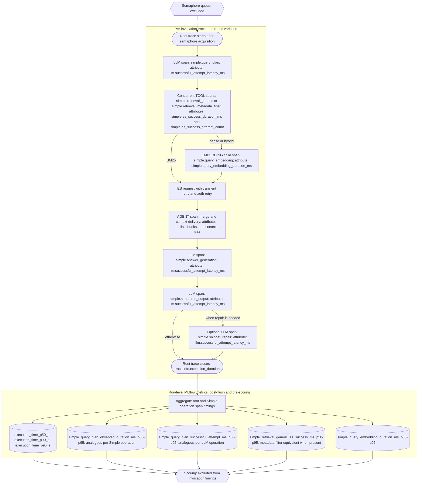

# 10 — Simple Mode Experiment Design

**Purpose:** Define a latency-first aiR Assist Simple Mode, the `S` experiment suite used to
measure it, and the implementation roadmap needed to execute those experiments. Simple Mode is
intended for questions plausibly answerable from one or a few passages—for example, acronym
expansion, person identification, or a focused evidence question. It is not assumed to be
appropriate for every question; the suite measures where it succeeds and where full mode remains
necessary.

**Scope:** This is an experiment design, not a production routing design. It reuses the existing
EMC2 and Mallinckrodt nested indices, direct-ES experiment tooling, v3 agent, and r1-evals
workflow. It adds no index mapping or ingestion requirement.

**Prior art:**

- `08-index-design-and-ingestion.md` — authoritative nested-index structure and Elasticsearch
  query capabilities.
- `09-retrieval-experiment-design.md` — E0/Tier 2 baselines, evaluation protocol, and dataset
  conventions.
- Elastic Elasticsearch 9.4 retriever/RRF documentation — server-side RRF and nested `inner_hits`.
- GPT-5.1 model/prompting documentation — supported `none` and `low` reasoning efforts.
- MLflow tracing documentation — trace/span timing semantics and manual instrumentation.

---

## 1. Hypothesis and evaluation philosophy

Simple Mode is a deliberately constrained agent intended to trade broad research coverage for
lower retrieval and generation latency. The hypothesis is:

> For a discoverable subset of aiR Assist questions, one retrieval round, a small passage
> context, no generated document metadata, and minimal/no reasoning retain acceptable answer,
> retrieval, and citation quality while materially reducing latency.

The suite does **not** pre-classify questions as simple. It runs all question variations already
used for the three established datasets, then identifies the empirical Simple-compatible cohort
from quality and timing outcomes:

| Dataset | Rubrics | Dataset selector | Rubric scope |
|---|---:|---|---|
| EMC2 UAT set_1 | 21 | `emc2` | `**/uat/set_1/*.rubric.toml` |
| EMC2 UAT set_2 | 20 | `emc2` | `**/uat/set_2/*.rubric.toml` |
| Mallinckrodt GA | 22 | `mallinckrodt` | all GA rubrics |

All existing input variations and repetitions used by prior experiments remain eligible. Results
must be analysed overall and per rubric/use case/question variation: an aggregate score cannot
establish whether individual questions are suitable for a future Simple/Full routing decision.

No experiment report is generated during this suite. The implementation must store all required
raw measurements in MLflow; comparative reporting occurs after the experiments finish.

---

## 2. Baseline and held constants

### 2.1 E0 reference baseline

E0 is the historical quality reference. It uses the direct-ES nested index but reproduces the
production-style two chunk signals: nested BM25 and nested kNN, client-side ordinal RRF, 25 final
chunks, low reasoning, multi-hop, and flat output. It also has important non-parity caveats:
semantic rather than fixed-window chunking, a nested rather than flat index, no qna-service/MCP
path, and different first-chunk handling.

Simple Mode is not an E0 clone. It intentionally changes the hop, context, fusion, output, and
reasoning design to measure a low-latency alternative.

### 2.2 Held constants for all initial S experiments

| Property | Initial Simple Mode value |
|---|---|
| Agent | v3 `MultihopFreeTextRag` |
| LLM | `gpt-5.1-2025-11-13` |
| Retrieval iteration count | Exactly one |
| Hop enforcement | `max_tool_iterations = 1`; `get_tool_choice()` forces `none` after the first tool round |
| LLM tool schema | Retrieval tools only; no `WriteFile` or `ReadFile` |
| Side artifacts | None: no `notes.txt`, `signature.txt`, or virtual file access |
| Retrieval fields | Chunk text / chunk dense embedding only; no title, summary, topic, sparse parent vectors, or parent BM25 |
| Generation metadata | OFF: no title, summary, or topic in LLM context |
| Hard filters | Mandatory `subset_ids`; explicit date/email filters when allowed by call policy |
| Empty filtered result | No fallback generic query |
| Size filter | OFF: search the full existing index; no document is excluded by `workspace_extracted_text_size` |
| First chunk | No query/fetch/decorate algorithm |
| Invocation concurrency | 1 |
| Output format | Flat-concatenated grouped chunks |
| Citation format | `[doc_id-N]` or `[doc_id-i:j]` for a concatenated run |
| Output token budget | 12,000 `max_completion_tokens` |

The one-hop rule is both prompt guidance and a code rule. At iteration 0 the graph requires a tool
call. After that tool round, `max_tool_iterations = 1` makes the next LLM call use
`tool_choice="none"`, so no second retrieval round can occur.

E0 uses 30,000 `max_completion_tokens` because it permits multi-hop, low-reasoning planning and
its structured output can follow a broader retrieval context. Simple Mode instead has one retrieval
round, default `reasoning_effort = "none"`, a small global-context chunk budget, and a 100–600
word answer target. A 12,000-token cap is therefore 60% below E0 while preserving headroom for
the structured response and exact source snippets. An 8,000-token cap would likely work but adds
unnecessary length-finish risk when a 20-chunk answer cites several passages.

### 2.3 Flat-concatenated output

Simple Mode uses **flat** output like E0: one `<grouped_chunks>` element per document, not a Tier
2 `<document_group>` with parent metadata. It does not use first-chunk decoration.

It retains the Tier 2 adjacent-chunk algorithm because it is cheap and avoids duplicating stored
overlap. After global selection, contiguous selected chunk indices `[i, …, j]` from one document
are joined by removing each later chunk’s `leading_overlap_chars`. A one-chunk run retains ID
`"i"`; a multi-chunk run receives ID `"i:j"`. The range is a single flat `<chunk>` and is cited
as `[doc_id-i:j]`.

This requires the existing range-ID citation validation/scoring support. It does not require
metadata generation or nested XML.

---

## 3. Retrieval architecture

### 3.1 Retrieval modes

Initial Simple Mode supports only chunk-level retrieval:

| Mode | Elasticsearch request per retrieval tool call | Query style |
|---|---|---|
| `bm25` | Nested `match` on `chunks.text` | Terse keywords, entities, aliases, exact terminology |
| `dense` | Nested kNN on `chunks.embedding` | Natural-language information need |
| `hybrid_es_rrf` | One server-side RRF request combining nested BM25 and nested kNN | Blended, keyword-oriented, semantic, or mixed phrasing by call budget |

Dense/hybrid calls compute only the E5 **query** embedding client-side, using the existing query
prefix; BM25-only calls do not. This local query-embedding time is part of measured retrieval
latency. Simple Mode never calculates client-side candidate/passage embeddings: it performs no
MMR, client-side reranking, or passage-vector caching. Sparse query encoding, parent BM25, sparse
parent signals, client RRF, and client MMR are also absent from the initial suite.

### 3.2 Elasticsearch 9.4 server-side RRF feasibility

Server-side RRF is technically supported by the existing mapping:

- `chunks` is a nested field.
- `chunks.text` is searchable text.
- `chunks.embedding` is an indexed 384-dimension cosine dense vector.
- Elasticsearch RRF accepts two or more child retrievers and propagates uniquely named nested
  `inner_hits` from sub-retrievers to final RRF parent hits.

The hybrid request must use two `standard` retrievers, each wrapping a nested query:

1. nested BM25 `match` on `chunks.text` with `inner_hits.name = "bm25_chunks"`;
2. nested kNN on `chunks.embedding` with `inner_hits.name = "knn_chunks"`.

The direct kNN retriever does not itself accept the required `inner_hits`; the nested-standard
wrapper is therefore mandatory. The RRF request uses `rank_window_size >= size`, a fixed
`rank_constant`, and a request `size` equal to `simple_per_call_fetch_count`.

### 3.3 Parent-ranking limitation and extraction

With the nested index, RRF ranks parent documents rather than a global chunk list. Inner hits are
computed only for the final RRF parent hits. Therefore each hybrid call must extract chunks
deterministically without client reranking:

1. traverse RRF parent hits in server rank order;
2. consume the uniquely named child inner-hit lists in fixed child order (BM25 then kNN), each in
   returned rank order;
3. deduplicate `(document_artifact_id, chunk_index)`;
4. stop at `simple_per_call_fetch_count` chunks.

This is an extraction policy, not a fusion/reranking stage.

### 3.4 ES RRF integration smoke test

Before running any S experiment, run a credentials-gated live integration test against the deployed
Elasticsearch 9.4 cluster. The test:

1. builds the two-child `standard`/nested RRF payload with nested BM25 and nested kNN, uniquely
   named inner hits, and the mandatory `subset_ids` filter;
2. executes the request once against each EMC2 and Mallinckrodt experiment index;
3. asserts a successful response, parent hits, both named inner-hit sections, and usable
   `chunk_index`/`text` fields;
4. runs the deterministic extraction routine and asserts at most `simple_per_call_fetch_count`
   unique chunk identities in the documented order, without a first-chunk query or fetch;
5. reports only structural counts and identifiers—never document text.

The mapping and Elasticsearch documentation prove API capability, but only this live request proves
the exact nested-kNN-in-standard-retriever syntax, named-inner-hit propagation, and response shape
for the deployed cluster.

### 3.5 First-chunk removal

Simple Mode query builders must omit `_first_chunk_filter_clause()` entirely. This avoids both the
extra nested inner-hit work and the E0/Tier 0 first-chunk output behavior. Chunk 0 appears only
when it is returned/selected by the active retrieval mode.

---

## 4. One-hop tool-call policy

The experiment config supplies a requested call count of 1, 2, or 3. The foundation model is
prompted to make that many retrieval calls, but the implementation accepts and executes every
retrieval call it actually emits in the sole tool round. MLflow stores:

- requested call count;
- actual emitted retrieval-call count;
- generic versus metadata-filtered call counts;
- deviation between requested and actual counts.

All calls from the one tool round execute concurrently. The current v3 `_call_tools` loop executes
them sequentially, so Simple Mode needs a dedicated concurrent path that preserves emitted-call
ordinal for later merge and trace labels.

### 4.1 Query style

| Retrieval mode | 1 requested call | 2 requested calls | 3 requested calls |
|---|---|---|---|
| BM25 | Compact keyword query | Distinct keyword/entity angles | Three distinct keyword/alias/aspect angles |
| Dense | One natural-language information need | Distinct semantic formulations | Three semantic/relationship/timeframe formulations |
| Hybrid ES RRF | Blended exact-entity + natural-language query | Keyword-oriented + semantic-oriented query | Keyword-oriented + semantic-oriented + mixed alternative angle |

The prompt must avoid near-duplicate calls, boolean syntax, invented email addresses, and claims
that the agent can conduct a second retrieval round.

### 4.2 Date/email filter policy

Date and email participant fields are allowed only as hard filters:

| Mode / requested calls | Metadata-filter tool availability |
|---|---|
| Any mode, 1 call | Not exposed; generic retrieval only |
| BM25 or dense, 2–3 calls | At most one filter call, only when user supplied explicit date/email values |
| Hybrid, 2 calls | Not exposed |
| Hybrid, 3 calls | At most one filter call, only when user supplied explicit date/email values |

All remaining calls are generic. An empty filtered result stays empty; it does not trigger an
unfiltered fallback query.

---

## 5. Cross-call merge policies

One retrieval call already returns a ranked, per-call passage list. Multiple calls need a global
merge after all tool calls complete. Raw `_score` values cannot be compared across distinct query
strings: BM25 scores, dense similarities, and per-query RRF scores are query-relative.

### 5.1 `round_robin` — fixed global context budget

Consume rank 1 from every actual call in emitted-call order, then rank 2 from every call, and so
on. Skip duplicate chunk identities until exactly `simple_global_context_chunk_count` unique
chunks are selected, or every list is exhausted.

This policy is deterministic, gives every query an equal opportunity to contribute, does not
compare query-relative scores, and performs no client reranking.

### 5.2 `current_union` — literal current control

Preserve first-seen document order, deduplicate chunks by `(doc_id, chunk_id)`, sort chunks
inside each document by start index, and retain the full unique union up to each call's
`simple_per_call_fetch_count` cap. Context can grow to roughly
`actual_call_count × simple_per_call_fetch_count`.

After the union is built, adjacent selected chunks within each document are concatenated into
range IDs (`"i:j"`) using the same overlap-trimming algorithm as `round_robin`. Output format
(flat-concatenated grouped chunks) is held constant across both merge policies.

The implementation logs both configured counts, the actual unique chunk count, and the estimated
prompt-context size. This arm is an intentional control, not a clean merge-only comparison: it
changes both merge policy and context volume relative to `round_robin`.

---

## 6. S experiment suite

### 6.1 Naming

Simple Mode experiments use `S` instead of `E`. IDs encode stage and dimensions:

`S-<stage>-<mode>-c<requested_calls>-<merge>-f<per_call_fetch>-g<global_context>-r<reasoning>`

`f<per_call_fetch>` is the `simple_per_call_fetch_count` value used by each retrieval call. Its
value is **mode-dependent**: for `bm25` and `dense` arms it equals `g` (the actual chosen global
context value, e.g. `f10` when `g10`); for `hybrid_es_rrf` and `current_union` arms it is `20`.
`g<global_context>` is the `simple_global_context_chunk_count` limit applied after `round_robin`
cross-call merging. `g` is omitted from `current_union` arms because that policy retains the full
per-call-capped union without a global budget.

`rr` is rank-preserving round-robin, not reciprocal-rank fusion.

Examples:

- `S-A-bm25-c1-rr-f10-g10-rnone` (bm25: f = g = 10)
- `S-A-dense-c2-rr-f15-g15-rnone` (dense: f = g = 15)
- `S-A-hybrid-c3-rr-f20-g10-rnone` (hybrid: f = 20, g = 10)
- `S-B-hybrid-c3-union-f20-rnone` (current_union: f = 20, no g segment)
- `S-C-bm25-c1-rr-f10-g10-rlow` (Stage C bm25: f = g = 10, reasoning low)
- `S-C-hybrid-c3-rr-f20-g15-rlow` (Stage C hybrid: f = 20, g = 15, reasoning low)

### 6.2 Full experiment table

Per-call fetch (`simple_per_call_fetch_count`) is mode-dependent across all stages:

- **`bm25` and `dense` arms (Stage A and C):** `f = g`. Per-call fetch equals the global context
  budget: ES returns exactly as many ranked candidates as the round-robin cap will select into
  context, with no wasted tail.
- **`hybrid_es_rrf` arms (Stage A and C):** `f = 20` (fixed). The full 20-candidate RRF rank
  window is preserved regardless of `g`; the round-robin cap then selects up to `g` chunks into
  context.
- **Stage B (`current_union`):** `f = 20`. The `current_union` policy retains the complete
  per-call-capped union without a global budget; Stage B arm IDs carry no `g` segment.

Stage C arms inherit the fetch rule of their paired Stage A counterpart, ensuring reasoning effort
is the sole changed dimension.

The global context budget (`simple_global_context_chunk_count`) is chosen per individual
experiment run — `g10`, `g15`, or `g20` — rather than being declared as a mandatory full
cross-product in advance.

| Stage | ID pattern | Retrieval | Requested calls | Merge | Per-call fetch | Global context | Reasoning | Purpose |
|---|---|---|---:|---|---|---|---|---|
| A | `S-A-bm25-c{1,2,3}-rr-f{g}-g{chosen}-rnone` | BM25 only | 1, 2, 3 | round-robin | = g (chosen per run) | chosen per run | none | Lexical/call-count screen |
| A | `S-A-dense-c{1,2,3}-rr-f{g}-g{chosen}-rnone` | dense only | 1, 2, 3 | round-robin | = g (chosen per run) | chosen per run | none | Semantic/call-count screen |
| A | `S-A-hybrid-c{1,2,3}-rr-f20-g{chosen}-rnone` | ES RRF BM25+dense | 1, 2, 3 | round-robin | 20 (fixed) | chosen per run | none | Hybrid/call-count screen |
| B | `S-B-<selected>-union-f20-rnone` | selected Stage A setup | selected | current union | 20 per call | full union | none | Context-volume control |
| C | `S-C-<selected-bm25/dense>-rr-f{g}-g{chosen}-rlow` | selected bm25 or dense Stage A arm | selected | round-robin | = g (inherited from paired Stage A) | same as paired Stage A arm | low | Reasoning for single-signal arms |
| C | `S-C-<selected-hybrid>-rr-f20-g{chosen}-rlow` | selected hybrid Stage A arm | selected | round-robin | 20 (inherited from paired Stage A) | same as paired Stage A arm | low | Reasoning for hybrid arm |

All rows hold constant: one code-enforced retrieval round, generated metadata OFF, no parent
metadata ranking, no first chunk, flat-concatenated output, date/email filters only under the
policy above, 5 MiB filter OFF, and invocation concurrency 1.

### 6.3 Comparison map

| Comparison | Dimension isolated | Interpretation |
|---|---|---|
| `S-A-bm25-cN` vs `S-A-dense-cN` | lexical vs dense | Query-representation/retrieval-mode effect |
| `S-A-dense-cN` vs `S-A-hybrid-cN` | dense vs server-side hybrid RRF | Value of combining chunk lexical+dense signals |
| `S-A-<mode>-c1/c2/c3` | requested call count | Value of query diversity; actual count recorded separately |
| `S-A/B selected rr` vs `union` | merge plus context volume | Intentionally confounded control |
| `S-A-hybrid gX` vs `S-A-hybrid gY` | global context budget at fixed f=20, mode, and call count | Value of more passages to the LLM at constant ES retrieval depth |
| `S-A-bm25/dense gX` vs `S-A-bm25/dense gY` | co-varying ES fetch depth and context budget (f = g for both) | Combined effect of deeper ES retrieval and larger LLM context in single-signal mode |
| `S-A gX rnone` vs `S-C gX rlow` | reasoning effort at chosen `gX`; fetch rule inherited from paired Stage A arm, so only reasoning changes | Value of GPT-5.1 reasoning tokens |
| E0 vs selected S arm | full baseline vs Simple Mode | Quality/latency trade-off; multi-dimensional comparison |

### 6.4 Execution order and stop/go gates

Execute from lowest expected latency to highest:

1. Stage A one-call BM25, dense, hybrid (at chosen g-value);
2. Stage A two-call BM25, dense, hybrid;
3. Stage A three-call BM25, dense, hybrid;
4. Stage B current-union control for Stage A Pareto candidate(s);
5. Stage C `low` arms for any selected global context, each paired with an already completed
   like-for-like `rnone` arm from Stage A.

Stage C can contain as many selected `g` values as needed. Each `low` arm requires a like-for-like
Stage A `none` counterpart, isolating reasoning effort without replacing a screening arm or
conflating effort with context budget. The Stage C arm inherits its paired Stage A arm's fetch
configuration: `f = g` for bm25/dense arms and `f = 20` for hybrid arms; reasoning effort is
therefore the sole changed dimension. GPT-5.1 supports custom tool calling for both `none` and
`low`; the chosen effort remains constant across all LLM calls in one run.

Advance a candidate only if it has acceptable rubric/citation/retrieval quality relative to E0 and
demonstrates a latency benefit at concurrency 1. Retain the complete Stage A matrix even when a
candidate fails: failures define the empirical boundary of Simple Mode.

### 6.5 Deferred dimensions

The first suite intentionally excludes:

- parent metadata retrieval and metadata generation;
- client MMR;
- client cross-call RRF;
- dynamic reasoning effort between planning and answer calls;
- a production Simple/Full router;
- a new index or reindex;
- persistent caching;
- invocation concurrency above 1.

Follow-up experiments may add generated metadata to retrieval and/or generation after the initial
no-metadata suite is complete.

Appendix A documents separate, future foundation-model follow-up options; it does not change this
initial suite's baseline, stages, matrix, execution order, or implementation.

---

## 7. Agent/config implementation design

### 7.1 v3 model configurations

Simple Mode configs use the `rag_agent_v3` namespace, beginning at `061.toml` / model version
`3.61`; subsequent arms allocate `062.toml`, `063.toml`, and so on. They do not reuse the
DSAS-2836 `092`–`095` namespace.

Each TOML derives from E0 `013.toml`. It retains evidence, citation, legal-language, error, and
structured-response requirements but removes multi-hop research and note/signature instructions.
It explains flat-concatenated range chunks, no generated metadata, the requested call count,
allowed query styles, and one-hop final-answer behavior.

Every initial config includes the following fields. The value of `simple_per_call_fetch_count`
**depends on retrieval mode** and must match the rules enforced by the model config validator.

**`bm25` or `dense` arms (Stage A and C) — `f = g`:**

```toml
simple_mode = true
requested_retrieval_calls = 1          # 1, 2, or 3 by arm
simple_retrieval_mode = "bm25"         # or "dense"
simple_merge_policy = "round_robin"
simple_per_call_fetch_count = 10       # must equal simple_global_context_chunk_count (10, 15, or 20)
simple_global_context_chunk_count = 10 # unique chunks selected after round_robin merging; chosen per experiment
include_metadata = false
max_tool_iterations = 1
reasoning_effort = "none"              # Stage C uses "low"
max_completion_tokens = 12_000
```

**`hybrid_es_rrf` arms (Stage A and C) — `f = 20`:**

```toml
simple_mode = true
requested_retrieval_calls = 1          # 1, 2, or 3 by arm
simple_retrieval_mode = "hybrid_es_rrf"
simple_merge_policy = "round_robin"
simple_per_call_fetch_count = 20       # fixed at 20; preserves the full RRF rank-window depth
simple_global_context_chunk_count = 10 # unique chunks selected after round_robin merging; chosen per experiment (e.g. 10, 15, 20)
include_metadata = false
max_tool_iterations = 1
reasoning_effort = "none"              # Stage C uses "low"
max_completion_tokens = 12_000
```

`simple_per_call_fetch_count` controls the ES request `size` / per-call extraction cap; it feeds
the merge step. `simple_global_context_chunk_count` is the maximum unique chunks delivered to the
LLM after `round_robin` selection and adjacent-chunk concatenation; it is not used by
`current_union` arms. Neither replaces the existing `result_count` field, which continues to
control legacy E/Tier 2 retrievers.

`ModelConfig` gains typed, validated Simple Mode fields rather than untyped TOML access. Existing
E/TOMLs retain their current behavior through defaults.

### 7.2 Tool allowlist and one-hop execution

Simple Mode has a config-driven tool allowlist. It exposes:

- generic retrieval in every arm;
- metadata-filter retrieval only in arms allowed by the policy in section 4.2.

`WriteFile` and `ReadFile` are absent from the OpenAI tool schema, not merely unmentioned in the
prompt. The graph still performs current answer cleaning, citation normalization, snippet
extraction/repair, and structured output after the single retrieval round.

All retrieval calls emitted by the model during that round run concurrently. Each receives a tool
ordinal and configuration attributes. Once all are complete, Simple Mode applies the configured
cross-call merge policy, concatenates adjacent chunks, emits flat grouped XML, and invokes final
answer generation. To preserve OpenAI tool-response pairing without duplicating context, the full
merged XML is returned only for the first emitted retrieval tool-call ID. Every later retrieval
tool-call ID receives the acknowledgement `Results merged into the first retrieval response.`
The final-answer LLM therefore receives one authoritative retrieval context.

### 7.3 Simple retrieval adapter

Add a dedicated Simple provider/retriever rather than altering established E0/Tier 2 behavior. It:

1. issues chunk-only BM25, dense, or ES-RRF retrieval with ES `size = simple_per_call_fetch_count`;
2. disables the first-chunk query;
3. returns per-call ranked chunk lists capped at `simple_per_call_fetch_count`;
4. merges lists with `round_robin` (capping at `simple_global_context_chunk_count`) or `current_union`;
5. concatenates adjacent selected chunks into range-ID flat chunks;
6. returns `GroupedChunks`, flat XML, retrieved document IDs, and final relevant document IDs.

No candidate passage MMR encoding is present in this path.

---

## 8. Latency and MLflow observability

### 8.0 Timing measurement overview

Every Simple Mode rubric variation produces one invocation trace. Invocation concurrency is fixed
at `1`, so the measured root trace starts **after** the evaluation semaphore is acquired and ends
after the final structured response. The semaphore queue and all scorer work are deliberately
outside that trace. Compare timings only within the same dataset and invocation-concurrency
setting.

The following table gathers the timing contract in execution order. Later subsections define the
literal attribute keys and metric names.

| What | Where and when | What is measured | Stored result |
|---|---|---|---|
| Invocation queue | Before the evaluation semaphore is acquired | Queue time only | Deliberately not measured |
| End-to-end invocation | Root r1-evals trace, from semaphore acquisition through final structured response | All agent work, including LLM calls, retrieval, merge, normalization, and structured output | Root `execution_duration`; `execution_time_p50_s`, `execution_time_p90_s`, and `execution_time_p95_s` |
| Query-plan LLM | `simple.query_plan` LLM child span, before the single tool round | Observed wall time including rate-limit waits and retries; final successful API attempt separately | Span wall duration; `llm.successful_attempt_latency_ms` |
| Retrieval call | One concurrent `simple.retrieval_generic` or `simple.retrieval_metadata_filter` TOOL span per emitted call | Observed wall time for the complete retrieval operation, including local embedding when applicable, ES work, retries, and backoff | Span wall duration; final successful ES duration and transient-search attempt count |
| Query embedding | `simple.query_embedding` EMBEDDING child span for dense/hybrid retrieval only | Local E5 query-embedding wall time | `simple.query_embedding_duration_ms` on the EMBEDDING span only |
| Merge and context delivery | `evals_complete` AGENT span, after all retrieval calls complete | No independent Simple operation duration; this work is included in end-to-end and AGENT-span wall time | Merge/call-count attributes, selected chunks, and serialized context size |
| Answer and output LLMs | `simple.answer_generation`, `simple.structured_output`, and optional `simple.snippet_repair` LLM child spans | Observed wall time and final successful API attempt time per operation | Span wall duration; `llm.successful_attempt_latency_ms` |
| Run aggregation | After invocation traces flush and before scorers execute | p50/p90/p95 over recorded operation spans | Run-level MLflow timing metrics |
| Scoring | After aggregation | Scorer work and scorer LLM calls | Deliberately excluded from all invocation timing layers |



Shapes: stadiums are root-trace boundaries and root timing; rectangles are child spans and their
span attributes; cylinders are run-level MLflow metrics; hexagons are work excluded from invocation
timing. Find the rectangle values in **Experiment → Run → Traces → trace detail → Spans →
Attributes**. Find the cylinder values in **Experiment → Run → Metrics**. Observed span wall times
include waits and retries; successful-attempt attributes do not.

`round_robin` retrieval records a configured global-context cap; `current_union` has no global
cap and omits it when absent. Successful-attempt timings intentionally exclude prior failures,
retry backoff, and token waits. Observed child-span and root-trace timings retain those costs, so
they describe the latency experienced by the caller.

### 8.1 Timing layers

| Metric | Definition | Includes | Excludes |
|---|---|---|---|
| End-to-end invocation | Root r1-evals trace: prompt accepted to final structured response | all agent work after invocation semaphore acquisition | scoring, scorer LLM calls, pre-semaphore queue time |
| Observed operation latency | Child LLM/tool span wall duration | token waits, retries, backoff, all internal work | scoring |
| Successful-attempt latency | Explicit child-span attribute for final successful external request | only final API/ES request attempt | token wait, prior failures, retry backoff, pauses |

### 8.2 Required trace-tree and run attributes

The invocation trace tree and its evaluation run together store:

- the `evals_complete` AGENT span stores requested/actual generic and metadata-filter tool-call
  counts, retrieval mode, merge policy, configured per-call fetch count
  (`simple_per_call_fetch_count`), configured global context budget when applicable
  (`simple_global_context_chunk_count`), actual selected chunk count, and serialized context size;
- run parameters store invocation concurrency (`1`), Simple Mode config/model version, retrieval
  mode, merge policy, configured per-call fetch count, and the global context budget when
  configured;
- the root trace stores the end-to-end invocation duration as `execution_duration`, which
  `log_execution_time_percentiles` aggregates into `execution_time_p{50,90,95}_s`.

`log_simple_span_time_percentiles` separately aggregates the operation spans marked with
`simple.operation`. Root-duration and Simple-operation percentiles are distinct metric paths.

Every LLM span stores an operation label:

- `simple.query_plan`;
- `simple.answer_generation`;
- `simple.structured_output`;
- `simple.snippet_repair` when used.

Every retrieval span stores:

- `simple.retrieval_generic` or `simple.retrieval_metadata_filter`;
- E-tier-equivalent tool inputs: `args`, tool provider, request context, and resolved model config;
- complete raw per-call retrieved `GroupedChunks` output, including chunk XML/content;
- raw Elasticsearch chunk rank order plus retrieved/relevant document IDs;
- tool ordinal;
- signal mode;
- configured per-call fetch count and actual returned count;
- final successful ES duration and transient-search successful-attempt count. An authentication
  refresh can retry the full search but does not increment this transient-search count;
- observed duration and successful-attempt duration.

Dense/hybrid retrieval additionally records a child `EMBEDDING` span and
`simple.query_embedding_duration_ms` for the local E5 query embedding. This duration contributes
to observed retrieval-call latency; it is not an external successful-attempt metric and is not
duplicated on the parent TOOL span.

#### Span attribute key contract

The attribute keys below are the literal strings consumed by
`r1_evals.mlflow_logging.log_simple_span_time_percentiles` in `r1-evals-new`. Because
`air_assist_core` intentionally has no dependency on `r1_evals` (production package,
dependency-minimization rule), these strings cannot be shared via import. Any future
instrumentation in `LlmModel.complete` or the Simple retrieval spans must reproduce them
character-for-character; a mismatch causes `log_simple_span_time_percentiles` to silently
aggregate zero metrics rather than raise an error.

| Attribute key | Set by | Canonical values / notes |
|---|---|---|
| `simple.operation` | Every Simple Mode LLM and retrieval span | See operation labels listed above |
| `llm.successful_attempt_latency_ms` | LLM spans (from `r1_rate_limiter` timing hook via `LlmModel.complete`) | Wall time of the final successful `await func(...)` attempt only, in ms |
| `simple.es_success_duration_ms` | Retrieval spans | Wall time of the final successful ES request attempt, in ms |
| `simple.query_embedding_duration_ms` | Dense/hybrid `EMBEDDING` child spans | Local E5 query-embedding wall time, in ms; not a successful-attempt metric |

#### Run-level metric naming convention

`log_simple_span_time_percentiles` aggregates span attributes into run-level MLflow metrics. The
operation label value (e.g. `simple.query_plan`) is normalised to lowercase with
non-alphanumeric characters replaced by `_`, and the redundant leading `simple_` prefix is
stripped before the outer `simple_` prefix is applied, so each metric is prefixed with a single
`simple_`:

| Metric key pattern | Source | Example |
|---|---|---|
| `simple_<operation>_observed_duration_ms_p{N}` | Span wall time (`end_time_ns - start_time_ns`) | `simple_query_plan_observed_duration_ms_p50` |
| `simple_<operation>_successful_attempt_ms_p{N}` | `llm.successful_attempt_latency_ms` attribute | `simple_query_plan_successful_attempt_ms_p95` |
| `simple_<operation>_es_success_ms_p{N}` | `simple.es_success_duration_ms` attribute | `simple_retrieval_generic_es_success_ms_p90` |
| `simple_query_embedding_duration_ms_p{N}` | `simple.query_embedding_duration_ms` attribute | `simple_query_embedding_duration_ms_p50` |

`{N}` is one of `50`, `90`, or `95`. The embedding metric is not operation-keyed because it is
recorded on a child `EMBEDDING` span, not on the retrieval operation span itself. All other
metrics produce one row per distinct `simple.operation` value present in the traces.

### 8.3 Retry-aware LLM measurement

The generic rate limiter remains independent from MLflow. In `r1_rate_limiter`, measure immediately
around each underlying `await func(...)` API attempt. On success, store final-attempt duration and
attempt count in context-local state so concurrent calls cannot overwrite each other. OpenAI SDK
retries remain disabled. `air_assist_core` declares `r1-rate-limiter` as an explicit dependency;
`LlmModel.complete` consumes the final-attempt value and sets it plus the operation label on the
active MLflow LLM span.

Failed attempts and retry waits remain visible through observed child-span and root-trace
durations but are absent from successful-attempt latency.

### 8.4 Retry-aware retrieval measurement

Create one MLflow TOOL span per concurrently executed Simple retrieval call. The transient ES
retry helper retains final-success attempt duration and count for connection/timeout retries,
while the TOOL span wall duration retains the complete observed retrieval cost. Authentication
refresh can retry the full search separately; it is included in observed latency but not in the
transient-search attempt count. Hybrid ES RRF is one ES request per tool call; BM25/dense are also
one request.

Simple retrieval spans intentionally retain the same complete raw tool inputs and per-call chunk
outputs as E-tier `_get_documents` spans, so retrieval/scorer debugging has trace parity. These
raw outputs represent the unmerged per-call result. The first retrieval tool response and root
trace separately represent the merged, flat-concatenated context delivered to the final-answer
LLM.

### 8.5 MLflow data and later analysis

Store raw per-variation measurements in traces and aggregate run-level p50/p90/p95 metrics for
the three timing layers. Store quality, retrieval, citation, retry/failure, requested/actual
call-count, configured per-call fetch, the global context cap when configured, actual selected
chunks, and serialized context-size data. Attempt counts remain diagnostic span attributes rather
than run-level percentile metrics. Do not generate experiment reports during S execution; reporting
and Pareto analysis happen after all configured S experiments complete.

### 8.6 Cross-arm performance comparison

Use run-level MLflow metrics for arm-to-arm screening and trace/span values for drill-down. The
headline caller-experienced latency is `execution_time_p50_s`; inspect
`execution_time_p90_s` and `execution_time_p95_s` for tail latency. These root-duration metrics
include all invocation work after semaphore acquisition, including waits, retries, and backoff.

| Metric key family | Use for comparison |
|---|---|
| `execution_time_p{50,90,95}_s` | Primary end-to-end latency: compare median and tail caller experience |
| `simple_query_plan_observed_duration_ms_p{N}` | Query-planning cost, including waits and retries |
| `simple_retrieval_generic_observed_duration_ms_p{N}` | Generic retrieval-call wall time; use metadata-filter equivalent only for filter-call arms |
| `simple_query_embedding_duration_ms_p{N}` | Dense/hybrid local embedding cost |
| `simple_answer_generation_observed_duration_ms_p{N}` and `simple_structured_output_observed_duration_ms_p{N}` | Generation/output bottlenecks |
| `simple_<llm_operation>_successful_attempt_ms_p{N}` | Final successful LLM API-attempt time, separated from waits/retries |
| `simple_<retrieval_operation>_es_success_ms_p{N}` | Final successful ES-attempt time, separated from retries/backoff |
| `simple_snippet_repair_*_p{N}` | Optional repair cost; compare only when that operation occurs |

`{N}` is `50`, `90`, or `95`. Prefer **observed** metrics for user-perceived latency. Use
successful-attempt metrics to determine whether an observed difference originates in LLM/ES
service time or in waits and retries. Actual/requested call counts, successful-attempt counts,
retrieval mode, merge policy, fetch/context values, selected chunks, and context size are
span-level diagnostics—not percentile comparison metrics.

Hold constant the dataset, invocation concurrency (`1`), rubric variations and repetitions, seed,
scorer configuration, and all experiment dimensions other than the intended comparison in §6.3.
Do not pool timing across datasets. `round_robin` versus `current_union` remains intentionally
confounded by merge policy and context volume; E0 versus S remains a multi-dimensional comparison.
Assess latency together with the quality, citation, and retrieval gates in §6.4 and §9.

---

## 9. Evaluation protocol

Reuse current answer-quality, retrieval, citation-format, reference, and range-citation scorers.
Before execution, audit every enabled scorer that consumes chunk IDs—especially citation-to-snippet
matching—to ensure `"i:j"` range IDs remain accepted for flat-concatenated output.

All S arms use the identical dataset partitions, rubric variations, seed, scorer configuration,
and invocation concurrency. Compare timing only within one dataset and concurrency setting.

MLflow must retain enough information for later:

- quality and citation validity by rubric/use case;
- retrieval recall/precision;
- full Simple Mode config identity, including `simple_per_call_fetch_count` and
  `simple_global_context_chunk_count` when the merge policy uses a global cap;
- requested vs actual calls;
- actual chunks/context delivered to the LLM;
- all three latency layers by operation;
- retry/failure rates separate from happy-path metrics.

---

## 10. Branch and project plan

| Project | Branch/base | Future purpose |
|---|---|---|
| `es-index-explorer` | Stay on `experiments` at `2496796` | Add this report only; no new branch |
| `air-assist-agent` | `DSAS-2836/simple-mode-base` from `DSAS-2836/tier2-base` at `89e65180` | Shared Simple graph/provider/retriever/config/tracing implementation |
| `r1_rate_limiter` | `DSAS-2836/simple-mode-timing` from local `main` `bda88cd904e81fdc164088f0c63d55331b4048c2` | Generic context-local successful-attempt timing hook |
| `r1-evals-new` | `DSAS-2836/simple-mode-evals` from `2a5cad9e387e12062b598bf8b96453fd3b4c9133`, then cherry-pick required range-citation changes | Range scorer audit/fixes and optional child-span timing aggregation |

The air-assist-agent Simple base retains direct ES, range citations, and existing experiment
infrastructure. It is the required common root for strict tool allowlisting, code-enforced
single-hop, concurrent retrieval-call execution, chunk-only ES retrieval, server-side RRF
extraction, flat-concatenated output, the no-first-chunk path, and timing spans. Its original main
base is `fa50a3198d16971056f578c48e239f0209b43810` (2026-06-18).

After this shared implementation exists, individual S experiment branches normally add only their
v3 model TOML/config values. S experiments are therefore TOML-configurable after the common root
is complete, but they are not TOML-only today.

The r1-evals original DSAS base is `2a5cad9e387e12062b598bf8b96453fd3b4c9133` (2026-06-18).
The es-index experiments base is `b4a96446f1b932ecbad4aa3a0f7a284587d6eb47` (2026-06-04).
`r1_rate_limiter` was not on a DSAS experiment branch; its current local main base is
`bda88cd…` from 2026-04-24.

No Elasticsearch mapping, index, or ingestion branch/change is planned.

---

## 11. Implementation gates and non-goals

Before the first S run, verify:

1. ES-side RRF nested BM25/kNN returns uniquely named, usable inner hits.
2. Simple extraction preserves a deterministic per-call order without client reranking, capped at `simple_per_call_fetch_count`.
3. Retrieval calls emitted in one tool round execute concurrently.
4. The first-chunk query/fetch/decorate path is absent.
5. Parent metadata fields/signals are absent from ranking and generation XML.
6. File tools are absent from the Simple Mode OpenAI tool schema.
7. The root trace excludes scoring and successful-attempt timing excludes waits/retries.
8. Flat-concatenated range citations pass all enabled scorers.
9. For `bm25` and `dense` arms: a `round_robin` run with `simple_per_call_fetch_count = g` and
   `simple_global_context_chunk_count = g` (e.g. `g = 10`) delivers at most `g` unique chunks to
   the LLM, each call's candidate list capped independently at `g`. For `hybrid_es_rrf` arms:
   `simple_per_call_fetch_count = 20` and `simple_global_context_chunk_count = g` (e.g. `g = 10`)
   delivers at most `g` unique chunks to the LLM, each call's candidate list capped
   independently at 20.

Non-goals:

- production Simple/Full routing;
- generated metadata retrieval or generation;
- new indices or reindexing;
- persistent cache;
- dynamic reasoning effort in one invocation;
- client MMR or client cross-call RRF in the initial suite;
- experiment-report generation during execution;
- merging experimental changes into production main.

---

## Appendix A. Foundation-model follow-up candidates

This appendix is reference and future-design material only. The initial S suite remains pinned to
`gpt-5.1-2025-11-13`; it does not schedule or require a model replacement. A later model-swap
experiment must retain the Simple Mode architecture and compare one pinned, Azure-available model
version against a completed GPT-5.1 S arm.

### A.1 Evidence, compatibility, and limits

Microsoft Foundry currently catalogs GPT-5.2 through GPT-5.6 variants, but catalog presence does
not guarantee that a model is deployable for this team: availability depends on the deployment
region, deployment type, quota, and supported API version. Confirm all of these, plus the exact
snapshot/version, before creating any future arm. [Microsoft Foundry catalog][azure-model-catalog]
and [regional availability][azure-region-availability] are the authoritative starting points.

The GPT-5.6, GPT-5.4 mini, and GPT-5.4 nano candidates below support Chat Completions, structured
outputs, function/tool calling, and configurable reasoning, so they can be tested without changing
the one-hop direct-tool architecture. [GPT-5.6 model guidance][openai-gpt-56-guidance],
[GPT-5.4 mini][openai-gpt-54-mini], and [GPT-5.4 nano][openai-gpt-54-nano] document those
capabilities. This is a compatibility statement, not a quality or latency claim.

OpenAI's public GPT-5.6 evidence emphasizes general professional, coding, browsing, and agentic
work. Its system card and public benchmarks do **not** measure grounded, citation-constrained,
single-hop e-discovery retrieval QA. Treat that evidence as directional only; the existing S
rubrics, citation checks, retrieval metrics, and latency measurements remain the decision source.
[GPT-5.6 system card][openai-gpt-56-system-card]

### A.2 Priority future candidates

These are candidates for a separate model-swap follow-up only. Prices are published OpenAI API
prices per million input/output tokens, included to form a cost hypothesis rather than to predict
the Azure-billed price.

| Model | Published positioning and price | Simple Mode hypothesis | Source |
|---|---|---|---|
| `gpt-5.4-nano` | Simple high-volume tasks; `$0.20` / `$1.25` | Aggressive cost/latency screen at `none`; advance only if grounded quality survives. | [OpenAI GPT-5.4 nano][openai-gpt-54-nano] |
| `gpt-5.4-mini` | Faster, efficient high-volume work; `$0.75` / `$4.50` | Lower-cost quality/cost screen at `none`. | [OpenAI GPT-5.4 mini][openai-gpt-54-mini] |
| `gpt-5.6-luna` | Cost-sensitive, high-volume GPT-5.6 tier; `$1.00` / `$6.00` | Test whether a newer efficient tier improves quality, latency, or cost relative to GPT-5.1. | [OpenAI GPT-5.6 Luna][openai-gpt-56-luna] |
| `gpt-5.6-terra` | GPT-5.6 intelligence/cost balance; `$2.50` / `$15.00` | Balanced quality/latency/cost screen after efficient candidates. | [OpenAI GPT-5.6 Terra][openai-gpt-56-terra] |
| `gpt-5.6-sol` | Frontier GPT-5.6 tier; `$5.00` / `$30.00` | Quality ceiling on selected difficult rubrics; not a presumed latency candidate. | [OpenAI model guidance][openai-gpt-56-guidance] |

The first future screen should test GPT-5.4 nano, GPT-5.4 mini, and GPT-5.6 Luna at
`reasoning_effort = "none"`. Test `low` only when a candidate is quality-competitive at `none`.
Test GPT-5.6 Terra at `none`, then `low` only if justified. Reserve GPT-5.6 Sol for difficult
rubrics where a quality ceiling is useful. This optional order is not an amendment to §6.4.

### A.3 Azure-listed but non-priority or excluded variants

The following catalog review documents why the first follow-up should not expand into every
available GPT-5 variant. The disposition is specific to Simple Mode's grounded, latency-sensitive
e-discovery objective—not a general statement about model quality.

| Azure-listed model or variant | Status and disposition for the first follow-up | Sources |
|---|---|---|
| `gpt-5.2` | Available, but OpenAI labels it a previous frontier model and recommends GPT-5.6. Its published `$1.75` / `$14.00` price does not create a clearer Simple Mode hypothesis than the GPT-5.1 baseline, GPT-5.4 mini/nano, or GPT-5.6 candidates. Do not prioritize. | [Azure catalog][azure-model-catalog]; [OpenAI GPT-5.2][openai-gpt-52] |
| `gpt-5.2-codex`; preview `gpt-5.2-chat` | Azure-listed, but Codex is coding-specialized and the chat variant is preview. Exclude from this grounded-retrieval screen. | [Azure catalog][azure-model-catalog] |
| `gpt-5.3-codex`; preview `gpt-5.3-chat` | Codex is coding-specialized. OpenAI declares GPT-5.3 Chat deprecated, so exclude both from new Simple Mode experiments. | [Azure catalog][azure-model-catalog]; [OpenAI GPT-5.3 Chat][openai-gpt-53-chat]; [OpenAI GPT-5.3 Codex][openai-gpt-53-codex] |
| `gpt-5.4` | Available, but its published `$2.50` / `$15.00` price and frontier-work positioning provide no clearer first-screen hypothesis than the newer GPT-5.6 Terra at the same published price. Do not prioritize. | [Azure catalog][azure-model-catalog]; [OpenAI GPT-5.4][openai-gpt-54] |
| `gpt-5.4-pro` | Exclude: it is quality-first, slow, Responses-only, lacks structured outputs, and does not support `none` or `low` reasoning. | [OpenAI GPT-5.4 Pro][openai-gpt-54-pro] |
| `gpt-5.5` | Available, but its published `$5.00` / `$30.00` price matches GPT-5.6 Sol and OpenAI's current guidance recommends evaluating GPT-5.6 for latest-model work. Do not prioritize. | [Azure catalog][azure-model-catalog]; [OpenAI GPT-5.5][openai-gpt-55]; [OpenAI model guidance][openai-gpt-56-guidance] |

### A.4 Controlled follow-up boundary and selection gate

Every future arm must pin a concrete Azure-available model version/snapshot; do not compare moving
aliases. Hold constant the one-hop graph, direct tools, retrieval mode, call count, merge policy,
fetch/context parameters, prompt except model-specific compatibility wording, dataset, rubric
variations, repetitions, seed, scorer configuration, and invocation concurrency `1`.

Programmatic Tool Calling, Responses-API migration, multi-agent features, pro mode, and persisted
reasoning are excluded from this appendix. They alter the workflow and require separate experiments.

Reuse the quality/citation/retrieval gates in §6.4 and the timing comparison method in §8.6. Record
input, output, and reasoning-token usage plus Azure billed cost in addition to the existing MLflow
measurements. Promote a candidate only when it preserves or improves the established quality,
citation, and retrieval gates and demonstrates a measured latency and/or cost benefit on the same
rubric cohort. Retain GPT-5.6 Sol only when a measured quality gain justifies its resource cost.

---

## 12. References

- [Elasticsearch RRF retriever](https://www.elastic.co/docs/reference/elasticsearch/rest-apis/reciprocal-rank-fusion)
  and [retriever examples](https://www.elastic.co/docs/reference/elasticsearch/rest-apis/retrievers/retrievers-examples):
  server-side RRF, nested standard retrievers, and propagated inner hits.
- [GPT-5.1 model documentation](https://developers.openai.com/api/docs/models/gpt-5.1) and
  [prompting guide](https://developers.openai.com/cookbook/examples/gpt-5/gpt-5-1_prompting_guide):
  `none`, `low`, `medium`, and `high` reasoning effort; tool calling with `none`.
- [MLflow spans](https://mlflow.org/docs/latest/genai/concepts/span.md) and
  [manual tracing](https://mlflow.org/docs/latest/genai/tracing/app-instrumentation/manual-tracing.md):
  trace root spans, manual child spans, span attributes, and timing fields.
- [OpenAI model guidance][openai-gpt-56-guidance] and [GPT-5.6 system card][openai-gpt-56-system-card]:
  current GPT-5.6 positioning, migration guidance, capabilities, and benchmark limitations.
- [OpenAI GPT-5.2][openai-gpt-52], [GPT-5.3 Chat][openai-gpt-53-chat],
  [GPT-5.3 Codex][openai-gpt-53-codex], [GPT-5.4][openai-gpt-54],
  [GPT-5.4 mini][openai-gpt-54-mini], [GPT-5.4 nano][openai-gpt-54-nano],
  [GPT-5.4 Pro][openai-gpt-54-pro], [GPT-5.5][openai-gpt-55],
  [GPT-5.6 Luna][openai-gpt-56-luna], and [GPT-5.6 Terra][openai-gpt-56-terra]:
  model positioning, supported capabilities, and published OpenAI API prices.
- [Microsoft Foundry catalog][azure-model-catalog], [regional availability][azure-region-availability],
  and [reasoning-model guidance][azure-reasoning]:
  Azure model catalog, deployment prerequisites, regional availability, and reasoning compatibility.
- `08-index-design-and-ingestion.md` and `09-retrieval-experiment-design.md`.

[azure-model-catalog]: https://learn.microsoft.com/en-us/azure/foundry/foundry-models/concepts/models-sold-directly-by-azure
[azure-region-availability]: https://learn.microsoft.com/en-us/azure/foundry/foundry-models/concepts/models-sold-directly-by-azure-region-availability
[azure-reasoning]: https://learn.microsoft.com/en-us/azure/foundry/openai/how-to/reasoning
[openai-gpt-56-guidance]: https://developers.openai.com/api/docs/guides/latest-model
[openai-gpt-56-system-card]: https://deploymentsafety.openai.com/gpt-5-6
[openai-gpt-52]: https://developers.openai.com/api/docs/models/gpt-5.2
[openai-gpt-53-chat]: https://developers.openai.com/api/docs/models/gpt-5.3-chat-latest
[openai-gpt-53-codex]: https://developers.openai.com/api/docs/models/gpt-5.3-codex
[openai-gpt-54]: https://developers.openai.com/api/docs/models/gpt-5.4
[openai-gpt-54-mini]: https://developers.openai.com/api/docs/models/gpt-5.4-mini
[openai-gpt-54-nano]: https://developers.openai.com/api/docs/models/gpt-5.4-nano
[openai-gpt-54-pro]: https://developers.openai.com/api/docs/models/gpt-5.4-pro
[openai-gpt-55]: https://developers.openai.com/api/docs/models/gpt-5.5
[openai-gpt-56-luna]: https://developers.openai.com/api/docs/models/gpt-5.6-luna
[openai-gpt-56-terra]: https://developers.openai.com/api/docs/models/gpt-5.6-terra
