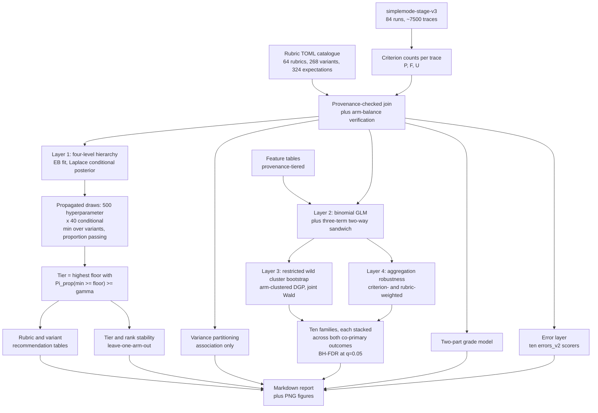

# Simple Mode result analysis: research plan and analysis specification

This report is the **analysis specification** for the Simple Mode result analysis. It
identifies which user questions are suitable for Simple Mode, the fast single-hop
agent action defined in `10-simple-mode-experiment-design.md`, and characterises what
makes them suitable.

The document is frozen as the pre-specification for that analysis. It is split into two
parts that are intended to be read independently:

- **Part I - Research methodology.** The scientific design: estimand, measurement model,
  estimation architecture, decision rule, hypothesis families, linguistic dimensions,
  annotation protocol, sensitivity matrix and limitations. Part I can be read without
  reference to this repository.
- **Part II - Implementation architecture.** Programme layout, dependencies, annotation
  kit, and the analysis-lock procedure.
- **Appendix A** preserves the methodological audit trail: constructions that were
  specified during design and then rejected, with the reason each failed. It is part of
  the specification, not a footnote, because two of the rejections bear directly on how
  the accepted method must be implemented.

The plan was revised through five rounds of external methodological review. Its status
at freeze time: no methodological choice remains open; the remaining work is
implementation, plus validation of the two extensions declared in §5.3.

---

# PART I - RESEARCH METHODOLOGY

## 1. Objective, estimand and scope

**Objective.** Identify which user questions are suitable for Simple Mode, and
characterise what makes them suitable.

**Estimand.** Expected performance of a rubric or variant under the **empirical
distribution of the 28 evaluated Simple Mode configurations for its dataset**. This is a
finite-population estimand over the configuration set actually run, not performance
under any possible configuration: the arms are purposively selected and there is no
within-arm replication.

**Scope.** English only. Absolute performance, no E0 baseline. Three datasets with
disjoint rubric sets.

**Variant scope statement (binding on all reporting).** Variant analysis characterises
robustness across the **designed variant set** of roughly 2 to 8 phrasings per
information need. It does not characterise robustness across the space of possible
natural-language formulations. No recommendation may read "suitable regardless of
wording".

**Three statements kept separate throughout the final report**, since conflating them is
the main way conclusions get challenged: what the experiment demonstrates; what the
statistical model estimates; what we recommend operationally.

## 2. Settled decisions

- Measurement: three criterion states per expectation per trace, modelled jointly (§4).
- `RubricV2` retained as the stakeholder-facing composite and a **derived estimand**,
  never as a likelihood.
- **Co-primary** binary outcomes: PASS-versus-FAIL among resolved, and
  PASS-versus-not-PASS (§4.2).
- Units: expectations (324) within variants (268) within rubrics (64); dataset as a
  stratification factor.
- Layer 1: an **explicit four-level hierarchy** (§5.1), fitted by empirical Bayes, with a
  Laplace conditional posterior per rubric and **hyperparameter uncertainty propagated by
  parametric bootstrap** into the decision quantity `Pi_prop` - which is a propagated
  empirical-Bayes uncertainty measure, **not a Bayesian posterior**, and is named
  accordingly throughout.
- Recommendation: a **single decision rule on `Pi_prop`** applied at both rubric and
  variant level, which **formally replaces** the earlier point-estimate-plus-lower-bound
  conjunction (§6, Appendix A.4).
- Tiers: `SUITABLE` / `PROMISING` / `BORDERLINE` / `NOT_SUITABLE`, with **gamma = 0.90**
  and **kappa = 0.75** locked (§6).
- Confirmatory rigour: **ten pre-specified hypothesis families**, each one **joint test
  stacked across both co-primary outcomes**, FDR-controlled over the ten (§11).
- Inference backbone: **binomial GLM independence working likelihood**, hand-implemented
  **three-term two-way cluster-robust covariance**, and the **restricted wild cluster
  bootstrap with the DGP clustered on the arm dimension** - MacKinnon-Nielsen-Webb's
  simulation-recommended pairing - applied to score contributions (§5.3).
- Grade: **two-part model**, not five-level proportional odds (§8).
- Arm treatment: per-analysis, with suitability summaries **explicitly marginalised** over
  the 28 arms (§5.5).
- Annotation: hybrid deterministic plus LLM, **outcome-blind**, validated against
  single-coder human gold with delayed blind re-code, admitted to confirmatory use through
  a **frozen validation rubric** rather than analyst judgment (§13.2a).
- Error modes: the ten `errors_*_v2` scorers only; the absence of rubric-embedded error
  modes reported as a coverage finding.
- Noise floor: accepted as non-identifiable and stated as a limitation.
- **The linguistic taxonomy is closed.** Eight dimensions, ten confirmatory families. No
  further feature proliferation; remaining work is formalisation.

## 3. Data inventory (verified on disk)

Snapshot `artifacts/mlflow/simplemode-stage-v3/` - 84 runs, schema v3, exported
2026-08-18. No re-download needed.

- 64 rubrics: EMC2 UAT set_1 (21 rubrics / 102 variants), set_2 (21 / 84), Mallinckrodt GA
  (22 / 82). Roughly 268 single-turn question strings.
- 84 runs = Stage A 54 + Stage B 18 + Stage C 12, giving 28 runs per dataset, about 28
  traces per variant, roughly 7,500 traces.
- **324 expectations** (set_1 120, set_2 108, Mallinckrodt 96), range 1 to 21 per rubric,
  mean about 5.1. Roughly **40,000 criterion observations**.
- `material` is **uniformly true** across the S cohort, so the `RubricV2` 2:1 weighting
  collapses to uniform. This also means the material-only criterion set used by the
  ordinal grade and the all-criteria set used by `RubricV2` coincide in this cohort.
- **Zero `[[error_modes]]`** blocks anywhere in the S cohort, so `detected_error_modes` is
  empty and `Critical Error` can only come from the ten `errors_*_v2` scorers.
- `document_ids` present on essentially every expectation, but it never reaches the judge -
  see §12 Dimension H.
- `positive_indicators` / `negative_indicators` / `detection_hints` too sparse to use
  (about 11 EMC2 files, absent from Mallinckrodt). Explicitly excluded.

### 3.1 Design facts that govern identification

Verified in `10-simple-mode-experiment-design.md`:

- Stage A single-signal arms (BM25-only, dense-only) set per-call fetch **equal to** `g`
  (line 314), so fetch and `g` are perfectly collinear by construction; line 417 already
  labels this a co-varying contrast.
- Stage A hybrid (ES RRF) arms hold fetch fixed at 30 while `g` ranges over 10, 15, 20,
  25, 30 (lines 317, 336). **This is the only subset where the context-budget effect is
  separable from retrieval depth.**
- Within the hybrid subset, **requested call count `c` also varies over 1, 2, 3** (line
  336). Lines 348-350 hold every other retrieval and context parameter constant across all
  rows. So `g` is identifiable within the hybrid subset **conditional on `c`**, which must
  therefore enter the model as a covariate; the design report's own comparison map states
  the contrast at fixed call count (line 416).
- **Design-rank check, before F3 is estimated.** Because `g` is chosen per run rather than
  as a mandatory cross-product (lines 328-330), whether the realised 54 Stage A runs
  support the interaction is an empirical question about the snapshot. The realised `c` by
  `g` grid is tabulated first, but the **decision rule is stated on the rank of the design
  matrix, not on literal level crossing**, because partial crossing can leave an
  interaction weakly rather than wholly unidentifiable.

**The mechanical rule is exact rank deficiency, and only that.** If the realised design
matrix is rank-deficient for the specified interaction, the interaction is demoted to
exploratory and only the `expectation_count` main effect remains confirmatory. An earlier
revision also demoted on being "numerically ill-conditioned", which reintroduced exactly
the arbitrary-threshold problem this plan avoids elsewhere: without a pre-specified
cutoff, one analyst's acceptable VIF is another's disqualifying one, and the choice would
be made after seeing the data. So the condition number of the interaction block and the
variance inflation factor of the interaction term are **reported as diagnostics** and, if
large, trigger a written caveat that the interaction estimate is imprecise and its
interval wide - which the interval will show anyway. They do **not** trigger automatic
demotion. Rank is a property of the design that can be checked without any threshold;
conditioning is a matter of degree that cannot.

- Stage B arms use the union merge and have **no `g` parameter** (lines 320-321), so they
  cannot contribute to context-budget analysis.
- Stage C repeats selected Stage A and B configurations with reasoning `low` instead of
  `none`, inheriting every other parameter (lines 325-326) - a paired reasoning contrast,
  not a replicate.

Every claim about `g` is estimated on the hybrid subset conditional on `c`, and labelled
as such. Nothing about `g` is claimed causally; arms are purposive, not randomised.

## 4. Measurement model

### 4.1 The three-state atom and why the composite is not binomial

Each expectation in each trace yields `PASS`, `FAIL` or `UNDETERMINED`. This is
**ternary**.

`RubricV2 = (P + 0.5U)/N` has a **fractional numerator**, so it is not a binomial count
and `UNDETERMINED` is not half a success. Empirical-Bayes beta-binomial shrinkage applied
to `RubricV2` is therefore unfounded and is withdrawn (Appendix A.1). `RubricV2` is a
**derived estimand** of the model in §5.1, computed per draw as `pi_P + 0.5 * pi_U`.

### 4.2 Co-primary binary outcomes, and the assumption they rest on

Two outcomes are **co-primary**, not primary and secondary:

- **Resolved-only binary.** `PASS` versus `FAIL` among resolved criteria. Answers "when the
  judge can decide, how often is the criterion satisfied", isolating agent capability from
  judge indecision.
- **Conservative binary.** `PASS` versus not-`PASS`, counting `UNDETERMINED` as a miss.
  Answers "how often does Simple Mode unambiguously satisfy the criterion".

Both are primary because of an **informative-indeterminacy** problem. Under the
resolved-only outcome, `UNDETERMINED` criteria drop out of the analysis entirely, so a
trace's effective denominator shrinks with judge indecision and an all-`UNDETERMINED`
trace contributes nothing at all. If indecision correlates with question properties -
very likely, since ambiguous questions are precisely what a judge cannot resolve - the
resolved-only outcome is subject to selection on a quantity that is itself a function of
the predictors.

**What joint modelling does and does not achieve.** Modelling `(P, F, U)` jointly **avoids
conditioning away the observed indeterminacy mechanism**, which the resolved-only outcome
does by construction. It does not make an informative-indeterminacy mechanism identifiable
without assumptions. The identifying assumption is stated explicitly: *conditional on the
modelled covariates and the rubric and variant effects, the probability that a criterion is
returned `UNDETERMINED` is independent of whether that criterion would have been `PASS` or
`FAIL` had it been resolved.* This is not testable in this design. It is the reason the
conservative binary, which needs no such assumption because its denominator is all
criteria, is co-primary rather than secondary, and **divergence between the two is reported
as evidence that the assumption is strained**.

### 4.3 Calibration, the UNDETERMINED wedge, and degenerate cases

With uniform materiality the two headline metrics reduce to grade pass rate
`= n_PASS / (n_total - n_UNDETERMINED)` and
`RubricV2 = (n_PASS + 0.5 * n_UNDETERMINED) / n_total`. For ordinary mixed cases they
differ **only** in the `UNDETERMINED` convention, so calibration is arithmetic. That
statement is too casual for the degenerate case, which is enumerated:

- `P = 0, F = 0, U = N`: `RubricV2` = 0.5 (defined); resolved-only pass rate =
  **undefined**, denominator zero; contribution to the resolved-only model = **zero
  observations**; `ordinal_grading_v2.py` returns `"Poor"` by explicit convention at
  `total_count == 0`.
- `0 < U < N`: all three defined, but the resolved-only denominator is reduced by `U` - the
  graded form of the same problem.
- For the roughly ten single-expectation rubrics, one `UNDETERMINED` verdict produces the
  fully degenerate case.

Prevalence of each case is reported before any modelling, since it bounds how far the two
co-primary outcomes can diverge.

### 4.4 Resolution heterogeneity

Expectation counts run from 1 to 21, so the attainable score lattice differs per rubric.
About ten rubrics have a single expectation: `RubricV2` can only be 0, 0.5 or 1 and the
grade can only be `Poor`, `Good` or `Critical Error`, with `Partial` and `Acceptable`
unreachable. A 4-expectation rubric cannot express "60% correct".

Handling: per-rubric attainable-value grids; explicit flagging of single-expectation
rubrics in every tier table; preference for the expectation-level model, where the problem
does not arise; and the shrinkage in §5.1, which pulls low-`N` rubrics hard toward the
prior.

## 5. Estimation architecture

Four layers with distinct jobs.

### 5.1 Layer 1 - the explicit probability model

The phrase "Dirichlet-multinomial with a joint posterior" does not determine a
computation, because several distinct models hide behind it. The model is therefore
written out.

**Indices.** Rubric `r = 1..64`; variant `v = 1..V_r` within rubric `r`; trace
`t = 1..T_rv`, one per evaluated arm; expectation count `N_r`, fixed by the rubric and
therefore constant across all traces of all variants of `r`.

**Level 1 - criterion outcomes within a trace.**

`(P_rvt, F_rvt, U_rvt) | theta_rvt ~ Multinomial(N_r, theta_rvt)`

**Level 2 - trace-level overdispersion within a variant.**

`theta_rvt | theta_rv ~ Dirichlet(phi * theta_rv)`

with a single global concentration `phi > 0`. Marginalising `theta_rvt` gives a
Dirichlet-multinomial for each trace's counts, with mean `N_r * theta_rv` and
overdispersion governed by `phi`. `phi` is pooled globally because 28 traces per variant
estimate one common concentration well but not 268 separate ones.

**`phi` is trace-level overdispersion, not a clean stochastic-noise parameter.** Since each
trace is one arm, `phi` mixes four things that this design cannot separate: agent
stochasticity, judge stochasticity, arm and configuration heterogeneity, and
variant-by-arm interaction. It is never interpreted as a noise floor, and the terminology
is kept literal throughout to prevent that reading.

**Level 3 - variants within a rubric.** Work in additive log-ratio coordinates with `FAIL`
as reference, so the simplex constraint disappears and a Gaussian random effect is
available:

`eta_rv = ( log(theta_rv,P / theta_rv,F), log(theta_rv,U / theta_rv,F) )` in R^2

`eta_rv | mu_r ~ Normal_2(mu_r, Sigma_within)`

with **`Sigma_within` pooled globally across rubrics**. A per-rubric `Sigma_r` is
unestimable from 2 to 8 variants, so global pooling is the deliberate choice that makes
the within-rubric variant distribution estimable at all.

**This is the global exchangeability assumption for variant effects, and it is a
substantive assumption rather than a technical convenience.** It asserts that the
dispersion induced by rewording is governed by the same covariance across all 64 rubrics -
across both EMC2 sets and Mallinckrodt, and across every kind of information need. Three
checks are therefore pre-specified, listed in §14, and their status is deliberately
unequal:

- `Sigma_within` **estimated separately by dataset**, and **diagonal versus full
  covariance**. These are the informative checks, because they refit the object of interest
  and show directly whether conclusions depend on it.
- A **heterogeneity diagnostic**: regressing per-rubric residual variant dispersion on
  `V_r`, `N_r` and dataset. This is explicitly **not a test of `Sigma_r = Sigma_within`**,
  and calling it one would overstate it. It compares a scalar summary of dispersion, so it
  can detect specific systematic heterogeneity - dispersion growing with `V_r`, or
  differing by dataset - while remaining blind to rubrics that happen to share an average
  dispersion but differ in covariance structure. It is reported as a directional warning,
  and a null result is **not** evidence for exchangeability.

**Level 4 - rubrics.**

`mu_r ~ Normal_2(mu_0 + d(r), Sigma_between)`

with `d(r)` a fixed offset for the rubric's dataset, and `Sigma_between` estimated. This is
what makes low-`N_r` rubrics shrink toward their dataset mean.

**Fitting (empirical Bayes).** The hyperparameters
`psi = (phi, mu_0, d, Sigma_within, Sigma_between)` are estimated by marginal maximum
likelihood, initialised by method of moments.

**Uncertainty computation, with hyperparameter uncertainty propagated rather than
ignored.** A plug-in empirical-Bayes scheme treats `psi_hat` as known and so **understates
width** - a real defect, because the headline recommendation in §6 compares a probability
against `gamma` = 0.90, and a rule calibrated on an artificially narrow distribution can
promote units it should not. Relegating this to a sensitivity analysis while the headline
number uses the narrow version would be the wrong way round. Here the fix is cheap, so it
is taken as the **primary computation**:

1. Draw `B_psi = 500` hyperparameter vectors `psi*_b` from the parametric bootstrap
   distribution of `psi_hat` - simulate complete datasets from the fitted hierarchy,
   re-estimate by marginal maximum likelihood, retain the estimates.
2. For each `psi*_b` and each rubric independently, form the **Laplace approximation** to
   the conditional posterior of `(mu_r, eta_r1, ..., eta_rV_r)` - dimension
   `2(V_r + 1) <= 18` - at its mode, and take `M_b = 40` draws.
3. Pool the `B_psi * M_b = 20,000` draws per rubric. Every derived quantity is computed per
   draw, including `R_rv = pi_P + 0.5 * pi_U` and `min over v of R_rv`.

**Monte Carlo error is governed by the outer draws, not the total.** The 20,000 draws are
not 20,000 exchangeable draws: 500 outer values carry the hyperparameter uncertainty and 40
inner values the conditional latent uncertainty per outer value. So the Monte Carlo
standard error of the headline probability scales with `B_psi`, not with 20,000, and
quoting the total would overstate precision. Rather than a generic convergence check, the
criterion is tied to the decision the number feeds:

- The Monte Carlo standard error of `Pi_prop` is estimated by **batch means over the 500
  outer draws**, treating each outer draw's inner block as one batch, and is reported for
  every unit.
- A unit whose `Pi_prop` lies **within two Monte Carlo standard errors of `gamma`** is one
  whose tier could flip on Monte Carlo noise alone. Such units are **adaptively refined** by
  raising `B_psi` for that unit - 1,000, then 2,000, capped at 4,000 - until the interval
  clears `gamma` or the cap is reached; units still ambiguous at the cap are reported as
  **Monte Carlo indeterminate** rather than silently assigned.
- A global check reports tier assignments at `B_psi` = 250, 500 and 1,000 and the count of
  units whose tier changes, which is the quantity that matters rather than the stability of
  any individual probability.

Cost is trivial at this scale: 500 marginal-likelihood fits plus 32,000 low-dimensional
Laplace approximations, and no MCMC library.

**The pooled object is not a posterior, and calling it one would be wrong.** The parametric
bootstrap distribution of `psi_hat` is a **sampling distribution** - the distribution of the
estimator under resampling from the fitted model - whereas a posterior `p(psi | D)` requires
a prior on `psi`, which this design deliberately does not specify. Mixing genuine
conditional posteriors `p(theta | D, psi*)` over draws from a sampling distribution yields a
**hybrid uncertainty distribution**, not `p(theta | D)`. The two objects can behave
similarly and are used for the same practical purpose, but they are not interchangeable, and
the distinction must survive into the report because the entire recommendation system rests
on one number derived from this distribution.

**Frozen terminology**, used consistently from here on:

- **`Pi_prop`**, the **hyperparameter-uncertainty-propagated empirical-Bayes probability**,
  computed from the pooled draws above. This is **the decision quantity** in §6.
- **`Pi_cond`**, the **conditional empirical-Bayes probability given `psi_hat`**, computed
  from the plug-in scheme. Reported alongside as the comparison, with the gap
  `Pi_prop - Pi_cond` quoted as direct evidence of how much the propagation matters.
- **`p(theta | D, psi)`** remains a genuine **conditional posterior** and keeps that name;
  only the pooled mixture is barred from the word.

**Why the propagation is still worth doing, given it buys no Bayesian guarantee.** The
motivation is frequentist coverage, not Bayesian interpretation: `Pi_cond` **can understate
uncertainty** because it treats estimated hyperparameters as known, and since §6 promotes a
unit when the probability exceeds `gamma`, this **can shift threshold decisions toward
promotion**. `Pi_prop` corrects the width. There is an asymptotic argument that the
bootstrap distribution approximates a flat-prior posterior for `psi`, but it is **not
invoked as justification** here, because it is weakest exactly where this model lives:
variance components such as `Sigma_within` and `Sigma_between` can sit near the boundary of
the parameter space, where that approximation fails.

**Consequence for `gamma`, which must not be misread as a credibility level.** Because
`Pi_prop` is not a posterior probability, `gamma` = 0.90 is an **operational calibration
threshold on an uncertainty measure**, not a Bayesian credibility level and not a
frequentist coverage guarantee. It is defensible as a locked, pre-specified, monotone
decision threshold whose sensitivity is reported at 0.95 (§14); it is not defensible as a
statement that a `SUITABLE` rubric has at most a 10% chance of falling below its floor. §6
is worded accordingly.

**Why the joint treatment of variants matters.** Variants within a rubric are *conditionally
independent given `mu_r`* but *marginally dependent through it*. That dependence is the
point: variant estimates **borrow strength through the rubric-level prior, inducing partial
pooling**, and the worst-variant statistic in §6.2 accounts for the resulting correlation
instead of treating variants as independent draws.

Stated carefully, because the loose version invites a misreading: when one variant performs
poorly, its siblings' estimates move toward the rubric mean. That is shrinkage under an
exchangeable hierarchical prior. It is **not** evidence that the siblings themselves
performed worse, and it must never be described as a weak variant demonstrating that the
rubric is difficult.

**Remaining approximations, each with a check.** Hyperparameter uncertainty is propagated
rather than merely quantified, so what remains is the **Laplace approximation** to each
conditional posterior, verified against importance resampling on a purposive sample of
rubrics including the smallest `V_r`, the smallest `N_r`, and the most extreme observed
performance; and the **parametric bootstrap's own adequacy** as a representation of
hyperparameter uncertainty, which is asymptotic and is stated as such.

**Arm handling, and why pooling is equal weighting.** The estimand in §1 is an
equal-weighted average over the 28 arms. Level 2 treats arm-to-arm variation as
exchangeable noise, so pooling counts across arms delivers the equal-weight average **only
if every variant is observed in exactly the same 28 arms with the same `N_r`**. Design
implies this; the snapshot must confirm it. A **balance verification is therefore a
precondition**: trace counts per variant are tabulated, and if any variant has missing
traces, arm marginalisation is performed explicitly with equal weights rather than relying
on pooling. Because Level 2 absorbs systematic arm effects into trace-level overdispersion,
`phi` conflates them with stochastic variability - the same non-identifiable noise floor
stated in §16 - and a sensitivity fit adding arm effects to the Level 2 mean structure is
reported.

**Single inferential vocabulary.** Everything decision-facing uses **`Pi_prop` probabilities
and quantiles** from this model, under that name and never as "the posterior". Wilson and
Jeffreys intervals appear only for raw descriptive proportions in tables and are labelled as
such.

Anchors: Efron & Morris (1975); Gelman & Hill (2007); Aitchison (1986) on log-ratio
coordinates.

### 5.2 Layer 2 - mean structure and two-way cluster-robust covariance

**Binomial GLM with an independence working likelihood** for the mean structure. The
independence likelihood is used to **define the mean model**, not to assert independence:
under a correctly specified conditional mean, the GLM score equations remain **unbiased
estimating equations** even when observations are correlated, so clustering affects the
covariance rather than the target of estimation. This is preferred over GEE with an
exchangeable working correlation because the multiway variance theory is built for
independence-based estimating equations.

**Two distinctions worth keeping straight, since conflating them overstates the guarantee.**
First, unbiasedness here is a property of the estimating *function* - `E[s_i(beta_0)] = 0`
at the true mean parameters - and **not** of the estimator: `beta_hat` is not claimed to be
unbiased in finite samples, and no such claim is made anywhere. Second, the resulting
consistency is **asymptotic in the number of clusters**, which here is 28 arms and 64
rubrics, so it is a limiting property invoked as justification for the estimator's target
rather than a finite-sample guarantee about this dataset. Finite-sample behaviour is handled
separately and deliberately: by the bootstrap of §5.3, the aggregation-based robustness
analysis of §5.4, and the leave-one-arm-out checks.

**The limit of that argument, stated.** Cluster-robust covariance addresses dependence and
variance misspecification. It does **not** repair a misspecified mean structure: validity of
coefficient interpretation still requires the specified mean model to be appropriate. This
matters concretely for the nonlinearity of `expectation_count`, F4's `log1p` form, the
interactions, the categorical codings, and the Mundlak terms. Link and functional-form
diagnostics - binned residual plots against each continuous predictor, and a
Hosmer-Lemeshow-style grouped check - are reported for every confirmatory model.

**Covariance: the three-term estimator specifically.** A hand-implemented
Cameron-Gelbach-Miller two-way sandwich

`V_3 = V_rubric + V_arm - V_(rubric intersect arm)`

built from the GLM score contributions. The three-term form is chosen deliberately over the
two-term `V_rubric + V_arm`: MacKinnon, Nielsen & Webb show that **only the three-term CRVE
is consistent in all the dependence cases they consider**, whereas the two-term version is
consistent only under stronger assumptions, its guaranteed positive semi-definiteness being
its sole compensating advantage. `statsmodels` exposes no multiway cluster-robust option, so
this is implemented directly, consistent with the auditability requirement.

**PSD step, which is part of the established procedure rather than a local repair.** The
three-term estimator can be indefinite in finite samples, and MNW's own algorithm includes
checking positive semi-definiteness and replacing `V_3` by its PSD projection when the check
fails. It is still not mathematically neutral - the projection changes the matrix and
therefore the Wald statistic - so it is reported rather than silently applied: compute the
raw three-term matrix; test for positive semi-definiteness; if indefinite, record the fact
and apply the predefined eigenvalue projection; report the frequency of occurrence.
Crucially, **the identical projection is applied inside every bootstrap replicate** (§5.3),
so the reference distribution is the distribution of the projected statistic and the step is
absorbed into the inference rather than invalidating it.

Within-rubric features are estimated with **rubric fixed effects**. Features with both
within- and between-rubric variation use the Mundlak decomposition in §11.

Exchangeable-GEE with one-way clustering is retained as a sensitivity analysis. Anchors:
Liang & Zeger (1986); **Cameron, Gelbach & Miller (2011), *Journal of Business & Economic
Statistics* 29(2):238-249**, which develops multiway cluster-robust inference for nonlinear
estimators including logit, not only OLS.

### 5.3 Layer 3 - the score-based restricted wild cluster bootstrap for two-way clustered inference

**A note on the name.** An earlier revision headed this section "the score-based multiway
wild bootstrap". That name is inaccurate and has been changed. The **covariance** is
multiway - the three-term two-way CRVE of §5.2 - but the **bootstrap DGP is deliberately
one-way**, clustered on the arm dimension, because MNW show no bootstrap DGP can replicate
two-way dependence and their simulations recommend clustering on the dimension with fewest
clusters. Calling the whole procedure a "multiway wild bootstrap" invites precisely the
misreading that produced the rejected product-weight construction of Appendix A.2: that the
DGP itself should somehow be two-way. It should not, and the validity argument does not
require it.

The bootstrap is a **required component of every confirmatory family test**, so it must be
an algorithm rather than a label.

**Resolution part one: perturb the score, not the response.** A score-based
(estimating-function) wild bootstrap never constructs a bootstrap response, which removes
the invalid-response problem of Appendix A.2 entirely while preserving the wild bootstrap's
cluster-level sign-flip structure. Anchor: **Kline & Santos (2012), "A Score Based Approach
to Wild Bootstrap Inference", *Journal of Econometric Methods* 1(1):23-41**, which develops
score perturbation for general M-estimators including Wald tests and clustered settings.

**Resolution part two: the weighting scheme is taken from the established menu, not
invented.** MacKinnon, Nielsen & Webb propose **eight** procedures: wild bootstrap or wild
cluster bootstrap, restricted or unrestricted estimates in the bootstrap DGP, and
disturbances clustered by the first dimension, the second dimension, their intersection, or
not at all. They state explicitly that **none of these replicates the two-dimensional
dependence structure**, prove that they are nonetheless asymptotically valid because
cluster-robust statistics are asymptotically pivotal, and give per-variant validity
conditions. There is therefore no generic "multiway wild bootstrap" independent of the
pairing, and the correct move is to select the pairing their simulations recommend rather
than to design a new one.

**Selected pairing, with its rationale from the source.** MNW's overall recommendation is
the **restricted wild cluster bootstrap (WCR) based on the three-term CRVE, with a bootstrap
DGP clustered along the dimension having the fewest clusters**, because that preserves
intra-cluster correlation for the dimension whose clusters are on average largest. For this
design: rubric has 64 clusters, arm has 28, so **the bootstrap DGP is clustered by arm**.
One Rademacher weight per arm, applied to every observation in that arm. This is also the
favourable case here, since arm clusters are the larger ones - roughly 1,430 criterion
observations each against roughly 625 per rubric.

**Setup.** Observation `i` has covariate row `x_i`, response `y_i` in {0,1}, rubric cluster
`g(i)` in 1..64, arm cluster `h(i)` in 1..28. Logit link, so the score contribution is
`s_i(beta) = x_i * (y_i - mu_i(beta))`. Family `f` imposes `R beta = 0` of rank `q`.

**Algorithm.**

1. Fit unrestricted, giving `beta_hat`. Build the three-term CRVE
   `V_3 = V_rubric + V_arm - V_(rubric intersect arm)` from `{s_i(beta_hat)}`, with the §5.2
   PSD step. Observed statistic `W_obs = (R beta_hat)' (R V_3 R')^-1 (R beta_hat)`.
2. Fit **restricted** under `R beta = 0`, giving `beta_tilde`, fitted means `mu_tilde_i`,
   restricted score contributions `s_tilde_i = x_i * (y_i - mu_tilde_i)`, and the
   information matrix `A(beta_tilde)`. Restriction is what MNW's simulations find performs
   best, and imposing the null is what gives the bootstrap its reliability with few
   clusters.
3. For `b = 1..B` with `B = 9999`:
   - Draw **one** independent Rademacher weight `z_h` for each of the **28 arm clusters** -
     the dimension with the fewest clusters. No rubric weights are drawn, and no products
     are formed.
   - Perturbed score `S*_b = sum over i of z_h(i) * s_tilde_i`.
   - One-step update `beta*_b = beta_tilde + A(beta_tilde)^-1 * S*_b`, avoiding a re-fit per
     replicate. A full restricted-and-unrestricted re-fit is performed on a random 2% of
     replicates, subject to the numerical validation criterion below.
   - Bootstrap covariance `V*_b` built by the **same three-term formula** from the perturbed
     contributions `z_h(i) * s_tilde_i`, with the **identical PSD step**, and with the
     **bread held fixed at `A(beta_tilde)`** per the specification below. Studentising each
     replicate by its own covariance is what makes this a bootstrap-t with asymptotic
     refinement rather than a plain percentile bootstrap.
   - `W*_b = (R beta*_b)' (R V*_b R')^-1 (R beta*_b)`.
   - If `R V*_b R'` remains singular after the PSD step, the replicate is discarded and
     counted, subject to the singular-replicate protocol below.
4. `p_f = (1 + #{ W*_b >= W_obs }) / (B + 1)`.

**The bread's evaluation point, frozen rather than left implicit.** `V*_b` is a sandwich
`A^-1 B* A^-1`, so the replicate depends on where the bread `A` is evaluated. Frozen choice:
**the bread is held fixed at `A(beta_tilde)` in every one-step replicate**, for three
reasons. It is internally consistent, since `beta*_b` is itself defined by the linearisation
at `beta_tilde` and pairing a linearised estimate with a re-evaluated bread would mix two
different expansion points. It makes each replicate an exact linear functional of the
weights, so the whole loop reduces to matrix products with nothing re-fitted. And it is the
natural generalisation of the linear case, where the bread is `X'X` and does not depend on
the coefficient at all, which is what keeps the `boottest` reduction meaningful.

**The validation replicates test this choice too.** On the 2% of replicates that are fully
re-fitted, the bread is **recomputed at the refitted estimates**, so the difference between
fixed and recomputed bread is one of the things the 99% indicator-agreement criterion below
is measuring. The bread choice is therefore not merely asserted; it fails loudly if it
matters, and the consequence is the same full-refit fallback.

**Which blocks of `V*_b` actually vary, stated exactly, because it is not obvious and it has
consequences.** Under an arm-clustered DGP every observation in arm `h` receives the same
sign `z_h`, so for the arm block the cluster sum becomes `z_h * S_h` and its outer product
is `z_h^2 * S_h S_h' = S_h S_h'`. The same cancellation applies to each rubric-by-arm
intersection cell, since every observation in a cell shares one arm sign. Therefore, **in
every replicate**:

`V*_arm = V_arm` and `V*_intersection = V_intersection`, **exactly**, while only `V*_rubric`
varies, because a rubric's cluster sum `sum over h of z_h * S_gh` mixes several arm signs.

Three consequences, all pre-specified. **Correctness**: the two invariant blocks are
computed once and reused, and any implementation in which they drift across replicates has a
bug - this is a useful unit test rather than a curiosity. **Interpretation**: with the bread
fixed, *all* replicate-to-replicate variation in the studentisation comes from the rubric
block, so if that block is small relative to the others the procedure behaves close to a
fixed-covariance bootstrap and the asymptotic refinement from studentisation is
correspondingly weaker. **Reporting**: the share of `V_3` attributable to each of the three
blocks, and the coefficient of variation of `V*_rubric` across replicates, are reported per
family so that this degeneracy is visible rather than hidden.

**Why a DGP that does not reproduce two-way dependence is still valid**, stated so this is
not re-litigated: MNW prove asymptotic validity for variants that fail to replicate the
two-way structure, because the studentised cluster-robust statistic is asymptotically
pivotal. The bootstrap's job here is to approximate the distribution of a pivotal statistic,
not to simulate the data-generating process faithfully. The two-way dependence is carried by
the **three-term CRVE in the studentisation**, which is why the CRVE choice matters as much
as the DGP choice.

**Alternative pairings as declared sensitivity analyses**, since MNW give validity conditions
per variant and the conditions differ: the DGP clustered by rubric; the DGP clustered by
intersection; and the ordinary (unclustered) wild bootstrap, each with the same three-term
CRVE. Disagreement among them is reported rather than resolved by preference.

**Two honest extensions, labelled as such.** MNW's theory is developed for the linear
regression model estimated by least squares. This analysis applies the three-term CRVE and
the WCR procedure to the **estimating equations of a binomial GLM**, taking the M-estimator
score-bootstrap justification from Kline & Santos. Neither reference covers the exact
combination, so the correct description is *"the multiway cluster framework of
MacKinnon-Nielsen-Webb combined with the score-bootstrap framework of Kline-Santos for GLM
estimating equations"*, and no claim is made that every theorem transfers unchanged. Second,
the stacking across two co-primary outcomes (§11) is a further extension of the same kind.

**Implementation verification against a reference, with its scope bounded.** Because
validity is not simply inherited, the Python implementation is verified in the one place an
exact check is available: MNW's procedures are implemented in the Stata package `boottest`
(Roodman, MacKinnon, Nielsen & Webb, 2019) for the **linear** model. The implementation is
first exercised on a linear reduction of the data with a fixed seed and must reproduce
`boottest` to numerical tolerance before it is used on the GLM.

The claim this earns must not be inflated. **`boottest` reproduction validates the linear
special case; it is a regression-test oracle for the shared numerical components, not
validation of the GLM extension.** Specifically it does cover: the three-term CRVE assembly,
the PSD step, the restricted-estimate bootstrap DGP, the arm-clustered weight assignment,
the Wald and p-value machinery, and the seeding. It does **not** cover: the GLM score
construction, the one-step GLM update, the fixed-bread studentisation, or the stacked
two-outcome score of §11. Those four are exercised only by internal consistency checks - the
full-refit agreement criterion, the invariant-block unit test above, and simulation from the
fitted model - and they remain the declared extension.

**Numerical validation of the one-step approximation, with a consequence.** "The comparison
is reported" is not a criterion, since it degrades into "the approximation looked fine". The
criterion is pre-specified, and it targets the object that actually determines the answer.
Because `p_f` depends on the replicates only through the indicator `1{W*_b >= W_obs}`, the
binding requirement is agreement of that indicator:

- **Primary criterion.** On the validation replicates, the one-step and full-refit schemes
  must produce the **same value of `1{W* >= W_obs}` in at least 99% of cases**. This is
  exactly the condition under which the two schemes cannot materially disagree about `p_f`.
- **Secondary criterion.** Maximum relative discrepancy of the Wald statistic,
  `max |W_1step - W_full| / W_full`, below 0.01, reported per family.
- **Consequence on failure.** If either criterion fails for a family, **that family is
  re-run with full refitting in every replicate**, and the additional cost is accepted. The
  criterion is therefore consequential rather than decorative.

**Singular-replicate protocol.** The 1% figure is a **reporting and investigation trigger,
not a validity cliff**, since a bare cutoff would become another magic number. For every
family the following are reported: the number of discarded replicates; the reason,
distinguishing rank deficiency in `R V*_b R'` from numerical failure; the distribution of
discards across families; and `p_f` recomputed under discard tolerances of 0%, 0.5%, 1% and
2% as a sensitivity. Exceeding 1% triggers mandatory disclosure and a documented
investigation rather than automatic rejection, because frequent singularity is usually
**diagnostic** - it typically indicates a predictor nearly collinear with a cluster
dimension, which is information about the design rather than noise to be discarded.

**What is bootstrapped is the joint statistic**, never a single coefficient's t-ratio, so a
family with three terms is tested at rank `q = 3`, extended per §11 to span both co-primary
outcomes.

**Known constraint.** Bootstrap performance is governed by the coarser dimension, and 28 arm
clusters is modest - which is precisely why MNW's recommendation to cluster the DGP on that
dimension is the right choice here, and why Layer 4 exists as an independent check. Anchors
additionally: **MacKinnon, Nielsen & Webb (2021), *Journal of Business & Economic Statistics*
39(2):505-519** and its working-paper version, Queen's Economics Department Working Paper
1415; Davidson & Flachaire (2008) on Rademacher weights; Cameron, Gelbach & Miller (2008),
*Review of Economics and Statistics* 90(3):414-427.

### 5.4 Layer 4 - aggregation-based robustness analysis

Collapsing does not remove assumptions; it **changes the estimand, discards information, and
implies a weighting scheme**. Both the collapse and the weighting are therefore declared.

Collapse per family: **rubric-arm cell** for between-rubric families (F1, F2, F9, and F3's
`expectation_count` main effect); **variant** for within-rubric families (F5, F6, F7, F10),
retaining rubric fixed effects; **expectation-arm cell** for expectation-level families
(F4, F8).

**The weighting philosophy is made explicit, because it is a choice of estimand, not a
technicality.** Weighting a 21-expectation rubric by its denominator gives it 21 times the
influence of a single-expectation rubric, which is correct for a *criterion-level* estimand
("how often is a criterion satisfied") and wrong for a *rubric-level* estimand ("how often
is an information need served"), where each rubric should count once. Both are therefore
computed and reported:

- **criterion-weighted** - cells weighted by criterion denominator; the default for
  expectation-level and criterion-level questions;
- **rubric-weighted** - equal weight per rubric; the default for rubric-level robustness and
  for anything feeding a routing recommendation.

Divergence between the two weightings is itself reported, since it localises conclusions
that depend on expectation-rich rubrics. Agreement between aggregated and full analyses is
the strongest available defence against dependence misspecification; disagreement is
reported rather than resolved by preference.

### 5.5 Arm treatment is per-analysis

A blanket "arm as random effect" is withdrawn (Appendix A.6): 28 purposive configurations
are not a sample from a superpopulation.

- **Suitability estimates and tiers:** arm fixed effects are used for adjustment, and
  **suitability summaries are then marginalised over the 28 arms with equal weights** to
  recover the stated finite-population estimand. The equivalence between fixed effects and
  an equal-weighted average is not automatic - it requires that explicit marginalisation
  step - and in Layer 1 it holds through the balance argument in §5.1, which is verified
  rather than assumed.
- **Feature inference:** arm as fixed effects **and** as a clustering dimension in the
  two-way covariance.
- **Variance partitioning:** arm as a variance component, reported as a **descriptive
  variance share over the evaluated arm set**, never as a superpopulation parameter.

### 5.6 Multiplicity

Benjamini-Hochberg at q = 0.05 over the **ten** confirmatory family-level bootstrap
p-values declared in §11, one per family. Anchor: Benjamini & Hochberg (1995).

## 6. Suitability decision rule

### 6.1 One decision rule on `Pi_prop`

**Requirements-traceability note.** An earlier revision described the worst-variant
criterion as "the approved point-estimate-plus-lower-bound conjunction applied at the
correct unit". That was wrong. `E[theta] >= c` **and** `Q_.05(theta) >= c` is a different
rule from `P(theta >= c) >= gamma`, and describing the latter as an implementation of the
former is requirements drift. The rule below is adopted as a **deliberate replacement**,
recorded in Appendix A.4.

**The rule.** For a decision unit `u` with variant set `V_u`, and tier floor `c`:

`tier(u) = the highest floor c such that Pi_prop( min over v in V_u of R_uv >= c ) >= gamma`

where `R_uv` is the variant's `RubricV2` estimand from §5.1, `Pi_prop` is the
**hyperparameter-uncertainty-propagated empirical-Bayes probability** defined in §5.1, and
**gamma = 0.90** is the locked operational calibration threshold. A **variant** is the
special case `|V_u| = 1`, so rubric-level and variant-level recommendations use the **same
rule** rather than two rules that must be kept consistent.

**What `gamma` is and is not.** Per §5.1, `Pi_prop` is a propagated empirical-Bayes
uncertainty measure and **not a Bayesian posterior probability**, so `gamma` = 0.90 is a
pre-specified operational threshold on that measure. It does **not** license the claim that
a `SUITABLE` rubric has at most a 10% chance of sitting below its floor, and no such
statement appears in the report. What it does license is a reproducible, monotone,
pre-locked ordering of units by evidential strength, which is what a routing decision
requires.

`gamma` is set at 0.90 rather than 0.95 because with only 2 to 8 variants per rubric the
uncertainty distribution of `min over v` is intrinsically wide, and a 0.95 requirement would
make `SUITABLE` nearly unreachable for exactly the well-covered rubrics whose evidence is
strongest. The 0.95 variant is reported in the §14 sensitivity matrix.

**Two mathematical facts about this rule, stated so no one has to rederive them.** These are
properties of the distribution used, whatever it is called. First, the rule is exactly
equivalent to a lower-bound rule on the min statistic: `Pi_prop(min >= c) >= gamma` if and
only if the `(1 - gamma)` quantile of `min` under that distribution is at least `c`. So the
lower-bound arm of the old conjunction survives, expressed on the correct statistic. Second,
for any `gamma > 0.5` the rule **implies** that the *median* of `min over v` clears the
floor, so a central-tendency condition is implied rather than discarded - though the *mean*
is not guaranteed to clear it under strong left skew, which is why the mean is reported
rather than used as a gate.

**Tier floors:** `SUITABLE` 0.75, `PROMISING` 0.60, `BORDERLINE` 0.50, `NOT_SUITABLE` below
0.50.

**A single confidence level.** The earlier "lower 95% bound" language is **removed** to
avoid an unexplained mismatch with `gamma` = 0.90. There is one operational threshold,
`gamma`, applied uniformly to `Pi_prop`.

**Threshold provenance, stated honestly.** 0.75 and 0.50 are **pre-existing scoring
thresholds** from `air_research/docs_dev/evals.md`. That document states them bare with no
utility rationale, and its written decision tree does not match the implemented percentage
logic - it requires 100% for `Good`, omits `Partial`, and adds a `Fail` grade absent from
the code. They are inherited convention, not stakeholder-sanctioned utility boundaries.
**0.60 is an operational classification threshold, not a validated utility boundary**, which
is why the tier is named `PROMISING` rather than `LIKELY_SUITABLE`: a probabilistic-sounding
label would invite exactly the misreading of `Pi_prop` that §5.1 forbids.

An `UNCERTAIN` flag marks units whose **mean** of `min over v` clears a higher floor than
`gamma` permits. All floors and `gamma` are locked before results are inspected (§19).

### 6.2 The mandatory proportion diagnostic, and the comparability problem it addresses

The worst-variant rule is **not invariant to variant count**: for two rubrics with identical
true per-variant performance distributions, the one with 8 tested variants is more likely to
fail an all-variants criterion than the one with 2, purely because more variants were
sampled. The direction is conservative - better-covered rubrics face a higher bar, so the
risk is under-recommendation - but it is a genuine comparability defect that a
minimum-variant sensitivity analysis mitigates without solving.

The proportion criterion is therefore a **major interpretive companion reported for every
rubric without exception**, not a supporting statistic:

`Pi_prop( (# variants with R_rv >= c) / V_r >= kappa ) >= gamma`

read semantically as: *the propagated empirical-Bayes probability that at least `kappa` of
the designed variants for this information need are suitable is at least `gamma`*, with
**kappa = 0.75** locked. Because `kappa` is a proportion rather than a universal quantifier,
this statistic is **less sensitive in its interpretation to `V_r`, while retaining
finite-sample discreteness**, which is precisely why it accompanies rather than replaces the
worst-variant decision. At 0.75 it tolerates one weak phrasing in four without endorsing a
rubric where a quarter of phrasings fail; at `kappa` = 1 it would collapse into the
worst-variant rule and serve no diagnostic purpose.

**Where the discreteness bites, with the exact condition rather than an example.** Attainable
proportions are multiples of `1/V_r`, so the binding requirement is that `ceil(kappa * V_r)`
variants clear the floor. The diagnostic carries information independent of the worst-variant
rule **only when `ceil(kappa * V_r) < V_r`**, and at `kappa` = 0.75 that fails for `V_r` = 2
(`ceil(1.5) = 2`) and equally for `V_r` = 3 (`ceil(2.25) = 3`). So:

**At `V_r` = 2 and `V_r` = 3 the diagnostic collapses exactly into the worst-variant rule and
carries no independent information**, and it begins to add information only from **`V_r` >= 4**
onward - `3/4`, then `4/5`, `5/6`, `6/8` and so on. That the collapse covers two of the
possible variant counts rather than one matters, since these are precisely the rubrics with
the thinnest coverage, where an independent check would be most valuable.

Consequences: `V_r`, the **attainable proportion grid**, and the binding count
`ceil(kappa * V_r)` are printed beside the diagnostic for every rubric; rubrics with
`V_r` <= 3 are flagged as ones where the diagnostic is **uninformative by construction rather
than reassuring**; the count of such rubrics is reported, since if most rubrics have two or
three variants the companion diagnostic is largely decorative across the corpus and that is
a finding about the design rather than about the rubrics; and the full curve
`Pi_prop(proportion >= k)` for `k` from 0.5 to 1.0 is retained as an exploratory display,
since at small `V_r` its step shape is more honest than any single value.

Also reported for every rubric: **`V_r` itself, always**; the observed minimum of the
shrunken variant means; and the pooled-mean tier. **Disagreement between the worst-variant
tier and the pooled-mean tier is a headline wording-sensitivity finding** - a rubric that is
`SUITABLE` on its mean but `BORDERLINE` on its worst variant is exactly a servable
information need with a fragile phrasing.

### 6.3 Both recommendation units are deliverables

The original objective was to identify suitable **questions**, so variant-level output is
not optional. Two tables:

- **Information-need recommendations** at rubric level.
- **Surface-form recommendations** at variant level, each variant tiered by the same rule at
  `|V_u| = 1`, so it is clear which actual phrasings should be routed to Simple Mode.

### 6.4 Ranking and tier stability

- **`Pi_prop`-based tier-membership probability** for each rubric and each variant - an
  uncertainty probability for each tier assignment, not a posterior probability (§5.1);
- frequency of rank reversal for adjacent pairs under resampling of the `Pi_prop` draws;
- **leave-one-arm-out and leave-one-stage-out** stability of tier assignment and ranking,
  since with 28 arms and no replication a few extreme configurations can move the ordering.

## 7. Analysis hierarchy

Top-down for presentation, bottom-up for estimation.

- **Level 0 - configuration.** Descriptive characterisation of the 28 arms and three stages.
  No attempt to separate configuration effects from stochastic noise (§16).
- **Level 1 - dataset.** **Descriptive and stratified estimation only.** Rubric populations
  are disjoint, so any dataset contrast is a between-rubric contrast. Counts, median
  `RubricV2`, and `Good` / `Acceptable`-or-better shares are reported; "Mallinckrodt is
  inherently easier than EMC2" is not a permitted statement.
- **Level 2 - use case.** Descriptive plus jointly-adjusted one-vs-rest effects where counts
  permit. Genuinely multi-class and multi-label (1-3 labels per rubric; 10 of 11
  `air_assist` use cases present, `compliance_review` absent), so naive group-by
  double-counts and confounds co-occurring labels.
- **Level 3 - rubric / information need.** Primary recommendation level (§6).
- **Level 4 - variant / surface form.** Within-rubric modelling, and the second
  recommendation unit.
- **Level 5 - expectation.** Three-state and binary modelling over roughly 40,000
  observations.
- **Orthogonal layer - errors.** The ten `errors_*_v2` dimensions (§10).

**Named RQ.** *How much of Simple Mode performance variation is **associated with** surface
realisation, conditional on a fixed information need?* The word "attributable" is
deliberately avoided, since §7.1 prohibits causal attribution and the two would contradict
each other. The variants are paraphrases of a fixed information need against a fixed rubric -
the closest thing to a natural experiment in this data, subject to the scope limit in §1.

### 7.1 Variance partitioning, not attribution

Variance is partitioned across rubric, variant-within-rubric, expectation-within-rubric,
arm, dataset and residual, framed as **partitioning and association, never attribution or
causation**. No statement of the form "X% of success is caused by wording" is permitted.

The crossed and balanced design **permits estimation** of the named components, but
identifiability also depends on the exact variance-component parameterisation and coding,
which the implementation demonstrates rather than assumes. What is definitely not
identifiable is separating the highest-order interaction from replication noise, since there
are no replicates: the residual is a composite of question-by-arm interaction and stochastic
judge and agent variability.



## 8. The grade layer: a two-part model

The grade adds no **measurement information** beyond criterion states plus the error
override, but it does add **decision and interpretive information** by imposing predefined
categories.

**Five-level proportional odds is withdrawn** (Appendix A.5). `Critical Error` is not a rung
on a quality ladder; it is an **override state**. A trace with complete coverage plus a
hallucination becomes `Critical Error`, which does not mean it sits above `Good` on a latent
quality continuum. Replacement, mirroring the short-circuit in `compute_ordinal_grade`:

- **Part 1.** Binary model for `P(Critical Error)`.
- **Part 2.** Conditional on no critical error, proportional odds over
  `Poor < Partial < Acceptable < Good`. Anchors: McCullagh (1980); Agresti (2010); Liddell &
  Kruschke (2018).

This is the formal counterpart of the **coverage-by-error typology** - coverage crossed with
error - whose dangerous cell is **high coverage with a critical error**, a confident,
well-covered, wrong answer. For a routing decision that cell matters more than
incompleteness, and the two-part model estimates exactly the two quantities the typology
displays.

**`expectations_to_next_grade` is defined against the implementation, not a formula.**
Because the specification and implementation disagree, and because the `total_count == 0`
convention breaks any percentage-based formula (an all-`UNDETERMINED` trace scores `RubricV2`
0.5 yet grades `Poor`, so "one more pass" has no formula-based meaning), the metric is
defined operationally: *the minimum number of currently non-`PASS` material criteria that
must flip to `PASS` for `compute_ordinal_grade`, called directly as the authoritative
function, to return a strictly higher grade*, found by direct enumeration over candidate
flip sets. It is **undefined and reported as such** for traces whose grade derives from the
error override or from the all-`UNDETERMINED` convention.

**Integrity check.** Recompute the grade from criterion states and compare against the
logged `ordinal_grade`. Since `detected_error_modes` is empty throughout, any `Critical
Error` must trace to an `errors_*_v2` scorer. Mismatches quantify how much of the headline
metric is error-driven rather than coverage-driven and would surface any join or export
defect. The §4.3 degenerate cases are checked here.

## 9. Feature provenance, and three distinct kinds of quality

- **P1 deterministic structural** - rubric metadata: `expectation_count`,
  `expectation_document_count`, `use_case`, `variant_count`.
- **P2 parser-derived** - English UD parses: `token_count`, `dependency_tree_depth`,
  `mean_dependency_length`, `clause_count`, `subordinate_clause_ratio`,
  `complex_nominals_per_clause`, `named_entity_count`, `temporal_expression_present`.
- **P3 rule-based semantic** - deterministic rules over parses, e.g. `clause_type` from
  `PronType=Int` and `Mood=Imp`. Rules published in the codebook.
- **P4 LLM-annotated semantic and pragmatic** - `exhaustivity_requirement`,
  `presupposition_load`, `hop_structure`, `qdmr_step_count`, `referring_form_type`,
  `recall_orientation`, `answer_locality`, `demand_type`, `specificity`. **Only these require
  gold validation and measurement-error correction** (§13).

**Three kinds of quality kept separate, because "deterministic" does not mean "valid":**

- **Measurement reproducibility** - would the same procedure return the same value. P1 is
  **deterministically reproducible under the frozen snapshot and the specified extraction
  procedure**, which is the accurate claim rather than "perfect": even deterministic metadata
  can shift with parser version, schema version, normalisation choices or missing-value
  conventions, and it is the snapshot-and-versioning discipline of §17, not determinism as
  such, that closes those routes.
- **Construct validity** - does the measured quantity represent the intended construct.
  `document_count = 26` is perfectly reproducible, but whether it represents *evidence
  redundancy* is a hypothesis, which is why F4 is two-sided.
- **Measurement error** - discrepancy between recorded and true label. Applies to P2 through
  P4; only P4 gets a formal correction.

Every reported effect states the provenance tier of its predictors.

## 10. Error-mode layer

For each of the ten scorers:

- **Marginal prevalence** - traces with error `e` over **eligible traces**, where eligible
  means the scorer returned a judgement. Missing or errored output is counted as missing,
  never as "no error", and the missingness rate is reported.
- **Co-occurrence** - the scorers are **not mutually exclusive**, so rates do not sum to one
  and are never presented as a partition. UpSet-style plot plus a pairwise matrix.
- **Prevalence conditional on failure** - separates "wrong because incomplete" from "wrong
  because erroneous".
- **Relationship to `RubricV2`** - whether errors concentrate in low-coverage traces or occur
  independently.
- **Relationship to `Critical Error`** - which scorers drive the override, feeding Part 1 of
  §8.

Reported as a rubric-by-error heat map, co-occurrence plot, and error rate by linguistic
dimension. The complete absence of rubric-embedded `[[error_modes]]` is reported as a
coverage finding with a recommendation to author them for future cohorts.

## 11. Confirmatory hypothesis families

The unit of pre-specification is the **scientific hypothesis**. Ten families, each tested
once.

**How the two co-primary outcomes enter.** Two co-primary outcomes and ten families could
mean twenty tests. They do not. Each family is tested by a **single joint Wald statistic
stacked across both outcome models**: the two binomial GLMs are fitted under the two codings,
their score contributions are concatenated per observation, one three-term two-way covariance
is built for the stacked parameter vector, and the family null restricts the relevant
coefficients **in both models simultaneously**. For F6 this is
`H0: beta_surface,resolved = 0 and beta_surface,strict = 0`, with `q` equal to the combined
number of restrictions. This preserves exactly **ten FDR hypotheses** and avoids halving
power on a design already limited to 28 arm clusters. Per-outcome coefficients are reported
descriptively with intervals; a significant family does not license a claim about one outcome
specifically.

**The two models do not share an observation set, and the stacking must respect that.** Both
outcomes are deterministic functions of the same criterion state, but the resolved-only model
**excludes `UNDETERMINED` criteria** while the conservative model retains them scored as
misses. The stacked score contribution for criterion `i` is therefore

`[ s_i^resolved * 1{i is resolved} , s_i^conservative ]`

so an `UNDETERMINED` criterion contributes zero to the resolved block and a genuine
contribution to the conservative block. This matters practically: a naive row-wise
concatenation of two separately fitted models would misalign the two observation sets and
silently corrupt the covariance (Appendix A.3). Constructing the stacked score this way lets
the covariance estimator account correctly for the two blocks sharing observations only on
the resolved subset.

**The stacked sandwich has a block-diagonal bread and a non-block-diagonal meat, and getting
that pairing wrong destroys the construction.** For the stacked parameter vector
`beta_stacked = (beta_resolved, beta_conservative)`:

- **Bread**: `A_stacked = blockdiag( A(beta_resolved), A(beta_conservative) )`, block-diagonal
  **exactly**, because each model's score depends only on its own parameters so the
  cross-model second derivatives are identically zero. `A(beta_resolved)` is accumulated over
  the **resolved subset only**, consistent with the indicator in the stacked score;
  `A(beta_conservative)` over all criteria.
- **Meat**: the three-term two-way covariance of the stacked cluster sums, which is **not**
  block-diagonal. Its off-diagonal blocks are the cross-outcome covariance contributed by
  observations that appear in both blocks, that is the resolved ones.
- **Statistic**: `V_stacked = A_stacked^-1 * B_stacked * A_stacked^-1`, with the family
  restriction `R` spanning both blocks.

The off-diagonal meat blocks are **the entire reason for stacking**. If the meat were
block-diagonal the joint Wald statistic would decompose into **block-separable Wald
components**, the two outcomes would contribute as if measured on disjoint data, and the
construction would buy nothing over testing them separately. The off-diagonal meat blocks
must therefore be **explicitly constructed**. A zero or near-zero realised value is a
**possible empirical result**, not by itself evidence of a defect; the implementation must
accordingly be tested on **synthetic data with deliberately non-zero cross-outcome score
covariance**, where the off-diagonal block is required to be non-zero.

**One arm weight multiplies both blocks of an observation's stacked contribution.** In the
bootstrap the weight is drawn per arm and applied to the **whole stacked vector** for each
observation, `z_h(i) * [ s_i^resolved * 1{i resolved} , s_i^conservative ]`. Drawing separate
weights for the two blocks would zero the cross-outcome covariance in expectation and so
destroy the dependence the stacking exists to capture - structurally the same error as the
rejected product-weight construction of Appendix A.2, in a different guise, and worth naming
as such so it is not reintroduced.

**Directionality is interpretive, not inferential.** The family test is a joint Wald
statistic, which is a two-sided quadratic form on `q` degrees of freedom. The directional
hypotheses below therefore **determine interpretation, not the null-test construction**; a
family can reach significance with a coefficient opposite to the hypothesised sign, and that
outcome is reported as such rather than as confirmation.

**Declared FDR family: exactly these ten family-level bootstrap p-values.** Within a family,
one term is **primary** and the rest **secondary descriptive**, so a significant result can
be interpreted without implying every component behaves as hypothesised. Term-level effects
are reported with intervals and are **not** FDR-controlled. All other interactions,
exploratory features, and secondary outcomes form **separate exploratory families with no
confirmatory claims**.

Features with both within- and between-rubric variation enter as a **Mundlak within-between
decomposition**, `X_rv` split into `(X_rv - Xbar_r)` and `Xbar_r`, with the family's joint
null covering both components, since a single coefficient in a fixed-effects model cannot
answer both questions.

- **F1 Retrieval decomposition.** Primary `qdmr_step_count`; secondary `hop_structure`. H1:
  greater decomposition lowers pass probability. Between-rubric.
- **F2 Answerhood and exhaustivity.** Primary `exhaustivity_requirement`; secondary
  `negative_conclusiveness`. H2: mention-all questions have lower suitability than
  mention-some. Between-rubric.
- **F3 Context-demand pressure.** Terms `expectation_count`, `g`, and their interaction,
  entered **separately, never as a ratio**, with **requested call count `c` as a covariate**.
  H3: more expectations lowers full-satisfaction probability, potentially amplified at smaller
  `g`. Estimated on the hybrid subset only, conditional on `c` (§3.1), and **subject to the
  design-rank check**: if the realised design matrix is rank-deficient for the interaction, the
  interaction is demoted to exploratory and only the `expectation_count` main effect remains
  confirmatory. A ratio is the restricted case where the two log coefficients are equal and
  opposite; that restriction is tested, not assumed.
- **F4 Evidence redundancy.** Term `log1p(expectation_document_count)`, **two-sided**. The
  functional form is **pre-specified on substantive grounds**: the probability of retrieving at
  least one of `k` redundant documents saturates roughly as `1 - (1-p)^k`, so the log-odds
  effect should be concave in `k`, and `log1p` is the standard concave parameterisation. No
  data-dependent form selection enters the confirmatory path. Expectation level.
- **F5 Reference form.** Primary `referring_form_type`; secondary `named_entity_count`. H5:
  within a rubric, referring-expression form affects performance after controlling for rubric
  difficulty. Within-rubric, rubric fixed effects.
- **F6 Surface complexity.** Primary `token_count`; secondary `subordinate_clause_ratio`,
  `mean_dependency_length`. H6: greater surface complexity lowers performance. Within-rubric.
- **F7 Illocution and clause type.** Primary `clause_type`, entered with the Mundlak
  decomposition since it varies both within and between rubrics. H7: directive imperatives
  differ from interrogatives.
- **F8 Answer locality.** Term `answer_locality`. H8: expectations satisfiable from a single
  passage pass more often than those needing cross-document aggregation. Expectation level;
  the sharpest test of the single-hop hypothesis.
- **F9 Task framing.** Term `recall_orientation`. H9: recall-oriented exhaustive-review
  questions have lower suitability than precision-oriented known-item questions.
  Between-rubric.
- **F10 Temporal anchoring.** Term `temporal_expression_present`. H10: temporal constraints
  lower performance. Within-rubric.

Exploratory: `presupposition_load`, `demand_type`, `specificity`, `entity_density`,
`expectation_type`, full QDMR operator profiles, LingFeat, lexical norms, surprisal, use-case
interactions.

Collinearity is expected within F5 and F6 and between `expectation_count` and
`expectation_document_count`. Report a correlation matrix and VIF, and present both marginal
and adjusted effects.

## 12. Linguistic, morphosyntactic and structural dimensions

Eight dimensions with recognised anchors. Sources marked (verified) were confirmed against
open sources. **This taxonomy is closed** - remaining work is formalisation, not feature
addition, since more features would only inflate researcher degrees of freedom.

### Dimension A - Illocution and clause type

Many rubric "questions" are directive imperatives (`List the evidence...`, `Summarize...`),
not interrogatives. Labels: open (wh) interrogative / closed (polar) interrogative /
directive imperative / declarative request. Partly derivable from UD (`PronType=Int`,
`Mood=Imp`, root `VerbForm`), so P2/P3 where possible.

Anchors: Searle (1969, 1976); Sadock & Zwicky (1985) in Shopen, *Language Typology and
Syntactic Description*; Huddleston & Pullum (2002), *CGEL* Ch. 10; Portner (2018), *Mood*,
OUP.

### Dimension B - Answerhood and exhaustivity

The mention-some versus mention-all distinction, with negative-polarity items as Dayal's
diagnostic - exactly the form of `Is there any evidence that Joe Doe did XYZ?`. Labels:
mention-all / weakly exhaustive / mention-some; plus negative-conclusiveness and
presupposition load.

Anchors: **Dayal (2016), *Questions*, Oxford Surveys in Semantics and Pragmatics, OUP, Ch.
2-3** (verified); Groenendijk & Stokhof (1984); Hamblin (1973); Karttunen (1977); Beck &
Rullmann (1999); George (2011); Ladusaw (1979) NPI; Karttunen (1971) and Kiparsky & Kiparsky
(1970) presupposition; Roberts (2012) QUD, *Semantics and Pragmatics* 5; Ginzburg (2012),
*The Interactive Stance*, OUP.

**Cross-check:** annotated exhaustivity can be validated against observed expectation counts.
A question annotated mention-some whose rubric demands twelve distinct facts is either
mis-annotated or reveals a rubric-question mismatch; either is a finding.

### Dimension C - Retrieval-decomposition complexity

`qdmr_step_count`, `qdmr_operator_set`, `hop_structure` (atomic / bridge / comparison /
intersection).

**QDMR applicability is declared per item**, since the corpus contains directives QDMR was
not designed for. Three-way flag: applicable (interrogative) / applicable after normalisation
(directive rewritten to its interrogative paraphrase, rewrite recorded) / not applicable, in
which case the step count is **missing, never zero**. Without this, `qdmr_step_count` would
silently equate inapplicability with zero decomposition steps.

Anchors: **Wolfson et al. (2020), TACL 8, doi:10.1162/tacl_a_00309** (verified); Yang et al.
(2018) HotpotQA; Ho et al. (2020) 2WikiMultiHopQA; Trivedi et al. (2022) MuSiQue; **Jeong et
al. (2024) Adaptive-RAG, NAACL, doi:10.18653/v1/2024.naacl-long.389** (verified - prior art
for this study's premise: classify question complexity to route between no-retrieval,
single-step and multi-step); **Li & Roth (2002), COLING, ACL C02-1150** (verified).

### Dimension D - Reference and lexical anchoring

Variants deliberately swap full names, aliases and raw email addresses for the same referent.
Under givenness theory an email address is maximally uniquely-identifying while an alias may
not be corpus-familiar - testable *within* rubric. Features: `named_entity_count`,
`entity_density`, `referring_form_type`, `temporal_expression_present`.

Anchors: **Gundel, Hedberg & Zacharski (1993), *Language* 69(2):274-307,
doi:10.2307/416535** (verified); Ariel (1990); Prince (1981).

### Dimension E - Morphosyntactic complexity

Features: `token_count`, `dependency_tree_depth`, `mean_dependency_length`, `clause_count`,
`subordinate_clause_ratio` (L2SCA DC/C), `complex_nominals_per_clause` (CN/C),
`coordination_count`.

Anchors: **de Marneffe, Manning, Nivre & Zeman (2021), *Computational Linguistics*
47(2):255-308, doi:10.1162/coli_a_00402** (verified); **Lu (2010), *IJCL* 15(4):474-496,
doi:10.1075/ijcl.15.4.02lu** (verified); Kyle (2016) TAASSC; Kyle & Crossley (2018), *Modern
Language Journal* 102(2):333-349; Petrov, Das & McDonald (2012); Gibson (1998, 2000) DLT;
Futrell, Mahowald & Gibson (2015), *PNAS*; Yngve (1960).

Tooling: spaCy (already a dependency) or Stanza for English UD. L2SCA clause and T-unit
definitions reimplemented over UD parses, documented in the codebook.

### Dimension F - Lexical and information-theoretic (exploratory only)

Mean log lexical frequency, domain-term density, per-token surprisal. Anchors: Brysbaert &
New (2009) SUBTLEX-US; Hale (2001); Levy (2008).

**Excluded from confirmatory work:** MTLD (McCarthy & Jarvis 2010) and classical readability
formulas (Flesch 1948; Kincaid et al. 1975) are unreliable on roughly 15-token strings.
LingFeat (**Lee, Jang & Lee 2021, EMNLP, doi:10.18653/v1/2021.emnlp-main.834**, verified) is
exploratory only.

### Dimension G - Task and intent framing

`recall_orientation`, `cognitive_process_level`, plus existing `use_case` labels at no
annotation cost.

Anchors: **Oard & Webber (2013), *Foundations and Trends in Information Retrieval*
7(2-3):99-237** (verified); Broder (2002); Rose & Levinson (2004); Ingwersen & Jarvelin
(2005), *The Turn*; Belkin, Oddy & Brooks (1982) ASK; Anderson & Krathwohl (2001). To verify:
Graesser & Person (1994).

### Dimension H - Evidence demand

**Previously specified on a misreading; corrected here** (Appendix A.7).

Verified facts. `document_ids` appears only in the Pydantic model, in parsers that set it to
`None`, and in the rubric TOML data. It appears in **no grading, prompt or scorer code**, so
the judge never sees it. `models_v2.py` documents it as nothing more than "Optional list of
supporting document IDs". The semantics is demonstrably **not conjunctive**: in
`4-03.rubric.toml` a single expectation asserting that one named physician was one of three
presenters at one 2012 event carries **21 document IDs**, and a sibling carries 26. Those
documents each independently attest the fact.

Consequences:

- `evidence_budget_ratio` and `rubric_evidence_union` are **withdrawn**.
- `expectation_document_count` is retained with a limited interpretation: **it may proxy
  evidence redundancy, and the direction is tested rather than assumed**. It could equally
  reflect fact popularity, document duplication, corpus redundancy, authoring style, fact
  type, or how the author happened to specify support. Hence F4 is two-sided.
- `expectation_count` is the genuine demand measure, and its relation to `g` is
  **context-demand pressure**, not a structural upper bound. Since one chunk can carry
  evidence for several expectations, `N > g` does not imply the rubric cannot be fully
  satisfied, so the earlier "upper-bound test" language is withdrawn entirely.
- `expectation_count` and `g` enter as **separate terms plus interaction** (F3).
- `expectation_type` (evidence-citation versus synthesis, derived from field presence) is
  demoted to exploratory, since the field's status as authoring metadata undermines it as a
  scored distinction.

### 12.1 Expectation-description features

The 324 expectation descriptions characterise what the answer must contain - a different
construct from what the user asked. Annotated with the same codebook discipline:
`demand_type` (verbatim citation / entity identification / relational claim / temporal
ordering / quantification / evaluative synthesis), `specificity`, `answer_locality`, plus
Dimension E morphosyntax over expectation text.

## 13. Annotation methodology

### 13.1 Outcome blinding (mandatory)

**All linguistic and semantic annotation is performed without access to experimental
outcomes.** Annotators, LLM or human, see only question text or expectation text. No
`RubricV2`, no pass rates, no grade, no error rates, no tier, no ordering correlated with
performance. Batches use a seeded shuffle. The ingest validator **refuses any response file
containing an outcome field**.

Sequencing: annotation and human gold adjudication complete **before** any outcome model is
fitted, recorded in the analysis lock (§19). This also protects the human pass, otherwise the
easiest place for outcome knowledge to leak.

### 13.2 Human gold is the primary validity criterion

Agreement among LLMs is **reliability**, not validity: models can agree and be wrong
together.

- **Primary: validity against human gold.** Per-feature confusion matrix against adjudicated
  labels, with the scale-matched metric of §13.2a, **each reported with an uncertainty
  interval**.
- **Secondary: reliability.** Krippendorff alpha across annotator models, per feature.
- **Human self-consistency.** Single-coder gold, with a **blind re-code of a subset after a
  delay** giving a test-retest estimate. The absence of a second independent human coder is an
  explicit limitation: human-human reproducibility is not estimable in this design.

### 13.2a The confirmatory feature-validation gate

The question is not whether a feature is mathematically permitted but whether **its
annotation is sufficiently valid for the confirmatory inference intended**, which is the §9
distinction between reproducibility, construct validity and measurement error.

**No universal alpha threshold.** An arbitrary alpha >= 0.80 rule is not defensible, since
alpha depends strongly on category prevalence and measurement level. But "joint consideration
of alpha, prevalence and accuracy" is too discretionary to count as locked: two analysts
could read the same confusion matrix and disagree, which leaves researcher degrees of freedom
in measurement validation even though outcome blinding prevents outcome leakage. The gate is
therefore a **frozen validation rubric** with a finite status set, no invented numeric
cutoffs, and a procedure that constrains the judgment.

**Statuses**, exactly three: `VALIDATED` - usable for confirmatory inference on the full
sample. `VALIDATED_WITH_LIMITATIONS` - usable, but every family containing such a feature is
**marked in the report as resting on a qualitatively gated measurement**, since it carries
weaker pre-specification than a fully numerical criterion. `NOT_VALIDATED` - cannot support
confirmatory inference; demoted to exploratory, or restricted to the gold subsample per
§13.4.

**Mandatory evidence dossier per feature**, fixed now so it cannot be selected later:
Krippendorff alpha with its interval; per-class prevalence in the annotated corpus; the full
gold confusion matrix; the feature's **assigned accuracy metric** with an interval, per the
scale rule below; the widest class-level interval; the human coder's test-retest
self-agreement on that feature; and enumerated failure modes with examples.

**The accuracy metric is assigned by measurement scale, and each has a matched naive
baseline:**

- **Binary features**: the assigned metric is **balanced accuracy**, the mean of sensitivity
  and specificity, with sensitivity and specificity also reported separately. Its naive
  baseline is **0.5**, the value achieved by any constant or random-guessing classifier
  regardless of class prevalence - which is why balanced accuracy rather than raw accuracy is
  used, since raw accuracy on a 90-10 feature is beaten by always predicting the majority.
- **Multi-class features**: the assigned metric is **macro-F1**, and its naive baseline is the
  **macro-F1 achieved by the majority-class predictor on the realised gold class
  distribution**, computed and quoted rather than assumed.
- **Ordinal features**: the assigned metric is **quadratically weighted kappa**, baseline
  **0**. This branch applies only to features the codebook declares ordinal, and that list is
  fixed when the codebook is frozen; if the closed taxonomy contains none, the branch is inert
  and is recorded as such rather than left as a dangling provision.

**These are feature-scale-specific validity screens, not comparable numbers.** Balanced
accuracy, macro-F1, quadratically weighted kappa and Krippendorff alpha are on different
scales with different chance behaviour, so a 0.72 in one is not a 0.72 in another and they are
never tabulated as though ranking features against each other. Each screen asks one question
of one feature - *is this measurement distinguishable from its own matched naive baseline* -
and the answer is a status, not a score. The report presents them per feature with the
baseline printed beside the value, and never sorts features by metric.

**Three structural rules that are mechanical rather than discretionary.** These are
comparisons against meaningful references, not invented thresholds:

- A feature whose alpha interval **includes zero** is `NOT_VALIDATED`. Agreement
  indistinguishable from chance is not a measurement.
- A feature whose **assigned-metric interval includes its matched naive baseline** is
  `NOT_VALIDATED`. A classifier indistinguishable from guessing carries no information about
  the construct.
- A feature with any confirmatory class whose realised gold count falls **below the §13.3
  minimum coverage target** cannot be `VALIDATED`; the best available status is
  `VALIDATED_WITH_LIMITATIONS`.

**The boundary between the two passing statuses, stated as a rule rather than left to
"clearly meets":**

- **`VALIDATED`** requires **all three structural rules passed** *and* **no documented
  material failure mode affecting the intended construct** - that is, no failure mode in the
  dossier that misclassifies items in a way bearing on what the feature is supposed to
  measure.
- **`VALIDATED_WITH_LIMITATIONS`** is the **residual category**: the structural rules pass,
  but a substantive limitation remains - a documented material failure mode, coverage below
  target, or a class-level interval so wide that the class carries little information.
- **`NOT_VALIDATED`** applies whenever any structural rule fails.

Because the failure modes are enumerated in the dossier before the status is assigned, "is
there a documented material failure mode affecting the construct" is answered from a written
list rather than from an impression.

**Procedural constraints on the residual judgment:**

- The decision is made **after gold adjudication and before outcome modelling is unlocked**,
  and **blind to all experimental outcomes and to every downstream coefficient estimate**.
- Features are judged in a **seeded-shuffle order**, and each decision is committed to version
  control **before the next feature's dossier is opened**, so no feature can be admitted
  because another family needs it.
- Each decision carries a **written justification citing the dossier**.
- **Ties default downward.** Any feature not clearly meeting `VALIDATED` receives
  `VALIDATED_WITH_LIMITATIONS` only if it satisfies the stated structural rules, and
  `NOT_VALIDATED` otherwise. Defaulting downward removes the incentive to argue upward.

The gate is thus locked as a procedure: gold data feeds the frozen rubric, the rubric assigns
a pre-specified status, and only then is outcome modelling unlocked.

Anchors: **Artstein & Poesio (2008), *Computational Linguistics* 34(4):555-596,
doi:10.1162/coli.07-034-R2** (verified); Krippendorff (2019), *Content Analysis* 4th ed.;
Zapf et al. (2016) on coefficient choice for nominal data, PMC4974794; Cohen (1960); Fleiss
(1971); Gilardi, Alizadeh & Kubli (2023), *PNAS* 120(30), doi:10.1073/pnas.2305016120.

### 13.3 Gold sample design

**Stratified with known inclusion probabilities:**

- Stratify by **dataset** and by **predicted label** for the rarest categorical confirmatory
  features, since simple random sampling would yield too few rare-label instances to estimate
  their error rates at all.
- Strata are determined by **outcome-blind preliminary annotation**, and **realised stratum
  membership is frozen before gold adjudication begins**. Inclusion probabilities incorporate
  the preliminary classification step, which closes a reproducibility objection about
  data-dependent strata.
- Size so every confirmatory categorical level receives at least 10-15 gold instances. This is
  the **minimum coverage required for a non-degenerate diagnostic estimate, not a precision
  guarantee**: ten observations do not give a precise sensitivity or specificity, so the
  resulting intervals are reported and no greater precision is implied.
- Report the realised design, achieved per-level counts, and inclusion probabilities.

### 13.4 Measurement-error correction, as a formal gate

Direct use of imperfect surrogate labels biases downstream regressions and invalidates
intervals **even at 80-90% surrogate accuracy**, so correction is required for P4 features.
Anchor: **Egami, Hinck, Stewart & Wei (2023), "Using Imperfect Surrogates for Downstream
Inference", NeurIPS, arXiv:2306.04746**.

This is **not** a general-purpose cure. Design-based supervised learning is developed for
M-estimators and GMM; our setting adds **clustered dependence and a two-way cluster-robust
estimating equation**, a genuine extension. The decision is a **formal gate settled before
the lock**:

> A mathematically justified mapping from the design-based surrogate correction to the two-way
> clustered estimating equation is required. If the derivation fails, **P4 variables cannot
> support confirmatory full-sample inference**; confirmatory claims involving them are
> restricted to the gold subsample, with the full-sample estimate reported as exploratory
> only.

The outcome of the gate is recorded in the lock, not chosen after seeing which path gives a
nicer answer.

## 14. Sensitivity and stability matrix

- **Outcome sensitivity.** Resolved-only binary; conservative binary; `RubricV2`; grade.
  Divergence between the co-primary binaries is interpreted per §4.2.
- **Resolution sensitivity.** All rubrics; excluding single-expectation rubrics;
  criterion-weighted; rubric-weighted.
- **Configuration sensitivity.** Pooled; Stage A, B and C separately; leave-one-stage-out;
  leave-one-arm-out.
- **Dependence sensitivity.** Three-term two-way CRVE versus the two-term variant;
  exchangeable-GEE; aggregation-based analysis under both weightings (§5.4).
- **Bootstrap-pairing sensitivity**, the substantive one, since MNW give different validity
  conditions for each variant: the primary arm-clustered restricted WCB against the
  rubric-clustered DGP, the intersection-clustered DGP, and the ordinary unclustered wild
  bootstrap, each with the three-term CRVE (§5.3).
- **Model-approximation sensitivity.** Laplace versus importance-resampled conditional
  posterior; `Pi_prop` against `Pi_cond`, with the gap reported; Level 2 with and without arm
  effects (§5.1).
- **Monte Carlo convergence.** Tier assignments at `B_psi` = 250, 500 and 1,000 with the count
  of units whose tier changes; per-unit Monte Carlo standard error by batch means over outer
  draws; adaptive refinement for units within two standard errors of `gamma` (§5.1).
- **Variant-covariance sensitivity**, probing the global exchangeability assumption for
  variant effects: `Sigma_within` common versus dataset-specific, and diagonal versus full,
  these being the informative refits; plus the **heterogeneity diagnostic** regressing
  per-rubric residual variant dispersion on `V_r`, `N_r` and dataset, which is a directional
  warning rather than a test of the covariance assumption (§5.1).
- **Bootstrap-implementation sensitivity.** One-step versus full-refit on the validation
  replicates against the indicator-agreement criterion; `p_f` under discard tolerances of 0%,
  0.5%, 1% and 2%; and the `boottest` reproduction check on the linear reduction (§5.3).
- **Annotation sensitivity.** Corrected versus uncorrected P4 estimates; gold-subsample-only
  estimates; per-annotator-model estimates.
- **Recommendation-rule sensitivity.** Worst-variant rule at `gamma` = 0.90 and at 0.95; the
  proportion criterion across `kappa` from 0.5 to 1.0; pooled mean; observed minimum; and the
  worst-variant rule restricted to rubrics with at least three variants, exposing the count
  asymmetry in §6.2.

## 15. Estimand table

- **Is this information need suitable?** Unit rubric. Outcome criterion counts. Estimand
  `Pi_prop(min over variants of R >= floor)` on the `RubricV2` scale, equal-weighted over the
  28 arms. Estimator §5.1 hierarchy with Laplace-Monte Carlo. Display sorted caterpillar plot
  with tier bands and `V_r` annotated.
- **Is this actual phrasing suitable?** Unit variant. Outcome criterion counts. Estimand the
  same rule at `|V_u| = 1`. Estimator as above. Display variant-level recommendation table.
- **How robust is the need to wording?** Unit variant within rubric. Outcome criterion counts.
  Estimand within-rubric spread and the propagated probability that a proportion of variants
  clears the floor. Estimator §5.1 plus within-rubric contrasts. Display within-rubric slope
  plots plus variance-share bar.
- **Which question properties predict success?** Unit variant. Outcome both co-primary
  binaries, stacked. Estimand marginal log-odds per family. Estimator binomial GLM, three-term
  two-way sandwich, arm-clustered restricted WCB. Display forest plot of family effects.
- **Which expectation properties predict success?** Unit expectation-trace. Outcome three-state
  or binary. Estimand marginal probability. Estimator as above. Display partial-dependence and
  forest plots.
- **Does the context budget bind?** Unit expectation-trace, hybrid arms only, conditional on
  call count. Outcome binary. Estimand `expectation_count` by `g` interaction. Estimator GLM on
  the hybrid subset, subject to the design-rank check. Display pass rate against expectation
  count faceted by `g`.
- **Which errors occur and where?** Unit trace. Outcome each `errors_*_v2` indicator, and
  `Critical Error`. Estimand prevalence, marginal and conditional on failure. Estimator
  binomial with declared denominators; Part 1 of §8. Display heat map plus co-occurrence plot.
- **What quality level is reached when there is no error?** Unit trace. Outcome
  `Poor < Partial < Acceptable < Good`. Estimand cumulative log-odds. Estimator proportional
  odds conditional on no critical error; Part 2 of §8. Display stacked and diverging bars.
- **How do datasets compare?** Unit dataset. Outcome `RubricV2` and grade shares. Estimand
  descriptive distribution, stratified. Estimator stratified summary only. Display
  small-multiple ECDFs with boundary mass.
- **How uncertain is the recommendation?** Unit rubric and variant. Outcome tier assignment.
  Estimand tier-membership probability and rank-reversal frequency. Estimator `Pi_prop` draws
  plus leave-one-arm-out. Display tier-probability bars and rank-stability plot, with the
  Monte Carlo standard error of `Pi_prop` and any Monte Carlo indeterminate units marked
  (§5.1).

## 15a. Five distinct uncertainties, never collapsed into one word

The analysis carries five different uncertainties with different sources, different remedies
and different interpretations. Writing "uncertainty" without qualification would let them
blur, so each has a name that is used consistently in the report and in figure captions:

- **Latent-performance uncertainty** - from finite observations per variant. Quantified by the
  Layer 1 conditional posteriors. Shrinks with more traces.
- **Hyperparameter uncertainty** - from estimating the empirical-Bayes hierarchy. Quantified
  by the parametric bootstrap and propagated into `Pi_prop` (§5.1). Shrinks with more rubrics,
  not more traces.
- **Bootstrap inference uncertainty** - from having 28 arm clusters and 64 rubric clusters for
  the confirmatory tests. Quantified by the WCR procedure (§5.3). Not reducible within this
  snapshot.
- **Annotation uncertainty** - from imperfect semantic labels on P3 and P4 features.
  Quantified against human gold and gated by §13.2a. Affects the feature side, not the outcome
  side.
- **Stochastic noise** - agent and judge variability, inseparable here from arm heterogeneity,
  absorbed into `phi` (§5.1). Not identifiable without replication.

The distinction that matters most operationally: the first two move a rubric's tier, the third
moves a hypothesis family's p-value, the fourth moves a feature's admissibility, and the fifth
moves none of them but caps how much any of them can be trusted.

## 16. Limitations

- **Stochastic noise floor not identifiable.** One run per arm per dataset, no within-arm
  replication; Stage C changes reasoning effort so it is not a replicate. The Layer 2
  concentration `phi` conflates arm effects with judge and agent stochasticity. A 3-5 fold
  replication of one arm on one dataset would resolve it.
- **Informative indeterminacy** (§4.2). Joint modelling avoids conditioning it away but does
  not identify the mechanism without the stated, untestable assumption; co-primary reporting is
  the mitigation.
- **Layer 1 treats criterion outcomes within a trace as exchangeable conditional on the latent
  criterion-state vector.** The multinomial summary deliberately discards which expectation
  produced which state, so **systematic expectation-level difficulty is not represented in the
  Layer 1 likelihood** - a rubric of eighteen easy factual expectations plus three hard
  cross-document synthesis expectations is modelled identically to one with the same aggregate
  pass rate spread evenly. Three qualifications. The rubric-level *estimand* is unaffected,
  since `RubricV2` is itself an aggregate over expectations and its mean does not depend on the
  exchangeability assumption. What is affected is the **shape and width of the Layer 1
  uncertainty**, and the direction cannot be signed in advance: stable expectation-level
  difficulty produces less trace-to-trace variation than exchangeability predicts and would
  inflate `phi`, whereas heterogeneity interacting with configuration produces more.
  Systematic expectation-level heterogeneity is therefore handled in the **Level 5
  expectation-level analysis** (§7), where it is the object of study rather than a nuisance.
  Redesigning Layer 1 around 324 expectation random effects was considered and rejected as
  disproportionate to a rubric-level routing decision.
- **The decision quantity is empirical-Bayes with hyperparameter uncertainty propagated by
  parametric bootstrap** (§5.1), not a fully Bayesian posterior. The propagation removes the
  plug-in narrowness that could otherwise shift the `gamma` rule toward promotion, but the
  bootstrap representation of hyperparameter uncertainty is itself asymptotic, and the Laplace
  approximation to each conditional posterior remains.
- **The two-way inference is an extension, not an inherited theorem.** MacKinnon-Nielsen-Webb
  develop the three-term CRVE and the wild cluster bootstrap for the linear model; this
  analysis applies them to binomial GLM estimating equations with the score-bootstrap
  justification of Kline-Santos. The selected pairing is theirs and the code is verified against
  `boottest` on a linear reduction, but the combination is not covered end to end by either
  source.
- **28 arm clusters is the binding constraint on bootstrap accuracy**, which is why the DGP is
  clustered on that dimension and why Layer 4 exists.
- **The global exchangeability assumption for variant effects.** A single `Sigma_within`
  asserts that rewording dispersion is governed by the same covariance across all 64 rubrics
  and all three datasets. Unavoidable with 2-8 variants per rubric, probed three ways in §14 -
  two informative refits and one heterogeneity diagnostic that is not a test of the assumption -
  but an assumption rather than a finding.
- **The proportion diagnostic is uninformative at `V_r` = 2 and `V_r` = 3**, where it coincides
  exactly with the worst-variant rule (§6.2).
- **`phi` is trace-level overdispersion**, mixing agent stochasticity, judge stochasticity, arm
  heterogeneity and variant-by-arm interaction, and is never a clean noise parameter.
- **Features gated as `VALIDATED_WITH_LIMITATIONS`** rest on a qualitatively rather than
  numerically pre-specified measurement criterion, so families containing them carry weaker
  pre-specification than the rest.
- **Datasets have disjoint rubric sets**, so dataset contrasts are between-rubric.
- **`g` is identifiable only within hybrid arms and only conditional on call count**, and the
  interaction depends on a design-rank check that may fail (§3.1).
- **No causal claims about configuration.** Arms are purposive, not randomised.
- **The worst-variant rule is not variant-count invariant** (§6.2), conservative in the
  direction of under-recommendation.
- **Variant robustness is robustness across the designed variant set**, not arbitrary future
  phrasings (§1).
- **Human-human annotation reproducibility is not estimable** with a single coder.
- **Attainable score resolution varies from 1 to 21 expectations per rubric**, so cross-rubric
  `RubricV2` comparisons are not on a common lattice.
- **`document_ids` is undocumented authoring metadata not seen by the judge**, so
  `expectation_document_count` has uncertain construct validity - the reason F4 is two-sided.
- **The grading specification and implementation disagree**, so tier floors are inherited
  convention, and 0.60 is an operational threshold with no external provenance.

## 17. Closed-access search list

Books, priority order: Dayal (2016) *Questions*, OUP - **Ch. 2-3 essential**; Huddleston &
Pullum (2002) *CGEL* Ch. 10; Portner (2018) *Mood*; Ginzburg (2012) *The Interactive Stance*;
Quirk et al. (1985); Biber et al. (1999); Aikhenvald (2010) *Imperatives and Commands*;
Krippendorff (2019) *Content Analysis* 4th ed.; Pustejovsky & Stubbs (2012) *Natural Language
Annotation for Machine Learning*; Agresti (2010) *Analysis of Ordinal Categorical Data*;
Gelman & Hill (2007); Ingwersen & Jarvelin (2005) *The Turn*; Anderson & Krathwohl (2001).

Statistical layer: Cameron & Trivedi (2005) *Microeconometrics*; Davidson & MacKinnon (2004)
*Econometric Theory and Methods* on bootstrap inference; Carroll et al. (2006) *Measurement
Error in Nonlinear Models*; Aitchison (1986) *The Statistical Analysis of Compositional Data*;
Hardin & Hilbe (2013) *Generalized Estimating Equations* 2nd ed.

Query strings:

- `"mention-some" AND "mention-all" AND exhaustivity AND question*`
- `"question complexity" AND ("retrieval-augmented" OR "multi-hop") AND (classif* OR rout*)`
- `"syntactic complexity" AND indices AND (dependency OR clause) AND validat*`
- `"referring expression" AND ("givenness hierarchy" OR accessibility) AND corpus AND annotation`
- `"multiway clustering" AND ("wild bootstrap" OR "cluster robust") AND inference`
- `"score bootstrap" OR "estimating function bootstrap" AND (GLM OR nonlinear) AND cluster`
- `"wild cluster bootstrap" AND "few clusters" AND (size OR "type I error")`
- `"two-way cluster" AND variance AND ("positive semi-definite" OR eigenvalue)`
- `"logistic normal" OR "additive log-ratio" AND hierarchical AND compositional`
- `"Dirichlet-multinomial" AND (shrinkage OR "empirical Bayes") AND overdispersion`
- `"hurdle model" OR "two-part model" AND ordinal AND override`
- `"large language model" AND annotation AND ("measurement error" OR bias) AND inference`
- `"inter-rater reliability" AND nominal AND (Krippendorff OR kappa) AND prevalence`
- `"high recall retrieval" AND ("e-discovery" OR "technology-assisted review") AND evaluation`
- `"question asking" AND taxonomy AND Graesser`

---

# PART II - IMPLEMENTATION ARCHITECTURE

## 18. Programme and annotation kit

- New standalone programme: `es_index_explorer/question_analysis/` plus a
  `question_suitability.py` CLI and `README-question-suitability.md`. Reuses
  `es_index_explorer/mlflow_analysis/`. No new `mlflow_snapshot.py` subcommands.
- New `analysis` dependency group: `matplotlib`, `seaborn`, `statsmodels`, `scipy`. Pure
  Python, no R bridge and no PyMC - the Laplace-plus-Monte-Carlo design in §5.1 is
  deliberately chosen so no MCMC library is needed. `statsmodels` provides the binomial GLM
  fits; the **three-term two-way sandwich, the arm-clustered restricted WCB, and the four-level
  EB hierarchy are implemented directly**, since `statsmodels` exposes no multiway
  cluster-robust option. Every number stays auditable.
- Annotation kit: `annotation/prompts/system.md` generated from the codebook;
  `annotation/prompts/questions/batch_NN.md` and `annotation/prompts/expectations/batch_NN.md`
  in seeded-shuffle order, roughly 20-25 items each;
  `annotation/schema/question_annotation.json` and
  `annotation/schema/expectation_annotation.json`;
  `annotation/responses/<model>/<item_type>/batch_NN.jsonl`.
- Ingest validator: schema-checks pastes, reports coverage gaps, refuses malformed input, and
  **refuses any file containing an outcome field** (§13.1).
- Figures: PNG at Confluence-friendly resolution to `reports/figures/`. Visual grammar matches
  measurement scale - ECDFs, strip and raincloud plots with explicit boundary-mass annotation
  rather than box or violin plots - and **every distributional plot displays the varying
  attainable resolution** (§4.4).

### 18.1 Implementation checks that are part of the specification

These are not optional engineering hygiene; each one tests a property the methodology relies
on, and each is named in Part I:

1. **Arm balance** - trace counts per variant equal across the 28 arms, else explicit
   marginalisation (§5.1).
2. **`boottest` reproduction** on a linear reduction with a fixed seed, scope bounded per
   §5.3.
3. **Invariant-block unit test** - `V*_arm` and `V*_intersection` must not drift across
   bootstrap replicates (§5.3).
4. **Off-diagonal meat test** - on synthetic data with deliberately non-zero cross-outcome
   score covariance, the stacked off-diagonal block must be non-zero (§11).
5. **One-step versus full-refit indicator agreement** at 99%, with full-refit fallback
   (§5.3).
6. **Outcome-field refusal** in the annotation ingest validator (§13.1).
7. **Grade integrity** - recomputed grade against logged `ordinal_grade` (§8).

## 19. Analysis lock procedure

"Pre-registered" is withdrawn, since a Markdown file in a working tree is not a
preregistration. Replaced by **pre-specified and analysis-locked**:

- This report, the ten families with directions and primary terms, the tier floors, `gamma`,
  `kappa`, the **validation rubric of §13.2a**, the **selected bootstrap pairing of §5.3** with
  its alternatives declared as sensitivity analyses, the bootstrap numerical-validation
  criterion, and the DSL gate outcome are committed and **git-tagged** before any outcome model
  is fitted.
- The `boottest` reproduction check on the linear reduction (§5.3) is run and its result
  committed **before the lock**, since it validates code rather than reading outcomes in any
  way that could inform a specification choice.
- Anything decided after the lock appears in a clearly marked post-hoc section.

**How the lock is recorded without circularity.** §19 previously required the tag's commit SHA
to be quoted in this report, which is impossible: the SHA does not exist until this file is
committed, and amending the commit afterwards would invalidate the tag. The record is
therefore held the other way round. The tag name is fixed here as
**`analysis-lock/simple-mode-question-suitability`**; the annotated tag message quotes the
commit SHA and timestamp; and anyone can resolve the pair with:

```bash
git rev-list -n 1 analysis-lock/simple-mode-question-suitability
git show analysis-lock/simple-mode-question-suitability --stat
```

This is verifiable and immutable in the direction that matters: the tag pins the content, and
the content names the tag.

**Release sequence, in order, each step committed before the next begins:**

1. Pre-lock structural verifications (below).
2. Outcome-blind annotation of all roughly 592 items.
3. Human gold adjudication, then the delayed blind re-code.
4. The confirmatory feature-validation gate (§13.2a), applied in seeded-shuffle order,
   decisions committed one at a time, blind to outcomes and to any coefficient estimate.
5. The DSL derivation gate (§13.4).
6. Only then is outcome modelling unlocked.

The test the sequence is designed to pass: *could another competent researcher execute the same
validation and the same bootstrap without making a judgment call this plan has not documented?*

**Pre-lock verification steps that must run first**, since each can change the specification:
the arm-balance check (§5.1), the design-rank check for F3 (§3.1), the degenerate-case census
(§4.3), and the grade integrity check (§8). These read outcome data, so they run under a
documented restriction: they produce counts and structural diagnostics only, never
feature-outcome associations.

## 20. Deliverables and status

Deliverables: this report (Parts I and II); `reports/13a-source-dossier.md` (per-source notes
with DOI/ISBN, the dimension or method anchored, exact chapter or section, verified/to-verify
markers); `reports/14-question-linguistic-codebook.md`; **the rubric-level and variant-level
recommendation tables** (§6.3); the programme skeleton and dependency group.

**Closed decisions carried into the lock:** `gamma` = 0.90 (§6.1); `kappa` = 0.75 (§6.2); one
joint family test stacked across both co-primary outcomes, preserving ten FDR hypotheses
(§11); the confirmatory feature-validation gate as a frozen rubric with three statuses, a
mandatory dossier, three structural rules, scale-matched accuracy metrics with matched naive
baselines, and a stated boundary between the two passing statuses (§13.2a); the **three-term
CRVE plus restricted wild cluster bootstrap with the DGP clustered on the arm dimension**, with
the other MNW pairings declared as sensitivity analyses and **the bread held fixed at
`A(beta_tilde)` in one-step replicates** (§5.3); hyperparameter uncertainty propagated into the
decision quantity, with `Pi_prop` named as a propagated empirical-Bayes uncertainty measure
rather than a posterior and `gamma` therefore an operational threshold rather than a
credibility level (§5.1); exact rank deficiency as the sole mechanical demotion trigger for F3
(§3.1).

**Two annotator models is the default**, with a third only if the marginal cost is negligible.
This is a resourcing choice rather than a methodological blocker: human gold is the primary
validity criterion, alpha remains computable with two coders, and what a third would add is
information about model-to-model heterogeneity rather than anything the validity argument
depends on.

**No methodological choice remains open. The remaining work is implementation, plus validation
of the two explicitly declared extensions** - the transfer from linear regression to GLM
estimating equations, and the stacking across two co-primary outcomes. That is deliberately
weaker than "only implementation and resourcing remain", because these two are genuine
departures from the cited theory rather than engineering details: they are specified, bounded
and testable, but their validation is real work and its outcome is not guaranteed in advance.
The `boottest` oracle covers the shared numerical components only (§5.3), so the extensions
rest on internal consistency checks, and if those fail the fallback is the documented
full-refit route rather than a new method.

---

# APPENDIX A - METHODOLOGICAL AUDIT TRAIL: REJECTED CONSTRUCTIONS

This appendix records constructions that were specified during design and then rejected, with
the reason each failed. It is retained deliberately rather than quietly dropped, for three
reasons. It demonstrates that the accepted method was chosen **because plausible alternatives
were shown to be wrong**, not because it was obvious. Two of the rejections (A.2 and A.3)
describe mistakes that an implementer would plausibly make again, so the record is an
implementation safeguard. And any reader who expected one of these approaches can see why it
was not taken.

## A.1 Beta-binomial empirical-Bayes shrinkage on `RubricV2`

**Rejected because `RubricV2` is not a binomial observation.**

The original design applied beta-binomial empirical-Bayes shrinkage directly to the `RubricV2`
score, treating it as a pass count over an expectation denominator. That is unfounded.
`RubricV2 = (P + 0.5U)/N` has a **fractional numerator**: an `UNDETERMINED` criterion
contributes 0.5, so the numerator is not a count of successes, and no beta-binomial likelihood
generates it. The distributional assumption fails at the first step, and the resulting
shrinkage and intervals would have no justification.

**Replacement:** the four-level hierarchy of §5.1, whose Level 1 is an honest
`Multinomial(N_r, theta)` over the three states that actually occur. `RubricV2` is recovered as
a **derived estimand**, `pi_P + 0.5 * pi_U`, computed per draw. This keeps the
stakeholder-facing composite intact while modelling the measurement as it is.

**Wider consequence:** the same reasoning forced the three-state treatment throughout,
including the co-primary outcomes of §4.2. Rejecting the beta-binomial is what surfaced the
informative-indeterminacy problem, which would otherwise have been invisible.

## A.2 Product Rademacher weights across the two clustering dimensions

**Rejected because the construction preserves only intersection dependence, and because the
citation did not support it.**

An intermediate revision drew a Rademacher weight `w_g` per rubric cluster and `z_h` per arm
cluster and applied the **product** `w_g * z_h` to each score contribution, describing this as
"the multiway construction" and attributing it to MacKinnon, Nielsen & Webb.

**The mathematics.** With independent Rademacher `w` and `z`,
`E[w_g(i) w_g(j)] * E[z_h(i) z_h(j)]` equals 1 when observations `i` and `j` share **both** a
rubric and an arm, and **zero otherwise**. So the product construction:

- preserves correlation **within intersection cells**;
- **destroys** it for two observations sharing a rubric but not an arm;
- **destroys** it for two observations sharing an arm but not a rubric.

Those last two are exactly the dependence a two-way covariance exists to capture. The
construction is therefore not two-way at all; it is at best a dependent-weight approximation to
MNW's **intersection-clustered** variant, and not even exactly that, since products of shared
draws satisfy deterministic constraints across cells that independent per-cell weights do not.
As a two-way procedure it would understate variance relative to genuine two-way dependence.

**The citation.** MNW propose eight procedures and state explicitly that **none** replicates
two-dimensional dependence; they prove asymptotic validity anyway, because cluster-robust
statistics are asymptotically pivotal, and give per-variant validity conditions. There is no
generic "multiway wild bootstrap" independent of the CRVE/DGP pairing, so the attribution was
wrong as well as the mathematics.

**Replacement:** MNW's simulation-recommended pairing - three-term CRVE, restricted estimates,
and a bootstrap DGP clustered on the dimension with the fewest clusters, which here is arm
(§5.3). Note that no new method was needed: the fix was to select correctly from an established
menu.

**Why this is an implementation safeguard.** The same error recurs in a different guise in the
stacked construction of §11, where drawing separate weights per outcome block would zero the
cross-outcome covariance. §11 names it for that reason.

**Two further bootstrap specifications were also rejected along the way:**

- **`max(p_rubric, p_arm)`** - taking the larger of two one-way bootstrap p-values. Rejected
  because it has no type-I error theorem; it is an intuition about conservatism, not a
  procedure with known size.
- **Multiplicative Rademacher weights on residuals**, `y* = mu_hat + w * e_hat`. Rejected
  because it is **not executable for a binomial GLM**: the constructed response need not be 0
  or 1, so it is not a valid Bernoulli outcome. This is what forced the move to score
  perturbation (§5.3), following Kline & Santos.

## A.3 Naive stacking of the two co-primary outcome models

**Rejected because the two models do not share an observation set.**

Testing each hypothesis family jointly across both co-primary outcomes requires one covariance
for the stacked parameter vector. The naive implementation - fit the two binomial GLMs
separately, concatenate their score contributions row-wise, and build one covariance - is
wrong, and wrong in a way that produces no error message.

**The defect.** The resolved-only model **excludes `UNDETERMINED` criteria**; the conservative
model **retains them**, scored as misses. The two fitted models therefore have different row
sets. A row-wise concatenation silently misaligns them: row `k` of one block corresponds to a
different criterion than row `k` of the other, and the resulting cross-outcome covariance is
meaningless while remaining numerically well-formed.

**Replacement:** the explicitly indicator-weighted stacked contribution of §11,

`[ s_i^resolved * 1{i is resolved} , s_i^conservative ]`

so an `UNDETERMINED` criterion contributes **zero** to the resolved block and a genuine
contribution to the conservative block. The two blocks then share observations exactly on the
resolved subset, which is the truth of the measurement.

**Two related specifications that had to be added for the same reason**, both in §11: the
stacked sandwich pairs a **block-diagonal bread** with a **non-block-diagonal meat**, and a
**single arm weight multiplies both blocks** of an observation's contribution. Getting either
wrong destroys the cross-outcome covariance that is the entire purpose of stacking.

## A.4 The point-estimate-plus-lower-bound conjunction for suitability

**Rejected and replaced, with the replacement recorded rather than disguised.**

An earlier rule required both `E[theta] >= c` and `Q_.05(theta) >= c`. A later revision
described the worst-variant posterior criterion as "the approved conjunction applied at the
correct unit". That description was false: `P(theta >= c) >= gamma` is a **different rule**, not
an implementation of the conjunction, and presenting it as continuity would have been
requirements drift.

**Replacement:** the single rule on `Pi_prop` in §6.1, adopted as a deliberate substitution.
The conjunction's lower-bound arm survives in exact form - the rule is equivalent to a
`(1 - gamma)` quantile condition - and its central-tendency arm survives in implied form, since
any `gamma > 0.5` forces the median above the floor.

**An intermediate proposal was also rejected:** a "model-based 10th percentile of the variant
distribution". It was underspecified - the percentile of a latent distribution is not the same
object as a statement about the observed variants, and which of the two was intended was never
pinned down. The worst-variant formulation is unambiguous about what it asserts.

## A.5 Five-level proportional odds on the ordinal grade

**Rejected because `Critical Error` is not a rung on the quality ladder.**

Proportional odds over `Critical Error < Poor < Partial < Acceptable < Good` assumes a single
latent quality continuum. But `Critical Error` is an **override state**: a trace with complete
expectation coverage plus one hallucination is graded `Critical Error`, which does not place it
below `Poor` on any coherent quality dimension. The ordering is not a monotone scale, so the
model's central assumption fails.

**Replacement:** the two-part model of §8 - a binary model for `P(Critical Error)`, then
proportional odds over `Poor < Partial < Acceptable < Good` conditional on no critical error.
This mirrors the short-circuit in `compute_ordinal_grade` and estimates exactly the two
quantities the coverage-by-error typology displays.

## A.6 Arm as a random effect

**Rejected because 28 purposive configurations are not a sample from a superpopulation.**

Treating arm as a random effect implies the 28 evaluated configurations are exchangeable draws
from a population of configurations to which inference generalises. They are not: they were
selected deliberately in `10-simple-mode-experiment-design.md`, and there is no within-arm
replication.

**Replacement:** per-analysis arm treatment (§5.5) - fixed effects with explicit equal-weight
marginalisation for suitability, a clustering dimension for feature inference, and a descriptive
variance share over the evaluated set for partitioning. The estimand in §1 was tightened at the
same time to a **finite-population** quantity over the 28 configurations actually run.

**Relatedly, GEE with an exchangeable working correlation was demoted** from the inference
backbone to a sensitivity analysis, because the multiway variance theory is built for
independence-based estimating equations, and because `statsmodels` GEE offers no two-way
cluster-robust covariance.

## A.7 The evidence-cardinality reading of `document_ids`

**Rejected because `document_ids` is authoring metadata that the judge never sees, and its
semantics is disjunctive rather than conjunctive.**

Dimension H originally treated per-expectation `document_ids` as an evidence requirement,
yielding features `evidence_budget_ratio` and `rubric_evidence_union` and a "structural
upper-bound" hypothesis: that a rubric needing more distinct documents than the context budget
`g` could not be satisfied.

**Two verified facts destroyed this.** First, `document_ids` appears in **no grading, prompt or
scorer code** - only in the Pydantic model, in parsers that set it to `None`, and in the TOML
data - so it never reaches the judge and cannot function as a requirement. Second, the
semantics is not conjunctive: in `4-03.rubric.toml` a single expectation asserting that one
named physician was one of three presenters at one 2012 event carries **21 document IDs**, and a
sibling carries 26. Those documents each **independently attest** the same fact, so the count
measures redundancy, not required breadth.

**Replacement:** `evidence_budget_ratio` and `rubric_evidence_union` withdrawn;
`expectation_document_count` retained only as a **possible proxy for evidence redundancy with
the direction tested rather than assumed**, which is why F4 is two-sided; `expectation_count`
recast as **context-demand pressure** rather than a structural bound, since one chunk can carry
evidence for several expectations so `N > g` does not imply unsatisfiability.

**This is the clearest case in the project of a hypothesis inverted by reading the code.** The
original expected sign was negative on structural grounds; the replacement has no predicted
sign at all.

## A.8 Terminology and framing corrections

Smaller corrections, recorded because each was a claim the plan could not support:

- **"Posterior" for the propagated quantity.** The pooled draws mix conditional posteriors over
  a **sampling** distribution of `psi_hat`, so the result is a hybrid uncertainty distribution,
  not `p(theta | D)`. Renamed `Pi_prop`, with `gamma` demoted from credibility level to
  operational threshold (§5.1).
- **"Multiway wild bootstrap"** as a name for the whole procedure. The covariance is multiway;
  the DGP is deliberately one-way. The loose name is what made A.2 seem reasonable (§5.3).
- **Ill-conditioning as an F3 demotion trigger.** Reintroduced an arbitrary threshold in the one
  section designed to avoid one. Now: exact rank deficiency demotes; condition number and VIF are
  reported diagnostics (§3.1).
- **"Direct test" of the `Sigma_within` exchangeability assumption.** The regression compares a
  scalar dispersion summary, so it cannot test a covariance equality. Renamed a **heterogeneity
  diagnostic**, with a null result explicitly not evidence for exchangeability (§5.1).
- **"P1 is perfect" reproducibility.** Deterministic extraction can still shift with parser or
  schema version. Restated as **deterministically reproducible under the frozen snapshot** (§9).
- **`kappa` "far less sensitive" to variant count.** True qualitatively, but the diagnostic
  collapses exactly into the worst-variant rule at `V_r` = 2 **and** `V_r` = 3, adding
  independent information only from `V_r` >= 4 (§6.2).
- **Causal language about the context budget**, and **"attributable to"** in the named research
  question. Both replaced with association language, since arms are purposive and §7.1 forbids
  causal attribution.
- **"Pre-registered".** A Markdown file in a working tree is not a preregistration. Replaced by
  **pre-specified and analysis-locked**, implemented by the git tag in §19.
