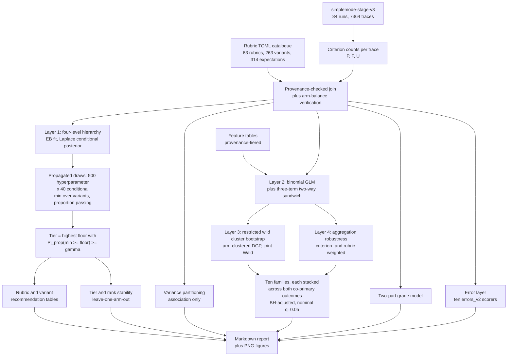

# Simple Mode result analysis: research plan and analysis specification

This report is the **analysis specification** for the Simple Mode result analysis. It
identifies which user questions are suitable for Simple Mode, the fast single-hop
agent action defined in `10-simple-mode-experiment-design.md`, and characterises what
makes them suitable.

This document is the **analysis specification, pre-specified and ready for lock**. It is
split into two parts that are intended to be read independently:

- **Part I - Research methodology.** The scientific design: estimand, measurement model,
  estimation architecture, decision rule, hypothesis families, linguistic dimensions,
  annotation protocol, sensitivity matrix, limitations, and the degenerate-and-failure case
  register (§16a). Part I can be read without reference to this repository.
- **Part II - Implementation architecture.** Programme layout, join keys, seeds, artefact
  schemas, dependencies, the annotation kit, the frozen test oracles, and the analysis-lock
  procedure.
- **Appendix A** preserves the methodological audit trail: constructions that were
  specified during design and then rejected, with the reason each failed. It is part of
  the specification, not a footnote, because several of the rejections bear directly on how
  the accepted method must be implemented.

**Revision history and current status.** The plan was revised through five rounds of external
methodological review, then through a sixth **implementation-contract completion pass**
following two further independent audits (a mathematical audit that found no defect requiring
redesign but twenty-eight specification gaps, and an implementation-contract audit that found
the architecture coherent but not yet unique enough to force two implementers onto the same
numbers). That sixth pass corrected five interpretive overclaims (§4.2, §5.1/§5.5, §5.2,
§5.6, §11), froze the Layer 1 numerical procedure, the CRVE finite-sample factors and PSD map,
the bootstrap's full-refit semantics and finite attainable support, every confirmatory
family's design matrix and analysis population, every remaining edge in the decision rule,
the aggregation and grade-model estimators, the gold-validation weighting and intervals, and
the full join/seed/artefact/CLI contract of Part II, and added the degenerate-and-failure
register of §16a.

A subsequent **implementation-alignment pass** produced the current text and is recorded in
Appendix A.10. It corrected the empirically false inventory and every dependent gate, replaced
the unavailable Stata oracle and direct `r1-evals` dependency with reproducible fixtures,
froze the parser/NER and Cursor SDK annotation runtimes and master seed, and decomposed the CLI
and release sequence into their implementation boundaries. **No methodological choice remains
open, and - as of this alignment pass - no computational or implementation-contract choice
that could change a confirmatory number is left unfrozen either**, with two honest exceptions
stated rather than hidden: the R `fwildclusterboot` oracle validates the linear special case
only, so the GLM and stacking extensions of §5.3 and §11 still rest on internal consistency
checks; and a small number of frozen constants (the annotation batch size, the exact per-level
gold count) have no principled value and were fixed only for reproducibility, not because that
value is demonstrably correct.

---

# PART I - RESEARCH METHODOLOGY

## 1. Objective, estimand and scope

**Objective.** Identify which user questions are suitable for Simple Mode, and
characterise what makes them suitable.

**Estimand.** Expected performance of a rubric or variant under the **empirical
distribution of the 28 evaluated Simple Mode configurations for its dataset**. This is a
finite-population estimand over the configuration set actually run, not performance
under any possible configuration: the arms are purposively selected and there is no
within-arm replication.

**Scope.** English only. Absolute performance, no E0 baseline. Three datasets with
disjoint rubric sets.

**Variant scope statement (binding on all reporting).** Variant analysis characterises
robustness across the **designed variant set** of roughly 2 to 8 phrasings per
information need. It does not characterise robustness across the space of possible
natural-language formulations. No recommendation may read "suitable regardless of
wording".

**Three statements kept separate throughout the final report**, since conflating them is
the main way conclusions get challenged: what the experiment demonstrates; what the
statistical model estimates; what we recommend operationally.

## 2. Settled decisions

- Measurement: three criterion states per expectation per trace, modelled jointly (§4).
- `RubricV2` retained as the stakeholder-facing composite and a **derived estimand**,
  never as a likelihood.
- **Co-primary** binary outcomes: PASS-versus-FAIL among resolved, and
  PASS-versus-not-PASS (§4.2).
- Units: expectations (314) within variants (263) within rubrics (63); dataset as a
  stratification factor.
- Layer 1: an **explicit four-level hierarchy** (§5.1), fitted by empirical Bayes, with a
  Laplace conditional posterior per rubric and **hyperparameter uncertainty propagated by
  parametric bootstrap** into the decision quantity `Pi_prop` - which is a propagated
  empirical-Bayes uncertainty measure, **not a Bayesian posterior**, and is named
  accordingly throughout.
- Recommendation: a **single decision rule on `Pi_prop`** applied at both rubric and
  variant level, which **formally replaces** the earlier point-estimate-plus-lower-bound
  conjunction (§6, Appendix A.4).
- Tiers: `SUITABLE` / `PROMISING` / `BORDERLINE` / `NOT_SUITABLE`, with **gamma = 0.90**
  and **kappa = 0.75** locked (§6).
- Confirmatory rigour: **ten pre-specified hypothesis families**, each one **joint test
  stacked across both co-primary outcomes**, BH-adjusted at nominal q = 0.05 over the ten,
  **without an unqualified FDR-control guarantee** since the required dependence condition is
  not established (§5.6, §11).
- Inference backbone: **binomial GLM independence working likelihood**, hand-implemented
  **three-term two-way cluster-robust covariance**, and the **restricted wild cluster
  bootstrap with the DGP clustered on the arm dimension** - MacKinnon-Nielsen-Webb's
  simulation-recommended pairing - applied to score contributions (§5.3).
- Grade: **two-part model**, not five-level proportional odds (§8).
- Arm treatment: per-analysis - the **arm-free** hierarchy is the sole primary suitability
  estimator, pooling directly over the balanced 28-arm empirical distribution, while arm fixed
  effects are used only in the feature GLMs and as a clustering dimension (§5.1, §5.5).
- Annotation: hybrid deterministic plus LLM, **outcome-blind**, validated against
  single-coder human gold with delayed blind re-code, admitted to confirmatory use through
  a **frozen validation rubric** rather than analyst judgment (§13.2a).
- Error modes: the ten `errors_*_v2` scorers only; the absence of rubric-embedded error
  modes reported as a coverage finding.
- Noise floor: accepted as non-identifiable and stated as a limitation.
- **The linguistic taxonomy is closed.** Eight dimensions, ten confirmatory families. No
  further feature proliferation; remaining work is formalisation.

## 3. Data inventory (verified on disk)

Snapshot `artifacts/mlflow/simplemode-stage-v3/` - 84 runs, schema v3, exported
2026-08-18. No re-download needed.

**A prior revision's global inventory was wrong, and the error is corrected here rather than
carried forward.** That revision asserted 64 rubrics / 268 variants / 324 expectations,
apparently by assuming `emc2_set2` mirrored `emc2_set1` at 21 rubrics / 84 variants / 108
expectations. The TOML catalogue and the exported snapshot agree with each other and disagree
with that assumption: `emc2_set2` has rubric files numbered 001-008 and 010-021, with **009
absent**, giving **20** rubrics, not 21. There is no missing MLflow data and no re-export is
needed; the five "missing" variants and ten "missing" expectations never existed in the rubric
source tree. The corrected, verified inventory, per eval segment:

- **`emc2_set1`**: 21 rubrics / 102 variants / 120 expectations.
- **`emc2_set2`**: 20 rubrics / 79 variants / 98 expectations.
- **Mallinckrodt GA**: 22 rubrics / 82 variants / 96 expectations.
- **Totals**: **63 rubrics, 263 variants, 314 expectations.** These are exact component sums
  (102 + 79 + 82 = 263; 120 + 98 + 96 = 314), not estimates, and §18's coverage verification
  treats each segment's counts as independent blocking targets rather than checking a single
  global constant.

**Rubric populations are disjoint by segment, and no run executes the cross-segment union.**
84 runs = Stage A 54 + Stage B 18 + Stage C 12, giving **exactly 28** runs per segment. Because
each run is scoped to one segment's rubric set, per-segment trace totals are **exactly**
`102 * 28 = 2,856` (`emc2_set1`), `79 * 28 = 2,212` (`emc2_set2`), and `82 * 28 = 2,296`
(Mallinckrodt), for a grand total of **exactly 7,364 traces**, not `263 * 28 = 7,364` treated
as a single flat product independent of segment structure - the two happen to coincide
numerically here only because every segment runs the same 28 arms, and the per-segment identity
is what the coverage gate actually checks (§18.1). The earlier `268 * 28 = 7,504` formula was
wrong for the same reason the 268 count was wrong: it assumed a single global variant pool that
does not exist. A join that does not reproduce the per-segment counts exactly is blocked by
§18's coverage verification, not merely flagged.

Across the **314 expectations**, the range is 1 to 21 per rubric and the mean is about 5.1
(this mean remains approximate). Criterion observations total **exactly `sum over rubrics r of
28 * V_r * N_r`** - a fully determined quantity given the per-rubric `V_r` and `N_r` in the
catalogue, not independently reported as a round number here because doing so without deriving
it from the same per-rubric data would itself introduce an unverified figure into a document
whose point is to remove those. This exact total, computed once the catalogue is built (§18), is
a further blocking coverage target alongside the rubric, variant and trace counts above;
"roughly 40,000" was an estimate only and is withdrawn as the reported figure once the exact
computation is available.

- `material` is **uniformly true** across the S cohort, so the `RubricV2` 2:1 weighting
  collapses to uniform. This also means the material-only criterion set used by the
  ordinal grade and the all-criteria set used by `RubricV2` coincide in this cohort.
- **Zero `[[error_modes]]`** blocks anywhere in the S cohort, so `detected_error_modes` is
  empty and `Critical Error` can only come from the ten `errors_*_v2` scorers.
- `document_ids` present on essentially every expectation, but it never reaches the judge -
  see §12 Dimension H.
- `positive_indicators` / `negative_indicators` / `detection_hints` too sparse to use
  (about 11 EMC2 files, absent from Mallinckrodt). Explicitly excluded.

### 3.1 Design facts that govern identification

Verified in `10-simple-mode-experiment-design.md`:

- Stage A single-signal arms (BM25-only, dense-only) set per-call fetch **equal to** `g`
  (line 314), so fetch and `g` are perfectly collinear by construction; line 417 already
  labels this a co-varying contrast.
- Stage A hybrid (ES RRF) arms hold fetch fixed at 30 while `g` ranges over 10, 15, 20,
  25, 30 (lines 317, 336). **This is the only subset where the context-budget effect is
  separable from retrieval depth.**
- Within the hybrid subset, **requested call count `c` also varies over 1, 2, 3** (line
  336). Lines 348-350 hold every other retrieval and context parameter constant across all
  rows. So `g` is identifiable within the hybrid subset **conditional on `c`**, which must
  therefore enter the model as a covariate; the design report's own comparison map states
  the contrast at fixed call count (line 416).
- **Design-rank check, before F3 is estimated.** Because `g` is chosen per run rather than
  as a mandatory cross-product (lines 328-330), whether the realised 54 Stage A runs
  support the interaction is an empirical question about the snapshot. The realised `c` by
  `g` grid is tabulated first, but the **decision rule is stated on the rank of the design
  matrix, not on literal level crossing**, because partial crossing can leave an
  interaction weakly rather than wholly unidentifiable.

**The mechanical rule is exact rank deficiency, and only that.** Let `X_full` contain
`[1, expectation_count, g, expectation_count*g, c]` and let `X_reduced` omit only
`expectation_count*g`. The interaction is identified exactly when
`rank(X_full) > rank(X_reduced)`; rank deficiency already present in `X_reduced`, for example
because a secondary covariate is constant, does not itself demote an independently identified
interaction. If the interaction does not increase rank, it is demoted to exploratory and only
the `expectation_count` main effect remains confirmatory. An earlier revision also demoted on
being "numerically ill-conditioned", which reintroduced exactly the arbitrary-threshold
problem this plan avoids elsewhere: without a pre-specified cutoff, one analyst's acceptable
VIF is another's disqualifying one, and the choice would be made after seeing the data. So the
condition number of the interaction block and the variance inflation factor of the interaction
term are **reported as diagnostics** and, if large, trigger a written caveat that the
interaction estimate is imprecise and its interval wide - which the interval will show anyway.
They do **not** trigger automatic demotion. Rank is a property of the design that can be checked
without any threshold; conditioning is a matter of degree that cannot.

- Stage B arms use the union merge and have **no `g` parameter** (lines 320-321), so they
  cannot contribute to context-budget analysis.
- Stage C repeats selected Stage A and B configurations with reasoning `low` instead of
  `none`, inheriting every other parameter (lines 325-326) - a paired reasoning contrast,
  not a replicate.

Every claim about `g` is estimated on the hybrid subset conditional on `c`, and labelled
as such. Nothing about `g` is claimed causally; arms are purposive, not randomised.

## 4. Measurement model

### 4.1 The three-state atom and why the composite is not binomial

Each expectation in each trace yields `PASS`, `FAIL` or `UNDETERMINED`. This is
**ternary**.

`RubricV2 = (P + 0.5U)/N` has a **fractional numerator**, so it is not a binomial count
and `UNDETERMINED` is not half a success. Empirical-Bayes beta-binomial shrinkage applied
to `RubricV2` is therefore unfounded and is withdrawn (Appendix A.1). `RubricV2` is a
**derived estimand** of the model in §5.1, computed per draw as `pi_P + 0.5 * pi_U`.

### 4.2 Co-primary binary outcomes, and the assumption they rest on

Two outcomes are **co-primary**, not primary and secondary:

- **Resolved-only binary.** `PASS` versus `FAIL` among resolved criteria. Answers "when the
  judge can decide, how often is the criterion satisfied", isolating agent capability from
  judge indecision.
- **Conservative binary.** `PASS` versus not-`PASS`, counting `UNDETERMINED` as a miss.
  Answers "how often does Simple Mode unambiguously satisfy the criterion".

Both are primary because of an **informative-indeterminacy** problem. Under the
resolved-only outcome, `UNDETERMINED` criteria drop out of the analysis entirely, so a
trace's effective denominator shrinks with judge indecision and an all-`UNDETERMINED`
trace contributes nothing at all. If indecision correlates with question properties -
very likely, since ambiguous questions are precisely what a judge cannot resolve - the
resolved-only outcome is subject to selection on a quantity that is itself a function of
the predictors.

**What joint modelling does and does not achieve.** Modelling `(P, F, U)` jointly **avoids
conditioning away the observed indeterminacy mechanism**, which the resolved-only outcome
does by construction. It does not make an informative-indeterminacy mechanism identifiable
without assumptions. The identifying assumption is stated explicitly: *conditional on the
modelled covariates and the rubric and variant effects, the probability that a criterion is
returned `UNDETERMINED` is independent of whether that criterion would have been `PASS` or
`FAIL` had it been resolved.* This is not testable in this design. It is the reason the
conservative binary, which needs no such assumption because its denominator is all
criteria, is co-primary rather than secondary.

**Divergence between the two outcomes is not, by itself, evidence about the assumption, and
an earlier revision overclaimed this.** Write `R_i = 1{criterion i is resolved}` and let
`Y_i*` be the latent PASS indicator that would be observed were `i` resolved. The resolved
estimand is `Pr(Y_i*=1 | R_i=1, X_i)` directly; the conservative estimand decomposes as

`Pr(PASS_i=1 | X_i) = Pr(R_i=1 | X_i) * Pr(Y_i*=1 | R_i=1, X_i)`.

The two therefore **diverge whenever `Pr(R_i=1|X_i) < 1`, exactly when there is any
indeterminacy at all, even if the stated identifying assumption holds precisely.**
Divergence is the arithmetic consequence of incomplete resolution, not a diagnostic for
whether resolution is *informative*. Reading raw divergence as evidence the assumption is
strained is therefore withdrawn (Appendix A.8).

**What is actually diagnostic.** Divergence is decomposed into its two factors -
`Pr(R_i=1|X_i)`, the resolution probability, and `Pr(Y_i*=1|R_i=1,X_i)`, the conditional pass
probability - and both are reported. The assumption itself is probed only indirectly, by
examining whether the resolution probability `Pr(R_i=1|X_i)` **varies with the confirmatory
features** (F1-F10). That variation is observable from the data; the assumption's truth is
not. A confirmatory feature that strongly predicts resolution status, while the same
feature's coefficient in the two co-primary models moves in different directions, is the
closest available evidence that the assumption is strained - not the raw gap between the two
headline probabilities.

### 4.3 Calibration, the UNDETERMINED wedge, and degenerate cases

With uniform materiality the two headline metrics reduce to grade pass rate
`= n_PASS / (n_total - n_UNDETERMINED)` and
`RubricV2 = (n_PASS + 0.5 * n_UNDETERMINED) / n_total`. For ordinary mixed cases they
differ **only** in the `UNDETERMINED` convention, so calibration is arithmetic. That
statement is too casual for the degenerate case, which is enumerated:

- `P = 0, F = 0, U = N`: `RubricV2` = 0.5 (defined); resolved-only pass rate =
  **undefined**, denominator zero; contribution to the resolved-only model = **zero
  observations**; `ordinal_grading_v2.py` returns `"Poor"` by explicit convention at
  `total_count == 0`.
- `0 < U < N`: all three defined, but the resolved-only denominator is reduced by `U` - the
  graded form of the same problem.
- For the roughly ten single-expectation rubrics, one `UNDETERMINED` verdict produces the
  fully degenerate case.

Prevalence of each case is reported before any modelling, since it bounds how far the two
co-primary outcomes can diverge.

### 4.4 Resolution heterogeneity

Expectation counts run from 1 to 21, so the attainable score lattice differs per rubric.
About ten rubrics have a single expectation: `RubricV2` can only be 0, 0.5 or 1 and the
grade can only be `Poor`, `Good` or `Critical Error`, with `Partial` and `Acceptable`
unreachable. A 4-expectation rubric cannot express "60% correct".

Handling: per-rubric attainable-value grids; explicit flagging of single-expectation
rubrics in every tier table; preference for the expectation-level model, where the problem
does not arise; and the shrinkage in §5.1, which pulls low-`N` rubrics hard toward the
prior.

## 5. Estimation architecture

Four layers with distinct jobs.

### 5.1 Layer 1 - the explicit probability model

The phrase "Dirichlet-multinomial with a joint posterior" does not determine a
computation, because several distinct models hide behind it. The model is therefore
written out.

**Indices.** Rubric `r = 1..64`; variant `v = 1..V_r` within rubric `r`; trace
`t = 1..T_rv`, one per evaluated arm; expectation count `N_r`, fixed by the rubric and
therefore constant across all traces of all variants of `r`.

**Level 1 - criterion outcomes within a trace.**

`(P_rvt, F_rvt, U_rvt) | theta_rvt ~ Multinomial(N_r, theta_rvt)`

**Level 2 - trace-level overdispersion within a variant.**

`theta_rvt | theta_rv ~ Dirichlet(phi * theta_rv)`

with a single global concentration `phi > 0`. Marginalising `theta_rvt` gives a
Dirichlet-multinomial for each trace's counts, with mean `N_r * theta_rv` and
overdispersion governed by `phi`. `phi` is pooled globally because 28 traces per variant
estimate one common concentration well but not 263 separate ones.

**`phi` is trace-level overdispersion, not a clean stochastic-noise parameter.** Since each
trace is one arm, `phi` mixes four things that this design cannot separate: agent
stochasticity, judge stochasticity, arm and configuration heterogeneity, and
variant-by-arm interaction. It is never interpreted as a noise floor, and the terminology
is kept literal throughout to prevent that reading.

**Level 3 - variants within a rubric.** Work in additive log-ratio coordinates with `FAIL`
as reference, so the simplex constraint disappears and a Gaussian random effect is
available:

`eta_rv = ( log(theta_rv,P / theta_rv,F), log(theta_rv,U / theta_rv,F) )` in R^2

`eta_rv | mu_r ~ Normal_2(mu_r, Sigma_within)`

with **`Sigma_within` pooled globally across rubrics**. A per-rubric `Sigma_r` is
unestimable from 2 to 8 variants, so global pooling is the deliberate choice that makes
the within-rubric variant distribution estimable at all.

**This is the global exchangeability assumption for variant effects, and it is a
substantive assumption rather than a technical convenience.** It asserts that the
dispersion induced by rewording is governed by the same covariance across all 63 rubrics -
across both EMC2 sets and Mallinckrodt, and across every kind of information need. Three
checks are therefore pre-specified, listed in §14, and their status is deliberately
unequal:

- `Sigma_within` **estimated separately by dataset**, and **diagonal versus full
  covariance**. These are the informative checks, because they refit the object of interest
  and show directly whether conclusions depend on it.
- A **heterogeneity diagnostic**: regressing per-rubric residual variant dispersion on
  `V_r`, `N_r` and dataset. This is explicitly **not a test of `Sigma_r = Sigma_within`**,
  and calling it one would overstate it. It compares a scalar summary of dispersion, so it
  can detect specific systematic heterogeneity - dispersion growing with `V_r`, or
  differing by dataset - while remaining blind to rubrics that happen to share an average
  dispersion but differ in covariance structure. It is reported as a directional warning,
  and a null result is **not** evidence for exchangeability.

**Level 4 - rubrics.**

`mu_r ~ Normal_2(mu_0 + d(r), Sigma_between)`

with `d(r)` a fixed offset for the rubric's dataset, and `Sigma_between` estimated. This is
what makes low-`N_r` rubrics shrink toward their dataset mean.

**`mu_0` and `d(r)` are not separately identified as written, and this is fixed by a
reference-dataset constraint rather than left implicit.** For any vector `a`,
`mu_0 + d(r) = (mu_0 + a) + (d(r) - a)`, so the likelihood is flat along the one-parameter
family of reshufflings between `mu_0` and the three `d_j`: the marginal log-likelihood's
gradient is identically zero in that direction, its Hessian is singular there, and an
optimiser started off the ridge can still walk along it indefinitely, including inside the
parametric-bootstrap re-estimation of §5.1's propagation loop, where it can trigger the
discard-and-replenish protocol on draws that never actually fail to fit. The fix is a
constraint, not a new parameter: **`d(EMC2 UAT set_1) = (0, 0)`** is fixed as the reference
level for every fit, in both the outer marginal-likelihood optimisation and every bootstrap
re-estimation `psi*_b`. `mu_0` is then the reference dataset's ALR mean, and
`d(EMC2 UAT set_2)`, `d(Mallinckrodt GA)` are its two free deviations from that mean. The
**identified quantities `mu_0 + d(r)` for each dataset `r` are unaffected by this choice**;
only the otherwise-arbitrary split between `mu_0` and `d(r)` is fixed, and `psi` as a whole is
identifiable once it is. A sum-to-zero constraint (`d_1 + d_2 + d_3 = 0`) would resolve the
same non-identifiability equally validly; the reference-dataset form is adopted for being
simpler to read off directly as a per-dataset contrast against EMC2 UAT set_1 (Appendix A.9).

**Fitting (empirical Bayes).** The hyperparameters
`psi = (phi, mu_0, d, Sigma_within, Sigma_between)` are estimated by marginal maximum
likelihood, initialised by method of moments.

**The fitting procedure, frozen rather than left as a named technique.** "Marginal maximum
likelihood, initialised by method of moments" does not by itself determine a computation;
two reviewers independently found this the largest remaining gap in Layer 1, and it is closed
here in full.

- **Positive-definite parameterisation.** `Sigma_within` and `Sigma_between` are each
  parameterised by their **log-Cholesky factor**: `Sigma = L L'` with `L` lower-triangular,
  diagonal entries stored in log-space and off-diagonal entries unconstrained. This makes the
  hyperparameter vector `psi` an unconstrained Euclidean vector for the purposes of
  optimisation, so no constrained solver or boundary-respecting step size is needed; `phi > 0`
  is parameterised as `log(phi)` for the same reason.
- **Method-of-moments initialisation, named exactly.** Compute, per variant `rv`, the
  empirical proportions `theta_hat_rv = (P_rv, F_rv, U_rv) / N_r` pooled over that variant's
  traces, transform to ALR coordinates `eta_hat_rv` (boundary rule below), and take: the
  rubric-level averages `eta_bar_r = mean over v of eta_hat_rv`; **`mu_0`** as
  `eta_bar_r` averaged over rubrics **in the reference dataset, EMC2 UAT set_1, only** (per
  the identifiability fix above); **`d(r)`** for each of the other two datasets as that
  dataset's own average `eta_bar_r` minus `mu_0`, and **`d`** for the reference dataset fixed
  at `(0, 0)` rather than estimated; `Sigma_between` from the between-rubric sample covariance
  of `eta_bar_r - mu_0 - d(r)` (dataset offsets removed using the values just computed); `phi`
  from the explicit estimator below.
- **`Sigma_within`, with the pooling denominator written out because "pooled ... across all
  rubrics" does not by itself say how, and the two readings disagree exactly where a rubric has
  only one variant.** The estimator is

  `Sigma_within_hat = ( sum over r of sum over v of (eta_hat_rv - eta_bar_r)(eta_hat_rv - eta_bar_r)' ) / ( sum over r of (V_r - 1) )`,

  a single sum of outer products over every variant of every rubric, divided by the pooled
  degrees of freedom `sum_r (V_r - 1)`, **not** an average of separately computed per-rubric
  covariances `Sigma_r_hat = (...)/(V_r - 1)`. The two constructions agree when every `V_r` is
  equal, but not otherwise, and only the pooled-sum form remains well defined when some `V_r`
  is small: a rubric with `V_r = 1` has `eta_hat_r1 = eta_bar_r` exactly, so its one variant
  contributes the zero matrix to the numerator and the value `0` to the denominator - it drops
  out of the estimator entirely, with no operational branch required, whereas the
  per-rubric-then-average form would divide that rubric's own covariance by `V_r - 1 = 0` and
  be undefined. This is why the pooled-sum form, not the average-of-per-rubric form, is the one
  specified.
- **The `phi` initialiser, written as a formula rather than named as a technique.** Under the
  Level 1-2 model, the marginal variance of a single count `X_rvt,k` (`k` in `{P, F, U}`) is
  `Var(X_k) = N_r * theta_k * (1 - theta_k) * (N_r + phi) / (1 + phi)`, so the ratio of
  observed to binomial variance identifies an overdispersion factor `c = (N_r + phi)/(1 + phi)`,
  invertible as `phi = (N_r - c) / (c - 1)` whenever `c` is strictly between `1` and `N_r`. Per
  variant `rv` and component `k`:
  - `theta_hat_rv,k = (sum over t of X_rvt,k) / (T_rv * N_r)` (the same quantity as
    `theta_hat_rv` above, taken per component);
  - `s2_rv,k = (1 / (T_rv - 1)) * sum over t of (X_rvt,k - N_r * theta_hat_rv,k)^2`, the
    unbiased sample variance of the component's trace-level counts within the variant;
  - `c_hat_rv,k = s2_rv,k / (N_r * theta_hat_rv,k * (1 - theta_hat_rv,k))`.
  - The pair `(rv, k)` is **retained** only if `theta_hat_rv,k` is strictly in `(0, 1)` **and**
    `c_hat_rv,k` is strictly in `(1, N_r)`; otherwise it is **discarded**, since a boundary
    `theta_hat_rv,k` makes the denominator zero and a `c_hat_rv,k` outside `(1, N_r)` inverts to
    a non-positive or infinite `phi`, carrying no usable information about a finite positive
    concentration. This discards every single-expectation rubric automatically, since `N_r = 1`
    leaves no value of `c` in the open interval `(1, 1)`.
  - `phi_init = median` of the retained `phi_hat_rv,k = (N_r - c_hat_rv,k) / (c_hat_rv,k - 1)`,
    clamped to `[phi_min, phi_max]` with **`phi_min = 0.1`** and **`phi_max = 1000`** fixed
    exactly (not "a small positive constant"); if no pair is retained across the entire corpus,
    `phi_init = phi_min`.
  - This is an **initialiser only**: the estimand is `phi`'s marginal-maximum-likelihood value,
    and the formula above supplies a starting point for the optimiser in §5.1's fitting
    procedure, not a claim about the converged `phi_hat`.
  - **Verification that the initialiser does not bias the answer.** Every marginal-likelihood
    fit - the primary fit and every bootstrap re-estimation `psi*_b` - is additionally started
    from `0.5 * phi_init` and `2 * phi_init`, holding every other initial value fixed. If all
    three starts converge to the same optimum within the existing convergence tolerance (§5.1),
    the fit is retained as normal; if they do not, the fit is flagged as **multi-modal or
    initialiser-sensitive** and reported rather than silently resolved by keeping whichever
    start was tried first. This turns "the initialiser should not matter" from an assumption
    into a per-fit, reported check.
- **ALR boundary rule.** For a trace or variant with any zero component among `(P, F, U)`,
  additive smoothing is applied before the log-ratio: `theta_smoothed = (P + eps, F + eps, U +
  eps) / (N_r + 3*eps)` with `eps = 0.5` (a Jeffreys-type continuity correction), applied
  **only** to form the ALR coordinate used in fitting and in Laplace-mode-finding; the
  underlying multinomial likelihood in Level 1 uses the raw, unsmoothed counts. This is the
  single boundary rule used everywhere ALR coordinates are computed - initialisation, Laplace
  approximation, and any diagnostic that reports `eta_rv` on the log-ratio scale.
- **Marginal likelihood evaluation.** The marginal likelihood of `psi` integrates out
  `(mu_r, eta_r1, ..., eta_rV_r)` for all 63 rubrics; this integral is evaluated by **nested
  Laplace approximation**: for each candidate `psi` during optimisation, find the joint mode of
  `(mu_r, eta_r1, ..., eta_rV_r)` by Newton's method with the ALR-Dirichlet-multinomial
  log-likelihood plus the Level 3-4 Gaussian log-densities (the same density constructed
  explicitly in the Laplace step below), and use the Laplace approximation to that mode's
  curvature to approximate the rubric's contribution to the marginal log-likelihood. Rubric
  contributions are independent given `psi` and are summed.
- **Optimiser and convergence.** `L-BFGS` on the unconstrained log-Cholesky/log-`phi`
  parameterisation, from the method-of-moments start; converged when the change in marginal
  log-likelihood between iterations is below `1e-6` **and** the maximum absolute gradient
  component is below `1e-4`; capped at 200 iterations, with non-convergence at the cap
  recorded as a failed fit under the retention protocol below.

**The Laplace step in the propagation loop conditions on the observed data `D`, never on a
simulated dataset, and this is stated because the two readings give different `Pi_prop`
values.** For each bootstrap hyperparameter draw `psi*_b`, step 2 of the propagation procedure
below forms `p(mu_r, eta_r1, ..., eta_rV_r | D, psi*_b)` - the conditional posterior **given
the actually observed criterion counts**, evaluated at the resampled hyperparameters. It is
**not** `p(... | D*_b, psi*_b)`, the conditional posterior for the simulated dataset that
produced `psi*_b`; that second object describes a bootstrap replicate's own latent state, not
the observed rubric's, and using it would not propagate hyperparameter uncertainty for the
data actually collected.

**The parametric-bootstrap DGP for `psi*`, with what is held fixed and what is redrawn.**
Simulating `D*_b ~ p(. | psi_hat)` means: hold the **design** fixed exactly as observed -
`N_r` for every rubric, `V_r` for every rubric, `T_rv` for every variant (all equal to 28 under
the balance gate), and the arm labelling of each trace; **redraw every latent quantity**, in
order: `mu_r* ~ Normal_2(mu_0_hat + d_hat(r), Sigma_between_hat)` for each rubric, `eta_rv* ~
Normal_2(mu_r*, Sigma_within_hat)` for each variant, `theta_rvt* ~ Dirichlet(phi_hat *
theta_rv*)` for each trace (with `theta_rv*` the back-transform of `eta_rv*`), and `(P,F,U)_rvt*
~ Multinomial(N_r, theta_rvt*)`. Re-estimate `psi_b* = psi_hat(D_b*)` by the identical fitting
procedure above, from the identical method-of-moments initialisation computed on `D_b*`.

**Retention protocol for every failure mode in the fitting and approximation chain, stated
once and reused everywhere below.** Three failure classes can occur - the outer marginal
maximum-likelihood fit fails to converge or returns a non-positive-definite `Sigma_within` or
`Sigma_between`; the inner Laplace mode-finding fails to converge or its Hessian is not
positive-definite at the mode (§5.1 Laplace step); the importance-resampling adequacy check
below fails its effective-sample-size rule. In every case the failure is **counted and
reported**, the affected draw is **discarded and replenished** by drawing a fresh outer
`psi*_b` (never a silent drop, since dropping conditions the hybrid distribution on numerical
success), and if the replenishment rate for a rubric exceeds 5% of attempted draws, that
rubric's `Pi_prop` is reported as **computed under elevated numerical-failure conditions**
rather than silently on a smaller effective `B_psi`.

**Uncertainty computation, with hyperparameter uncertainty propagated rather than
ignored.** A plug-in empirical-Bayes scheme treats `psi_hat` as known and so **understates
width** - a real defect, because the headline recommendation in §6 compares a probability
against `gamma` = 0.90, and a rule calibrated on an artificially narrow distribution can
promote units it should not. Relegating this to a sensitivity analysis while the headline
number uses the narrow version would be the wrong way round. Here the fix is cheap, so it
is taken as the **primary computation**:

1. Draw `B_psi = 500` hyperparameter vectors `psi*_b` from the parametric bootstrap
   distribution of `psi_hat` - simulate complete datasets `D*_b` from the fitted hierarchy
   with design held fixed and latents redrawn (DGP frozen above), re-estimate `psi*_b` by the
   identical marginal-maximum-likelihood procedure, retain the estimates. A failed re-estimate
   is discarded and replenished under the retention protocol above.
2. For each `psi*_b` and each rubric independently, form the **Laplace approximation** to
   the conditional posterior of `(mu_r, eta_r1, ..., eta_rV_r)` **given the observed data `D`**
   - `p(mu_r, eta_r1, ..., eta_rV_r | D, psi*_b)`, never given the simulated `D*_b` - dimension
   `2(V_r + 1) <= 18` - at its mode found by Newton's method from the ALR-transform of the
   method-of-moments point as the starting value, using the **observed** Hessian (the exact
   second derivative of the log-density at the mode, not the Fisher-information / expected
   Hessian) as the curvature matrix. If the observed Hessian is not negative-definite at the
   located mode, the draw is discarded and replenished under the retention protocol above,
   rather than substituting the expected Hessian or a damped variant, since either substitution
   would silently change which distribution is being approximated. Take `M_b = 40` draws from
   the resulting Gaussian approximation per retained outer draw.
3. Pool the `B_psi * M_b = 20,000` draws per rubric. Every derived quantity is computed per
   draw, including `R_rv = pi_P + 0.5 * pi_U` and `min over v of R_rv`, using the **inclusive**
   convention `R_rv >= c` throughout; a draw landing exactly on `c` counts as clearing the
   floor. Since the draws are continuous, exact ties are measure-zero and this convention has
   no practical effect beyond removing an otherwise-undefined edge case.

**Monte Carlo error is governed by the outer draws, not the total.** The 20,000 draws are
not 20,000 exchangeable draws: 500 outer values carry the hyperparameter uncertainty and 40
inner values the conditional latent uncertainty per outer value. So the Monte Carlo
standard error of the headline probability scales with `B_psi`, not with 20,000, and
quoting the total would overstate precision. Rather than a generic convergence check, the
criterion is tied to the decision the number feeds:

- The Monte Carlo standard error of `Pi_prop` is estimated by **batch means over the 500
  outer draws**, treating each outer draw's inner block as one batch, and is reported for
  every unit. The **interval** referred to throughout this subsection is the closed interval
  `[Pi_prop - 2*MCSE, Pi_prop + 2*MCSE]`.
- **The trigger, stated exactly.** A **primary decision event** is one of: the three
  worst-variant floor events `Pi_prop(min >= c)` for `c` in `{0.75, 0.60, 0.50}`, and the
  mandatory proportion-diagnostic event `Pi_prop(proportion >= kappa)`, both evaluated at
  every rubric and every variant. If the above interval for **any** primary decision event
  for a unit contains `gamma`, that unit's tier could flip on Monte Carlo noise alone and
  refinement is triggered for that unit. Sensitivity-only evaluations - `gamma = 0.95`, the
  pooled-mean tier, alternative `kappa` values, and any other §14 sensitivity display - are
  explicitly **not** primary decision events and never trigger refinement on their own.
- **Refinement is an extension of one global outer sequence, not four independent
  bootstraps.** A single ordered sequence of outer hyperparameter draws `psi*_1, psi*_2, ...`
  is generated once, under one master seed (§18). The base analysis uses draws `1..500`. For a
  unit requiring refinement, the **same sequence** is extended - reusing draws `1..500` and
  generating draws `501..1000`, then, if still ambiguous, `1001..2000`, then `1..4000` - and
  **only the additional outer draws' own conditional Laplace draws are computed**; the
  original 500 outer draws' `M_b = 40` inner draws are reused unchanged. This is what makes
  "raising `B_psi` for that unit" a single well-defined operation rather than three
  interpretations (extra outer draws for that rubric only, extra inner draws reusing the name
  `B_psi`, or a wholly new global bootstrap): it is always extra outer draws, always from the
  one shared sequence, always with fresh inner draws only for the newly added outer draws.
- Units still ambiguous at the `B_psi = 4000` cap are assigned the status
  **`MONTE_CARLO_INDETERMINATE`**, which is a distinct value in the tier column, disjoint from
  `SUITABLE` / `PROMISING` / `BORDERLINE` / `NOT_SUITABLE`. It is never silently mapped to
  `NOT_SUITABLE` or omitted from the recommendation table; the table carries the status
  explicitly and the unit's best available `Pi_prop` and its MCSE are reported alongside it.
- A global check reports tier assignments at `B_psi` = 250, 500 and 1,000 and the count of
  units whose tier changes, which is the quantity that matters rather than the stability of
  any individual probability. This check reuses prefixes of the same shared outer sequence.

Cost is trivial at this scale: 500 marginal-likelihood fits plus 32,000 low-dimensional
Laplace approximations, and no MCMC library.

**The pooled object is not a posterior, and calling it one would be wrong.** The parametric
bootstrap distribution of `psi_hat` is a **sampling distribution** - the distribution of the
estimator under resampling from the fitted model - whereas a posterior `p(psi | D)` requires
a prior on `psi`, which this design deliberately does not specify. Mixing genuine
conditional posteriors `p(theta | D, psi*)` over draws from a sampling distribution yields a
**hybrid uncertainty distribution**, not `p(theta | D)`. The two objects can behave
similarly and are used for the same practical purpose, but they are not interchangeable, and
the distinction must survive into the report because the entire recommendation system rests
on one number derived from this distribution.

**Frozen terminology**, used consistently from here on:

- **`Pi_prop`**, the **hyperparameter-uncertainty-propagated empirical-Bayes probability**,
  computed from the pooled draws above. This is **the decision quantity** in §6.
- **`Pi_cond`**, the **conditional empirical-Bayes probability given `psi_hat`**, computed
  from the plug-in scheme. Reported alongside as the comparison, with the gap
  `Pi_prop - Pi_cond` quoted as direct evidence of how much the propagation matters. `Pi_cond`
  is frozen identically to a single outer draw of the `Pi_prop` procedure with `psi*_1` fixed
  at `psi_hat` itself: it conditions on the observed data `D`, uses the same Laplace
  mode-finding and the same observed-Hessian rule, and takes `M_cond = 20,000` conditional
  draws under a **dedicated seed stream** (§18) distinct from the `Pi_prop` streams, so its own
  Monte Carlo error is not confounded with the outer-draw error of `Pi_prop`. Its own Monte
  Carlo standard error is the ordinary binomial-proportion standard error at `M_cond` draws.
  `Pi_prop - Pi_cond` is a **reported diagnostic only**; it is never compared to `gamma` and
  never itself decides a tier.
- **`p(theta | D, psi)`** remains a genuine **conditional posterior** and keeps that name;
  only the pooled mixture is barred from the word.

**Why the propagation is still worth doing, given it buys no Bayesian guarantee.** The
motivation is frequentist coverage, not Bayesian interpretation: `Pi_cond` **can understate
uncertainty** because it treats estimated hyperparameters as known, and since §6 promotes a
unit when the probability exceeds `gamma`, this **can shift threshold decisions toward
promotion**. `Pi_prop` corrects the width. There is an asymptotic argument that the
bootstrap distribution approximates a flat-prior posterior for `psi`, but it is **not
invoked as justification** here, because it is weakest exactly where this model lives:
variance components such as `Sigma_within` and `Sigma_between` can sit near the boundary of
the parameter space, where that approximation fails.

**Consequence for `gamma`, which must not be misread as a credibility level.** Because
`Pi_prop` is not a posterior probability, `gamma` = 0.90 is an **operational calibration
threshold on an uncertainty measure**, not a Bayesian credibility level and not a
frequentist coverage guarantee. It is defensible as a locked, pre-specified, monotone
decision threshold whose sensitivity is reported at 0.95 (§14); it is not defensible as a
statement that a `SUITABLE` rubric has at most a 10% chance of falling below its floor. §6
is worded accordingly.

**Why the joint treatment of variants matters.** Variants within a rubric are *conditionally
independent given `mu_r`* but *marginally dependent through it*. That dependence is the
point: variant estimates **borrow strength through the rubric-level prior, inducing partial
pooling**, and the worst-variant statistic in §6.2 accounts for the resulting correlation
instead of treating variants as independent draws.

Stated carefully, because the loose version invites a misreading: when one variant performs
poorly, its siblings' estimates move toward the rubric mean. That is shrinkage under an
exchangeable hierarchical prior. It is **not** evidence that the siblings themselves
performed worse, and it must never be described as a weak variant demonstrating that the
rubric is difficult.

**Remaining approximations, each with a check.** Hyperparameter uncertainty is propagated
rather than merely quantified, so what remains is the **Laplace approximation** to each
conditional posterior, verified against importance resampling on a purposive sample of
rubrics including the smallest `V_r`, the smallest `N_r`, and the most extreme observed
performance; and the **parametric bootstrap's own adequacy** as a representation of
hyperparameter uncertainty, which is asymptotic and is stated as such.

**The importance-resampling check, frozen so it produces one comparable answer rather than
an unspecified procedure.** For each purposive rubric, at `psi_hat` (not repeated per bootstrap
draw, since the check targets the Laplace approximation's own adequacy rather than the
propagation): draw `N_particles = 5,000` proposals from the Laplace Gaussian approximation
itself as the importance proposal; compute importance weights as the ratio of the true
ALR-Dirichlet-multinomial-plus-Gaussian-prior density to the Laplace Gaussian density at each
proposal; compute the effective sample size `ESS = (sum of weights)^2 / sum of squared
weights`. **Consequence, stated so two implementers cannot diverge on what happens next**: if
`ESS / N_particles >= 0.10`, the Laplace approximation is accepted for that rubric and its
importance-weighted first two moments are reported alongside the Laplace ones as a comparison
table entry; if `ESS / N_particles < 0.10`, the Laplace approximation is flagged as
**inadequate for that rubric**, the rubric's row in the comparison table is marked
accordingly, and its `Pi_prop` in the main analysis is reported with an explicit caveat
pointing to this failure rather than silently accepted at face value. No rubric's tier is
changed by this check alone; it is a validity flag on the approximation, reported per the
sensitivity matrix (§14).

**The `Sigma_within` heterogeneity-diagnostic scalar, named exactly, since "per-rubric residual
variant dispersion" is not self-defining.** For rubric `r`, compute the ALR residuals
`e_rv = eta_hat_rv - eta_bar_r` for each of its `V_r` variants (the same point estimates used
in method-of-moments initialisation), and define the rubric's dispersion scalar as
`D_r = trace(sample covariance of {e_rv}) / (2)` when `V_r >= 3` (dividing the trace of the
2x2 empirical covariance by its dimension to give an average per-coordinate variance), and as
**undefined, reported as missing** when `V_r < 3`, since a covariance is not estimable from
fewer than three points. `D_r` is then regressed on `V_r`, `N_r` and a dataset indicator; a
coefficient significantly different from zero on any of the three is the directional warning
described above.

**Arm handling: the arm-free hierarchy above is the primary suitability estimator, full
stop, and this resolves a contradiction an earlier revision left standing.** Level 2 as
written contains **no arm-specific mean or fixed effect**; arm-to-arm variation is absorbed
into the single trace-level concentration `phi`. A later section of an earlier revision
additionally stated that suitability estimation uses arm fixed effects and then marginalises
over them - a different likelihood, since a hierarchy with arm fixed effects and one without
have different mean structures, different posterior widths, and in general different
nonlinear functionals such as `Pi_prop(min >= c)`. The two cannot both be "the" primary
computation, and the balance argument below does not make them equivalent: balance makes a
**descriptive point mean** equal to the average of arm-specific means when every denominator
is the same, but it does not make an arm-free hierarchical likelihood's posterior equal to an
arm-fixed-effect likelihood's posterior, nor does it equate their nonlinear derived
quantities. This plan resolves the contradiction in favour of the model actually written out
above: **the arm-free four-level hierarchy of Levels 1-4 is the sole primary suitability
estimator**, and the finite-population estimand of §1 is recovered because the hierarchy's
pooled counts already average over the balanced 28-arm empirical distribution, not because a
separate marginalisation step is applied to an arm-fixed-effect fit. Arm fixed effects are
used only in the feature GLMs of §5.2 onward, where they serve a different, clustering
purpose; §5.5 is restated to match. A sensitivity fit that adds arm effects to the Level 2
mean structure is reported (§14) precisely because it is a genuine alternative model, not a
reparameterisation of the primary one.

**Why pooling still requires balance, even though no separate marginalisation step is
applied.** Level 2 treats arm-to-arm variation as exchangeable noise, so pooling counts
across arms yields the intended equal-weighted average **only if every variant is observed in
exactly the same 28 arms with the same `N_r`**. Design implies this; the snapshot must confirm
it. A **balance verification is therefore a precondition, and its failure is a hard blocking
gate rather than a fallback to a different estimand**: trace counts per variant are tabulated
against the exact target of 28 arms per variant (§18, Group 9 register), and if any variant
falls short, the primary Layer 1 suitability analysis for that variant does **not** proceed on
a silently reduced arm set - it is reported as blocked by the balance gate, and no
observed-arm renormalisation is substituted for it, because renormalising over fewer arms
changes the estimand rather than approximating it. Because Level 2 absorbs systematic arm
effects into trace-level overdispersion, `phi` conflates them with stochastic variability -
the same non-identifiable noise floor stated in §16.

**Single inferential vocabulary.** Everything decision-facing uses **`Pi_prop` probabilities
and quantiles** from this model, under that name and never as "the posterior". Wilson and
Jeffreys intervals appear only for raw descriptive proportions in tables and are labelled as
such.

Anchors: **Efron & Morris (1975), "Data Analysis Using Stein's Estimator and Its
Generalizations," [doi:10.1080/01621459.1975.10479864](https://doi.org/10.1080/01621459.1975.10479864),
pp. 311–312 (human-verified; general empirical-Bayes shrinkage context, not the exact
Layer 1 model)**; **Gelman & Hill (2007), *Data Analysis Using Regression and
Multilevel/Hierarchical Models*,
[doi:10.1017/CBO9780511790942](https://doi.org/10.1017/CBO9780511790942),
pp. 7, 251, and 253–254 (human-verified partial-pooling anchor)**. The additive log-ratio
transform remains the frozen mathematical parameterization defined above, without an external
source claim.

### 5.2 Layer 2 - mean structure and two-way cluster-robust covariance

**Binomial GLM with an independence working likelihood** for the mean structure. The
independence likelihood is used to **define the mean model**, not to assert independence:
under a correctly specified conditional mean, the GLM score equations remain **unbiased
estimating equations** even when observations are correlated, so clustering affects the
covariance rather than the target of estimation. This is preferred over GEE with an
exchangeable working correlation because the multiway variance theory is built for
independence-based estimating equations.

**Two distinctions worth keeping straight, since conflating them overstates the guarantee.**
First, unbiasedness here is a property of the estimating *function* - `E[s_i(beta_0)] = 0`
at the true mean parameters - and **not** of the estimator: `beta_hat` is not claimed to be
unbiased in finite samples, and no such claim is made anywhere. Second, the resulting
consistency is **asymptotic in the number of clusters**, which here is 28 arms and 64
rubrics, so it is a limiting property invoked as justification for the estimator's target
rather than a finite-sample guarantee about this dataset. Finite-sample behaviour is handled
separately and deliberately: by the bootstrap of §5.3, the aggregation-based robustness
analysis of §5.4, and the leave-one-arm-out checks.

**The limit of that argument, stated.** Cluster-robust covariance addresses dependence and
variance misspecification. It does **not** repair a misspecified mean structure: validity of
coefficient interpretation still requires the specified mean model to be appropriate. This
matters concretely for the nonlinearity of `expectation_count`, F4's `log1p` form, the
interactions, the categorical codings, and the Mundlak terms. Link and functional-form
diagnostics - binned residual plots against each continuous predictor, and a
Hosmer-Lemeshow-style grouped check - are reported for every confirmatory model.

**Covariance: the three-term estimator specifically.** A hand-implemented
Cameron-Gelbach-Miller two-way sandwich

`V_3 = V_rubric + V_arm - V_(rubric intersect arm)`

built from the GLM score contributions. The three-term form is chosen deliberately over the
two-term `V_rubric + V_arm`: MacKinnon, Nielsen & Webb show that **only the three-term CRVE
is consistent in all the dependence cases they consider**, whereas the two-term version is
consistent only under stronger assumptions, its guaranteed positive semi-definiteness being
its sole compensating advantage. `statsmodels` exposes no multiway cluster-robust option, so
this is implemented directly, consistent with the auditability requirement.

**The three finite-sample multipliers, written out rather than left implicit.** For cluster
sums `S_g = sum over i in g of s_i`, `S_h = sum over i in h of s_i`, `S_gh = sum over i in
(g,h) of s_i`, with `G` the number of rubric clusters actually present in the fitted sample,
`H` the number of arm clusters, and `GH` the number of non-empty rubric-by-arm intersection
cells:

`B_G = (G / (G-1)) * sum over g of S_g S_g'`,

`B_H = (H / (H-1)) * sum over h of S_h S_h'`,

`B_I = (GH / (GH-1)) * sum over (g,h) of S_gh S_gh'`,

`V_3 = A^-1 (B_G + B_H - B_I) A^-1`.

This is the standard CGM finite-sample correction, one factor per term, each computed from the
**number of clusters realised in that term** rather than a single global count - which matters
because `G`, `H` and `GH` need not coincide with the nominal 63 rubrics and 28 arms once a
family's analysis population (§11) excludes some rows. **Empty intersection cells do not enter
`GH`**: an intersection cell with zero observations contributes nothing to the sum and is not
counted in the multiplier's denominator, since counting empty cells would understate the
correction. For the stacked two-outcome system of §11, whose two blocks have different
observation counts, `G`, `H` and `GH` are each computed **once, from the union of rows
contributing to either block** (a cluster is present if it contains at least one row in either
the resolved or the conservative block), so a single set of multipliers applies to the whole
stacked meat rather than one set per block.

**The PSD step, written as an exact map rather than referenced by name.** The three-term
estimator can be indefinite in finite samples, and MNW's own algorithm includes checking
positive semi-definiteness and replacing `V_3` by its PSD projection when the check fails. The
map applied, identically to the observed statistic and to every bootstrap replicate: (1)
**symmetrise** `V_3 <- (V_3 + V_3') / 2` to remove floating-point asymmetry; (2)
**eigendecompose** the symmetrised matrix; (3) **clip** every eigenvalue at `max(lambda_j, 0)`
with tolerance `1e-10` (eigenvalues within `1e-10` of zero are treated as zero rather than
negative, to avoid clipping numerical noise as a distinct case); (4) **reconstruct** `V_3` from
the clipped eigenvalues and the original eigenvectors. The projection changes the matrix and
therefore the Wald statistic, so it is reported rather than silently applied: test for
positive semi-definiteness before the map; if indefinite, record the fact, apply the map, and
report the frequency of occurrence. **The identical map is applied inside every bootstrap
replicate** (§5.3), so the reference distribution is the distribution of the projected
statistic and the step is absorbed into the inference rather than invalidating it.

**The previously missing case: a singular observed `R V_3 R'` after the PSD map.** If the
projected `R V_3 R'` remains singular (rank-deficient after clipping, meaning the restriction
`R` probes a direction with zero estimated variance even after the PSD correction), `W_obs`
itself is undefined and the family is reported as **non-computable**, entering the same gate as
persistent bootstrap-replicate failure (§11's gate-to-BH mapping) rather than being silently
skipped or assigned a placeholder statistic.

Within-rubric features are estimated with **rubric fixed effects**. Features with both
within- and between-rubric variation use the Mundlak decomposition in §11.

**Every reported family coefficient is a conditional log-odds effect, and the estimand table
is corrected to say so.** A logistic coefficient from a model containing arm and/or rubric
fixed effects is conditional on those effects and is **non-collapsible**: it does not equal
the log-odds effect from the corresponding marginal (population-averaged) model, and no
standardisation or marginalisation step is defined anywhere in this plan that would produce a
marginal quantity. "Marginal log-odds" is therefore withdrawn as a label for these
coefficients (it previously appeared in §15); "marginal" is reserved exclusively for a
quantity that has been explicitly standardised or averaged over a stated covariate
distribution, and no such quantity is currently produced. This changes only the label, not
the fitted coefficient.

Exchangeable-GEE with one-way clustering is retained as a sensitivity analysis. Anchors:
Liang & Zeger (1986); **Cameron, Gelbach & Miller (2011), *Journal of Business & Economic
Statistics* 29(2):238-249**, which develops multiway cluster-robust inference for nonlinear
estimators including logit, not only OLS.

### 5.3 Layer 3 - the score-based restricted wild cluster bootstrap for two-way clustered inference

**A note on the name.** An earlier revision headed this section "the score-based multiway
wild bootstrap". That name is inaccurate and has been changed. The **covariance** is
multiway - the three-term two-way CRVE of §5.2 - but the **bootstrap DGP is deliberately
one-way**, clustered on the arm dimension, because MNW show no bootstrap DGP can replicate
two-way dependence and their simulations recommend clustering on the dimension with fewest
clusters. Calling the whole procedure a "multiway wild bootstrap" invites precisely the
misreading that produced the rejected product-weight construction of Appendix A.2: that the
DGP itself should somehow be two-way. It should not, and the validity argument does not
require it.

The bootstrap is a **required component of every confirmatory family test**, so it must be
an algorithm rather than a label.

**Resolution part one: perturb the score, not the response.** A score-based
(estimating-function) wild bootstrap never constructs a bootstrap response, which removes
the invalid-response problem of Appendix A.2 entirely while preserving the wild bootstrap's
cluster-level sign-flip structure. Anchor: **Kline & Santos (2012), "A Score Based Approach
to Wild Bootstrap Inference", *Journal of Econometric Methods* 1(1):23-41**, which develops
score perturbation for general M-estimators including Wald tests and clustered settings.

**Resolution part two: the weighting scheme is taken from the established menu, not
invented.** MacKinnon, Nielsen & Webb propose **eight** procedures: wild bootstrap or wild
cluster bootstrap, restricted or unrestricted estimates in the bootstrap DGP, and
disturbances clustered by the first dimension, the second dimension, their intersection, or
not at all. They state explicitly that **none of these replicates the two-dimensional
dependence structure**, prove that they are nonetheless asymptotically valid because
cluster-robust statistics are asymptotically pivotal, and give per-variant validity
conditions. There is therefore no generic "multiway wild bootstrap" independent of the
pairing, and the correct move is to select the pairing their simulations recommend rather
than to design a new one.

**Selected pairing, with its rationale from the source.** MNW's overall recommendation is
the **restricted wild cluster bootstrap (WCR) based on the three-term CRVE, with a bootstrap
DGP clustered along the dimension having the fewest clusters**, because that preserves
intra-cluster correlation for the dimension whose clusters are on average largest. For this
design: rubric has 64 clusters, arm has 28, so **the bootstrap DGP is clustered by arm**.
One Rademacher weight per arm, applied to every observation in that arm. This is also the
favourable case here, since arm clusters are the larger ones - roughly 1,430 criterion
observations each against roughly 625 per rubric.

**Setup.** Observation `i` has covariate row `x_i`, response `y_i` in {0,1}, rubric cluster
`g(i)` in 1..64, arm cluster `h(i)` in 1..28. Logit link, so the score contribution is
`s_i(beta) = x_i * (y_i - mu_i(beta))`. Family `f` imposes `R beta = 0` of rank `q`.

**Algorithm.**

1. Fit unrestricted, giving `beta_hat`. Build the three-term CRVE
   `V_3 = V_rubric + V_arm - V_(rubric intersect arm)` from `{s_i(beta_hat)}`, with the §5.2
   PSD step. Observed statistic `W_obs = (R beta_hat)' (R V_3 R')^-1 (R beta_hat)`.
2. Fit **restricted** under `R beta = 0`, giving `beta_tilde`, fitted means `mu_tilde_i`,
   restricted score contributions `s_tilde_i = x_i * (y_i - mu_tilde_i)`, and the
   information matrix `A(beta_tilde)`. Restriction is what MNW's simulations find performs
   best, and imposing the null is what gives the bootstrap its reliability with few
   clusters.
3. **The reference sample size is `B = 9999` under sampling; a family with small finite
   support instead enumerates its support exhaustively, in which case the reference sample
   size is `S_f = 2^(H_f - 1)`, not `B`.** Which regime applies is decided per family and
   detailed in full below the algorithm; the steps here are written for the sampled regime,
   with the enumerated regime's differences stated where they occur. For `b = 1..B` with
   `B = 9999` (sampled regime) or `b` ranging over the `S_f` enumerated sign vectors
   (enumerated regime):
   - **Sampled regime**: draw **one** independent Rademacher weight `z_h` for each of the
     **28 arm clusters** (or `H_f` arm clusters for a family fitted on a subset, §11.1) - the
     dimension with the fewest clusters. No rubric weights are drawn, and no products are
     formed. **Enumerated regime**: rather than drawing, `b` ranges deterministically over one
     representative sign vector per sign-flip pair, covering all `S_f = 2^(H_f - 1)` distinct
     vectors exactly once each; the remaining computation in this step is identical between the
     two regimes.
   - Perturbed score `S*_b = sum over i of z_h(i) * s_tilde_i`.
   - One-step update `beta*_b = beta_tilde + A(beta_tilde)^-1 * S*_b`, avoiding a re-fit per
     replicate. A full restricted-and-unrestricted re-fit is performed on a random 2% of
     replicates (selected once per family by the master seed's dedicated stream, §18), subject
     to the numerical validation criterion below and defined in full there.
   - Bootstrap covariance `V*_b` built by the **same three-term formula and the same finite-sample
     multipliers** from the perturbed contributions `z_h(i) * s_tilde_i`, with the **identical
     PSD step**, and with the **bread held fixed at `A(beta_tilde)`** per the specification
     below. Studentising each replicate by its own covariance is what makes this a bootstrap-t
     with asymptotic refinement rather than a plain percentile bootstrap.
   - `W*_b = (R beta*_b)' (R V*_b R')^-1 (R beta*_b)`.
   - **Two distinct failure modes, counted and handled separately, never conflated.** If `R
     V*_b R'` remains singular after the PSD step, the replicate is discarded and counted as a
     **singular replicate**, subject to the singular-replicate protocol below. Independently,
     if the one-step `beta*_b` produces a non-finite `W*_b` (a diverging update, typically from
     an ill-conditioned `A(beta_tilde)`), the replicate is discarded and counted as a
     **non-finite replicate**; this is a distinct failure mode from singularity of the
     restricted meat, since it can occur even when `R V*_b R'` is itself well-conditioned, and
     mixing the two counts would hide which part of the computation is failing.
   - **Replenishment, not denominator adjustment - sampled regime only.** Every discarded
     replicate, of either kind, is **replaced by drawing a fresh Rademacher vector** and
     repeating the replicate, so that exactly `B = 9999` **valid** replicates always enter the
     count below; the denominator `B + 1` in the formula therefore always refers to the same
     fixed `B`, and discards never bias `p_f` by silently counting a failed replicate as a
     non-exceedance. If a family cannot reach 9999 valid replicates after a capped number of
     replenishment attempts (10 * B), it is marked **non-computable** and enters the same gate
     as a singular observed statistic (§11's gate-to-BH mapping), rather than reporting `p_f` on
     a smaller effective `B`. **In the enumerated regime, replenishment does not apply**: a
     discarded vector cannot be replaced, since the support is exhausted rather than resampled
     and there is no further vector to draw. Its consequence is not exclusion from a
     renormalised denominator but the bracket of step 4 below.
4. **The `p_f` formula differs between the two regimes, and this difference - specifically
   whether the `+1` correction applies, and how a discard is handled - was previously left
   incompletely specified for the enumerated case.**
   - **Sampled regime**: `p_f = (1 + #{ W*_b >= W_obs }) / (B + 1)`, computed over the
     `B = 9999` valid replicates obtained after replenishment. The `+1` in both numerator and
     denominator is the standard finite-resample correction that guarantees `p_f > 0` and
     accounts for the observed statistic itself being one exchangeable draw under the null.
   - **Enumerated regime: an assumption-free bracket on the true support `S_f`, not a point
     value renormalised to the surviving count.** A revision of this section previously
     computed `p_f = #{W*_s >= W_obs} / S_f_valid`, dividing by the count of vectors that
     survived the singular- and non-finite-replicate rules. That is a **different quantity**
     from the exact finite-support p-value, which is defined on the full support `S_f`: it
     silently conditions the reference distribution on numerical success, and since `S_f` can
     be as small as 32 for a thinly-clustered family (§16), a single discard can move the
     reported value by several percentage points while looking like an ordinary computation.
     The renormalisation is **withdrawn** (Appendix A.9) and replaced by a bracket that makes no
     assumption about the discarded vectors' true statistic: let `E_valid` be the count of
     surviving sign vectors with `W*_s >= W_obs`, and `D` the number discarded (singular or
     non-finite, combined). Every discarded vector either would or would not have exceeded
     `W_obs` had it been computable, so the true finite-support p-value satisfies

     `p_f in [ E_valid / S_f , (E_valid + D) / S_f ]`,

     with **both endpoints on the true support `S_f`**, never on `S_f_valid`. When `D = 0` the
     bracket collapses to the point value `E_valid / S_f`, recovering the ordinary exhaustive
     enumeration exactly. The **no-`+1` rule is unaffected by this change** and applies to both
     endpoints identically: the `+1` correction exists to account for finite-sample resampling
     error when the reference distribution approximates an infinite bootstrap distribution, and
     exhaustive enumeration - whether or not every vector is computable - has no such error to
     correct for, since the denominator `S_f` is the exact count of distinct attainable values,
     not an approximation to one. Adjudication of the bracket against the ten-family BH
     procedure is specified in §11.1. If `D = S_f` (every vector discarded), the bracket
     degenerates to `[0, 1]` and the family is reported **non-computable**, entering the same
     gate as a singular observed statistic (§11's gate-to-BH mapping).

**The bread's evaluation point, frozen rather than left implicit.** `V*_b` is a sandwich
`A^-1 B* A^-1`, so the replicate depends on where the bread `A` is evaluated. Frozen choice:
**the bread is held fixed at `A(beta_tilde)` in every one-step replicate**, for three
reasons. It is internally consistent, since `beta*_b` is itself defined by the linearisation
at `beta_tilde` and pairing a linearised estimate with a re-evaluated bread would mix two
different expansion points. It makes each replicate an exact linear functional of the
weights, so the whole loop reduces to matrix products with nothing re-fitted. And it is the
natural generalisation of the linear case, where the bread is `X'X` and does not depend on
the coefficient at all, which is what keeps the R oracle's linear reduction meaningful.

**"Full refit" has exactly one mathematical meaning, frozen here because the algorithm never
constructs a bootstrap response and the phrase would otherwise admit several readings.** A
full refit on replicate `b` means: solve the **perturbed restricted estimating equation**
`sum over i of z_h(i) * s_i(beta) = 0` for `beta`, restricted to `R beta = 0`, by constrained
Newton-Raphson (the restriction enforced by a Lagrange-multiplier augmentation of the score
equations, initialised at `beta_tilde`, converged when the maximum absolute component of the
Lagrangian score is below `1e-8`, capped at 50 iterations) to obtain a refitted `beta_tilde*_b`;
then solve the corresponding **unrestricted** perturbed equation `sum over i of z_h(i) * s_i(beta)
= 0` (no restriction, initialised at `beta_hat`, same convergence rule) to obtain a refitted
`beta_hat*_b`; the restricted solve is performed **before** the unrestricted one, matching the
order of the original two-step fit. This is the natural generalisation of the one-step update
to a fully iterated solution of the same perturbed score equation - **not** a construction of
any bootstrap response `y*`, which the score-based design exists specifically to avoid (§18.6
test 5's fixture exercises exactly this equivalence). One arm weight `z_h(i)` multiplies both
blocks of the stacked score for every observation in the refit, identically to the one-step
loop (§11).

**The validation replicates test this choice too.** On the 2% of replicates that are fully
re-fitted, the bread is **recomputed at the refitted estimates**, so the difference between
fixed and recomputed bread is one of the things the 99% indicator-agreement criterion below
is measuring. The bread choice is therefore not merely asserted; it fails loudly if it
matters, and the consequence is the same full-refit fallback.

**Which blocks of `V*_b` actually vary, stated exactly, because it is not obvious and it has
consequences.** Under an arm-clustered DGP every observation in arm `h` receives the same
sign `z_h`, so for the arm block the cluster sum becomes `z_h * S_h` and its outer product
is `z_h^2 * S_h S_h' = S_h S_h'`. The same cancellation applies to each rubric-by-arm
intersection cell, since every observation in a cell shares one arm sign. Therefore, **in
every replicate**:

`V*_arm = V_arm` and `V*_intersection = V_intersection`, **exactly**, while only `V*_rubric`
varies, because a rubric's cluster sum `sum over h of z_h * S_gh` mixes several arm signs.

Three consequences, all pre-specified. **Correctness**: the two invariant blocks are
computed once and reused, and any implementation in which they drift across replicates has a
bug - this is a useful unit test rather than a curiosity. **Interpretation**: with the bread
fixed, *all* replicate-to-replicate variation in the studentisation comes from the rubric
block, so if that block is small relative to the others the procedure behaves close to a
fixed-covariance bootstrap and the asymptotic refinement from studentisation is
correspondingly weaker. **Reporting**: the share of `V_3` attributable to each of the three
blocks, and the coefficient of variation of `V*_rubric` across replicates, are reported per
family so that this degeneracy is visible rather than hidden.

**Why a DGP that does not reproduce two-way dependence is still valid**, stated so this is
not re-litigated: MNW prove asymptotic validity for variants that fail to replicate the
two-way structure, because the studentised cluster-robust statistic is asymptotically
pivotal. The bootstrap's job here is to approximate the distribution of a pivotal statistic,
not to simulate the data-generating process faithfully. The two-way dependence is carried by
the **three-term CRVE in the studentisation**, which is why the CRVE choice matters as much
as the DGP choice.

**Alternative pairings as declared sensitivity analyses**, since MNW give validity conditions
per variant and the conditions differ: the DGP clustered by rubric; the DGP clustered by
intersection; and the ordinary (unclustered) wild bootstrap, each with the same three-term
CRVE. Disagreement among them is reported rather than resolved by preference, and **the
confirmatory `p_f` used in the BH procedure is always the primary arm-clustered restricted
WCR value from the algorithm above; no sensitivity pairing ever substitutes for it, whatever
the direction of disagreement**. This closes a specific ambiguity: reporting disagreement is
not the same as leaving open which value counts, and here exactly one value counts.

**Two honest extensions, labelled as such.** MNW's theory is developed for the linear
regression model estimated by least squares. This analysis applies the three-term CRVE and
the WCR procedure to the **estimating equations of a binomial GLM**, taking the M-estimator
score-bootstrap justification from Kline & Santos. Neither reference covers the exact
combination, so the correct description is *"the multiway cluster framework of
MacKinnon-Nielsen-Webb combined with the score-bootstrap framework of Kline-Santos for GLM
estimating equations"*, and no claim is made that every theorem transfers unchanged. Second,
the stacking across two co-primary outcomes (§11) is a further extension of the same kind.

**Implementation verification against a reference, with its scope bounded.** Because
validity is not simply inherited, the Python implementation is verified in the one place an
exact check is available: MNW's procedures are implemented for the **linear** model in the R
package **`fwildclusterboot`** (Fischer, Roodman, MacKinnon, Nielsen & Webb). Stata's
`boottest` (Roodman, MacKinnon, Nielsen & Webb, 2019) implements the same procedures but is not
available in this environment; `fwildclusterboot` is the R port of the same reference
implementation and is run inside a **digest-pinned Docker image** rather than installed on the
host, so the oracle has a reproducible, immutable environment. Python `wildboottest` and
PyFixest were considered and rejected as substitutes because both **explicitly document that
they do not support multiway clustering**, which is exactly the property this oracle exists to
check. The implementation is first exercised on a linear reduction of the data with a fixed
seed and must reproduce the R reference to numerical tolerance before it is used on the GLM.

**The oracle tuple, frozen completely rather than left as "reproduce the reference", and its
dependency scope stated.** The linear reduction fixes: `y` = the resolved-only binary outcome
recoded to a linear probability model on the criterion-in-trace grain (§11); `X` = the F6
design matrix (`token_count` plus rubric fixed effects), chosen because it is purely
between-rows with no stacking, no Mundlak split and no interaction, making it the simplest
family that still exercises two-way clustering; cluster variables = rubric and arm, matching
the production clustering exactly; `R` = the F6 restriction (`token_count` coefficient = 0);
the frozen `fwildclusterboot::boottest()` call uses `clustid = c("rubric", "arm")`,
`bootcluster = "arm"`, `B = 9999`, `type = "rademacher"`, `impose_null = TRUE` (restricted WCR)
- the `type` argument is set explicitly because `fwildclusterboot`'s default is Webb six-point
weights, which is a different distribution and would silently fail to match if left at its
default; seed = a dedicated value from the master seed's `r_oracle` stream (§18); tolerance =
agreement of `p_f` to `1e-4` and of `W_obs` to relative `1e-6`. **R, Docker and
`fwildclusterboot` are a one-off verification dependency, not a dependency of the analysis
programme**: the reference run is executed once inside the pinned image, its `(y, X, seed)`
input and its output `p_f` and `W_obs` are committed to the repository as a fixture, and the
Python test suite replays that fixture without invoking Docker or R again, so the analysis run
itself requires neither R, Docker, nor `fwildclusterboot` installed.

The claim this earns must not be inflated. **The R oracle reproduction validates the linear
special case; it is a regression-test oracle for the shared numerical components, not
validation of the GLM extension.** Specifically it does cover: the three-term CRVE assembly,
the PSD step, the restricted-estimate bootstrap DGP, the arm-clustered weight assignment,
the Wald and p-value machinery, and the seeding. It does **not** cover: the GLM score
construction, the one-step GLM update, the fixed-bread studentisation, or the stacked
two-outcome score of §11. Those four are exercised only by internal consistency checks - the
full-refit agreement criterion, the invariant-block unit test above, and simulation from the
fitted model - and they remain the declared extension.

**Numerical validation of the one-step approximation, with a consequence.** "The comparison
is reported" is not a criterion, since it degrades into "the approximation looked fine". The
criterion is pre-specified, and it targets the object that actually determines the answer.
Because `p_f` depends on the replicates only through the indicator `1{W*_b >= W_obs}`, the
binding requirement is agreement of that indicator:

- **Primary criterion.** On the validation replicates, the one-step and full-refit schemes
  must produce the **same value of `1{W* >= W_obs}` in at least 99% of cases**. This is
  exactly the condition under which the two schemes cannot materially disagree about `p_f`.
- **Secondary criterion.** Maximum relative discrepancy of the Wald statistic,
  `max |W_1step - W_full| / W_full`, below 0.01, reported per family.
- **Consequence on failure.** If either criterion fails for a family, **that family is
  re-run with full refitting in every replicate**, and the additional cost is accepted. The
  criterion is therefore consequential rather than decorative.

**Singular- and non-finite-replicate protocol.** The 1% figure is a **reporting and
investigation trigger, not a validity cliff**, since a bare cutoff would become another magic
number. For every family the following are reported, with the two failure modes **always
tabulated separately, never pooled into one discard count**: the number of singular
replicates (rank-deficient `R V*_b R'` after the PSD map) and the number of non-finite
replicates (diverging one-step `beta*_b`), each with its own count; the distribution of each
across families; and, **for sampled-regime families**, `p_f` recomputed under discard
tolerances of 0%, 0.5%, 1% and 2%, applied to the **combined** rate, as a sensitivity display
only - never as the primary computation, which always replenishes to exactly `B = 9999` valid
replicates per the algorithm above. Exceeding 1% **combined** triggers mandatory disclosure and
a documented investigation rather than automatic rejection, because frequent singularity is
usually **diagnostic** - it typically indicates a predictor nearly collinear with a cluster
dimension, which is information about the design rather than noise to be discarded - while
frequent non-finite replicates more often indicate near-collinearity in `A(beta_tilde)` itself.
**For enumerated-regime families**, the discard-tolerance sensitivity display does not apply,
since discards there are not resolved by recomputing at a chosen tolerance but by the bracket
of step 4 above; the two failure counts are still reported, and the same 1% **combined**
trigger, computed against `S_f` rather than `B`, applies to the disclosure requirement, in
addition to the bracket itself and the BH adjudication of §11.1.

**What is bootstrapped is the joint statistic**, never a single coefficient's t-ratio, so a
family with three terms is tested at rank `q = 3`, extended per §11 to span both co-primary
outcomes.

**The attainable bootstrap support, and why it is reported for every family rather than
assumed to be dense.** The sign-flip construction has finite support: with `H_f` arm clusters
contributing to a family's fit, there are `2^H_f` possible Rademacher sign vectors, but
`W*(-z) = W*(z)` **exactly** for every family, since `V*` is built from squared or paired sign
products that are invariant to a global flip and `R beta*` under a full sign reversal merely
negates (`R(beta_tilde - A^-1 S*) ` for `-z` equals the negation of the value for `z`, and the
statistic is a quadratic form in that value). The bootstrap distribution therefore has at most
`S_f = 2^(H_f - 1)` **distinct attainable values of `W*`**, not `2^H_f` and not the sampled
count `B`. For every family, `H_f` and the resulting attainable support `S_f = 2^(H_f - 1)`
are reported, using the name `S_f` fixed in the algorithm above rather than the bare formula,
so the two regimes are referred to consistently throughout. **Where `S_f <= B`, the family is
fitted in the enumerated regime**: the replicates are drawn by exhaustive enumeration of all
`S_f` distinct sign vectors (one representative per sign-flip pair) rather than by sampling
with replacement, and `p_f` is computed from that enumeration exactly as specified in step 4
above - a point value `E_valid / S_f` when every vector is computable, widening to the bracket
`[E_valid / S_f, (E_valid + D) / S_f]` when `D` vectors are discarded, never a value
renormalised to `S_f_valid`; the replenishment rule does not apply since the support is
exhausted rather than sampled. **Where `S_f > B`, the family is fitted in the sampled regime**,
`B = 9999` draws with replenishment, exactly as the base algorithm specifies. In either regime,
the **full attainable grid on the true support `S_f`** is published for every family alongside
its `p_f` (or bracket), not merely the grid's minimum, so a reader can see directly which
values `p_f` can and cannot take: `{1/S_f, 2/S_f, ..., S_f/S_f}` in the enumerated regime -
**always denominated by `S_f`, never by a discard-dependent `S_f_valid`**, so the grid is a
fixed property of the family's design (`H_f`) alone and does not itself move when a replicate
is discarded; in the sampled regime the grid is the ordinary `(B+1)`-point bootstrap percentile
grid. This finite-granularity finding is a **stated limitation** (§16), not a defect requiring
a different bootstrap: MNW's asymptotic-pivotal argument for validity is unaffected by finite
support, but finite support does cap the smallest reportable `p_f` and therefore the
resolution of the BH procedure applied to it, including a **spillover onto other families**
detailed in §16, now sharpened by the bracket's own adjudication rule in §11.1.

**Known constraint.** Bootstrap performance is governed by the coarser dimension, and 28 arm
clusters is modest - which is precisely why MNW's recommendation to cluster the DGP on that
dimension is the right choice here, and why Layer 4 exists as an independent check. Anchors
additionally: **MacKinnon, Nielsen & Webb (2021), *Journal of Business & Economic Statistics*
39(2):505-519** and its working-paper version, Queen's Economics Department Working Paper
1415; Davidson & Flachaire (2008) on Rademacher weights; Cameron, Gelbach & Miller (2008),
*Review of Economics and Statistics* 90(3):414-427.

### 5.4 Layer 4 - aggregation-based robustness analysis

Collapsing does not remove assumptions; it **changes the estimand, discards information, and
implies a weighting scheme**. Both the collapse and the weighting are therefore declared.

Collapse per family: **rubric-arm cell** for between-rubric families (F1, F2, F9, and F3's
`expectation_count` main effect); **variant** for within-rubric families (F5, F6, F7, F10),
retaining rubric fixed effects; **expectation-arm cell** for expectation-level families
(F4, F8).

**The weighting philosophy is made explicit, because it is a choice of estimand, not a
technicality.** Weighting a 21-expectation rubric by its denominator gives it 21 times the
influence of a single-expectation rubric, which is correct for a *criterion-level* estimand
("how often is a criterion satisfied") and wrong for a *rubric-level* estimand ("how often
is an information need served"), where each rubric should count once. Both are therefore
computed and reported:

- **criterion-weighted** - cells weighted by criterion denominator; the default for
  expectation-level and criterion-level questions;
- **rubric-weighted** - equal weight per rubric; the default for rubric-level robustness and
  for anything feeding a routing recommendation.

Divergence between the two weightings is itself reported, since it localises conclusions
that depend on expectation-rich rubrics. Agreement between aggregated and full analyses is
the strongest available defence against dependence misspecification; disagreement is
reported rather than resolved by preference.

**The three collapsed estimators, frozen exactly, since naming the collapse unit does not
determine the regression fitted on it.**

- **Rubric-arm cell** (F1, F2, F9, F3's main effect). One row per `(rubric, arm)` pair, 64 x
  28 = 1,792 rows before any family-specific population restriction (§11.1). Cell membership:
  every criterion-in-trace row for that rubric's variants observed under that arm belongs to
  the cell; a cell's collapsed response is `y_cell = (count of PASS, or count of
  not-UNDETERMINED-PASS under the conservative coding) / n_cell`, with `n_cell` the criterion
  count under criterion-weighting or `1` under rubric-weighting (in which case `y_cell` for
  rubric-weighting is the **variant-averaged** cell proportion, not the raw criterion-weighted
  proportion, so that a rubric's 28 cells each carry the rubric's total weight once regardless
  of `N_r`). The collapsed model is a **binomial GLM on cell-level counts** (criterion-weighted:
  binomial with denominator `n_cell`; rubric-weighted: quasi-binomial with weights normalising
  every rubric's total weight to one) with the same family predictors as the confirmatory fit,
  no rubric or arm fixed effects (since the cell is itself rubric-by-arm, a fixed effect per
  cell would saturate the model), and a one-way cluster-robust covariance clustered by rubric
  (the finer-grained dimension no longer available once collapsed to cell level; arm remains a
  covariate but not a clustering dimension at this grain).
- **Variant** (F5, F6, F7's within term, F10). One row per variant, 263 rows. Cell membership:
  every criterion-in-trace row for that variant across all 28 arms. Collapsed response
  `y_variant` analogous to the cell case above, criterion-weighted or rubric-weighted (the
  latter giving every rubric's variants equal total weight, `1/V_r` each). Collapsed model: a
  binomial or quasi-binomial GLM with **rubric fixed effects retained** (since these are
  within-rubric families and the collapse must preserve the within-rubric contrast that
  defines them), one-way cluster-robust covariance clustered by rubric.
- **Expectation-arm cell** (F4, F8). One row per `(expectation, arm)` pair, 314 x 28 = 8,792
  rows before restriction. Cell membership and response construction as for the rubric-arm
  cell, substituted at expectation grain; the expectation-level features (F4's
  `expectation_document_count`, F8's `answer_locality`) are constant within a cell by
  construction. Collapsed model: binomial or quasi-binomial GLM, one-way cluster-robust
  covariance clustered by rubric (expectations nest within rubrics).

In every case, the aggregation-robustness fit is **descriptive and comparative**, reported
alongside the confirmatory criterion-in-trace fit (§11) to show whether the confirmatory
conclusion survives collapsing; it does not itself feed the ten-family BH set.

### 5.5 Arm treatment is per-analysis

A blanket "arm as random effect" is withdrawn (Appendix A.6): 28 purposive configurations
are not a sample from a superpopulation.

- **Suitability estimates and tiers:** the **arm-free** four-level hierarchy of §5.1 is the
  primary estimator; there are no arm fixed effects in this model. The finite-population
  estimand of §1 is recovered because the hierarchy's counts are pooled across the balanced
  28-arm empirical distribution directly, subject to the balance gate in §5.1 - not by fitting
  an arm-fixed-effect model and marginalising it afterward. An earlier revision stated the
  latter; that was a contradiction with §5.1's own likelihood and is withdrawn (§5.1,
  Appendix A.8).
- **Feature inference:** arm as fixed effects **and** as a clustering dimension in the
  two-way covariance.
- **Variance partitioning:** arm as a variance component, reported as a **descriptive
  variance share over the evaluated arm set**, never as a superpopulation parameter.

### 5.6 Multiplicity

Benjamini-Hochberg at q = 0.05 over the **ten** confirmatory family-level bootstrap
p-values declared in §11, one per family. Anchor: Benjamini & Hochberg (1995).

**The procedure is fully reproducible; the textbook guarantee attached to it is not, and the
two are kept separate.** Given the ten p-values, ordered `p_(1) <= ... <= p_(10)`, BH computes
`k = max{j : p_(j) <= j * 0.05 / 10}` and rejects the families corresponding to `p_(1), ...,
p_(k)`; if no such `j` exists, none are rejected. That computation is exact and unambiguous
once the ten inputs are fixed (§11.1 groups the input-freezing and gate-to-BH-mapping rules).

**The 5% false-discovery-rate control claim requires a dependence condition this design does
not establish, and no such unqualified claim is made anywhere in this report.** BH's classical
guarantee holds under independence or under positive regression dependence on a subset (PRDS)
of the test statistics. The ten families here are two-sided joint Wald statistics built from
overlapping data - shared rubric clusters, shared arm clusters, and predictors correlated by
design (§11's collinearity note) - so their dependence structure is neither established as
independent nor verified as PRDS, and positive correlation among the underlying scores does
not by itself establish PRDS for quadratic (two-sided) statistics. The report's own language is
therefore: **"BH-adjusted confirmatory inference at nominal q = 0.05; the finite-sample false
discovery rate guarantee is not claimed, because the dependence condition it requires is not
established for two-sided joint Wald statistics on overlapping clusters."** This qualification
applies wherever the ten-family procedure is described (§2, §11, §16, §20); no alternative
multiplicity procedure is substituted (Appendix A.8 records Benjamini-Yekutieli as considered
and not adopted, since arbitrary dependence would demand a `1/sum(1/i)` correction that this
design has no basis to prefer over leaving the limitation stated).

## 6. Suitability decision rule

### 6.1 One decision rule on `Pi_prop`

**Requirements-traceability note.** An earlier revision described the worst-variant
criterion as "the approved point-estimate-plus-lower-bound conjunction applied at the
correct unit". That was wrong. `E[theta] >= c` **and** `Q_.05(theta) >= c` is a different
rule from `P(theta >= c) >= gamma`, and describing the latter as an implementation of the
former is requirements drift. The rule below is adopted as a **deliberate replacement**,
recorded in Appendix A.4.

**The rule.** For a decision unit `u` with variant set `V_u`, and tier floor `c`:

`tier(u) = the highest floor c such that Pi_prop( min over v in V_u of R_uv >= c ) >= gamma`

where `R_uv` is the variant's `RubricV2` estimand from §5.1, `Pi_prop` is the
**hyperparameter-uncertainty-propagated empirical-Bayes probability** defined in §5.1, and
**gamma = 0.90** is the locked operational calibration threshold. A **variant** is the
special case `|V_u| = 1`, so rubric-level and variant-level recommendations use the **same
rule** rather than two rules that must be kept consistent.

**What `gamma` is and is not.** Per §5.1, `Pi_prop` is a propagated empirical-Bayes
uncertainty measure and **not a Bayesian posterior probability**, so `gamma` = 0.90 is a
pre-specified operational threshold on that measure. It does **not** license the claim that
a `SUITABLE` rubric has at most a 10% chance of sitting below its floor, and no such
statement appears in the report. What it does license is a reproducible, monotone,
pre-locked ordering of units by evidential strength, which is what a routing decision
requires.

`gamma` is set at 0.90 rather than 0.95 because with only 2 to 8 variants per rubric the
uncertainty distribution of `min over v` is intrinsically wide, and a 0.95 requirement would
make `SUITABLE` nearly unreachable for exactly the well-covered rubrics whose evidence is
strongest. The 0.95 variant is reported in the §14 sensitivity matrix.

**Two mathematical facts about this rule, stated so no one has to rederive them.** These are
properties of the distribution used, whatever it is called. First, the rule is exactly
equivalent to a lower-bound rule on the min statistic: `Pi_prop(min >= c) >= gamma` if and
only if the `(1 - gamma)` quantile of `min` under that distribution is at least `c`. So the
lower-bound arm of the old conjunction survives, expressed on the correct statistic. Second,
for any `gamma > 0.5` the rule **implies** that the *median* of `min over v` clears the
floor, so a central-tendency condition is implied rather than discarded - though the *mean*
is not guaranteed to clear it under strong left skew, which is why the mean is reported
rather than used as a gate.

**Tier floors:** `SUITABLE` 0.75, `PROMISING` 0.60, `BORDERLINE` 0.50, `NOT_SUITABLE` below
0.50.

**The empty qualifying-floor set, made explicit rather than left to a bare "below 0.50"
reading.** The rule takes the highest floor `c` in `{0.75, 0.60, 0.50}` for which
`Pi_prop(min >= c) >= gamma`; it is possible for **none** of the three to satisfy the
threshold - for example a unit with `Pi_prop(min >= 0.50) = 0.85`, which clears none of the
three floors at `gamma = 0.90` despite a comfortably positive mean. "`NOT_SUITABLE` below 0.50"
described the floors, not this case, and an earlier revision left the mapping to be inferred.
It is now stated as part of the rule itself: **if the qualifying set is empty, `tier(u) =
NOT_SUITABLE`**, with no separate unresolved status. `NOT_SUITABLE` is thereby exactly the
disjunction "clears no floor" rather than a description of "score below 0.50", and the two can
differ, which is why the explicit rule rather than the informal description governs.

**A single confidence level.** The earlier "lower 95% bound" language is **removed** to
avoid an unexplained mismatch with `gamma` = 0.90. There is one operational threshold,
`gamma`, applied uniformly to `Pi_prop`.

**Threshold provenance, stated honestly.** 0.75 and 0.50 are **pre-existing scoring
thresholds** from `air_research/docs_dev/evals.md`. That document states them bare with no
utility rationale, and its written decision tree does not match the implemented percentage
logic - it requires 100% for `Good`, omits `Partial`, and adds a `Fail` grade absent from
the code. They are inherited convention, not stakeholder-sanctioned utility boundaries.
**0.60 is an operational classification threshold, not a validated utility boundary**, which
is why the tier is named `PROMISING` rather than `LIKELY_SUITABLE`: a probabilistic-sounding
label would invite exactly the misreading of `Pi_prop` that §5.1 forbids.

**`UNCERTAIN`, defined as a comparison between two tiers, never as a score compared to
`gamma`.** An earlier revision described the flag as marking units whose **mean** of `min over
v` "clears a higher floor than `gamma` permits", which mixes two different scales - a
`RubricV2`-scale mean compared against tier floors, and `gamma` = 0.90, a threshold on
`Pi_prop` - without stating a Boolean predicate. The frozen definition uses only the two tier
values already computed: let `tier_mean(u)` be the pooled-mean tier defined in §6.2 (the same
decision rule applied to the per-draw arithmetic mean rather than the per-draw minimum), and
`tier(u)` the primary worst-variant tier of this section. **`UNCERTAIN` marks any unit for
which `tier_mean(u)` is strictly higher than `tier(u)`** in the ordering `SUITABLE >
PROMISING > BORDERLINE > NOT_SUITABLE`. This is a restatement, in the frozen vocabulary, of
the disagreement already described in §6.2 as a headline wording-sensitivity finding; `UNCERTAIN`
is its flag, not a third quantity. All floors and `gamma` are locked before results are
inspected (§19).

### 6.2 The mandatory proportion diagnostic, and the comparability problem it addresses

The worst-variant rule is **not invariant to variant count**: for two rubrics with identical
true per-variant performance distributions, the one with 8 tested variants is more likely to
fail an all-variants criterion than the one with 2, purely because more variants were
sampled. The direction is conservative - better-covered rubrics face a higher bar, so the
risk is under-recommendation - but it is a genuine comparability defect that a
minimum-variant sensitivity analysis mitigates without solving.

The proportion criterion is therefore a **major interpretive companion reported for every
rubric without exception**, not a supporting statistic:

`Pi_prop( (# variants with R_rv >= c) / V_r >= kappa ) >= gamma`

read semantically as: *the propagated empirical-Bayes probability that at least `kappa` of
the designed variants for this information need are suitable is at least `gamma`*, with
**kappa = 0.75** locked. Because `kappa` is a proportion rather than a universal quantifier,
this statistic is **less sensitive in its interpretation to `V_r`, while retaining
finite-sample discreteness**, which is precisely why it accompanies rather than replaces the
worst-variant decision. At 0.75 it tolerates one weak phrasing in four without endorsing a
rubric where a quarter of phrasings fail; at `kappa` = 1 it would collapse into the
worst-variant rule and serve no diagnostic purpose.

**Where the discreteness bites, with the exact condition rather than an example.** Attainable
proportions are multiples of `1/V_r`, so the binding requirement is that `ceil(kappa * V_r)`
variants clear the floor. The diagnostic carries information independent of the worst-variant
rule **only when `ceil(kappa * V_r) < V_r`**, and at `kappa` = 0.75 that fails for `V_r` = 2
(`ceil(1.5) = 2`) and equally for `V_r` = 3 (`ceil(2.25) = 3`). So:

**At `V_r` = 2 and `V_r` = 3 the diagnostic collapses exactly into the worst-variant rule and
carries no independent information**, and it begins to add information only from **`V_r` >= 4**
onward - `3/4`, then `4/5`, `5/6`, `6/8` and so on. That the collapse covers two of the
possible variant counts rather than one matters, since these are precisely the rubrics with
the thinnest coverage, where an independent check would be most valuable.

Consequences: `V_r`, the **attainable proportion grid**, and the binding count
`ceil(kappa * V_r)` are printed beside the diagnostic for every rubric; rubrics with
`V_r` <= 3 are flagged as ones where the diagnostic is **uninformative by construction rather
than reassuring**; the count of such rubrics is reported, since if most rubrics have two or
three variants the companion diagnostic is largely decorative across the corpus and that is
a finding about the design rather than about the rubrics; and the full curve
`Pi_prop(proportion >= k)` for `k` from 0.5 to 1.0 is retained as an exploratory display,
since at small `V_r` its step shape is more honest than any single value.

Also reported for every rubric: **`V_r` itself, always**; the observed minimum of the
shrunken variant means; and the pooled-mean tier, now given a formula rather than named
without one. **The pooled-mean tier applies the identical decision rule of §6.1 to the
per-draw arithmetic mean instead of the per-draw minimum**, so the two tiers are mathematically
parallel and differ only in which statistic of the draws they threshold. For each draw
`(b, m)`, form `Rbar_r^(b,m) = V_r^-1 * sum over v of R_rv^(b,m)`, the simple average of that
draw's variant-level `RubricV2` values; then

`tier_mean(r) = the highest floor c such that Pi_prop( Rbar_r >= c ) >= gamma`,

using the same pooled draws, the same `gamma`, and the same three floors as §6.1, with the
same empty-set convention (`tier_mean(r) = NOT_SUITABLE` if no floor clears). **Disagreement
between the worst-variant tier and the pooled-mean tier is a headline wording-sensitivity
finding**, and is exactly what the `UNCERTAIN` flag above reports - a rubric that is `SUITABLE`
on `tier_mean` but `BORDERLINE` on `tier(r)` is exactly a servable information need with a
fragile phrasing.

### 6.3 Both recommendation units are deliverables

The original objective was to identify suitable **questions**, so variant-level output is
not optional. Two tables:

- **Information-need recommendations** at rubric level.
- **Surface-form recommendations** at variant level, each variant tiered by the same rule at
  `|V_u| = 1`, so it is clear which actual phrasings should be routed to Simple Mode.

### 6.4 Ranking and tier stability

**"Tier-membership probability" is withdrawn as a label, because a tier is not a random
variable over the draws.** `tier(u)` is a **deterministic functional** of the entire `Pi_prop`
distribution and the fixed constants `gamma` and the three floors: given the pooled draws, it
has exactly one value, with no further randomness left to assign a probability to. What the
draws *do* support directly is a probability over **score bands** - `Pi_prop(min in [a, b))`
for adjoining ranges of the `RubricV2` scale - and that quantity is renamed **score-band
probability** throughout (§15) to remove the implication that the tier itself is repeatedly
estimated.

- **Score-band probability** for each rubric and each variant: `Pi_prop(min over v of R_uv in
  [a, b))` for the score bands defined by the three tier floors plus the interval below 0.50,
  displayed as a stacked bar per unit. This replaces the withdrawn "tier-membership
  probability" with the well-defined quantity the draws actually carry.
- **Rank reversal, defined on one synchronised draw index, never on independently pooled
  per-rubric draws.** Ranking by `min over v of R_uv` requires comparing the **same** draw
  across rubrics, so the outer hyperparameter-bootstrap index `b = 1, ..., B_psi` is shared:
  for outer draw `b`, every rubric's inner Laplace draws are indexed `m = 1, ..., M_b` from
  that same outer draw, and a rank-reversal event for an adjacent pair `(u, u')` at draw `(b,
  m)` is `1{min_u^(b,m) > min_u'^(b,m)}` disagreeing with the ordering of the point tiers.
  Rank-reversal frequency is the average of this indicator over the shared draws. Units that
  underwent the adaptive refinement of §5.1 contribute their refined draws only for the
  outer-draw range actually shared with the comparison unit; comparisons that would require
  draws beyond a unit's refined range are reported as **not comparable at that draw depth**
  rather than silently truncated or extrapolated.
- **Leave-one-arm-out and leave-one-stage-out, with the refit made explicit.** Each leave-out
  analysis **fully re-estimates `psi_hat` and refits Layer 1 from scratch on the reduced arm
  or stage set**, rather than reusing the full-data `psi_hat` with a reduced pooling weight;
  this is the only reading under which the leave-out check tests sensitivity to a specific
  configuration rather than merely re-weighting the same fitted model. The statistic compared
  before and after removal is the **point tier** `tier(u)` from §6.1 (the deterministic
  functional, not `Pi_prop` itself, since `Pi_prop` values are not comparable in isolation
  across two different fitted hierarchies); stability is reported as the count and identity of
  units whose point tier changes under each single-arm or single-stage removal.

## 7. Analysis hierarchy

Top-down for presentation, bottom-up for estimation.

- **Level 0 - configuration.** Descriptive characterisation of the 28 arms and three stages.
  No attempt to separate configuration effects from stochastic noise (§16).
- **Level 1 - dataset.** **Descriptive and stratified estimation only, with the unit and
  weighting frozen rather than left implicit.** The unit is **the rubric**: one rubric, one
  information need, one vote, since this is the unit that matches the primary recommendation
  (§6). Every dataset summary - counts, median `RubricV2`, `Good` / `Acceptable`-or-better
  shares - is computed by first summarising **within each rubric** (the rubric's `RubricV2` is
  its already-defined §5.1 estimand; the rubric's grade share is the share of its variants at
  or above the given grade) and then taking the median or share **across rubrics with equal
  rubric weight**, never pooling raw traces or criteria, which would implicitly weight a dataset
  by its total expectation count rather than by its number of distinct information needs.
  Rubric populations are disjoint, so any dataset contrast is a between-rubric contrast;
  "Mallinckrodt is inherently easier than EMC2" is not a permitted statement.
- **Level 2 - use case.** Descriptive plus jointly-adjusted one-vs-rest effects where counts
  permit, **kept exploratory throughout**, since it is not one of the ten confirmatory families
  and is not stacked, bootstrapped, or BH-controlled alongside them. Genuinely multi-class and
  multi-label (1-3 labels per rubric; 10 of 11 `air_assist` use cases present,
  `compliance_review` absent), so naive group-by double-counts and confounds co-occurring
  labels. When fitted, the jointly-adjusted contrast is frozen as: **unit** rubric (one row per
  rubric, matching Level 1's unit); **design** one binary indicator column per present use case,
  all entered **jointly** in a single binomial GLM on the rubric-level outcome (so a rubric with
  two labels contributes to both indicators' estimation simultaneously rather than being
  double-counted across separate one-vs-rest fits); **adjustment** a dataset indicator, since
  use-case prevalence differs by dataset; **no rubric fixed effects**, because each binary
  indicator derived from the catalogue's `use_cases` list is constant within rubric and a
  rubric fixed effect would make every use-case coefficient unidentified for the same reason
  as F7's between-rubric term (§11.1).

  **No cluster-robust covariance is used here, and this is a correction rather than the
  original design.** An earlier revision clustered this fit's covariance by dataset - but
  there are only **three** datasets, and a two-way or even one-way cluster-robust sandwich with
  three clusters is not an inferentially reliable object: CGM-style asymptotics assume the
  cluster count grows, and three is nowhere near that regime. Because dataset already enters as
  a fixed-effect adjustment covariate, clustering the covariance on the same variable it is
  adjusting for would in any case be close to degenerate. The covariance is instead
  **HC3 heteroskedasticity-robust**, reported at the rubric level, and is labelled throughout as
  **descriptive uncertainty only** - a visual band on an effect-size plot, never a p-value and
  never a significance claim, since this analysis is already declared exploratory and a
  formally invalid inferential claim would contradict that declaration rather than merely
  under-power it. This is reported as an exploratory contrast with descriptive uncertainty
  bands, not as an eleventh confirmatory family.
- **Level 3 - rubric / information need.** Primary recommendation level (§6).
- **Level 4 - variant / surface form.** Within-rubric modelling, and the second
  recommendation unit.
- **Level 5 - expectation.** Three-state and binary modelling at the criterion-in-trace grain;
  the exact observation count is the catalogue-derived quantity defined in §3, not a rounded
  constant.
- **Orthogonal layer - errors.** The ten `errors_*_v2` dimensions (§10).

**Named RQ, reworded to match the quantity §7.1 now actually defines.** *How much of the
between-need and within-need dispersion in the Layer 1 hierarchy is associated with the
rubric level versus the variant (surface-realisation) level, on the ALR scale?* An earlier
revision posed this question against an undefined general variance decomposition (below); it
is now posed, and answered, against the one decomposition this plan's own machinery already
produces. The word "attributable" is still deliberately avoided, since §7.1 prohibits causal
attribution. The variants are paraphrases of a fixed information need against a fixed rubric -
the closest thing to a natural experiment in this data, subject to the scope limit in §1.

### 7.1 Variance partitioning: one defined decomposition, the rest descriptive

**The only variance decomposition with a confirmatory-grade defined model and scale is the one
Layer 1 already fits, and this section is narrowed to state that rather than naming a
six-component decomposition with no attached model.** An earlier revision listed rubric,
variant-within-rubric, expectation-within-rubric, arm, dataset and residual as components of
one `Var(total)` identity without specifying a response, link, scale or weighting for any of
them - for a binary or ordinal outcome, a decomposition on the latent-logit scale and one on
the observed-probability scale are not the same numbers, and "the implementation demonstrates"
is not a specification. Rather than introduce a new formal variance-components model solely to
answer this named RQ, the plan uses the decomposition Layer 1 (§5.1) already estimates:

- **`Sigma_between`** - the between-rubric covariance of `mu_r` on the ALR scale, i.e. dispersion
  **between information needs**.
- **`Sigma_within`** - the pooled within-rubric covariance of `eta_rv` around `mu_r` on the ALR
  scale, i.e. dispersion **between surface realisations of the same information need**.
- **`phi`** - the trace-level Dirichlet concentration, i.e. residual dispersion **within a
  variant across traces**, which as §5.1 states is never a clean noise parameter.

These three quantities are reported on the **ALR scale on which they are fitted**, as
covariance matrices (`Sigma_between`, `Sigma_within`) and a scalar (`phi`), not converted to a
"percentage of variance explained" on the probability scale, since that conversion is exactly
the undefined step the withdrawn six-component identity depended on. The named RQ above is
answered by comparing **`trace(Sigma_between)`** against **`trace(Sigma_within)`** - both
already estimated with hyperparameter uncertainty propagated (§5.1) - as a relative-magnitude
statement on the ALR scale, framed as **partitioning and association, never attribution or
causation**. The trace, not a summary eigenvalue, is the frozen comparison statistic: it is
the **total variance across both ALR coordinates** and does not privilege either coordinate's
direction, whereas the largest eigenvalue would report only the most-dispersed direction and
silently discard the other. The individual eigenvalues of `Sigma_between` and `Sigma_within`
are additionally reported **descriptively**, alongside the trace comparison, for a reader who
wants the directional detail; they are not themselves the comparison statistic. No statement
of the form "X% of success is caused by wording" is permitted, and no percentage-of-variance
number is produced by this defined decomposition at all, precisely because the
ALR-to-probability conversion needed to produce one is not specified.

**Dataset, expectation-within-rubric and arm dispersion remain explicitly descriptive, not
part of this defined decomposition.** Dataset-level spread is reported via the Level 1
rubric-weighted summaries above; expectation-level heterogeneity is the subject of the Level 5
expectation analysis and the §16 exchangeability limitation, not a variance-component share;
arm dispersion is the descriptive variance share over the evaluated arm set already declared
in §5.5. None of the three is assigned a numeric share of a total, since no such total is
defined without the withdrawn six-component model.

The crossed and balanced design **permits estimation** of the three Layer 1 components above,
and their parameterisation is now fully fixed by §5.1 rather than left to the implementation
to demonstrate. What is definitely not identifiable, even so, is separating the highest-order
interaction from replication noise, since there are no replicates: `phi` remains a composite of
question-by-arm interaction and stochastic judge and agent variability, exactly as §5.1 and §16
state.



## 8. The grade layer: a two-part model

The grade adds no **measurement information** beyond criterion states plus the error
override, but it does add **decision and interpretive information** by imposing predefined
categories.

**Five-level proportional odds is withdrawn** (Appendix A.5). `Critical Error` is not a rung
on a quality ladder; it is an **override state**. A trace with complete coverage plus a
hallucination becomes `Critical Error`, which does not mean it sits above `Good` on a latent
quality continuum. Replacement, mirroring the short-circuit in `compute_ordinal_grade`:

- **Part 1.** Binary model for `P(Critical Error)`.
- **Part 2.** Conditional on no critical error, proportional odds over
  `Poor < Partial < Acceptable < Good`. Anchors: McCullagh (1980); Agresti (2010); Liddell &
  Kruschke (2018).

This is the formal counterpart of the **coverage-by-error typology** - coverage crossed with
error - whose dangerous cell is **high coverage with a critical error**, a confident,
well-covered, wrong answer. For a routing decision that cell matters more than
incompleteness, and the two-part model estimates exactly the two quantities the typology
displays.

**Both parts frozen as explicit equations, since naming "binary model" and "proportional
odds" leaves the link, covariates and clustering open.** Unit: trace `t`. Covariate set,
**identical for both parts and equal to the union of the ten confirmatory families' primary
and secondary terms** (§11), so the grade model is not a separate feature-selection exercise;
arm and rubric enter as **fixed effects in both parts**, matching the feature-inference
treatment of §5.2 (not the arm-free Layer 1 treatment of §5.1, since the grade model is a
feature-inference object, not the suitability estimator). Covariance: the same **three-term
two-way cluster-robust sandwich** (§5.2), clustered by rubric and arm, wherever an inferential
claim (a p-value or interval) is reported for a grade-model coefficient; point estimates alone
carry no inferential claim and may be reported without it.

- **Part 1.** `logit Pr(C_t = 1 | X_t) = X_t' beta_C`, `C_t = 1{ordinal_grade = "Critical
  Error"}`, fitted by the same binomial GLM machinery as the co-primary outcomes (§5.2).
- **Part 2.** Conditional on `C_t = 0`, `logit Pr(G_t <= k | C_t = 0, X_t) = alpha_k - X_t'
  beta_G` for `k` in `{Poor, Partial, Acceptable}` (three cut points for four ordered
  categories), with `Poor < Partial < Acceptable < Good` the fixed ascending order and the
  **negative** sign on `X_t' beta_G` the fixed convention, so that a positive `beta_G`
  coefficient means higher covariate values are associated with **better** grades (higher
  cumulative probability of exceeding a given cut point) - stated explicitly because the sign
  convention for cumulative-logit models is not universal across textbooks and an unstated
  convention would flip every coefficient's reported direction.
- **Empty-category rule.** For rubrics where a grade category is structurally unreachable
  (§4.4 - e.g. single-expectation rubrics, where `Partial` and `Acceptable` cannot occur), those
  traces simply do not contribute an observation at the unreachable category; the proportional-odds
  fit is not restricted to rubrics where all four categories are reachable, since excluding them
  would be an outcome-correlated population restriction. If an entire **cut point** has zero
  observations on one side across the whole fitted population (not merely within one rubric),
  that cut point's `alpha_k` is reported as **inestimable** and the model is refit with that cut
  point merged into its neighbour, disclosed as such.
- **Missing `errors_*_v2` judgement, resolved for Part 1.** §10 already defines missingness as
  "counted as missing, never as no error" for scorer-level prevalence. The same convention
  applies to Part 1: a trace with **any** missing `errors_*_v2` judgement is **not** treated as
  `C_t = 0` (a missing judgement is not evidence of the absence of a critical error) and is
  **excluded** from Part 1's fitted population, with the exclusion count reported; it is
  **not** dropped from Part 2, whose population is defined independently by `C_t` as actually
  logged (via `ordinal_grade`), since a missing scorer judgement does not affect the logged
  grade itself.

**`expectations_to_next_grade` is defined against the implementation, not a formula.**
Because the specification and implementation disagree, and because the `total_count == 0`
convention breaks any percentage-based formula (an all-`UNDETERMINED` trace scores `RubricV2`
0.5 yet grades `Poor`, so "one more pass" has no formula-based meaning), the metric is
defined operationally: *the minimum number of currently non-`PASS` material criteria that
must flip to `PASS` for the committed source-generated grade-oracle fixture (§18.6 test 7) to
return a strictly higher grade*, found by direct enumeration over candidate flip sets and
fixture lookup for each resulting `(P, F, U, detected_error_modes)` tuple. Runtime analysis
does not import or reimplement `compute_ordinal_grade`; that authoritative function is used
only once to generate the immutable fixture at its recorded `r1-evals-new` revision and file
SHA. The metric is **undefined and reported as such** for traces whose grade derives from the
error override or from the all-`UNDETERMINED` convention.

The runtime lookup receives the all-criterion `(P, F, U)` counts only because §18.1 enforces
`material = true` for every expectation as a blocking invariant of this locked cohort. Under
that invariant, all-criterion and material-only counts are identical. If a future catalogue
contains any non-material expectation, the join blocks rather than silently applying this
fixture to mixed-material counts; supporting such a cohort would require a separately specified
material-aware oracle that reproduces the authoritative helpful-criterion fallback.

**Integrity check.** Recompute the grade from criterion states and compare against the
logged `ordinal_grade`. Since `detected_error_modes` is empty throughout, any `Critical
Error` must trace to an `errors_*_v2` scorer. Mismatches quantify how much of the headline
metric is error-driven rather than coverage-driven and would surface any join or export
defect. The §4.3 degenerate cases are checked here.

## 9. Feature provenance, and three distinct kinds of quality

- **P1 deterministic structural** - rubric metadata: `expectation_count`,
  `expectation_document_count`, `use_cases`, `variant_count`. The source TOML field
  `meta.use_case` accepts a scalar or list, its labels are validated against the
  `specification.use_cases` task taxonomy, and catalogues store the normalized,
  order-preserving result as `use_cases: list[str]`.
- **P2 parser-derived** - English UD parses: `token_count`, `dependency_tree_depth`,
  `mean_dependency_length`, `clause_count`, `subordinate_clause_ratio`,
  `complex_nominals_per_clause`, `named_entity_count`, `temporal_expression_present`;
  `coordination_count` is retained as deterministic exploratory P2 and does not enter a
  confirmatory restriction.
- **P3 rule-based semantic** - deterministic rules over parses, e.g. `clause_type` from
  `PronType=Int` and `Mood=Imp`. Rules published in the codebook.
- **P4 LLM-annotated semantic and pragmatic** - `exhaustivity_requirement`,
  `presupposition_load`, `hop_structure`, `qdmr_step_count`, `referring_form_type`,
  `recall_orientation`, `answer_locality`, `demand_type`, `specificity`. **Only these require
  gold validation and measurement-error correction** (§13).

**Three kinds of quality kept separate, because "deterministic" does not mean "valid":**

- **Measurement reproducibility** - would the same procedure return the same value. P1 is
  **deterministically reproducible under the frozen snapshot and the specified extraction
  procedure**, which is the accurate claim rather than "perfect": even deterministic metadata
  can shift with parser version, schema version, normalisation choices or missing-value
  conventions, and it is the snapshot-and-versioning discipline of §17, not determinism as
  such, that closes those routes.
- **Construct validity** - does the measured quantity represent the intended construct.
  `document_count = 26` is perfectly reproducible, but whether it represents *evidence
  redundancy* is a hypothesis, which is why F4 is two-sided.
- **Measurement error** - discrepancy between recorded and true label. Applies to P2 through
  P4; only P4 gets a formal correction.

Every reported effect states the provenance tier of its predictors.

## 10. Error-mode layer

For each of the ten scorers:

- **Marginal prevalence** - traces with error `e` over **eligible traces**, where eligible
  means the scorer returned a judgement. Missing or errored output is counted as missing,
  never as "no error", and the missingness rate is reported.
- **Co-occurrence** - the scorers are **not mutually exclusive**, so rates do not sum to one
  and are never presented as a partition. UpSet-style plot plus a pairwise matrix. **Denominator,
  frozen**: for a pair of scorers `(e, f)`, the co-occurrence rate uses the **jointly eligible**
  denominator, traces where **both** `e` and `f` returned a judgement, `sum_t A_te * A_tf`, not
  the denominator of either scorer's marginal prevalence alone; a trace missing either scorer's
  judgement is excluded from that pair's co-occurrence estimate and counted in a reported
  joint-missingness rate.
- **Prevalence conditional on failure** - separates "wrong because incomplete" from "wrong
  because erroneous". **Failure, frozen as one indicator reused everywhere it is needed**:
  `F_t = 1{RubricV2_t < 1}`, equivalently at least one criterion in the trace is not `PASS`.
  Because materiality is uniform in this cohort (§3), this is the same as "at least one
  material criterion is not `PASS`", so no separate material-only failure indicator is needed.
  Conditional error prevalence for scorer `e` is `sum_t A_te * E_te * F_t / sum_t A_te * F_t`,
  eligible **and** failed traces in the denominator.
- **Relationship to `RubricV2`** - whether errors concentrate in low-coverage traces or occur
  independently. **Declared descriptive/exploratory**: reported as a correlation or binned
  comparison, carrying no confirmatory claim and entering no BH set, since it is not one of the
  ten families of §11.
- **Relationship to `Critical Error`** - which scorers drive the override, feeding Part 1 of
  §8. **Declared descriptive/exploratory** in the same sense: a scorer-by-`Critical Error`
  contingency table and marginal association, not a confirmatory test.
- **Relationship to linguistic features** - reported per dimension as a descriptive/exploratory
  breakdown, matching the two bullets above; no linguistic-feature-by-error relationship is
  promoted to confirmatory status outside the ten families of §11.

Reported as a rubric-by-error heat map, co-occurrence plot, and error rate by linguistic
dimension. The complete absence of rubric-embedded `[[error_modes]]` is reported as a
coverage finding with a recommendation to author them for future cohorts.

## 11. Confirmatory hypothesis families

The unit of pre-specification is the **scientific hypothesis**. Ten families, each tested
once.

**How the two co-primary outcomes enter.** Two co-primary outcomes and ten families could
mean twenty tests. They do not. Each family is tested by a **single joint Wald statistic
stacked across both outcome models**: the two binomial GLMs are fitted under the two codings,
their score contributions are concatenated per observation, one three-term two-way covariance
is built for the stacked parameter vector, and the family null restricts the relevant
coefficients **in both models simultaneously**. For F6 this is
`H0: beta_surface,resolved = 0 and beta_surface,strict = 0`, with `q` equal to the combined
number of restrictions. This preserves exactly **ten FDR hypotheses** and avoids halving
power on a design already limited to 28 arm clusters. Per-outcome coefficients are reported
descriptively with intervals; a significant family does not license a claim about one outcome
specifically.

**The two models do not share an observation set, and the stacking must respect that.** Both
outcomes are deterministic functions of the same criterion state, but the resolved-only model
**excludes `UNDETERMINED` criteria** while the conservative model retains them scored as
misses. The stacked score contribution for criterion `i` is therefore

`[ s_i^resolved * 1{i is resolved} , s_i^conservative ]`

so an `UNDETERMINED` criterion contributes zero to the resolved block and a genuine
contribution to the conservative block. This matters practically: a naive row-wise
concatenation of two separately fitted models would misalign the two observation sets and
silently corrupt the covariance (Appendix A.3). Constructing the stacked score this way lets
the covariance estimator account correctly for the two blocks sharing observations only on
the resolved subset.

**The stacked sandwich has a block-diagonal bread and a non-block-diagonal meat, and getting
that pairing wrong destroys the construction.** For the stacked parameter vector
`beta_stacked = (beta_resolved, beta_conservative)`:

- **Bread**: `A_stacked = blockdiag( A(beta_resolved), A(beta_conservative) )`, block-diagonal
  **exactly**, because each model's score depends only on its own parameters so the
  cross-model second derivatives are identically zero. `A(beta_resolved)` is accumulated over
  the **resolved subset only**, consistent with the indicator in the stacked score;
  `A(beta_conservative)` over all criteria.
- **Meat**: the three-term two-way covariance of the stacked cluster sums, which is **not**
  block-diagonal. **Its off-diagonal blocks are cross-products of cluster sums, not
  cross-products of individual observations, and an earlier revision misdescribed this in a
  way that would have implemented the wrong quantity.** For cluster `c` (rubric, arm, or
  their intersection, matching whichever term is being formed), the cluster sums are

  `S_c^R = sum over i in c, resolved of s_i^resolved` and `S_c^C = sum over j in c, all of
  s_j^conservative`,

  and the off-diagonal block contributed by cluster `c` is the outer product `S_c^R (S_c^C)'`
  - **not** a sum of per-observation products restricted to observations that appear in both
  blocks. Because `S_c^C` sums over *every* criterion in the cluster, expanding the outer
  product shows that it includes cross-terms between a resolved criterion's `s_i^resolved`
  and an **unresolved** criterion's `s_j^conservative` whenever both criteria fall in cluster
  `c`, alongside the terms where the same criterion contributes to both. **The zero-padded
  stacked score of the previous paragraph is the sole object from which cluster sums are
  formed; once it is formed, every within-cluster cross-product is retained automatically,
  and no separate restriction to "observations appearing in both blocks" is applied or
  needed.** Implementing the earlier, narrower description - restricting the off-diagonal
  block to per-observation products over resolved rows only - omits the
  resolved-with-unresolved cross-terms, understates `B_stacked`, and changes both `V_3` and
  `W_obs`.
- **Statistic**: `V_stacked = A_stacked^-1 * B_stacked * A_stacked^-1`, with the family
  restriction `R` spanning both blocks.

The off-diagonal meat blocks are **the entire reason for stacking**. If the meat were
block-diagonal the joint Wald statistic would decompose into **block-separable Wald
components**, the two outcomes would contribute as if measured on disjoint data, and the
construction would buy nothing over testing them separately. The off-diagonal meat blocks
must therefore be **explicitly constructed from the cluster-sum products above**, not
approximated by a per-observation restriction. A zero or near-zero realised value is a
**possible empirical result**, not by itself evidence of a defect; the implementation must
accordingly be tested on **synthetic data with deliberately non-zero cross-outcome score
covariance**, where the off-diagonal block is required to be non-zero (§18.6 test 4).

**One arm weight multiplies both blocks of an observation's stacked contribution.** In the
bootstrap the weight is drawn per arm and applied to the **whole stacked vector** for each
observation, `z_h(i) * [ s_i^resolved * 1{i resolved} , s_i^conservative ]`. Drawing separate
weights for the two blocks would zero the cross-outcome covariance in expectation and so
destroy the dependence the stacking exists to capture - structurally the same error as the
rejected product-weight construction of Appendix A.2, in a different guise, and worth naming
as such so it is not reintroduced.

**Directionality is interpretive, not inferential.** The family test is a joint Wald
statistic, which is a two-sided quadratic form on `q` degrees of freedom. The directional
hypotheses below therefore **determine interpretation, not the null-test construction**; a
family can reach significance with a coefficient opposite to the hypothesised sign, and that
outcome is reported as such rather than as confirmation.

**Declared FDR family: exactly these ten family-level bootstrap p-values.** Within a family,
one term is **primary** and the rest **secondary descriptive**, so a significant result can
be interpreted without implying every component behaves as hypothesised. Term-level effects
are reported with intervals and are **not** FDR-controlled. All other interactions,
exploratory features, and secondary outcomes form **separate exploratory families with no
confirmatory claims**.

Features with both within- and between-rubric variation enter as a **Mundlak within-between
decomposition**, `X_rv` split into `(X_rv - Xbar_r)` and `Xbar_r`, with the family's joint
null covering both components, since a single coefficient in a fixed-effects model cannot
answer both questions.

- **F1 Retrieval decomposition.** Primary `qdmr_step_count`; secondary `hop_structure`. H1:
  greater decomposition lowers pass probability. Between-rubric.
- **F2 Answerhood and exhaustivity.** Primary `exhaustivity_requirement`; secondary
  `negative_conclusiveness`. H2: mention-all questions have lower suitability than
  mention-some. Between-rubric.
- **F3 Context-demand pressure.** Terms `expectation_count`, `g`, and their interaction,
  entered **separately, never as a ratio**, with **requested call count `c` as a covariate**.
  H3: more expectations lowers the **criterion-level pass probability** - the same
  criterion-in-trace estimand every other family uses, not a trace-level "full-satisfaction"
  probability, a wording an earlier revision used that would have invited a second, different
  regression for this family alone (Group 4 note below) - potentially amplified at smaller
  `g`. Estimated on the hybrid subset only, conditional on `c` (§3.1), and **subject to the
  design-rank check**: if the realised design matrix is rank-deficient for the interaction, the
  interaction is demoted to exploratory and only the `expectation_count` main effect remains
  confirmatory. A ratio is the restricted case where the two log coefficients are equal and
  opposite; that restriction is tested, not assumed.
- **F4 Evidence redundancy.** Term `log1p(expectation_document_count)`, **two-sided**. The
  functional form is **pre-specified on substantive grounds**: the probability of retrieving at
  least one of `k` redundant documents saturates roughly as `1 - (1-p)^k`, so the log-odds
  effect should be concave in `k`, and `log1p` is the standard concave parameterisation. No
  data-dependent form selection enters the confirmatory path. Expectation level.
- **F5 Reference form.** Primary `referring_form_type`; secondary `named_entity_count`. H5:
  within a rubric, referring-expression form affects performance after controlling for rubric
  difficulty. Within-rubric, rubric fixed effects.
- **F6 Surface complexity.** Primary `token_count`; secondary `subordinate_clause_ratio`,
  `mean_dependency_length`. H6: greater surface complexity lowers performance. Within-rubric.
- **F7 Illocution and clause type.** Primary `clause_type`, **within-rubric term only**, with
  rubric fixed effects retained. H7: directive imperatives differ from interrogatives, holding
  the information need fixed. **This corrects a contradiction an earlier revision left
  standing**: that revision entered `clause_type` with a full Mundlak within-between split
  while simultaneously listing F7 among the within-rubric families that retain rubric fixed
  effects. The two are incompatible, because `Xbar_r`, the between-rubric mean, is constant
  within rubric and therefore lies exactly in the span of the 64 rubric dummies; with rubric
  fixed effects present, its coefficient is not identified and cannot enter `R_f`. The
  confirmatory restriction `R_f` for F7 therefore contains **only the within-rubric term**;
  the between-rubric component is reported descriptively, not tested. A **declared sensitivity
  analysis** refits F7 without rubric fixed effects, using a proper Mundlak specification in
  which both the within- and between-rubric terms are identified and jointly restricted. That
  sensitivity fit is **not an alternative implementation of the same test**: dropping the fixed
  effects changes what identifies rubric-level dependence, from an unrestricted fixed effect per
  rubric to the assumption that `mu_r` is exchangeable given the modelled covariates, so its
  between-rubric coefficient is informative only under that changed identifying assumption, and
  the report states this explicitly wherever the sensitivity fit is shown.
- **F8 Answer locality.** Term `answer_locality`. H8: expectations satisfiable from a single
  passage pass more often than those needing cross-document aggregation. Expectation level;
  the sharpest test of the single-hop hypothesis.
- **F9 Task framing.** Term `recall_orientation`. H9: recall-oriented exhaustive-review
  questions have lower suitability than precision-oriented known-item questions.
  Between-rubric.
- **F10 Temporal anchoring.** Term `temporal_expression_present`. H10: temporal constraints
  lower performance. Within-rubric.

Exploratory: `presupposition_load`, `demand_type`, `specificity`, `entity_density`,
`expectation_type`, full QDMR operator profiles, LingFeat, lexical norms, surprisal, use-case
interactions.

Collinearity is expected within F5 and F6 and between `expectation_count` and
`expectation_document_count`. Report a correlation matrix and VIF, and present both marginal
and adjusted effects.

### 11.1 Freezing the design matrices, so code constructs `R_f` rather than interpreting prose

Two independent reviews found that naming a family by its terms does not determine the design
matrix a fitting library actually builds. This subsection closes every fork that changes `q`,
the fitted coefficient, or the rows entering a family.

**Observation grain, frozen once for every family.** The confirmatory grain is
**criterion-in-trace**: one row per `(criterion, trace)` pair, with the exact pre-restriction
row count computed from the catalogue as specified in §3, and `y_i` the criterion's binary
outcome under whichever co-primary coding is being fitted. No family is fitted at the trace or
variant-arm cell grain in the confirmatory path; the trace- and variant-level collapses of §5.4
are the declared, separate aggregation-robustness analysis. F3's H3 wording above is corrected
to this grain so the family does not read as a trace-level "all expectations pass" model while
being fitted at criterion level.

**Identical column sets across the two stacked blocks, and the rule when a level is empty in
one.** The resolved-only block excludes `UNDETERMINED` criteria, so a categorical predictor
can have a level populated in the conservative block but empty (or singleton) in the resolved
block. Because the two blocks are stacked into one parameter vector `beta_stacked =
(beta_resolved, beta_conservative)` (§5.2), `dim(beta_resolved)` must equal `dim(beta_conservative)`
for the two to concatenate meaningfully, so: the **column set for every family is declared once,
from the full corpus, before fitting**, and the same declared columns are used for both blocks
regardless of which levels are realised in either block's subset. If a declared level has zero
rows in one block, that block's column for the level is retained as a structural zero column
(coefficient inestimable and reported as such for that block, not dropped from `R_f`, so the
restriction's rank does not silently change between the two blocks).

**Rubric fixed-effect coding, named exactly.** All within-rubric families (F5, F6, F7's
within term, F10) and every family using rubric fixed effects for adjustment use **rubric
`r = 1` as the dropped reference level**, chosen as the lowest-indexed rubric in the frozen
catalogue ordering (§18). Before fitting, the design rank of the rubric-dummy block is asserted
equal to 62 (63 rubrics minus the dropped reference); a library that silently drops additional
collinear columns changes `q` without failing, which is exactly the failure this assertion
exists to catch, so a rank mismatch here is a fitting error, not a silent adjustment.

**Mundlak averaging unit, for F7's between-rubric term and any other Mundlak split.** `Xbar_r`
is the mean of the variant-level predictor **over the rubric's designed variants**, that is
`Xbar_r = V_r^-1 * sum over v of X_rv`, computed once per rubric from the variant-level feature
values (not from criterion rows, which would implicitly weight by `expectation_count`, and not
from trace counts, which would implicitly weight by arm coverage). This is the unit used
wherever a Mundlak decomposition appears in this plan.

**F3's term coding and cluster set, named exactly.** `g` and `c` enter as **numeric** terms
(not as factors), since both are ordinal quantities on a common substantive scale
(`10, 15, 20, 25, 30` for `g`; `1, 2, 3` for `c`) and the confirmatory hypothesis is about a
monotone-with-count effect, not a per-level contrast; the interaction term is the numeric
product `expectation_count * g`, not `expectation_count * C(g)`. `H_F3` is defined as the
count of **distinct arm IDs realised in the hybrid subset** after the design-rank check of
§3.1 is applied (the same check that can demote the interaction to exploratory), used
consistently for F3's cluster indexing, its CRVE finite-sample multipliers, and its bootstrap
weight draws (§5.3); F3 never uses the global count of 28 arms, and no empty global arm
cluster is added to pad `H_F3` back up to 28.

**Perfect separation in a rubric-fixed-effect logit, detected rather than left to the fitting
library.** Before any confirmatory fit, each family's design is checked for perfect or
quasi-perfect separation (a predictor or fixed-effect level under which the outcome is
constant) using the standard diagnostic of an iteration count exceeding 100 with a coefficient
magnitude still growing past `20` in absolute value on the logit scale. A family that triggers
this diagnostic is **not silently fitted to whatever value the optimiser stops at**; it is
reported as a separation event naming the offending level, and that level is absorbed into the
reference category for the purposes of the confirmatory restriction, with the change disclosed
in the family's reported design population.

**The restriction-matrix table**, buildable by code without reading prose, one row per
family and outcome block:

| Family | Outcome block(s) | Primary term(s) in `R_f` | Secondary covariates (not in `R_f`) | Reference level(s) | `q` |
|---|---|---|---|---|---|
| F1 | both, stacked | `qdmr_step_count` | `hop_structure` | - | 2 |
| F2 | both, stacked | `exhaustivity_requirement` | `negative_conclusiveness` | mention-some | 2 |
| F3 | both, stacked | `expectation_count`, `g`, `expectation_count*g` | `c` | - | 6 (3 if interaction demoted) |
| F4 | both, stacked | `log1p(expectation_document_count)` | - | - | 2 |
| F5 | both, stacked | `referring_form_type` (within-rubric, rubric FE) | `named_entity_count` | `full_name_form` | 4 (`k=3`) |
| F6 | both, stacked | `token_count` (within-rubric, rubric FE) | `subordinate_clause_ratio`, `mean_dependency_length` | - | 2 |
| F7 | both, stacked | `clause_type`, within-rubric term only (rubric FE) | between-rubric `Xbar_r` (descriptive only) | `open_interrogative` | 6 (`k=4`) |
| F8 | both, stacked | `answer_locality` | - | `single_passage` | 2 (`k=2`) |
| F9 | both, stacked | `recall_orientation` | - | precision-oriented | 2 |
| F10 | both, stacked | `temporal_expression_present` (within-rubric, rubric FE) | - | absent | 2 |

`q` counts restrictions across **both** stacked blocks, per §11's stacking rule; a `k`-level
categorical restricts `k-1` non-reference levels per block, hence `2*(k-1)`. The frozen
codebook defines three `referring_form_type` levels, four `clause_type` levels, and two
`answer_locality` levels, with the references shown above.

**Analysis population, one rule for every family.** A family's analysis population is *the set
of rows for which every predictor entering that family's `R_f` and secondary covariates is
defined and, for P4 features, validated* (§13.2a) - stated once so "the family is fitted" has
one meaning. Concretely: a `qdmr_step_count`-inapplicable row (§12 Dimension C) is **missing**
for F1, not zero, and is excluded from F1's population rather than recoded; a `NOT_VALIDATED`
P4 feature removes its family from the confirmatory population entirely (mapped per the gate
below); no row is excluded because of its outcome value under either co-primary coding, since
that would be outcome-based complete-case selection. The realised row count `n_f` for every
family's population is reported beside its result.

**Mapping from validation and computability gates to the ten-family BH input set, frozen so
the set of ten never depends on which gates happened to fire.** A family's status feeds BH as
follows: if every predictor in `R_f` is `VALIDATED` or deterministic (P1-P3), and the bootstrap
produces a computable `p_f`, the family contributes its `p_f` as normal. If a required P4
predictor is `VALIDATED_WITH_LIMITATIONS`, the family still contributes its `p_f`, but is
flagged in the report as resting on a qualitatively gated measurement (§13.2a), unchanged from
the existing rule. If a required P4 predictor is `NOT_VALIDATED`, or the DSL derivation gate of
§13.4 fails for a family that depends on a corrected P4 estimate, that family's confirmatory
`p_f` is **not computed**; the family is **demoted to exploratory** and is **excluded from the
ten-input BH set**, which then runs on the remaining families only, with the reduction in family
count and the reason disclosed prominently rather than silently changing "the ten families" to
a smaller number without comment. If F3's interaction is demoted by the design-rank check
(§3.1), F3 still contributes its `expectation_count` main-effect `p_f` to the same ten-input
set; only the interaction term drops out of the confirmatory claim, not the family. If a
family's observed or bootstrap statistic is non-computable (§5.2, §5.3 singular-observed-
statistic and replenishment-exhaustion rules), that family is likewise excluded from the BH
set and disclosed, exactly as for `NOT_VALIDATED`. No gate is ever resolved by which choice
gives a nicer-looking BH result; each gate's outcome is determined by the frozen rules above,
independent of the p-values it produces.

**Adjudicating the enumerated-regime bracket (§5.3) against the whole ten-family BH set, not
against the affected family's status alone.** Any family fitted in the enumerated regime with
`D > 0` discarded sign vectors contributes not a point `p_f` but a bracket `[p_lower, p_upper]
= [E_valid/S_f, (E_valid + D)/S_f]`. Whether that width matters is a question about **the
entire ten-family decision**, not just the affected family's own rejection status, because
BH's step-up rule (§5.6) lets one family's p-value change the threshold every other family is
compared against - the same spillover mechanism already documented for F3's coarse support
(§16). The adjudication rule:

1. Run the standard ten-family BH step-up (§5.6) **twice**: once substituting `p_lower` for
   every bracketed family, once substituting `p_upper` for every bracketed family, holding
   every other family's `p_f` fixed at its own reported value in both runs.
2. If the **resulting rejection set is identical between the two runs** - the same subset of
   the ten families rejected in both - the discard is immaterial to the confirmatory outcome.
   The results are reported normally, with every bracket disclosed alongside its family's
   entry, and no family's status is marked as anything other than its ordinary rejected or
   not-rejected outcome.
3. If the two rejection sets **differ**, every family in their symmetric difference - including
   a family with no discard of its own, if it is the one whose rejection flips because a
   bracketed family's endpoint moved the BH threshold - receives the status **`BH_INDETERMINATE`**
   rather than a definite rejected or not-rejected outcome. `BH_INDETERMINATE` is disclosed
   exactly like `MONTE_CARLO_INDETERMINATE` (§5.1): a distinct status, never silently folded
   into "not rejected".
4. **Two evaluations suffice regardless of how many families are simultaneously bracketed**,
   and this is asserted rather than merely hoped for: BH's step-up statistic `k = max{j :
   p_(j) <= j * 0.05 / 10}` is monotone non-increasing in each input p-value taken in
   isolation - decreasing any single p-value can only enlarge or leave unchanged the rejection
   set, never shrink it - so the two rejection sets attainable by independently varying each
   bracketed family within its own interval are exactly the ones realised at the all-`p_lower`
   and all-`p_upper` corners. No intermediate combination of endpoints can produce a rejection
   set outside the range spanned by those two corners, so checking the `2^k` combinations for
   `k` simultaneously bracketed families is unnecessary.

## 12. Linguistic, morphosyntactic and structural dimensions

Eight dimensions with recognised anchors. Sources marked (verified) were confirmed against
open sources. **This taxonomy is closed** - remaining work is formalisation, not feature
addition, since more features would only inflate researcher degrees of freedom.

### Dimension A - Illocution and clause type

Many rubric "questions" are directive imperatives (`List the evidence...`, `Summarize...`),
not interrogatives. Labels: open (wh) interrogative / closed (polar) interrogative /
directive imperative / declarative request. Partly derivable from UD (`PronType=Int`,
`Mood=Imp`, root `VerbForm`), so P2/P3 where possible.

Anchors: **Searle (1969), *Speech Acts*,
[doi:10.1017/CBO9781139173438](https://doi.org/10.1017/CBO9781139173438),
pp. 30–31 (human-verified force/content distinction)**; **Searle (1976), "A Classification
of Illocutionary Acts,"
[doi:10.1017/S0047404500006837](https://doi.org/10.1017/S0047404500006837),
pp. 1, 3, and 11 (human-verified directive taxonomy)**; **Sadock & Zwicky (1985),
"Speech Act Distinctions in Syntax,"
[author PDF](https://web.stanford.edu/~zwicky/speech-act-distinctions.pdf),
§§1.1 and 2.1, pp. 155–160 (human-verified)**; **Huddleston & Pullum (2002),
*The Cambridge Grammar of the English Language*, Ch. 10, pp. 854, 856, 858, 929, 939,
and 941 (human-verified primary clause-type source)**; **Portner (2018), *Mood*,
[doi:10.1093/oso/9780199547524.001.0001](https://doi.org/10.1093/oso/9780199547524.001.0001),
Ch. 3, pp. 121, 123, and 127 (human-verified sentence-mood/clause-force distinction)**.

### Dimension B - Answerhood and exhaustivity

The mention-some versus mention-all distinction, with negative-polarity items as Dayal's
diagnostic - exactly the form of `Is there any evidence that Joe Doe did XYZ?`. Labels:
mention-all / weakly exhaustive / mention-some; plus negative-conclusiveness and
presupposition load.

Anchors: **Dayal (2016), *Questions*, Oxford Surveys in Semantics and Pragmatics, OUP, Ch.
2-3** (verified); **Groenendijk & Stokhof (1984), *Studies on the Semantics of Questions and
the Pragmatics of Answers*, [part I](https://pure.uva.nl/ws/files/1989717/27444_Proefschrift_001_257.PDF)
pp. 214–216 and [part II](https://pure.uva.nl/ws/files/1989719/27445_Proefschrift_258_577.PDF)
pp. 278 and 394–395 (human-verified)**; Hamblin (1973); Karttunen (1977); Beck & Rullmann
(1999); **George (2011), *Question Embedding and the Semantics of Answers*,
[dissertation PDF](https://linguistics.ucla.edu/wp-content/uploads/2021/11/old_brgeorge_dissertation_web_june2011.pdf),
pp. 13–18 (human-verified; defines mention-some, weakly exhaustive, and strongly exhaustive
answers while questioning whether weak exhaustivity is always independently needed)**;
Karttunen (1971) and Kiparsky & Kiparsky (1970) presupposition; Roberts (2012) QUD,
*Semantics and Pragmatics* 5; **Ginzburg (2012), *The Interactive Stance*,
[doi:10.1093/acprof:oso/9780199697922.001.0001](https://doi.org/10.1093/acprof:oso/9780199697922.001.0001),
Chs. 2–4, pp. 18, 20, 32, and 66 (human-verified; dialogue-context/QUD anchor, not an
exhaustivity taxonomy source)**.

**Cross-check:** annotated exhaustivity can be validated against observed expectation counts.
A question annotated mention-some whose rubric demands twelve distinct facts is either
mis-annotated or reveals a rubric-question mismatch; either is a finding.

### Dimension C - Retrieval-decomposition complexity

`qdmr_step_count`, `qdmr_operator_set`, `hop_structure` (atomic / bridge / comparison /
intersection).

**QDMR applicability is declared per item**, since the corpus contains directives QDMR was
not designed for. Three-way flag: applicable (interrogative) / applicable after normalisation
(directive rewritten to its interrogative paraphrase, rewrite recorded) / not applicable, in
which case the step count is **missing, never zero**. Without this, `qdmr_step_count` would
silently equate inapplicability with zero decomposition steps.

Anchors: **Wolfson et al. (2020), TACL 8, doi:10.1162/tacl_a_00309** (verified); Yang et al.
(2018) HotpotQA; Ho et al. (2020) 2WikiMultiHopQA; Trivedi et al. (2022) MuSiQue; **Jeong et
al. (2024) Adaptive-RAG, NAACL, doi:10.18653/v1/2024.naacl-long.389** (verified - prior art
for this study's premise: classify question complexity to route between no-retrieval,
single-step and multi-step); **Li & Roth (2002), COLING, ACL C02-1150** (verified).

### Dimension D - Reference and lexical anchoring

Variants deliberately swap full names, aliases and raw email addresses for the same referent.
Under givenness theory an email address is maximally uniquely-identifying while an alias may
not be corpus-familiar - testable *within* rubric. Features: `named_entity_count`,
`entity_density`, `referring_form_type`, `temporal_expression_present`.

Anchors: **Gundel, Hedberg & Zacharski (1993), *Language* 69(2):274-307,
doi:10.2307/416535** (verified); Ariel (1990).

### Dimension E - Morphosyntactic complexity

Features: `token_count`, `dependency_tree_depth`, `mean_dependency_length`, `clause_count`,
`subordinate_clause_ratio` (L2SCA DC/C), `complex_nominals_per_clause` (CN/C),
`coordination_count`.

Anchors: **de Marneffe, Manning, Nivre & Zeman (2021), *Computational Linguistics*
47(2):255-308, doi:10.1162/coli_a_00402** (verified); **Lu (2010), *IJCL* 15(4):474-496,
doi:10.1075/ijcl.15.4.02lu** (verified); Kyle (2016) TAASSC; Kyle & Crossley (2018), *Modern
Language Journal* 102(2):333-349; Petrov, Das & McDonald (2012); **Gibson (1998),
"Linguistic Complexity: Locality of Syntactic Dependencies,"
[doi:10.1016/S0010-0277(98)00034-1](https://doi.org/10.1016/S0010-0277(98)00034-1),
pp. 1, 8, and 11–13 (human-verified; theoretical locality context, not the definition of
the token-distance feature)**; Futrell, Mahowald & Gibson (2015), *PNAS*; Yngve (1960).

Tooling: **Stanza English UD, frozen as the sole authoritative dependency parser** for this
dimension (§18) - not "spaCy or Stanza" as an open choice, since running both and reconciling
disagreements would itself be an unspecified analytical decision. spaCy is used elsewhere only
for NER. L2SCA clause and T-unit definitions reimplemented over Stanza's UD parses, documented
in the codebook.

### Dimension F - Lexical and information-theoretic (exploratory only)

Mean log lexical frequency, domain-term density, per-token surprisal. Anchors: Brysbaert &
New (2009) SUBTLEX-US; Hale (2001); Levy (2008).

**Excluded from confirmatory work:** MTLD is excluded because McCarthy & Jarvis (2010),
p. 384, state that shorter texts are harder to evaluate confidently and report `100` tokens
as the shortest length tested during development—far above this corpus's roughly 15-token
questions. Classical readability formulas (Flesch 1948; Kincaid et al. 1975) are also excluded:
their cited applications use passages, and no retained source validates them for strings this
short. These are scope/validation exclusions, not claims that the measures are generally
unreliable.
LingFeat (**Lee, Jang & Lee 2021, EMNLP, doi:10.18653/v1/2021.emnlp-main.834**, verified) is
exploratory only.

### Dimension G - Task and intent framing

`recall_orientation`, `cognitive_process_level`, plus existing catalogue `use_cases` labels at
no annotation cost.

Anchors: **Oard & Webber (2013), *Foundations and Trends in Information Retrieval*
7(2-3):99-237** (verified); Broder (2002); Rose & Levinson (2004); Ingwersen & Jarvelin
(2005), *The Turn*; **Belkin, Oddy & Brooks (1982), "ASK for Information Retrieval:
Part I. Background and Theory," [doi:10.1108/eb026722](https://doi.org/10.1108/eb026722),
p. 61 (human-verified; supporting context, not the definition of `recall_orientation`)**;
Anderson & Krathwohl (2001). To verify: Graesser & Person (1994).

### Dimension H - Evidence demand

**Previously specified on a misreading; corrected here** (Appendix A.7).

Verified at `r1-evals` revision
[`41978dbd459ec3dfed9adcf3cc3695aae31a1551`](https://github.com/relativityone/r1-evals/commit/41978dbd459ec3dfed9adcf3cc3695aae31a1551)
(human-confirmed). Direct `document_ids` references in Python source occur only in the
Pydantic models and parsers that set the field to `None`; no prompt, grader, or scorer directly
names it. `models_v2.py` documents it as "Optional list of supporting document IDs".
`4-03.rubric.toml` attaches 21, 26, and 28 IDs to three individual factual expectations.
This establishes that the field can contain many IDs for one fact, but **does not establish**
whether every document independently attests the fact or whether the list has conjunctive or
disjunctive semantics. The field is therefore treated only as ambiguous authoring metadata.

Consequences:

- `evidence_budget_ratio` and `rubric_evidence_union` are **withdrawn**.
- `expectation_document_count` is retained with a limited interpretation: **it may proxy
  evidence redundancy, and the direction is tested rather than assumed**. It could equally
  reflect fact popularity, document duplication, corpus redundancy, authoring style, fact
  type, or how the author happened to specify support. Hence F4 is two-sided.
- `expectation_count` is the genuine demand measure, and its relation to `g` is
  **context-demand pressure**, not a structural upper bound. Since one chunk can carry
  evidence for several expectations, `N > g` does not imply the rubric cannot be fully
  satisfied, so the earlier "upper-bound test" language is withdrawn entirely.
- `expectation_count` and `g` enter as **separate terms plus interaction** (F3).
- `expectation_type` (evidence-citation versus synthesis, derived from field presence) is
  demoted to exploratory, since the field's status as authoring metadata undermines it as a
  scored distinction.

### 12.1 Expectation-description features

The 314 expectation descriptions characterise what the answer must contain - a different
construct from what the user asked. Annotated with the same codebook discipline:
`demand_type` (verbatim citation / entity identification / relational claim / temporal
ordering / quantification / evaluative synthesis), `specificity`, `answer_locality`, plus
Dimension E morphosyntax over expectation text.

## 13. Annotation methodology

### 13.1 Outcome blinding (mandatory)

**All linguistic and semantic annotation is performed without access to experimental
outcomes.** Annotators, LLM or human, see only question text or expectation text. No
`RubricV2`, no pass rates, no grade, no error rates, no tier, no ordering correlated with
performance. Batches use a seeded shuffle. The ingest validator **refuses any response file
containing an outcome field**.

Sequencing: annotation and human gold adjudication complete **before** any outcome model is
fitted, recorded in the analysis lock (§19). This also protects the human pass, otherwise the
easiest place for outcome knowledge to leak.

### 13.2 Human gold is the primary validity criterion

Agreement among LLMs is **reliability**, not validity: models can agree and be wrong
together.

- **Primary: validity against human gold.** Per-feature confusion matrix against adjudicated
  labels, with the scale-matched metric of §13.2a, **each reported with an uncertainty
  interval**.
- **Secondary: reliability.** Krippendorff alpha across annotator models, per feature.
- **Human self-consistency.** Single-coder gold, with a **blind re-code of a subset after a
  delay** giving a test-retest estimate. The absence of a second independent human coder is an
  explicit limitation: human-human reproducibility is not estimable in this design.

### 13.2a The confirmatory feature-validation gate

The question is not whether a feature is mathematically permitted but whether **its
annotation is sufficiently valid for the confirmatory inference intended**, which is the §9
distinction between reproducibility, construct validity and measurement error.

**No universal alpha threshold.** An arbitrary alpha >= 0.80 rule is not defensible, since
alpha depends strongly on category prevalence and measurement level. But "joint consideration
of alpha, prevalence and accuracy" is too discretionary to count as locked: two analysts
could read the same confusion matrix and disagree, which leaves researcher degrees of freedom
in measurement validation even though outcome blinding prevents outcome leakage. The gate is
therefore a **frozen validation rubric** with a finite status set, no invented numeric
cutoffs, and a procedure that constrains the judgment.

**Statuses**, exactly three: `VALIDATED` - usable for confirmatory inference on the full
sample. `VALIDATED_WITH_LIMITATIONS` - usable, but every family containing such a feature is
**marked in the report as resting on a qualitatively gated measurement**, since it carries
weaker pre-specification than a fully numerical criterion. `NOT_VALIDATED` - cannot support
confirmatory inference; demoted to exploratory, or restricted to the gold subsample per
§13.4.

**Mandatory evidence dossier per feature**, fixed now so it cannot be selected later:
Krippendorff alpha with its interval; per-class prevalence in the annotated corpus; the full
gold confusion matrix; the feature's **assigned accuracy metric** with an interval, per the
scale rule below; the widest class-level interval; the human coder's test-retest
self-agreement on that feature; and enumerated failure modes with examples.

**The accuracy metric is assigned by measurement scale, and each has a matched naive
baseline:**

- **Binary features**: the assigned metric is **balanced accuracy**, the mean of sensitivity
  and specificity, with sensitivity and specificity also reported separately. Its naive
  baseline is **0.5**, the value achieved by any constant or random-guessing classifier
  regardless of class prevalence - which is why balanced accuracy rather than raw accuracy is
  used, since raw accuracy on a 90-10 feature is beaten by always predicting the majority.
- **Multi-class features**: the assigned metric is **macro-F1**, and its naive baseline is the
  **macro-F1 achieved by the majority-class predictor on the realised gold class
  distribution**, computed and quoted rather than assumed.
- **Ordinal features**: the assigned metric is **quadratically weighted kappa**, baseline
  **0**. The frozen codebook declares no categorical feature ordinal, so this branch is
  **inert**. Counts remain numeric and all categorical labels are binary or nominal.

**These are feature-scale-specific validity screens, not comparable numbers.** Balanced
accuracy, macro-F1, quadratically weighted kappa and Krippendorff alpha are on different
scales with different chance behaviour, so a 0.72 in one is not a 0.72 in another and they are
never tabulated as though ranking features against each other. Each screen asks one question
of one feature - *is this measurement distinguishable from its own matched naive baseline* -
and the answer is a status, not a score. The report presents them per feature with the
baseline printed beside the value, and never sorts features by metric.

**The gold sample is stratified with unequal inclusion probabilities (§13.3), so every
confusion count above must be inclusion-probability-weighted, and this was previously named
but not frozen.** For gold item `j` with realised label `Z_j`, model or rule-based predicted
label `L_j`, and known stratum inclusion probability `pi_j` (§13.3), the corpus-level Horvitz-
Thompson confusion cell estimate is

`N_hat_ab = sum over j in gold with Z_j = a, L_j = b of (1 / pi_j)`,

and **every** confusion-matrix-derived quantity in this gate - sensitivity, specificity,
balanced accuracy, per-class precision and recall feeding macro-F1, and the weighted
disagreement feeding quadratically weighted kappa - is computed from the `N_hat_ab` cells, not
from raw unweighted gold counts. Unweighted counts would target the deliberately enriched gold
sample's own composition rather than the 577-item annotated corpus the gate is meant
to validate for.

**Interval construction, frozen as one procedure for every metric in the dossier.** All
intervals in the evidence dossier - the assigned accuracy metric's interval, its class-level
intervals, and Krippendorff alpha's interval - are computed by a **stratified nonparametric
bootstrap**: resample gold items **with replacement, independently within each stratum**
(preserving the stratified design rather than resampling the pooled gold set), recompute the
Horvitz-Thompson-weighted metric on each resample, repeat for `2,000` resamples under a
dedicated seed stream (§18), and report the **percentile interval** (2.5th to 97.5th
percentile of the resampled metric) as the reported interval throughout §13.2a and §13.2. This
is the one interval method referenced everywhere "with an uncertainty interval" or "with its
interval" appears in this section; no alternative (Wald, exact binomial, or design-based
linearisation) interval is used for any of these quantities.

**The zero-denominator case for a binary feature, given a named status rather than left as an
undefined metric.** If the realised gold data for a binary feature contain **no positives**
(no gold item with `Z_j = 1`) or **no negatives** (no gold item with `Z_j = 0`), sensitivity or
specificity respectively is `0/0` and balanced accuracy is undefined. This case is reported as
**`METRIC_UNDEFINED_DEGENERATE_GOLD`**, a status distinct from the three validation statuses:
it is not `NOT_VALIDATED` by the structural rules (which require a computed interval to
compare against a baseline), and it is not silently treated as passing or failing. A feature in
this state cannot proceed past the gate at all until the stratified sample of §13.3 is
supplemented to include at least one instance of the missing class, and this requirement is
recorded as a blocking validation-gate requirement in §19, not as a pre-lock structural
verification.

**Three structural rules that are mechanical rather than discretionary.** These are
comparisons against meaningful references, not invented thresholds:

- A feature whose alpha interval **includes zero** is `NOT_VALIDATED`. Agreement
  indistinguishable from chance is not a measurement.
- A feature whose **assigned-metric interval includes its matched naive baseline** is
  `NOT_VALIDATED`. A classifier indistinguishable from guessing carries no information about
  the construct.
- A feature with any confirmatory class whose realised gold count falls **below the §13.3
  minimum coverage target** cannot be `VALIDATED`; the best available status is
  `VALIDATED_WITH_LIMITATIONS`.

**The boundary between the two passing statuses, stated as a rule rather than left to
"clearly meets":**

- **`VALIDATED`** requires **all three structural rules passed** *and* **no documented
  material failure mode affecting the intended construct** - that is, no failure mode in the
  dossier that misclassifies items in a way bearing on what the feature is supposed to
  measure.
- **`VALIDATED_WITH_LIMITATIONS`** is the **residual category**: the structural rules pass,
  but a substantive limitation remains - a documented material failure mode, coverage below
  target, or a class-level interval so wide that the class carries little information.
- **`NOT_VALIDATED`** applies whenever any structural rule fails.

Because the failure modes are enumerated in the dossier before the status is assigned, "is
there a documented material failure mode affecting the construct" is answered from a written
list rather than from an impression.

**Procedural constraints on the residual judgment:**

- The decision is made **after gold adjudication and before outcome modelling is unlocked**,
  and **blind to all experimental outcomes and to every downstream coefficient estimate**.
- Features are judged in a **seeded-shuffle order**, and each decision is committed to version
  control **before the next feature's dossier is opened**, so no feature can be admitted
  because another family needs it.
- Each decision carries a **written justification citing the dossier**.
- **Ties default downward.** Any feature not clearly meeting `VALIDATED` receives
  `VALIDATED_WITH_LIMITATIONS` only if it satisfies the stated structural rules, and
  `NOT_VALIDATED` otherwise. Defaulting downward removes the incentive to argue upward.

The gate is thus locked as a procedure: gold data feeds the frozen rubric, the rubric assigns
a pre-specified status, and only then is outcome modelling unlocked.

Anchors: **Artstein & Poesio (2008), *Computational Linguistics* 34(4):555-596,
doi:10.1162/coli.07-034-R2** (verified); Krippendorff (2019), *Content Analysis* 4th ed.;
Zapf et al. (2016) on coefficient choice for nominal data, PMC4974794; Cohen (1960); Fleiss
(1971); Gilardi, Alizadeh & Kubli (2023), *PNAS* 120(30), doi:10.1073/pnas.2305016120.

### 13.3 Gold sample design

**Stratified with known inclusion probabilities, and the sampling algorithm itself now frozen
as a deterministic procedure, not described only by its intent.** Two independent audits
identified the same residual gap: "stratify by dataset and predicted label" does not, with two
annotator models, say which model's label defines a stratum, and an item eligible for several
strata was left with an unstated inclusion probability. Both are resolved below by making
strata a **strict partition** - every item in exactly one stratum - so that the existing
Horvitz-Thompson machinery of §13.2a is exact rather than approximate.

1. **Stratifying features, named rather than described as "the rarest".** The stratifying
   features are the confirmatory categorical P4 features entering any family's `R_f` (§11.1);
   the specific list is fixed by name when the codebook (§9, §12) freezes, and is not
   determined by a runtime notion of rarity.
2. **Stratum label, resolved for two annotators by agreement.** Each item's stratifying label
   for a given feature is: the **shared** outcome-blind preliminary label, if both annotator
   models agree; otherwise the item falls into a separate **`DISPUTED`** stratum for that
   feature, sampled at its own rate rather than assigned to either model's label. This is a
   deliberate choice, not a default: disagreement between the two annotators is exactly where
   gold validation is most informative, and routing disputed items into their own stratum
   ensures they are not diluted into whichever model happened to be consulted first.
3. **Strata are a strict partition, resolved by a fixed priority order when an item is
   eligible for more than one `(feature, level)` cell.** Every `(feature, level)` combination,
   including `(feature, DISPUTED)`, defines one candidate stratum. An item eligible for
   several such cells (because it carries preliminary labels for more than one confirmatory
   feature) is assigned to the single candidate stratum with the **smallest realised corpus
   frequency** among its eligible cells - rarest first, since that is where additional gold
   coverage does the most to raise `N_h` toward the target below - with ties broken
   alphabetically by feature name, then by level name (or `DISPUTED` sorting last within its
   feature). Stratum membership is thus a **deterministic function of the frozen preliminary
   annotation alone**, computed once, before any sampling occurs.
4. **The draw**: for each stratum `h` with realised size `N_h`, a **simple random sample
   without replacement** of size `n_h = min(12, N_h)` is drawn, strata visited in the same
   fixed priority order as step 3 (rarest first), each draw made from the `gold_sampling` seed
   stream (§18.2) advanced once per stratum in that order - so the sequence of draws, and
   therefore the realised sample, is a deterministic function of the master seed and the frozen
   strata alone.
5. **Inclusion probability**, now exact rather than merely "known" in principle: because every
   item belongs to exactly one stratum (step 3), the probability that item `j` in stratum `h`
   is selected is precisely `pi_j = n_h / N_h`, with no correction needed for multi-stratum
   exposure, since there is none. This is what makes the Horvitz-Thompson estimator of §13.2a
   exact rather than approximate.
6. **Coverage target, reconciled with §18.5.** The target per stratum is **exactly 12**
   (§18.5), not "10-15"; the earlier range is withdrawn as a residual inconsistency from before
   the target was frozen. Twelve remains the **minimum coverage required for a non-degenerate
   diagnostic estimate, not a precision guarantee**: even twelve observations do not give a
   precise sensitivity or specificity, so the resulting intervals are reported and no greater
   precision is implied, and a stratum with `N_h < 12` is sampled in full (`n_h = N_h`) rather
   than padded.
7. Report the realised design: every stratum's `N_h`, `n_h` and `pi_j`, and the count of items
   routed to each feature's `DISPUTED` stratum specifically, since a large disputed stratum is
   itself a finding about inter-model reliability (§13.2).

### 13.4 Measurement-error correction, as a formal gate

Direct use of imperfect surrogate labels biases downstream regressions and invalidates
intervals **even at 80-90% surrogate accuracy**, so correction is required for P4 features.
Anchor: **Egami, Hinck, Stewart & Wei (2023), "Using Imperfect Surrogates for Downstream
Inference", NeurIPS, arXiv:2306.04746**.

This is **not** a general-purpose cure. Design-based supervised learning is developed for
M-estimators and GMM; our setting adds **clustered dependence and a two-way cluster-robust
estimating equation**, a genuine extension. The decision is a **formal gate settled before
the lock**:

> A mathematically justified mapping from the design-based surrogate correction to the two-way
> clustered estimating equation is required. If the derivation fails, **P4 variables cannot
> support confirmatory full-sample inference**; confirmatory claims involving them are
> restricted to the gold subsample, with the full-sample estimate reported as exploratory
> only.

The outcome of the gate is recorded in the lock, not chosen after seeing which path gives a
nicer answer.

## 14. Sensitivity and stability matrix

- **Outcome sensitivity.** Resolved-only binary; conservative binary; `RubricV2`; grade.
  Divergence between the co-primary binaries is interpreted per §4.2.
- **Resolution sensitivity.** All rubrics; excluding single-expectation rubrics;
  criterion-weighted; rubric-weighted.
- **Configuration sensitivity.** Pooled; Stage A, B and C separately; leave-one-stage-out;
  leave-one-arm-out.
- **Dependence sensitivity.** Three-term two-way CRVE versus the two-term variant;
  exchangeable-GEE; aggregation-based analysis under both weightings (§5.4).
- **Bootstrap-pairing sensitivity**, the substantive one, since MNW give different validity
  conditions for each variant: the primary arm-clustered restricted WCB against the
  rubric-clustered DGP, the intersection-clustered DGP, and the ordinary unclustered wild
  bootstrap, each with the three-term CRVE (§5.3).
- **Model-approximation sensitivity.** Laplace versus importance-resampled conditional
  posterior; `Pi_prop` against `Pi_cond`, with the gap reported; Level 2 with and without arm
  effects (§5.1).
- **Monte Carlo convergence.** Tier assignments at `B_psi` = 250, 500 and 1,000 with the count
  of units whose tier changes; per-unit Monte Carlo standard error by batch means over outer
  draws; adaptive refinement for units within two standard errors of `gamma` (§5.1).
- **Variant-covariance sensitivity**, probing the global exchangeability assumption for
  variant effects: `Sigma_within` common versus dataset-specific, and diagonal versus full,
  these being the informative refits; plus the **heterogeneity diagnostic** regressing
  per-rubric residual variant dispersion on `V_r`, `N_r` and dataset, which is a directional
  warning rather than a test of the covariance assumption (§5.1).
- **Bootstrap-implementation sensitivity.** One-step versus full-refit on the validation
  replicates against the indicator-agreement criterion; `p_f` under discard tolerances of 0%,
  0.5%, 1% and 2%; and the R `fwildclusterboot` reproduction check on the linear reduction (§5.3).
- **Annotation sensitivity.** Corrected versus uncorrected P4 estimates; gold-subsample-only
  estimates; per-annotator-model estimates.
- **Recommendation-rule sensitivity.** Worst-variant rule at `gamma` = 0.90 and at 0.95; the
  proportion criterion across `kappa` from 0.5 to 1.0; pooled mean; observed minimum; and the
  worst-variant rule restricted to rubrics with at least three variants, exposing the count
  asymmetry in §6.2.

## 15. Estimand table

- **Is this information need suitable?** Unit rubric. Outcome criterion counts. Estimand
  `Pi_prop(min over variants of R >= floor)` on the `RubricV2` scale, equal-weighted over the
  28 arms. Estimator §5.1 hierarchy with Laplace-Monte Carlo. Display sorted caterpillar plot
  with tier bands and `V_r` annotated.
- **Is this actual phrasing suitable?** Unit variant. Outcome criterion counts. Estimand the
  same rule at `|V_u| = 1`. Estimator as above. Display variant-level recommendation table.
- **How robust is the need to wording?** Unit variant within rubric. Outcome criterion counts.
  Estimand within-rubric spread and the propagated probability that a proportion of variants
  clears the floor. Estimator §5.1 plus within-rubric contrasts. Display within-rubric slope
  plots plus variance-share bar.
- **Which question properties predict success?** Unit variant. Outcome both co-primary
  binaries, stacked. Estimand **conditional** log-odds per family, conditional on the rubric
  and/or arm fixed effects entering that family's model (§5.2). Estimator binomial GLM,
  three-term two-way sandwich, arm-clustered restricted WCB. Display forest plot of family
  effects.
- **Which expectation properties predict success?** Unit expectation-trace. Outcome three-state
  or binary. Estimand conditional probability, conditional on the same fixed effects. Estimator
  as above. Display partial-dependence and forest plots.
- **Does the context budget bind?** Unit expectation-trace, hybrid arms only, conditional on
  call count. Outcome binary. Estimand `expectation_count` by `g` interaction. Estimator GLM on
  the hybrid subset, subject to the design-rank check. Display pass rate against expectation
  count faceted by `g`.
- **Which errors occur and where?** Unit trace. Outcome each `errors_*_v2` indicator, and
  `Critical Error`. Estimand prevalence, marginal and conditional on failure. Estimator
  binomial with declared denominators; Part 1 of §8. Display heat map plus co-occurrence plot.
- **What quality level is reached when there is no error?** Unit trace. Outcome
  `Poor < Partial < Acceptable < Good`. Estimand cumulative log-odds. Estimator proportional
  odds conditional on no critical error; Part 2 of §8. Display stacked and diverging bars.
- **How do datasets compare?** Unit rubric, summarised per dataset with equal rubric weight
  (§7 Level 1). Outcome `RubricV2` and grade shares. Estimand descriptive distribution,
  stratified. Estimator stratified summary only. Display small-multiple ECDFs with boundary
  mass.
- **How uncertain is the recommendation?** Unit rubric and variant. Outcome tier assignment.
  Estimand **score-band probability** (§6.4) and rank-reversal frequency on the synchronised
  outer-draw index. Estimator `Pi_prop` draws plus fully-refitted leave-one-arm-out and
  leave-one-stage-out. Display score-band probability bars and rank-stability plot, with the
  Monte Carlo standard error of `Pi_prop` and any `MONTE_CARLO_INDETERMINATE` units marked
  (§5.1).

## 15a. Five distinct uncertainties, never collapsed into one word

The analysis carries five different uncertainties with different sources, different remedies
and different interpretations. Writing "uncertainty" without qualification would let them
blur, so each has a name that is used consistently in the report and in figure captions:

- **Latent-performance uncertainty** - from finite observations per variant. Quantified by the
  Layer 1 conditional posteriors. Shrinks with more traces.
- **Hyperparameter uncertainty** - from estimating the empirical-Bayes hierarchy. Quantified
  by the parametric bootstrap and propagated into `Pi_prop` (§5.1). Shrinks with more rubrics,
  not more traces.
- **Bootstrap inference uncertainty** - from having 28 arm clusters and 64 rubric clusters for
  the confirmatory tests. Quantified by the WCR procedure (§5.3). Not reducible within this
  snapshot.
- **Annotation uncertainty** - from imperfect semantic labels on P3 and P4 features.
  Quantified against human gold and gated by §13.2a. Affects the feature side, not the outcome
  side.
- **Stochastic noise** - agent and judge variability, inseparable here from arm heterogeneity,
  absorbed into `phi` (§5.1). Not identifiable without replication.

The distinction that matters most operationally: the first two move a rubric's tier, the third
moves a hypothesis family's p-value, the fourth moves a feature's admissibility, and the fifth
moves none of them but caps how much any of them can be trusted.

## 16. Limitations

- **Stochastic noise floor not identifiable.** One run per arm per dataset, no within-arm
  replication; Stage C changes reasoning effort so it is not a replicate. The Layer 2
  concentration `phi` conflates arm effects with judge and agent stochasticity. A 3-5 fold
  replication of one arm on one dataset would resolve it.
- **Informative indeterminacy** (§4.2). Joint modelling avoids conditioning it away but does
  not identify the mechanism without the stated, untestable assumption; co-primary reporting is
  the mitigation.
- **Layer 1 treats criterion outcomes within a trace as exchangeable conditional on the latent
  criterion-state vector.** The multinomial summary deliberately discards which expectation
  produced which state, so **systematic expectation-level difficulty is not represented in the
  Layer 1 likelihood** - a rubric of eighteen easy factual expectations plus three hard
  cross-document synthesis expectations is modelled identically to one with the same aggregate
  pass rate spread evenly. Three qualifications. The rubric-level *estimand* is unaffected,
  since `RubricV2` is itself an aggregate over expectations and its mean does not depend on the
  exchangeability assumption. What is affected is the **shape and width of the Layer 1
  uncertainty**, and the direction cannot be signed in advance: stable expectation-level
  difficulty produces less trace-to-trace variation than exchangeability predicts and would
  inflate `phi`, whereas heterogeneity interacting with configuration produces more.
  Systematic expectation-level heterogeneity is therefore handled in the **Level 5
  expectation-level analysis** (§7), where it is the object of study rather than a nuisance.
  Redesigning Layer 1 around 314 expectation random effects was considered and rejected as
  disproportionate to a rubric-level routing decision.
- **The decision quantity is empirical-Bayes with hyperparameter uncertainty propagated by
  parametric bootstrap** (§5.1), not a fully Bayesian posterior. The propagation removes the
  plug-in narrowness that could otherwise shift the `gamma` rule toward promotion, but the
  bootstrap representation of hyperparameter uncertainty is itself asymptotic, and the Laplace
  approximation to each conditional posterior remains.
- **The two-way inference is an extension, not an inherited theorem.** MacKinnon-Nielsen-Webb
  develop the three-term CRVE and the wild cluster bootstrap for the linear model; this
  analysis applies them to binomial GLM estimating equations with the score-bootstrap
  justification of Kline-Santos. The selected pairing is theirs and the code is verified against
  the R `fwildclusterboot` reference on a linear reduction, but the combination is not covered
  end to end by either source.
- **28 arm clusters is the binding constraint on bootstrap accuracy**, which is why the DGP is
  clustered on that dimension and why Layer 4 exists.
- **The global exchangeability assumption for variant effects.** A single `Sigma_within`
  asserts that rewording dispersion is governed by the same covariance across all 63 rubrics
  and all three datasets. Unavoidable with 2-8 variants per rubric, probed three ways in §14 -
  two informative refits and one heterogeneity diagnostic that is not a test of the assumption -
  but an assumption rather than a finding.
- **The proportion diagnostic is uninformative at `V_r` = 2 and `V_r` = 3**, where it coincides
  exactly with the worst-variant rule (§6.2).
- **`phi` is trace-level overdispersion**, mixing agent stochasticity, judge stochasticity, arm
  heterogeneity and variant-by-arm interaction, and is never a clean noise parameter.
- **Features gated as `VALIDATED_WITH_LIMITATIONS`** rest on a qualitatively rather than
  numerically pre-specified measurement criterion, so families containing them carry weaker
  pre-specification than the rest.
- **Datasets have disjoint rubric sets**, so dataset contrasts are between-rubric.
- **`g` is identifiable only within hybrid arms and only conditional on call count**, and the
  interaction depends on a design-rank check that may fail (§3.1).
- **No causal claims about configuration.** Arms are purposive, not randomised.
- **The worst-variant rule is not variant-count invariant** (§6.2), conservative in the
  direction of under-recommendation.
- **Variant robustness is robustness across the designed variant set**, not arbitrary future
  phrasings (§1).
- **Human-human annotation reproducibility is not estimable** with a single coder.
- **Attainable score resolution varies from 1 to 21 expectations per rubric**, so cross-rubric
  `RubricV2` comparisons are not on a common lattice.
- **`document_ids` is undocumented authoring metadata not seen by the judge**, so
  `expectation_document_count` has uncertain construct validity - the reason F4 is two-sided.
- **The grading specification and implementation disagree**, so tier floors are inherited
  convention, and 0.60 is an operational threshold with no external provenance.
- **F3's arm-clustered bootstrap has coarse finite support, and this can cost other families
  their BH rejection, not only F3's own.** F3 is fitted on the hybrid subset only (§3.1, §11),
  which realises roughly `H_F3` in the single digits of distinct arms, so its bootstrap support
  `2^(H_F3 - 1)` (§5.3) is small - at `H_F3 = 6`, 32 distinct values and a minimum attainable
  `p_f` near 0.031. Quoting `p_f` against `B = 9999` would imply a resolution the sign-flip
  construction cannot deliver. **This is not local to F3.** Benjamini-Hochberg is a step-up
  procedure: `k = max{j : p_(j) <= j * 0.05 / 10}`, so a single p-value that is coarsened
  upward by finite support can lower `k` and cost a *different*, better-resolved family its
  rejection. With illustrative true values `(0.008, 0.009)`, ordinary BH rejects both at `k =
  2`; if the smaller is floored to F3's minimum attainable value of 0.031 by coarse support,
  `k = 0` and **both** are lost, even though the second family's own p-value was never coarse.
  Per family, the minimum attainable p-value is reported beside the BH threshold it would need
  to clear at each rank, so this interaction is visible rather than discovered after the fact.
  **A discarded sign vector widens this into an explicit bracket rather than a point value**
  (§5.3): `p_f in [E_valid/S_f, (E_valid + D)/S_f]` on the true support `S_f`, never
  renormalised to the count of surviving vectors. Whenever the bracket is wide enough that the
  ten-family BH rejection set differs between its two endpoints, every family in the resulting
  symmetric difference - not only the bracketed family itself - is reported with status
  `BH_INDETERMINATE` rather than a definite rejection outcome (§11.1). This is the coarse-
  support limitation propagating through BH's own step-up structure in the way the illustrative
  example above already shows it can.

## 16a. Degenerate and failure case register

Two independent reviews each enumerated a list of edge cases "that will occur", scattered
across six different sections of Part I. Scattering them is exactly how such a case gets
missed by an implementer reading one section at a time. This register collects every one of
them in a single place, each with a **trigger** (how it is detected), the **defined
behaviour** (what happens, in the terms already frozen in the relevant section), whether it is
**counted and reported**, and whether it **blocks**. No entry here introduces a new rule; each
cross-references the section that already defines its behaviour, or supplies the missing
definition where none existed.

| Case | Trigger | Defined behaviour | Reported | Blocks |
|---|---|---|---|---|
| Zero or near-zero component count in `(P,F,U)` | Any of the three counts is exactly 0 for a trace or the pooled variant used in initialisation | ALR boundary rule: additive smoothing `eps=0.5` applied to form the log-ratio only; the raw multinomial likelihood is unaffected (§5.1) | Yes, count of smoothed cases | No |
| Rubric with `V_r = 1` (a single designed variant) | `min(V_r)` computed by the §18.1 coverage gate is `1` for at least one rubric | That rubric's one variant satisfies `eta_hat_r1 = eta_bar_r`, so it contributes the zero matrix to `Sigma_within`'s numerator and `0` to its pooled denominator - it drops out of the estimator with no operational branch (§5.1); the rubric is otherwise fitted normally, including its own `Pi_prop` | Yes, `min(V_r)`/`max(V_r)` and the affected rubric are disclosed | No on its own; the assertion `min(V_r) >= 2` is a reported invariant check, not itself a blocking condition unless it fails unexpectedly against the catalogue's expected range |
| Non-convergent or non-PD outer MML fit | `L-BFGS` fails to converge, or returns a non-PD `Sigma_within`/`Sigma_between` | Discard and replenish the outer draw (§5.1 retention protocol) | Yes, per-rubric replenishment rate | Only if replenishment rate exceeds 5% (elevated-uncertainty disclosure, not a hard block) |
| Laplace mode not found, or Hessian not negative-definite at the mode | Newton's method fails to converge, or the observed Hessian check fails | Discard and replenish the draw (§5.1 retention protocol); no substitution of the expected Hessian | Yes | No (replenished; only the corpus-level replenishment-rate disclosure) |
| Importance-resampling ESS below threshold | `ESS / N_particles < 0.10` on a purposive-sample rubric (§5.1) | Laplace approximation flagged inadequate for that rubric; its `Pi_prop` carries an explicit caveat | Yes | No (caveat, not a block) |
| Perfect or quasi-perfect separation in a family's fixed-effect logit | Iteration count > 100 with coefficient magnitude still growing past 20 on the logit scale (§11.1) | Offending level absorbed into the reference category; disclosed in the family's population statement | Yes | No |
| Design matrix rank-deficient for F3's interaction | Realised hybrid-arm `c`-by-`g` grid fails the rank check (§3.1) | Interaction demoted to exploratory; `expectation_count` main effect remains confirmatory | Yes | No (demotion, not a block) |
| All-`UNDETERMINED` trace | `U = N` for a trace (§4.3) | Contributes **zero rows** to the resolved-only model; contributes to the conservative model with every criterion scored a miss; the trace's **cluster** (rubric, arm) still exists and is estimated from the trace's siblings, so the cluster itself is never dropped even when one trace within it contributes nothing to one outcome block | Yes, prevalence reported per §4.3 | No |
| Ineligible trace (plan-validation failure or `ERROR` status) | `trace_status` or `criteria_parse_status` indicates failure (§18.1) | Excluded from `T_rv` and from the arm-balance count for its variant | Yes | Contributes to the arm-balance gate's block for that variant if it drops `T_rv` below 28 |
| Missing `errors_*_v2` judgement feeding grade Part 1 | A trace has no judgement for one or more of the ten scorers | Trace excluded from Part 1's fitted population (§8); **not** treated as `C_t = 0` | Yes, exclusion count | No (exclusion, not a block on the whole model) |
| Singular observed `R V_3 R'` after the PSD map | Rank-deficient restricted covariance for the observed statistic (§5.2) | `W_obs` undefined; family marked non-computable, entering the gate-to-BH mapping (§11.1) | Yes | Yes - family excluded from the ten-input BH set, disclosed |
| Singular bootstrap replicate `R V*_b R'` | Same check applied to a replicate (§5.3) | **Sampled regime**: discarded and replenished, up to the capped replenishment budget. **Enumerated regime**: discarded and counted toward `D`; contributes to the bracket `[E_valid/S_f, (E_valid+D)/S_f]`, never renormalised to a smaller denominator | Yes, per-family count, kept separate from non-finite replicates | Sampled: only if replenishment is exhausted (family non-computable). Enumerated: only if `D = S_f` (bracket degenerates to `[0,1]`, family non-computable); otherwise a wider bracket, adjudicated against the whole BH set per §11.1 |
| Non-finite one-step `beta*_b` or `W*_b` | Diverging update, typically from ill-conditioned `A(beta_tilde)` (§5.3) | **Sampled regime**: discarded and replenished, counted **separately** from singular replicates. **Enumerated regime**: discarded and counted toward `D` alongside singular replicates, same bracket treatment | Yes, per-family count | Sampled: only if replenishment is exhausted. Enumerated: only if `D = S_f`; otherwise a wider bracket per §11.1 |
| Empty proportional-odds cut point | Zero observations on one side of a cut point across the whole Part 2 fitted population (§8) | That `alpha_k` reported inestimable; model refit with the cut point merged into its neighbour | Yes | No (refit, not a block) |
| Zero-denominator binary feature in gold validation | No positive or no negative gold items for a binary feature (§13.2a) | Status `METRIC_UNDEFINED_DEGENERATE_GOLD`; cannot proceed past the gate | Yes | Yes - blocks that feature until the gold sample is supplemented |

**Success criterion for this register**: no case here should reach an implementer as an
undefined branch in the code; every row either points to a section that already supplies the
missing behaviour or, where none existed before this pass, states it directly in this table.

## 17. Closed-access search list

Books, priority order: Dayal (2016) *Questions*, OUP - **Ch. 2-3 essential**; Quirk et al.
(1985); Biber et al. (1999); Aikhenvald (2010) *Imperatives and Commands*;
Krippendorff (2019) *Content Analysis* 4th ed.; Pustejovsky & Stubbs (2012) *Natural Language
Annotation for Machine Learning*; Agresti (2010) *Analysis of Ordinal Categorical Data*;
Ingwersen & Jarvelin (2005) *The Turn*; Anderson & Krathwohl (2001).

Statistical layer: Cameron & Trivedi (2005) *Microeconometrics*; Davidson & MacKinnon (2004)
*Econometric Theory and Methods* on bootstrap inference; Carroll et al. (2006) *Measurement
Error in Nonlinear Models*; Hardin & Hilbe (2013) *Generalized Estimating Equations* 2nd ed.

Query strings:

- `"mention-some" AND "mention-all" AND exhaustivity AND question*`
- `"question complexity" AND ("retrieval-augmented" OR "multi-hop") AND (classif* OR rout*)`
- `"syntactic complexity" AND indices AND (dependency OR clause) AND validat*`
- `"referring expression" AND ("givenness hierarchy" OR accessibility) AND corpus AND annotation`
- `"multiway clustering" AND ("wild bootstrap" OR "cluster robust") AND inference`
- `"score bootstrap" OR "estimating function bootstrap" AND (GLM OR nonlinear) AND cluster`
- `"wild cluster bootstrap" AND "few clusters" AND (size OR "type I error")`
- `"two-way cluster" AND variance AND ("positive semi-definite" OR eigenvalue)`
- `"logistic normal" OR "additive log-ratio" AND hierarchical AND compositional`
- `"Dirichlet-multinomial" AND (shrinkage OR "empirical Bayes") AND overdispersion`
- `"hurdle model" OR "two-part model" AND ordinal AND override`
- `"large language model" AND annotation AND ("measurement error" OR bias) AND inference`
- `"inter-rater reliability" AND nominal AND (Krippendorff OR kappa) AND prevalence`
- `"high recall retrieval" AND ("e-discovery" OR "technology-assisted review") AND evaluation`
- `"question asking" AND taxonomy AND Graesser`

---

# PART II - IMPLEMENTATION ARCHITECTURE

## 18. Programme, joins, seeds, artefacts and the annotation kit

- New standalone programme: `es_index_explorer/question_analysis/` plus a
  `question_suitability.py` CLI and `README-question-suitability.md`. No new
  `mlflow_snapshot.py` subcommands.
- New `analysis` dependency group: `matplotlib`, `seaborn`, `statsmodels`, `scipy`, `stanza`,
  `spacy` (plus its pinned English model). Pure Python at runtime, no R bridge and no PyMC in
  the `analysis` group - the Laplace-plus-Monte-Carlo design in §5.1 is deliberately chosen so
  no MCMC library is needed. `statsmodels` provides the binomial GLM fits; the **three-term
  two-way sandwich, the arm-clustered restricted WCB, and the four-level EB hierarchy are
  implemented directly**, since `statsmodels` exposes no multiway cluster-robust option. Every
  number stays auditable. **Stanza (English UD) is the frozen, authoritative dependency parser
  for every P2 morphosyntactic feature (§9); spaCy is retained solely as the NER source** for
  the features that need it - the two are not redundant alternatives, each is authoritative for
  a disjoint feature subset, and no feature is computed from both and reconciled. `r1-evals` is
  **not a dependency of this package at all, direct or test-only, runtime or otherwise**
  (verified: absent from `pyproject.toml` and from every import in the repository); the grade
  oracle test (§18.6 test 7) instead consults an **immutable, source-generated fixture** derived
  once from a recorded `r1-evals-new` revision, so no import, pinned git revision, or implicit
  fetch of `r1-evals` exists anywhere in this codebase. The R `fwildclusterboot` oracle of §5.3
  is likewise not a dependency of the `analysis` group or of any Python environment: it runs
  once inside a **digest-pinned Docker image** to produce a committed fixture, and the analysis
  programme never invokes Docker or R at runtime.

### 18.1 Joins: what "reuses `mlflow_analysis`" means, exactly

**The blanket instruction "reuses `es_index_explorer/mlflow_analysis/`" is withdrawn as
written, because it is precisely broad enough to pull in a builder that silently drops 75% of
the variants it should join.** `es_index_explorer/mlflow_analysis/rubric_analysis.py`'s
`_rubric_question` helper returns **only the first `[[input]]` block** of a rubric TOML file,
while `es_index_explorer/mlflow_analysis/snapshot.py`'s `_extract_questions_from_inputs`
enumerates every `[[input]]` block when building `run_rubrics.parquet`, and assigns each one a
real `variant_index`. An implementer who joins against the catalogue built by
`_rubric_question` will match only variant 0 of every rubric to its TOML-side identity and
exclude every other variant as a `question_mismatch` discrepancy row - a join that runs
without error and silently collapses 263 variants to 63. This is not a hypothetical: it is
what "reuse the catalogue builder" produces if followed literally.

**Reuse allowlist, stated explicitly rather than left to "reuses the package".** In bounds: the
parquet loading pattern and the ten fixed schemas of `_SNAPSHOT_PARQUET_FILES` in `snapshot.py`
(`experiments`, `runs`, `run_metrics`, `trace_quality`, `trace_invocations`, `trace_criteria`,
`run_rubrics`, `trace_failures`, `trace_retrieval`, `span_timings`); `run_rubrics.parquet`
itself, which already carries a correct per-`[[input]]` `variant_index`;
`snapshot.decode_quality_value`, which reconstructs values from schema-v3's typed
`trace_quality` columns for the RubricV2 and error-scorer integrity checks;
`experiment_arms.split_arm_and_dataset` for parsing the dataset suffix from an experiment short
name; the `GRADE_ORDER`, `PASSING_GRADES` and `PERCENTILE_METHOD` constants. Out of bounds,
explicitly: `rubric_analysis._rubric_question`, `rubric_analysis._build_catalogue`, and
`rubric_analysis.analyze_rubrics` in their entirety, since all three are built around the
first-input-only helper; `stage_a.py` and `stage_b.py`'s arm regexes are consulted as a pattern
reference only and are not imported, since neither covers Stage C (below).

**Variant identity, frozen as the join key.** A variant's key is `(eval_dataset, rubric TOML
relative path, variant_index)`, where `eval_dataset` is the segment (`emc2_set1`, `emc2_set2`,
or `mallinckrodt`) and `variant_index` is the **positional index of the `[[input]]` block in
the TOML file's `[[input]]` array**, zero-based, with TOML declaration order authoritative.
The `eval_dataset` component is not optional: rubric populations are disjoint per segment
(§3), and dropping it would make no practical difference to key uniqueness today but would
silently stop being a valid assumption if a future cohort reused a rubric path across
segments. Building this key requires enumerating **every** `[[input]]` block for every rubric
file - stated as an explicit instruction here because the plan must say it positively, not
leave it to be inferred from "reuse the catalogue builder". On the snapshot side,
the frozen schema-v3 `run_rubrics.parquet` roster carries the rubric filename rather than this
canonical root-relative path. The join therefore requires a one-to-one catalogue mapping from
`(eval_dataset, rubric_file_name)` to `source_path`, rejects duplicate or missing mappings, and
then joins on the frozen `(eval_dataset, source_path, variant_index)` key. This is a strict
canonicalisation against the authoritative catalogue, not a suffix or format fallback.
The `variant_index` is read from `trace_invocations.parquet`, itself parsed by `snapshot.py`'s
`_parse_rubric_span_indices` from the `invoke_..._<rubric>_v<variant>` span-name pattern, with
the documented default `variant_index = 0` when a span name carries no `_vN` suffix at all
(single-variant rubrics never emit a suffix). **The span-derived `variant_index` and the
`run_rubrics.parquet` roster `variant_index` for the same `(run_id, rubric_index)` must agree**;
a mismatch is a join discrepancy, reported and excluded from the eligible population, on the
same footing as the existing `question_mismatch` and `identity_mismatch` discrepancy types.

**Exact coverage as a pre-annotation, blocking structural verification, run per eval segment
against the TOML catalogue, not against one mistaken global constant.** An earlier revision
of this section asserted a single global gate of 64 rubrics / 268 variants / 324 expectations
/ 268 * 28 = 7,504 traces. That was wrong for the reason given in §3: `emc2_set2` has 20
rubrics, not 21, so no run ever executes a 268-variant union. The gate is therefore stated,
and must be implemented, **per segment**:

| `eval_dataset` | rubrics | variants | expectations | traces (`= variants * 28`) |
|---|---:|---:|---:|---:|
| `emc2_set1` | 21 | 102 | 120 | 2,856 |
| `emc2_set2` | 20 | 79 | 98 | 2,212 |
| `mallinckrodt` | 22 | 82 | 96 | 2,296 |
| **total** | **63** | **263** | **314** | **7,364** |

Once joined, the catalogue and the snapshot together must reproduce **exactly** each
segment's own row of this table, and each run must contain **exactly** its own segment's
variant set (102, 79 or 82 - never a cross-segment union). The **total** row is a **derived
identity**, checked as a cross-sum sanity check, never an independently assumed target: a
join that matched the total 263/314/7,364 by coincidence while misallocating rubrics between
segments would still fail the per-segment gate and must still block. Any shortfall - a rubric
with the wrong variant count for its segment, a variant missing one or more of its 28 arms, an
expectation count that does not match the TOML - **blocks the primary Layer 1 analysis for the
affected unit** (the §5.1 balance gate is this verification's consequence at the variant level;
this verification is the same check stated at the corpus level) rather than being logged as an
informational deviation. §3's counts are stated as exact for this reason: a hedge ("roughly")
and a blocking gate on an exact value cannot coexist in the same document.

**`min(V_r)` and `max(V_r)` are recorded and asserted here, closing an assumption the plan
elsewhere states but never verifies.** §1, §5.1 and §6.1 each describe the designed variant
set as "roughly 2 to 8 phrasings", but nothing before this pass checked that against the
catalogue, and it matters concretely: `Sigma_within`'s pooled method-of-moments estimator
(§5.1) is well defined for any `V_r >= 1`, including `V_r = 1` by explicit convention, but the
`gamma = 0.90` threshold's own justification (§6.1) and the proportion diagnostic's collapse
behaviour (§6.2) are stated in terms of the 2-to-8 range. This verification therefore
**computes and records `min(V_r)` and `max(V_r)` across all 63 rubrics and asserts
`min(V_r) >= 2`**, run alongside the per-segment rubric/variant/expectation/arm counts above.
If the assertion holds - which the catalogue is expected to show, since it is exactly the
reason "roughly 2 to 8" was written in the first place - the `V_r = 1` handling in §5.1 is a
stated invariant of the estimator rather than a code path the S cohort ever exercises. If it
fails, the affected rubric is disclosed and its `Sigma_within` contribution follows the
zero-numerator, zero-denominator convention already specified in §5.1, without blocking the
rest of the corpus, since `Sigma_within` is pooled globally and a single `V_r = 1` rubric
contributing nothing to the pooled estimator is not itself a data-integrity failure the way a
wrong arm count is.

**Uniform materiality is a blocking cohort invariant.** The catalogue must contain exactly
314 material expectations and zero non-material expectations, with
`material_expectation_count == expectation_count` for every rubric. A failure blocks the join:
the aggregate grade-oracle key and `expectations_to_next_grade` are valid for this cohort only
because the material-only and all-criteria sets coincide (§3, §8). The pipeline does not
reinterpret a mixed-material catalogue using all-criterion counts.

**The F3 design-rank check and the full §16a degenerate-case census run here too, before
annotation begins, not deferred to family-fitting.** §3.1's design-rank check on the realised
hybrid-arm `c`-by-`g` grid, and every §16a register row observable at join time (all-
`UNDETERMINED` traces, single-expectation lattices, ineligible traces, `V_r` degeneracies, and
the grade-recomputation-vs-logged comparison of §8), are run and persisted as part of this
same structural-verification step, per §19's release sequence. F3's outcome - whether the
interaction remains confirmatory or is demoted - is **frozen at this point** and is read, not
re-derived, when the family's design matrix is built in §11.1.

**Other join keys and grains.**

- **Arm key, covering all three stages, not two.** `stage_a.py` and `stage_b.py` supply regexes
  for `S-A-...` and `S-B-...` experiment short names respectively; **no Stage C regex exists
  in the current codebase**, so the arm key for Stage C runs must be added, following the same
  `split_arm_and_dataset`-then-pattern-match structure, matching the `S-C-...-rlow` naming
  established in `10-simple-mode-experiment-design.md` and `12-stage-c-selection-from-stage-a-b.md`.
  The frozen arm key for every trace, regardless of stage, is the parsed `arm_id` (the
  short name with its dataset suffix removed), never the raw `experiment_name` or `run_id`,
  since either of those would create one cluster per run rather than one cluster per
  configuration where Stage C repeats a Stage A or B configuration under a different
  `run_id`.
- **Criterion grain.** Confirmatory rows are built from `trace_criteria.parquet`
  (`expectation_name`, `material`, `state` per `(run_id, trace_id, rubric_file_path)`), joined
  to `trace_invocations.parquet` for `(rubric_index, variant_index)` and to the arm key above.
  `N_r` is recovered as the **number of `[[expectations]]` entries for rubric `r` in the TOML
  catalogue**, equivalently the count of stable expectation identities (`expectation_id` /
  `expectation_index`). Repeated `expectation_name` values remain separate expectations and
  must never be deduplicated by name. `N_r` is cross-checked against the count of
  `trace_criteria` rows per trace for that rubric, which must match exactly for every trace per
  the coverage verification above.
- **Eligible-trace rule.** A trace is eligible for the confirmatory join if `trace_status`
  indicates successful completion and `criteria_parse_status` (on `trace_invocations`) indicates
  a successfully parsed criterion set; a plan-validation failure or an `ERROR` trace status
  (`trace_failures.parquet`) makes the trace **ineligible**, excluded from `T_rv` and therefore
  from the arm-balance count - so an ineligible trace for one arm is exactly the situation the
  balance gate is designed to catch, and the two are the same mechanism applied at two points.
- **`RubricV2` as reconstruction check only.** The logged `RubricV2` value (if present in
  `trace_quality.parquet`) is recomputed from the joined criterion states and compared; a
  mismatch is a data-integrity finding (§8's integrity check). The **logged** value is never
  used as a model input anywhere in Layer 1, Layer 2, or any confirmatory family - only the
  recomputed value from criterion states is.
- **`expectation_document_count`.** Defined as the count of **unique** document IDs in an
  expectation's `document_ids` field, deduplicated by exact string match before counting -
  since the 4-03 rubric example (§12 Dimension H) shows raw lists that could in principle
  contain duplicates, and a redundancy-proxy feature should not be inflated by duplicate
  entries within a single expectation's own list.

### 18.2 Seeds

One **master seed, `20`**, is frozen by this specification and recorded in the analysis-lock
manifest (§19). Every stochastic component of the analysis derives an **independent, named
stream** from it by a fixed
hash-based derivation, named to a specific cryptographic hash rather than a language-level
built-in - because language built-ins are exactly the kind of implicit choice this plan exists
to remove, and it is a real one here: Python's built-in `hash()` on strings is randomly salted
per process by default (`PYTHONHASHSEED`), so two runs of literally the same code would derive
different stream seeds from the same master seed and produce different draws. The frozen
derivation is

`stream_seed = int.from_bytes(sha256(f"{master_seed}:{stream_name}".encode("utf-8")).digest()[:8], byteorder="big")`,

taking the first 8 bytes (64 bits) of the SHA-256 digest of the canonical UTF-8 string
`"<master_seed>:<stream_name>"`, interpreted as a big-endian unsigned integer and used to seed
`numpy.random.default_rng`. **The language built-in `hash()` is explicitly forbidden** for
this derivation, in Python or any other runtime, precisely because its cross-process stability
is not guaranteed by the language and would silently break reproducibility. No stream's
sequence depends on the order in which streams happen to be consumed, since each is derived
independently from the same master seed:

- `layer1_bootstrap` - the `B_psi` outer hyperparameter draws and their replenishment (§5.1).
- `laplace_draws` - the `M_b` inner conditional draws per outer draw, and `Pi_cond`'s `M_cond`
  draws (§5.1).
- `glm_bootstrap` - the arm-clustered Rademacher draws for every family's WCR (§5.3), and the
  2% full-refit validation subsample selection.
- `r_oracle` - the one-off R `fwildclusterboot` Docker reference run (§5.3), consumed exactly
  once and never touched again after the fixture is committed.
- `gold_sampling` - the stratified gold sample draw (§13.3) and the stratified bootstrap
  intervals of §13.2a.
- `annotation_shuffle` - the seeded-shuffle batch ordering (§13.1) and the feature-validation
  seeded-shuffle judging order (§13.2a).
- `diagnostic_resampling` - the importance-resampling check (§5.1), the leave-one-arm-out and
  leave-one-stage-out refits (§6.4), and any other stability diagnostic not covered above.

### 18.3 Artefact schemas

Every load-bearing intermediate object referenced elsewhere in this plan is a named,
schematised artefact or artefact family, not an implicit in-memory structure:

- **`manifest.json` and `state.json`** - immutable-input hashes, tool/resource versions, master
  seed, named-stream derivations, workflow-step completion and the outcome-modelling unlock.
- **`rubric_catalogue.parquet`, `variant_catalogue.parquet` and
  `expectation_catalogue.parquet`** - the complete all-`[[input]]` catalogue at its three stable
  identity grains, including list-valued `use_cases` normalized from source `meta.use_case`
  against the `specification.use_cases` task taxonomy.
- **`criterion_table.parquet`** - one row per `(rubric_id, variant_index, arm_id, trace_id,
  expectation_id)`: `expectation_index`, non-key `expectation_name`, `state`
  (`PASS`/`FAIL`/`UNDETERMINED`), `material`, join-eligibility flags. `expectation_name` is not
  an identity key because names may repeat within one rubric.
- **`trace_pfu_table.parquet`** - one row per `(rubric_id, variant_index, arm_id, trace_id)`: `P`, `F`,
  `U`, `N_r`, derived `RubricV2` (recomputed, §18.1), `ordinal_grade` (logged and recomputed).
- **`join_discrepancies.parquet` and `structural_verification.json`** - row-level join failures,
  per-segment coverage/balance checks, the §16a census and their blocking statuses.
- **`f3_design_rank.json`** - the pre-annotation F3 rank decision, exact rows and columns,
  condition number, VIF diagnostics, `H_F3` and hybrid cluster IDs. `fit-families` reads this
  artefact as authoritative and never re-runs the demotion decision.
- **`grade_oracle_fixture` plus its provenance sidecar** - the exhaustive
  `(P, F, U, detected_error_modes)`-to-grade lookup through `N = 21`, with the generating
  `r1-evals-new` revision and source-file SHA.
- **Parser/resource manifests, parse archives and `features_deterministic.parquet`** - pinned
  Stanza/spaCy resources, source hashes, parses, tokens, extracted P1/P2/P3 features and
  missingness reasons.
- **`annotation_manifest.json`, emitted batches, immutable raw responses,
  `annotations_normalized.parquet` and `annotation_agreement.parquet`** - exact Cursor model
  IDs, batch/run IDs, hashes, schema-validation outcomes, normalized P4 labels and reliability.
- **`gold_sample.parquet`, `gold_labels.parquet`, `feature_validation.parquet` and
  `validated_features.parquet`** - inclusion probabilities, adjudication/re-code labels,
  validation dossiers/statuses and the feature set admitted past the gate.
- **The R-oracle input/output fixture** - frozen linear-reduction inputs, Docker image digest,
  R/package versions, seed, call arguments, `W_obs` and `p_f`.
- **`design_matrix_<family>`** - one per confirmatory family, at the criterion-in-trace grain
  (§11.1), with the frozen column set for both stacked outcome blocks and the population
  restriction already applied.
- **`restriction_matrix_<family>`** - `R_f` as a literal matrix keyed to `design_matrix_<family>`'s
  columns, generated from the §11.1 table, not hand-maintained separately from it.
- **`pi_prop_draws`** - one archive per rubric: the pooled `(b, m)` draws of `R_rv` for every
  variant, **required to persist** rather than being discarded after computing `Pi_prop`, since
  leave-one-arm-out comparisons and rank-reversal frequency (§6.4) both require access to the
  underlying draws, not merely the summary probability.
- **`recommendation_table_rubric`** and **`recommendation_table_variant`** - the two §6.3
  deliverables, columns: unit identifier, `tier`, `UNCERTAIN` flag, `V_r` (rubric table only),
  score-band probabilities, `MONTE_CARLO_INDETERMINATE` flag where applicable.
- **`bootstrap_results_<family>`** - `W_obs`, `p_f`, `H_f`, attainable support and grid,
  singular- and non-finite-replicate counts, and the one-step/full-refit validation outcome.

### 18.4 CLI

**The CLI is segmented into fourteen subcommands aligned to the workflow's persisted-artefact
boundaries, superseding the earlier seven-command sketch (`join`, `annotate-emit`,
`annotate-ingest`, `gold-adjudicate`, `validate-features`, `fit`, `report`).** The earlier
sketch under-decomposed two points that matter operationally: gold handling needs a separate
sampling step from ingestion (§13.3's stratified sample must be emitted, then human
adjudication happens out-of-band, then it is ingested), and outcome modelling needs `fit-layer1`
and `fit-families` split apart because they are reported and can fail independently, even
though both remain gated by the same unlock. The old names `gold-adjudicate` and `fit` are
**superseded**, not kept as aliases: any script still invoking them must be updated. The
frozen subcommand set, in release-sequence order (§19):

1. `join` - builds the artefacts of §18.3 up to `trace_pfu_table.parquet`, runs the per-segment coverage
   verification of §18.1, the arm-balance/degenerate-case gates and F3 design-rank check,
   verifies the source-generated grade fixture and uses its lookup for grade integrity and
   `expectations_to_next_grade`; it exits non-zero and refuses to proceed if a blocking gate
   fails.
2. `features` - deterministic P1/P2/P3 feature extraction (§9-§12), no outcome data touched.
3. `annotate-emit` - writes the seeded-shuffle annotation batches (§18.5) for both annotator
   models.
4. `annotate-run` - invokes the Cursor Python SDK against both named models (§18.5) over every
   emitted batch, with bounded retries, storing immutable raw responses.
5. `annotate-ingest` - runs the outcome-field-refusing validator (§18.6 test 6) and normalises
   raw responses into feature tables.
6. `gold-sample` - runs §13.3's deterministic stratified sampling algorithm and emits the human
   adjudication bundle.
7. `gold-ingest` - ingests human gold and the delayed blind re-code once returned.
8. `validate-features` - runs the §13.2a validation gate in seeded-shuffle order.
9. `oracle` - runs the R `fwildclusterboot` Docker oracle (§5.3, §18.6 test 2); may be run at
   any point before `fit-layer1` or `fit-families`, per §19's oracle-order note, but not after
   either. Grade-fixture generation, lookup and integrity belong to `join` (§18.4), not this
   statistical-oracle command.
10. `fit-layer1` - the empirical-Bayes hierarchy of §5.1-§5.2 and the tier decisions of §6;
    refuses to run unless annotation, gold, feature-validation and the oracle check are all
    recorded complete.
11. `fit-families` - the ten confirmatory families of §5.3-§5.6/§11; the same unlock check as
    `fit-layer1`, enforced independently since either command may be re-run on its own.
12. `robustness` - the aggregation-robustness (§7), sensitivity matrix (§14) and secondary
    grade/error/use-case analyses (§8-§10).
13. `report` - renders the recommendation tables and figures from persisted artefacts.
14. `status` - reports, for a given run directory, which release-sequence steps are recorded
    complete and which are outstanding; read-only, callable at any time.

Each subcommand's non-zero exit codes are reserved by category, unchanged from the earlier
sketch: `1` malformed input, `2` coverage or balance gate failure, `3` a prior release-sequence
step not yet completed, `4` a numerical non-computability (§5.2, §5.3). `fit-layer1` and
`fit-families` are the enforcement points for the §19 release sequence that the old monolithic
`fit` used to be: each independently checks for the recorded completion of every earlier step,
including the oracle check, before running; neither command may bypass the annotation, gold,
validation or DSL gates internally.

### 18.5 Annotation constants, frozen rather than left as ranges

- **Annotator models**, named exactly rather than "two strong models": **Claude Opus 5 (high
  thinking variant) and GPT-5.6 Sol**, invoked through the **Cursor Python SDK**
  (`Agent.prompt(...)`, one-shot per batch per model), not through the Agent Client Protocol
  (ACP). **ACP is technically capable of running the annotation**, but is not selected: the SDK
  gives direct Python lifecycle and model-ID control without the session, permission and
  streaming machinery ACP would otherwise require for no analytical benefit.
  The **exact** model identifiers returned by `Cursor.models.list()` at the time annotation
  begins are resolved once, written to `annotation_manifest.json`, and never silently
  substituted; if either named model is unavailable to the account at that time, annotation
  stops rather than falling back to a different model. This is what "the process, not a
  specific commercial version, is frozen" means in practice: the two model **names** are
  fixed here, and their exact resolved **IDs and versions** are recorded at run time, per §19.
  Exactly two models are used unless a third's marginal cost is negligible (§20), and no model
  is silently upgraded mid-annotation-run.
- **Batch size**: fixed at exactly **24** items per batch (midpoint of the "20-25" range,
  chosen only for a round, seed-reproducible per-batch count; **577** items (263 questions +
  314 expectation descriptions, §3) = 24 full batches of 24 plus one final batch of 1 -
  both sizes recorded, and the seeded shuffle in §18.2 determines membership, not
  order-of-appearance in the corpus). The final batch's size is an arithmetic consequence of
  the corrected item count, not a new choice; a single-item batch is still outcome-blind and
  schema-identical to every other batch, so no separate handling is required.
- **Gold sample size**: **exactly 12 per stratum** (`n_h = min(12, N_h)`), the single target
  used throughout §13.3's now fully deterministic stratified-sampling algorithm - agreement-
  based strata forming a strict partition, so no cross-stratum deduplication is needed - with
  the realised per-stratum `N_h`, `n_h` and `pi_j` reported per §13.3's own reporting
  requirement.

### 18.6 Implementation checks that are part of the specification

These are not optional engineering hygiene; each one tests a property the methodology relies
on. Each entry below states its **fixture** (the input the test constructs or uses), its
**expected invariant**, its **tolerance**, and its **failure action** - the four things a name
alone does not supply.

1. **Arm balance.** Fixture: `trace_pfu_table.parquet` grouped by `(rubric_id, variant_index)`.
   Invariant: exactly 28 rows (one per arm) per group, matching the §18.1 coverage
   verification. Tolerance: exact integer equality, no rounding. Failure action: the affected
   variant's Layer 1 contribution is blocked and reported per §5.1's hard gate; the run does not
   proceed to `fit-layer1` for the affected rubric, and any family population requiring that
   affected unit is blocked from `fit-families`.
2. **R `fwildclusterboot` reproduction.** Fixture: the committed `(y, X, cluster, R, seed)`
   tuple, replayed inside a **digest-pinned Docker image** running R with `fwildclusterboot`
   (a two-way `clustid`, arm `bootcluster`, restricted Rademacher WCR call frozen in §5.3), and
   the committed R output. Stata `boottest` is not used: it is not available locally, and
   Python `wildboottest`/PyFixest are not substitutes because both explicitly lack multiway
   clustering support. Invariant: Python-computed `p_f` and `W_obs` match the committed R
   output. Tolerance: `p_f` to `1e-4`, `W_obs` to relative `1e-6`. Failure action: the GLM
   bootstrap implementation is blocked from use on any family until the discrepancy is
   resolved; this is a pre-modelling gate (§19), not a pre-lock one, and may be run at any time
   before the first `fit-layer1` or `fit-families` invocation - it does not have to precede
   independent, outcome-blind annotation work. Once the reference fixture is committed, the
   Python test suite replays it without invoking Docker or R again, so the analysis run itself
   requires neither R nor `fwildclusterboot` installed at runtime.
3. **Invariant-block unit test.** Fixture: any one confirmatory family's bootstrap run.
   Invariant: `V*_arm` and `V*_intersection` are bit-identical (or within floating-point
   `allclose` at `rtol=1e-9`) across all `B` replicates. Tolerance: as stated. Failure action:
   the bootstrap implementation has a bug and the family's `p_f` is not reported until fixed.
4. **Off-diagonal meat test.** Fixture: synthetic two-outcome data constructed with a
   deliberately non-zero cross-outcome score covariance (specified by drawing `s_i^resolved`
   and `s_i^conservative` from a bivariate distribution with a fixed non-zero correlation,
   rather than independently). Invariant: the computed `B_stacked` off-diagonal block is
   non-zero and matches the analytically expected value to `rtol=1e-6`. Failure action: the
   stacked-meat construction is blocked from use until fixed.
5. **One-step versus full-refit indicator agreement.** Fixture: the 2% full-refit validation
   subsample, selected once per family from the `glm_bootstrap` seed stream (§18.2). Invariant:
   agreement of `1{W* >= W_obs}` in at least 99% of the subsample. Tolerance: as stated, with
   the secondary `rtol < 0.01` on `W*` itself. Failure action: the family is re-run with full
   refitting in every replicate (§5.3), at the stated additional cost.
6. **Outcome-field refusal.** Fixture: an annotation response file containing at least one
   outcome-adjacent field name (`rubric_v2`, `pass_rate`, `grade`, `ordinal_grade`, `tier`, or
   any column present in `trace_pfu_table.parquet` or `recommendation_table_*`). Invariant: the ingest
   validator raises and refuses to ingest the file. Tolerance: exact field-name match, case
   insensitive. Failure action: the batch is rejected and must be re-generated from a
   clean annotation response.
7. **Grade integrity.** Fixture: `trace_pfu_table.parquet` rows with their logged `ordinal_grade`,
   checked against an **immutable, source-generated grade oracle fixture** rather than a live
   `r1-evals` dependency. A direct, pinned `r1-evals` import (even test-only) was withdrawn
   because `air_assist_core` and this analysis package must not depend on an external
   repository's mutable local path or an implicit git fetch at test time. Instead, the fixture
   is **generated once**, from `r1_evals.rubrics.ordinal_grading_v2.compute_ordinal_grade` at a
   recorded `r1-evals-new` git revision and file SHA, by exhaustively enumerating
   `(P, F, U, detected_error_modes)` combinations up to `N = 21` (the corpus maximum, §3) and
   recording each combination's resulting grade as a committed lookup table. Invariant: for
   every `trace_pfu_table.parquet` row, a lookup against the committed fixture (by
   `(P, F, U, detected_error_modes)`) matches the logged `ordinal_grade`. Reimplementing the
   grading function locally, or importing `r1-evals` at runtime, are both explicitly **not**
   acceptable substitutes: the fixture generation step records provenance (source revision and
   file SHA) precisely so that a future `r1-evals` change is a visible, re-generatable event
   rather than a silent drift. Runtime analysis code has no `r1-evals` dependency at all, direct
   or test-only; only the one-off fixture-generation utility used by `join` touches the local
   `r1-evals-new` source checkout, and the generated fixture is what all runtime and test
   lookups consume. Failure action: mismatches are counted and reported per §8's integrity
   check, distinguishing error-driven from coverage-driven mismatches; a mismatch rate above
   1% blocks the release sequence pending investigation, matching the
   disclosure-not-automatic-rejection posture of §5.3's singular-replicate protocol.

## 19. Analysis lock procedure

"Pre-registered" is withdrawn, since a Markdown file in a working tree is not a
preregistration. Replaced by **pre-specified and analysis-locked**:

- This report, the ten families with directions and primary terms, the tier floors, `gamma`,
  `kappa`, the **validation rubric of §13.2a**, the **selected bootstrap pairing of §5.3** with
  its alternatives declared as sensitivity analyses, the bootstrap numerical-validation
  criterion, and the DSL gate outcome are committed and **git-tagged** before any outcome model
  is fitted.
- Anything decided after the lock appears in a clearly marked post-hoc section.

**The R `fwildclusterboot` oracle check is a pre-modelling gate, not a pre-lock one, and it need
not precede every outcome-blind preparation step - an earlier revision's wording conflated
those three distinct claims.** That earlier revision required the oracle reproduction check to
run and be committed "before the lock", even though this document is itself the lock artefact;
that requirement was circular and is withdrawn. The corrected sequencing is stated once,
here, and referenced rather than repeated: **the specification lock (this document's git tag)
precedes implementation**; the scientific requirement that survives is that **the oracle
check is a pre-outcome-modelling gate** - it must pass and be recorded before the first
`fit-layer1` or `fit-families` invocation, and both commands verify the recorded pass and
refuse to run otherwise - **but it is not required to precede independent, outcome-blind work
such as annotation, feature extraction or gold sampling**, since the check validates code
against a numerical reference, never against outcomes, and gates nothing about those steps'
validity. It may therefore be implemented and run at any point on or after specification lock
and before the first outcome-model fit; the release sequence below lists it as step 6,
interleavable with steps 1-5, precisely to make that independence explicit rather than implying
a fixed position it does not need.

**How the lock is recorded without circularity.** §19 previously required the tag's commit SHA
to be quoted in this report, which is impossible: the SHA does not exist until this file is
committed, and amending the commit afterwards would invalidate the tag. The record is
therefore held the other way round. The tag name is fixed here as
**`analysis-lock/simple-mode-question-suitability`**; the annotated tag message quotes the
commit SHA and timestamp; and anyone can resolve the pair with:

```bash
git rev-list -n 1 analysis-lock/simple-mode-question-suitability
git show analysis-lock/simple-mode-question-suitability --stat
```

This is verifiable and immutable in the direction that matters: the tag pins the content, and
the content names the tag.

**Release sequence, in order, each state-changing step committed before the next begins:**

1. Structural verifications (below): the per-segment exact-coverage verification of §18.1, the
   arm-balance check, the F3 design-rank check, and the full §16a degenerate-case census - run
   after the specification lock and before annotation (`join`, §18.4). Deterministic feature
   extraction (`features`) follows these successful checks and remains outcome-blind.
2. Outcome-blind annotation of all **exactly 577** items (263 questions + 314 expectation
   descriptions, both exact per the per-segment coverage gate of §18), in batches of the frozen
   size (§18.5) (`annotate-emit`, `annotate-run`, `annotate-ingest`).
3. Human gold sampling, adjudication, then the delayed blind re-code (`gold-sample`,
   `gold-ingest`).
4. The confirmatory feature-validation gate (§13.2a), applied in seeded-shuffle order,
   decisions committed one at a time, blind to outcomes and to any coefficient estimate
   (`validate-features`).
5. The DSL derivation gate (§13.4) (also part of `validate-features`'s output).
6. The R `fwildclusterboot` pre-modelling oracle gate (§18.6 test 2) (`oracle`) - may run at
   any point from specification lock onward, interleaved with steps 1-5 as convenient, but must
   be recorded complete before step 7. The grade-fixture integrity check (§18.6 test 7) is part
   of step 1/`join`, matching that command's ownership of grade-fixture generation and lookup.
7. Only then is outcome modelling unlocked (`fit-layer1`, `fit-families`, then `robustness` and
   `report`).

`status` is read-only and may be called after any command. It appears last in the public CLI
contract (§18.4), but it is not a release-sequence step or state transition and does not gate
any step.

The test the sequence is designed to pass: *could another competent researcher execute the same
validation and the same bootstrap without making a judgment call this plan has not documented?*

**Verification steps that must run at step 1**, since each can change the specification and
each must complete before annotation begins: the **per-segment exact-coverage verification of
§18.1** (63 rubrics, 263 variants, 314 expectations, 28 arms per variant, checked per
`emc2_set1` / `emc2_set2` / `mallinckrodt` rather than against one pooled constant); the
arm-balance check (§5.1, the same mechanism applied per-variant); the design-rank check for F3
(§3.1); the degenerate-case census (§4.3, extended to the full register of §16a); and the grade
integrity check (§8, §18.6 test 7). These read outcome data, so they run under a documented
restriction: they produce counts and structural diagnostics only, never feature-outcome
associations.

## 20. Deliverables and status

Deliverables: this report (Parts I and II); `reports/13a-source-dossier.md` (per-source notes
with DOI/ISBN, the dimension or method anchored, exact chapter or section, verified/to-verify
markers); `reports/14-question-linguistic-codebook.md`; **the rubric-level and variant-level
recommendation tables** (§6.3); the programme skeleton and dependency group.

**Closed decisions carried into the lock:** `gamma` = 0.90 (§6.1); `kappa` = 0.75 (§6.2); one
joint family test stacked across both co-primary outcomes, preserving ten confirmatory
families, BH-adjusted at nominal q = 0.05 without an unqualified FDR-control guarantee (§5.6,
§11); the confirmatory feature-validation gate as a frozen rubric with three statuses plus the
degenerate-gold status of §13.2a, a mandatory dossier, three structural rules, scale-matched
accuracy metrics with matched naive baselines, Horvitz-Thompson weighting, a stratified
bootstrap interval, and a stated boundary between the two passing statuses (§13.2a); the
**three-term CRVE with explicit finite-sample multipliers and PSD map, plus restricted wild
cluster bootstrap with the DGP clustered on the arm dimension**, with the other MNW pairings
declared as sensitivity analyses that never displace the confirmatory `p_f`, **the bread held
fixed at `A(beta_tilde)` in one-step replicates**, full refit defined as the perturbed
estimating equation with no bootstrap response ever constructed, and replenishment to exactly
`B = 9999` valid replicates (§5.3); hyperparameter uncertainty propagated into the decision
quantity via a fully specified fitting, boundary, DGP and retention procedure, with `Pi_prop`
named as a propagated empirical-Bayes uncertainty measure rather than a posterior and `gamma`
therefore an operational threshold rather than a credibility level (§5.1); exact rank
deficiency as the sole mechanical demotion trigger for F3 (§3.1); every confirmatory family's
restriction matrix, analysis population and design-matrix coding (§11.1); every remaining edge
of the decision rule, including the empty-floor-set mapping, the `UNCERTAIN` and pooled-mean-tier
formulas, and the score-band-probability rename (§6); and the full join, seed, artefact and CLI
contract, the exact-coverage structural verification, and the seven test oracles with their
fixtures, tolerances and failure actions (§18).

**Two annotator models is the default**, with named models and pinned versions recorded at
lock time (§18.5) and a third only if the marginal cost is negligible. This is a resourcing
choice rather than a methodological blocker: human gold is the primary validity criterion,
alpha remains computable with two coders, and what a third would add is information about
model-to-model heterogeneity rather than anything the validity argument depends on.

**No methodological choice remains open, and after this pass no computational or
implementation-contract choice that could alter a confirmatory number remains open either.**
Two things genuinely remain, stated as such rather than folded into "implementation": first,
validation of the two explicitly declared extensions - the transfer from linear regression to
GLM estimating equations, and the stacking across two co-primary outcomes - since the
R `fwildclusterboot` oracle covers their shared numerical components only (§5.3), so the extensions rest
on internal consistency checks, and if those fail the fallback is the documented full-refit
route rather than a new method; second, the honest acknowledgement that a handful of frozen
constants (§18.5's annotation batch size and per-level gold count) were fixed for
reproducibility rather than derived from a principled optimum, and freezing them buys
reproducibility, not correctness. Both are stated in the open rather than discovered by a
future implementer.

---

# APPENDIX A - METHODOLOGICAL AUDIT TRAIL: REJECTED CONSTRUCTIONS

This appendix records constructions that were specified during design and then rejected, with
the reason each failed. It is retained deliberately rather than quietly dropped, for three
reasons. It demonstrates that the accepted method was chosen **because plausible alternatives
were shown to be wrong**, not because it was obvious. Two of the rejections (A.2 and A.3)
describe mistakes that an implementer would plausibly make again, so the record is an
implementation safeguard. And any reader who expected one of these approaches can see why it
was not taken.

## A.1 Beta-binomial empirical-Bayes shrinkage on `RubricV2`

**Rejected because `RubricV2` is not a binomial observation.**

The original design applied beta-binomial empirical-Bayes shrinkage directly to the `RubricV2`
score, treating it as a pass count over an expectation denominator. That is unfounded.
`RubricV2 = (P + 0.5U)/N` has a **fractional numerator**: an `UNDETERMINED` criterion
contributes 0.5, so the numerator is not a count of successes, and no beta-binomial likelihood
generates it. The distributional assumption fails at the first step, and the resulting
shrinkage and intervals would have no justification.

**Replacement:** the four-level hierarchy of §5.1, whose Level 1 is an honest
`Multinomial(N_r, theta)` over the three states that actually occur. `RubricV2` is recovered as
a **derived estimand**, `pi_P + 0.5 * pi_U`, computed per draw. This keeps the
stakeholder-facing composite intact while modelling the measurement as it is.

**Wider consequence:** the same reasoning forced the three-state treatment throughout,
including the co-primary outcomes of §4.2. Rejecting the beta-binomial is what surfaced the
informative-indeterminacy problem, which would otherwise have been invisible.

## A.2 Product Rademacher weights across the two clustering dimensions

**Rejected because the construction preserves only intersection dependence, and because the
citation did not support it.**

An intermediate revision drew a Rademacher weight `w_g` per rubric cluster and `z_h` per arm
cluster and applied the **product** `w_g * z_h` to each score contribution, describing this as
"the multiway construction" and attributing it to MacKinnon, Nielsen & Webb.

**The mathematics.** With independent Rademacher `w` and `z`,
`E[w_g(i) w_g(j)] * E[z_h(i) z_h(j)]` equals 1 when observations `i` and `j` share **both** a
rubric and an arm, and **zero otherwise**. So the product construction:

- preserves correlation **within intersection cells**;
- **destroys** it for two observations sharing a rubric but not an arm;
- **destroys** it for two observations sharing an arm but not a rubric.

Those last two are exactly the dependence a two-way covariance exists to capture. The
construction is therefore not two-way at all; it is at best a dependent-weight approximation to
MNW's **intersection-clustered** variant, and not even exactly that, since products of shared
draws satisfy deterministic constraints across cells that independent per-cell weights do not.
As a two-way procedure it would understate variance relative to genuine two-way dependence.

**The citation.** MNW propose eight procedures and state explicitly that **none** replicates
two-dimensional dependence; they prove asymptotic validity anyway, because cluster-robust
statistics are asymptotically pivotal, and give per-variant validity conditions. There is no
generic "multiway wild bootstrap" independent of the CRVE/DGP pairing, so the attribution was
wrong as well as the mathematics.

**Replacement:** MNW's simulation-recommended pairing - three-term CRVE, restricted estimates,
and a bootstrap DGP clustered on the dimension with the fewest clusters, which here is arm
(§5.3). Note that no new method was needed: the fix was to select correctly from an established
menu.

**Why this is an implementation safeguard.** The same error recurs in a different guise in the
stacked construction of §11, where drawing separate weights per outcome block would zero the
cross-outcome covariance. §11 names it for that reason.

**Two further bootstrap specifications were also rejected along the way:**

- **`max(p_rubric, p_arm)`** - taking the larger of two one-way bootstrap p-values. Rejected
  because it has no type-I error theorem; it is an intuition about conservatism, not a
  procedure with known size.
- **Multiplicative Rademacher weights on residuals**, `y* = mu_hat + w * e_hat`. Rejected
  because it is **not executable for a binomial GLM**: the constructed response need not be 0
  or 1, so it is not a valid Bernoulli outcome. This is what forced the move to score
  perturbation (§5.3), following Kline & Santos.

## A.3 Naive stacking of the two co-primary outcome models

**Rejected because the two models do not share an observation set.**

Testing each hypothesis family jointly across both co-primary outcomes requires one covariance
for the stacked parameter vector. The naive implementation - fit the two binomial GLMs
separately, concatenate their score contributions row-wise, and build one covariance - is
wrong, and wrong in a way that produces no error message.

**The defect.** The resolved-only model **excludes `UNDETERMINED` criteria**; the conservative
model **retains them**, scored as misses. The two fitted models therefore have different row
sets. A row-wise concatenation silently misaligns them: row `k` of one block corresponds to a
different criterion than row `k` of the other, and the resulting cross-outcome covariance is
meaningless while remaining numerically well-formed.

**Replacement:** the explicitly indicator-weighted stacked contribution of §11,

`[ s_i^resolved * 1{i is resolved} , s_i^conservative ]`

so an `UNDETERMINED` criterion contributes **zero** to the resolved block and a genuine
contribution to the conservative block. The two blocks then share observations exactly on the
resolved subset, which is the truth of the measurement.

**Two related specifications that had to be added for the same reason**, both in §11: the
stacked sandwich pairs a **block-diagonal bread** with a **non-block-diagonal meat**, and a
**single arm weight multiplies both blocks** of an observation's contribution. Getting either
wrong destroys the cross-outcome covariance that is the entire purpose of stacking.

## A.4 The point-estimate-plus-lower-bound conjunction for suitability

**Rejected and replaced, with the replacement recorded rather than disguised.**

An earlier rule required both `E[theta] >= c` and `Q_.05(theta) >= c`. A later revision
described the worst-variant posterior criterion as "the approved conjunction applied at the
correct unit". That description was false: `P(theta >= c) >= gamma` is a **different rule**, not
an implementation of the conjunction, and presenting it as continuity would have been
requirements drift.

**Replacement:** the single rule on `Pi_prop` in §6.1, adopted as a deliberate substitution.
The conjunction's lower-bound arm survives in exact form - the rule is equivalent to a
`(1 - gamma)` quantile condition - and its central-tendency arm survives in implied form, since
any `gamma > 0.5` forces the median above the floor.

**An intermediate proposal was also rejected:** a "model-based 10th percentile of the variant
distribution". It was underspecified - the percentile of a latent distribution is not the same
object as a statement about the observed variants, and which of the two was intended was never
pinned down. The worst-variant formulation is unambiguous about what it asserts.

## A.5 Five-level proportional odds on the ordinal grade

**Rejected because `Critical Error` is not a rung on the quality ladder.**

Proportional odds over `Critical Error < Poor < Partial < Acceptable < Good` assumes a single
latent quality continuum. But `Critical Error` is an **override state**: a trace with complete
expectation coverage plus one hallucination is graded `Critical Error`, which does not place it
below `Poor` on any coherent quality dimension. The ordering is not a monotone scale, so the
model's central assumption fails.

**Replacement:** the two-part model of §8 - a binary model for `P(Critical Error)`, then
proportional odds over `Poor < Partial < Acceptable < Good` conditional on no critical error.
This mirrors the short-circuit in `compute_ordinal_grade` and estimates exactly the two
quantities the coverage-by-error typology displays.

## A.6 Arm as a random effect

**Rejected because 28 purposive configurations are not a sample from a superpopulation.**

Treating arm as a random effect implies the 28 evaluated configurations are exchangeable draws
from a population of configurations to which inference generalises. They are not: they were
selected deliberately in `10-simple-mode-experiment-design.md`, and there is no within-arm
replication.

**Replacement:** per-analysis arm treatment (§5.5) - fixed effects with explicit equal-weight
marginalisation for suitability, a clustering dimension for feature inference, and a descriptive
variance share over the evaluated set for partitioning. The estimand in §1 was tightened at the
same time to a **finite-population** quantity over the 28 configurations actually run.

**Relatedly, GEE with an exchangeable working correlation was demoted** from the inference
backbone to a sensitivity analysis, because the multiway variance theory is built for
independence-based estimating equations, and because `statsmodels` GEE offers no two-way
cluster-robust covariance.

## A.7 The evidence-cardinality reading of `document_ids`

**Rejected because the available code and rubric metadata do not establish that
`document_ids` is a scored conjunctive evidence requirement.**

Dimension H originally treated per-expectation `document_ids` as an evidence requirement,
yielding features `evidence_budget_ratio` and `rubric_evidence_union` and a "structural
upper-bound" hypothesis: that a rubric needing more distinct documents than the context budget
`g` could not be satisfied.

**Two revision-certified observations invalidate that strong reading.** First, a direct source
search finds `document_ids` only in the Pydantic models and parsers that set it to `None`; no
prompt, grader, or scorer directly names the field. This does not rule out indirect
serialization, but provides no evidence that the field is an explicit scoring requirement.
Second, `4-03.rubric.toml` attaches 21, 26, and 28 IDs to three individual factual
expectations. That high multiplicity undermines interpreting the count as the number of
distinct required claims, but does not prove independent attestation or establish conjunctive
or disjunctive document semantics.

**Replacement:** `evidence_budget_ratio` and `rubric_evidence_union` withdrawn;
`expectation_document_count` retained only as a **possible proxy for evidence redundancy with
the direction tested rather than assumed**, which is why F4 is two-sided; `expectation_count`
recast as **context-demand pressure** rather than a structural bound, since one chunk can carry
evidence for several expectations so `N > g` does not imply unsatisfiability.

**The original structural hypothesis was therefore unsupported by the available source
contract.** The replacement has no predicted sign.

## A.8 Terminology and framing corrections

Smaller corrections, recorded because each was a claim the plan could not support:

- **"Posterior" for the propagated quantity.** The pooled draws mix conditional posteriors over
  a **sampling** distribution of `psi_hat`, so the result is a hybrid uncertainty distribution,
  not `p(theta | D)`. Renamed `Pi_prop`, with `gamma` demoted from credibility level to
  operational threshold (§5.1).
- **"Multiway wild bootstrap"** as a name for the whole procedure. The covariance is multiway;
  the DGP is deliberately one-way. The loose name is what made A.2 seem reasonable (§5.3).
- **Ill-conditioning as an F3 demotion trigger.** Reintroduced an arbitrary threshold in the one
  section designed to avoid one. Now: exact rank deficiency demotes; condition number and VIF are
  reported diagnostics (§3.1).
- **"Direct test" of the `Sigma_within` exchangeability assumption.** The regression compares a
  scalar dispersion summary, so it cannot test a covariance equality. Renamed a **heterogeneity
  diagnostic**, with a null result explicitly not evidence for exchangeability (§5.1).
- **"P1 is perfect" reproducibility.** Deterministic extraction can still shift with parser or
  schema version. Restated as **deterministically reproducible under the frozen snapshot** (§9).
- **`kappa` "far less sensitive" to variant count.** True qualitatively, but the diagnostic
  collapses exactly into the worst-variant rule at `V_r` = 2 **and** `V_r` = 3, adding
  independent information only from `V_r` >= 4 (§6.2).
- **Causal language about the context budget**, and **"attributable to"** in the named research
  question. Both replaced with association language, since arms are purposive and §7.1 forbids
  causal attribution.
- **"Pre-registered".** A Markdown file in a working tree is not a preregistration. Replaced by
  **pre-specified and analysis-locked**, implemented by the git tag in §19.

## A.9 Corrections from the implementation-contract completion pass

Five further claims, identified by two independent post-freeze audits (one a narrow
mathematical audit, one an implementation-contract audit), are withdrawn or qualified here in
the same spirit as A.1-A.8: not as a redesign, but as a record of specific overclaims and gaps
this pass closed, kept visible so they are not reintroduced.

- **Divergence between the two co-primary outcomes as evidence the identifying assumption is
  strained.** Withdrawn: `Pr(PASS|X) = Pr(R=1|X) * Pr(Y*=1|R=1,X)` shows the two outcomes
  diverge whenever resolution is incomplete, **regardless of whether the assumption holds**, so
  raw divergence is arithmetic, not diagnostic. Replaced by decomposing divergence into the
  resolution probability and the conditional pass probability, and by examining whether the
  resolution probability itself varies with the confirmatory features (§4.2).
- **"Marginal log-odds" for coefficients from models containing fixed effects.** Withdrawn: a
  logistic coefficient conditional on rubric and/or arm fixed effects is non-collapsible and is
  not equal to any marginal (population-averaged) quantity, and no marginalisation step was
  ever defined that would produce one. Every family coefficient is now labelled **conditional**
  (§5.2, §15).
- **Arm fixed effects in the primary Layer 1 suitability estimator.** Withdrawn: §5.1's Level 2
  contains no arm term, so a later section's claim that suitability uses arm fixed effects
  "then marginalises" described a different likelihood from the one actually written out, and
  the balance argument does not equate the two. The arm-free hierarchy is now stated once, as
  the sole primary suitability estimator; arm fixed effects are confirmed to belong to the
  feature GLMs only (§5.1, §5.5).
- **The off-diagonal stacked meat as a sum of per-observation products over resolved
  observations.** Withdrawn: the actual object is an outer product of cluster sums, one of
  which sums over *all* criteria in the cluster, so the off-diagonal block necessarily includes
  resolved-with-unresolved cross-terms that the per-observation description would have omitted.
  Restated via the explicit cluster-sum formula, with the zero-padded stacked score identified
  as the sole object cluster sums are formed from (§11).
- **An unqualified "FDR-controlled at q = 0.05" claim for the ten-family BH procedure.**
  Withdrawn: the classical BH guarantee requires independence or PRDS among the test
  statistics, and the ten joint Wald statistics here share clusters and correlated predictors
  by design, with neither condition established. Replaced by "BH-adjusted confirmatory
  inference at nominal q = 0.05" without the unconditional guarantee (§5.6). **Benjamini-Yekutieli
  was considered as a distribution-free alternative and deliberately not adopted**: BY controls
  FDR under arbitrary dependence by applying a `1 / sum_{i=1}^{10}(1/i) ≈ 1/2.93` correction
  factor to the BH threshold, which is provably valid here but is also markedly more
  conservative than the situation may warrant, since the ten statistics are correlated rather
  than adversarially dependent. Adopting BY would trade a stated limitation for an
  unquantified loss of power, with no way to know in advance how much; stating the limitation
  honestly was judged the better trade, and this record exists so a future reviewer does not
  have to rediscover why BY was not simply substituted in.
- **The unconstrained `mu_0 + d(r)` parameterisation in Layer 1's Level 4.** Withdrawn: a final
  mathematical audit found that estimating `mu_0` and all three dataset offsets `d(r)` without
  a constraint leaves the split between them non-identified, since `mu_0 + d(r) =
  (mu_0 + a) + (d(r) - a)` for any `a` gives an identical likelihood - a flat ridge that a
  gradient-based optimiser has no signal to resolve and that can trigger the parametric
  bootstrap's discard-and-replenish protocol on draws that never actually failed to fit.
  Replaced by fixing `d(EMC2 UAT set_1) = (0, 0)` as a reference-dataset constraint, under which
  `mu_0` becomes that dataset's ALR mean and the other two `d(r)` become deviations from it
  (§5.1). The **identified quantities `mu_0 + d(r)` are unaffected**; only the arbitrary split
  is fixed. A sum-to-zero constraint would have resolved the same non-identifiability equally
  validly and was not adopted only because the reference-dataset form is easier to read as a
  direct per-dataset contrast.
- **The `+1` bootstrap correction applied to an exhaustively enumerated p-value.** Withdrawn as
  a case the finite-support fix (§5.3) had not yet addressed: the standard formula
  `p_f = (1 + #{W* >= W_obs})/(B + 1)` corrects for the resampling error of an approximate,
  finite Monte Carlo draw from an in-principle-infinite reference distribution. Under
  exhaustive enumeration of a family's finite Rademacher support (`S_f = 2^(H_f - 1)` distinct
  sign vectors, applying whenever `S_f <= B`), there is no resampling error to correct for,
  since every attainable value of `W*` is already included; applying `+1` in that regime would
  assert one more distinct value exists than actually does. This part of the fix stands.
- **The `S_f_valid` renormalisation for discarded enumerated sign vectors.** Withdrawn in a
  further audit: the immediately preceding fix replaced the `+1` correction with
  `p_f = #{W*_s >= W_obs} / S_f_valid`, dividing by the count of vectors that survived the
  singular- and non-finite-replicate rules rather than by the full support `S_f`. That
  renormalisation is itself a different, conditional quantity from the exact finite-support
  p-value, which is defined on `S_f`: it silently treats numerical failure as informative about
  the discarded vectors' statistics, when in fact each discarded vector simply has an unknown
  outcome. With `S_f` as small as 32 for a thinly-clustered family, a single discard could move
  the reported point value by several percentage points while looking like an unremarkable
  computation. Replaced by the assumption-free bracket `p_f in [E_valid/S_f, (E_valid+D)/S_f]`
  on the true support `S_f`, collapsing to the exact point value when `D = 0`, with its width
  adjudicated against the entire ten-family BH rejection set rather than against the affected
  family's status alone, since BH's step-up structure can let the bracket's width flip a
  different family's rejection (§11.1, §16).

## A.10 Corrections from the implementation-alignment pass

The implementation-alignment pass that produced the current text did not redesign the
scientific method. It withdrew assumptions and runtime choices that were contradicted by the
verified corpus, the available toolchain, or the segmented implementation contract. They are
recorded here because each would otherwise be easy to reintroduce from an older revision.

- **The 64-rubric / 268-variant / 324-expectation global inventory and the
  `268 * 28 = 7,504` trace formula.** Withdrawn after the TOML catalogue and exported snapshot
  independently showed that `emc2_set2` has no rubric 009 and therefore contains 20 rubrics,
  79 variants and 98 expectations, not 21 / 84 / 108. The five alleged missing variants and
  ten alleged missing expectations were phantom arithmetic, not missing MLflow data. Replaced
  by the per-segment gates `21 / 102 / 120 / 2,856`, `20 / 79 / 98 / 2,212`, and
  `22 / 82 / 96 / 2,296`, whose derived totals are 63 rubrics, 263 variants, 314 expectations,
  7,364 traces and 577 annotation items (§3, §18.1). No snapshot re-export is required.
- **Stata `boottest` as the executable linear-reference oracle.** Withdrawn because Stata is
  unavailable in the implementation environment. Replaced by R `fwildclusterboot` in a
  digest-pinned Docker image, with two-way `clustid`, arm `bootcluster`, restricted Rademacher
  WCR arguments and committed input/output fixtures (§5.3, §18.6). Python `wildboottest` and
  PyFixest remain unsuitable substitutes for this check because they do not provide the
  required multiway clustering.
- **A direct, pinned `r1-evals` test dependency and runtime call to
  `compute_ordinal_grade`.** Withdrawn because the analysis package must not depend on a
  mutable local checkout or implicit source fetch. Replaced by an immutable lookup fixture,
  generated once from the authoritative function at a recorded `r1-evals-new` revision and
  file SHA over all relevant `(P, F, U, detected_error_modes)` combinations through `N = 21`.
  Runtime grade integrity and `expectations_to_next_grade` both use that fixture (§8, §18.6).
- **Open runtime choices for parsing, annotation and random seeds.** Withdrawn: "spaCy or
  Stanza" left morphosyntactic results implementation-dependent; "two strong models" did not
  identify annotators; and an unnamed master seed did not reproduce stochastic artefacts.
  Replaced by Stanza English UD as the authoritative dependency parser, spaCy as the separate
  NER source, Cursor Python SDK annotation with Claude Opus 5 high-thinking and GPT-5.6 Sol
  whose exact available IDs are frozen in `annotation_manifest.json`, and master seed `20`
  with SHA-256-derived named streams (§9, §18.2, §18.5). ACP remains technically supported but
  is not selected because it adds no benefit to this batch annotation lifecycle.
- **The seven-command CLI and a monolithic `fit`.** Withdrawn because it hid artefact
  boundaries, conflated gold sampling with adjudication, and allowed Layer 1 and family
  inference to share one opaque enforcement point. Replaced by the fourteen-command contract
  of §18.4; `gold-adjudicate` and `fit` are superseded rather than retained as aliases.
  `fit-layer1` and `fit-families` independently enforce the annotation, gold, validation, DSL
  and R-oracle gates.
- **The R oracle as the first mandatory post-lock implementation step.** Withdrawn as an
  unnecessary sequencing constraint. The oracle remains a mandatory pre-outcome-modelling
  gate and both fit commands refuse to run without its recorded pass, but deterministic
  features, outcome-blind annotation, gold work and feature validation may proceed
  independently before it (§19). Grade-fixture generation and integrity remain owned by
  `join`; the `oracle` command owns only the independent R bootstrap reference.
